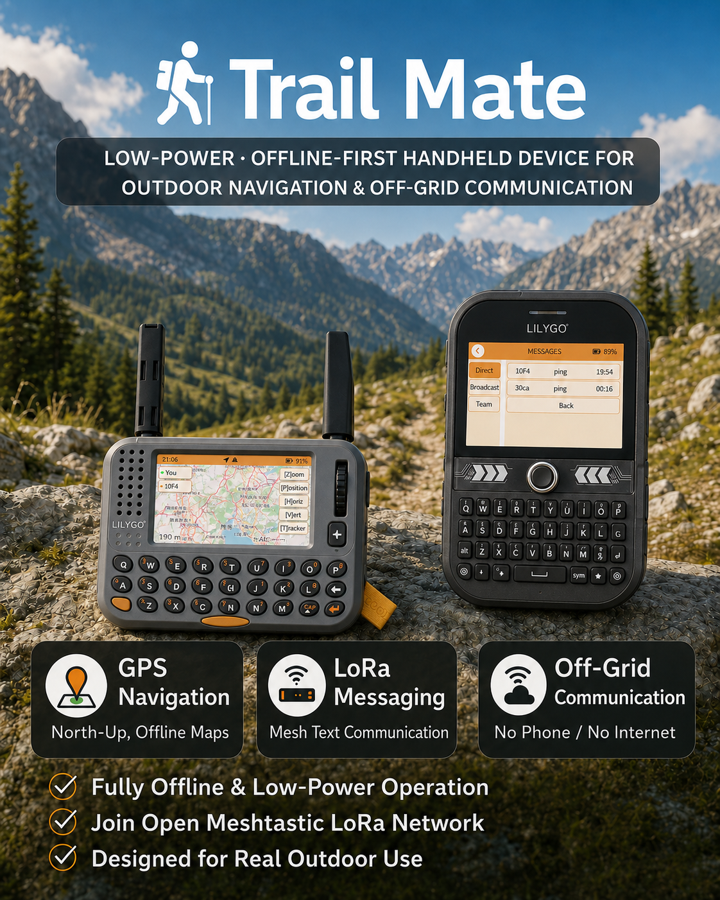
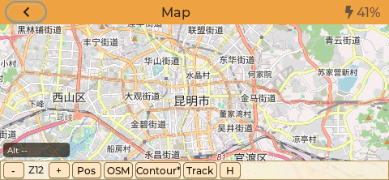
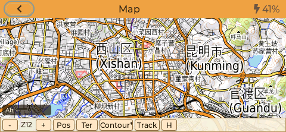
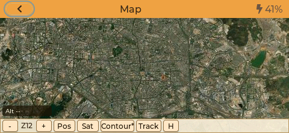

# 🗺️ Trail Mate



> 一个由使用者持有身份、数据与连接选择的端侧去中心化通信与态势系统

[English](README.md) | [中文](README_CN.md) | [加入 Discord 社区](https://discord.gg/UpDsAz9H3)

---

## 📋 Trail Mate 为什么存在


智能手机给了人们前所未有的连接能力，也让越来越多最基本的行为依赖少数平台：身份由账户确认，联系人由应用保管，位置、搜索、阅读、谈话和行动轨迹不断被汇集、解释并转化为画像。用户被要求交出越来越多信任，却越来越难知道数据如何被使用、如何提出异议，又如何真正离开。

一次泄露和一条广告只是表层现象。更深处的风险来自通信入口、身份体系、数据积累与解释权长期集中之后形成的结构性权力。算法可能逐渐成为一种缺少可识别责任主体和有效申诉渠道的官僚系统：它决定谁被看见、谁被怀疑、谁获得机会、谁被排除。无数个局部合理的“效率选择”足以累积出这种结果。

**Trail Mate 是对此作出的端侧回答。** 它把身份、联系人、消息、位置与地图尽量留在使用者持有的设备和 SD 卡上。基本通信与协作直接由个人设备建立，云账户、手机应用和持续联网都属于可选条件。设备接受网络的帮助，同时把所有权留给使用者；平台提供接口，生活的成立条件仍由人掌握。

Trail Mate 是一个运行在个人持有设备上的端侧系统，覆盖资源受限的嵌入式设备和 Linux 便携终端。从使用关系上看，它接近一部去中心化手机：使用者直接持有身份、联系人、消息和位置数据，并自行选择连接路径。它提供的是能够被解释和验证的隐私边界；在能力有限、链路恶劣甚至完全离网时，身份、通信、导航和团队协作仍然保有基本自主权。

> **Trail Mate 让人能够以自己的条件连接世界。**

## 🧭 产品定位

Trail Mate 的产品能力围绕四项核心组织：

- **匿名运行**：设备身份独立于云账户和手机号；系统减少非必要的公开发现、身份关联和位置暴露。匿名能力有明确的技术边界，使用者仍需结合环境作出安全判断。
- **去中心化通信**：Meshtastic、MeshCore 与 Reticulum 是三条可选择的产品网络路径；设备每次运行一条明确的协议路径，网络归属和行为保持可解释。
- **离网可用**：输入、查看、配置、地图、联系人、消息和轨迹都可以在设备端完成；手机与桌面工具提供可选扩展，控制权始终留在设备侧。
- **TAK 能力**：设备端提供成员、位置、航点、轨迹、状态与团队消息等战术态势能力。Trail Mate 当前声明的 TAK 范围止于自身的设备端团队态势能力；ATAK、WinTAK 与 CoT 互操作位于当前声明范围之外。

系统把公开发现位置、联系人位置、Team 位置和本地轨迹建模为四种不同的数据关系。使用者应当能够确认分享内容、接收对象和所用网络路径。

## 🔒 已定型的嵌入式固件边界

Trail Mate 当前嵌入式固件的大功能已经定型。未来范围由现有功能领域、Meshtastic/MeshCore/Reticulum 三种产品通信协议，以及匿名、去中心化、离网与 TAK 四项核心能力构成。这一边界专门描述嵌入式固件的产品面；整个 Trail Mate 同时覆盖 Linux 版本与其他端侧形态。

后续工作集中在错误修复、可靠性与安全性、协议互操作正确性、资源效率、既有硬件承载、测试工具和文档。新的硬件适配负责让既有产品能力在合适的设备上稳定运行。

---

## ✨ 核心功能

### 🧭 主菜单概览


主菜单提供 GPS、LoRa 聊天、Tracker 和系统工具的快捷入口，
适配实体键盘，减少深层菜单跳转。


### 🧭 GPS 地图（性能优先）

| 图层菜单 | OSM 底图 |
| --- | --- |
|  |  |

| Terrain 底图 | Satellite 底图 |
| --- | --- |
|  |  |

- 固定 **北向上（North-Up）** 地图方向（不旋转）
- 基于 SD 瓦片的完全离线地图渲染
- 支持三种可切换底图：**OSM / Terrain / Satellite**
- 支持等高线叠加开关，便于判断地形起伏
- 实时定位标记（当前 GPS 位置）
- 适合嵌入式系统的离散缩放级别
- 简单的面包屑轨迹记录，用于路径感知
- 通过地图图层菜单可即时切换，无需离开当前页面

SD 卡瓦片目录结构示例：

```text
/maps/base/osm/{z}/{x}/{y}.png
/maps/base/terrain/{z}/{x}/{y}.png
/maps/base/satellite/{z}/{x}/{y}.png
/maps/contour/major-500/{z}/{x}/{y}.png
/maps/contour/major-200/{z}/{x}/{y}.png
/maps/contour/major-100/{z}/{x}/{y}.png
/maps/contour/major-50/{z}/{x}/{y}.png
/maps/contour/major-25/{z}/{x}/{y}.png
```

### 🛰️ GNSS Sky Plot（卫星天空图）


- 实时展示可见卫星的天空分布（方位/仰角）
- 按星座与信号强度着色
- 清晰标识参与定位的卫星
- 顶部 USE/HDOP/FIX 一眼定位状态

### 📶 Energy Sweep（Sub-GHz 扫描）


Energy Sweep 用于在野外快速观察 Sub-GHz 频段占用，辅助选频与干扰判断。

- 实时 RSSI 柱状扫描，展示当前频段能量分布
- 光标模式可读取精确频点、RSSI 与噪声底
- 提供最佳信道推荐与清洁度/SNR 提示
- `STOP/SCAN` 可暂停或继续扫描
- `AUTO` 一键应用当前最佳频点并把光标定位到推荐频率
- 扫描范围跟随当前 Region 配置（Meshtastic Region 或 MeshCore Region Preset）

### 📡 去中心化消息（Meshtastic / MeshCore / Reticulum）


消息页展示最近会话与历史，方便快速回看。

- Meshtastic、MeshCore 与 Reticulum 三种可切换的产品协议
- Reticulum 模式使用设备端 Reticulum/LXMF 运行时，可通过 LoRa、AutoInterface 或 TCP 网关等已配置接口传递消息
- 支持中文
- 兼容 **Meshtastic 公共网络**（LongFast/PSK）
- 兼容 **MeshCore 网络**（原生 MeshCore 报文链路）
- 支持通过蓝牙连接 Meshtastic / MeshCore App
- 面向高延迟、低带宽与丢包环境设计
- 联系人、会话与消息在设备端持久化；SD 卡是 Reticulum 网络配置和可编辑联系人目录的配置来源

Reticulum 的 SD 卡配置格式、文件位置、联系人导入方式和设备操作，请参阅 [Reticulum 模式用户指南](https://github.com/vicliu624/trail-mate/wiki/3.5-Configuration-Guide-%28%E4%B8%AD%E6%96%87%29)。

### 📷 SSTV 图片接收


- 接收 SSTV 音频并在设备端解码成图片
- 实时解码进度与图像预览
- 面向低功耗嵌入式的解码流程

### 👥 联系人


联系人页是设备端持久化的通信目录。它统一展示已发现和用户维护的联系人、最近活动与协议身份，并可快速进入私聊、呼叫、Ping 或团队操作（具体动作取决于当前协议和硬件能力）。

在带实体键盘的界面中可按 `S` 搜索联系人；联系人也可以从发现结果保存，或通过编辑 SD 卡上的 Reticulum 联系人文件批量加入。完整按键和文件格式见上述 Wiki 用户指南。

### 💻 上位机数据交换（PC Link）


PC Link 通过 USB CDC-ACM 与上位机连接，提供结构化 HostLink 数据流，
便于 APRS/iGate 集成、诊断与数据采集。

- 实时转发 LoRa 消息、团队状态与 GPS 快照
- 面向 APRS 网关/看板的扩展元数据
- 具备确定性帧格式的传输协议

### 🤝 TAK / 组队模式（ESP-NOW 建队 + LoRa 运行）


面向近距离小队场景，配对阶段使用 ESP-NOW 交换团队密钥，
建立完成后队伍内通信统一走 LoRa。

- 创建队伍（leader）或加入附近队伍（member）
- 配对阶段完成密钥分发与团队 ID 建立
- 团队聊天（文本/位置）与状态同步
- 成员列表、角色标识与人数统计
- 团队航点 / 集合点共享
- 团队地图视图展示成员位置与轨迹快照

### 🧭 轨迹记录与循迹


- 轨迹记录与保存（支持记录/路线模式）
- 轨迹列表浏览与轨迹聚焦
- 支持 KML 路线覆盖
- GPX 轨迹可通过 USB 大容量存储导出

### 🎙️ Walkie Talkie 对讲


- 基于 FSK + Codec2 的语音对讲
- 半双工模式（按住说话 / 松开守听）
- 针对低带宽和丢包场景优化的缓冲与节拍

---
## 💡 设计原则

- **端侧所有权**：身份、联系人、消息、配置、地图与轨迹首先属于设备使用者。
- **明确的数据关系**：不同协议、不同联系人关系和不同位置用途不互相冒充，也不在后台悄悄合并。
- **诚实表达不确定性**：界面直接呈现链路失败、位置过期和状态未知，并只在取得成功证据后显示成功。
- **可预测地降级**：缺少网络、手机、云服务或某项硬件能力时，系统保留可以独立成立的部分。
- **受限硬件上的长期可靠性**：资源效率、确定性和可维护性优先于功能堆叠与视觉表演。

---

## 📱 硬件承载策略

Trail Mate 的硬件工作聚焦于适合承载既有产品能力的设备。本节描述 **硬件选择方向**；实际完成度以随后列出的当前构建目标和状态为准。新硬件继续承载已经定型的产品领域。

当前优先考虑的设备方向包括：

- **键盘优先的 LoRa 手持终端**：例如 `T-LoRa-Pager`、`T-Deck`、`T-Deck Pro`、`Cardputer` 一类设备，适合在没有手机的情况下直接输入自由文本。
- **大屏触控导航终端**：例如 `M5Stack Tab5`、`T-Display P4` 一类设备，适合地图、团队态势、HostLink / 上位机配套等场景。
- **超低功耗 / 小屏消息终端**：例如 `nRF52 + SX1262` 这类资源更紧的设备，适合做单色 UI、状态查看、简化聊天和蓝牙桥接。

选择硬件时，项目目前主要看重以下条件：

- 具备稳定的 LoRa / Sub-GHz 无线能力，或存在清晰可接入的射频硬件路径
- 设备本身可以独立完成基本输入、查看与配置，手机仅提供可选扩展
- 具有可接受的功耗、供电与户外便携性
- 在社区生态、文档或供应链上相对稳定，便于长期维护

项目会尽量保持 **协议 / 存储 / UI 业务逻辑** 与具体板级实现解耦。未来的 ESP32、nRF52 与 Linux 目标共同复用 Meshtastic、MeshCore、Reticulum 与 TAK 相关能力，并维持同一个产品模型。

---

## 🧩 当前支持的设备与开发进度

下面这张表只记录 **仓库当前存在的真实构建目标及其成熟度**。

| 设备 / 目标 | 构建目标 | 技术路线 | 当前状态 |
| --- | --- | --- | --- |
| **LILYGO T-LoRa-Pager (SX1262)** | `tlora_pager_sx1262` | PlatformIO / Arduino | 当前默认环境，也是最完整、最适合日常开发验证的目标 |
| **LILYGO T-Deck** | `tdeck` | PlatformIO / Arduino | 当前主力验证目标，键盘、聊天、地图与共享 UI 路径已稳定接入 |
| **GAT562 Mesh EVB Pro** | `gat562_mesh_evb_pro` | PlatformIO / Arduino（nRF52） | nRF52 简易版目标，重点在单色 UI、Meshtastic / MeshCore LoRa 链路与设备侧无线参数持久化 |
| **LILYGO T-Echo-Lite-KeyShield** | `t-echo-lite` | PlatformIO / Arduino（nRF52） | nRF52 简易版目标，包含 192x176 墨水屏、4x5 实体键盘输入、Meshtastic / MeshCore LoRa 链路与本机设备设置 |
| **LILYGO T-LoRa-Pager (LR1121)** | `tlora_pager_lr1121` | PlatformIO / Arduino | 已接入的 Pager 射频变体，包含 LR1121 RF switch 与 TCXO 初始化 |
| **LILYGO T-Deck Pro** | `tdeck_pro_a7682e` / `tdeck_pro_pcm512a` | PlatformIO / Arduino | 已有独立环境，仍处于 bring-up / 适配推进阶段 |
| **LILYGO T-Watch S3** | `lilygo_twatch_s3` | PlatformIO / Arduino | 实验性目标，当前用于系统与 UI 验证；完整功能验证使用主力目标 |
| **M5Stack Tab5** | `TRAIL_MATE_IDF_TARGET=tab5` | ESP-IDF | 当前主要的大屏 IDF bring-up 目标，共享 shell 已跑通，硬件细节仍在补齐 |
| **LILYGO T-Display P4 TFT** | `TRAIL_MATE_IDF_TARGET=t_display_p4_tft` | ESP-IDF | 明确的 TFT / HI8561 变体接入目标 |
| **LILYGO T-Display P4 AMOLED** | `TRAIL_MATE_IDF_TARGET=t_display_p4_amoled` | ESP-IDF | 明确的 AMOLED / RM69A10 + GT9895 变体接入目标 |

### 当前阶段怎么选目标

- 如果你想走今天最稳的日常开发路径，优先使用 **`tlora_pager_sx1262`** 或 **`tdeck`**。
- 如果你在做资源受限、单色屏的 nRF52 简易版目标调试，优先使用 **`gat562_mesh_evb_pro`** 或 **`t-echo-lite`**。
- 如果你在推进新的大屏触控 ESP-IDF 路线，优先使用 **`tab5`**。
- **`tdeck_pro_*`**、**`lilygo_twatch_s3`**、**`t_display_p4_tft`**、**`t_display_p4_amoled`** 当前承担 bring-up、布局和设备适配工作；完整功能验证优先使用主力目标。
- 构建目标只证明该设备已进入仓库；页面与能力成熟度以表格中的状态为准。部分功能会根据 capability、RAM 和输入设备条件动态启用或隐藏。
- GitHub Actions 当前持续构建的主路径是 **`tlora_pager_sx1262`**、**`tlora_pager_lr1121`**、**`tdeck`**、**`lilygo_twatch_s3`** 和 **`gat562_mesh_evb_pro`**。

---

## 🛠️ 编译方法

Trail Mate 当前主要有两条工具链路径：**PlatformIO** 和 **ESP-IDF**。下面的命令默认都在 **仓库根目录** 执行。

### PlatformIO

PlatformIO 覆盖了 ESP32 Arduino 目标，也覆盖了当前的 nRF52 Arduino 目标。根目录的 [platformio.ini](platformio.ini) 只保留共享配置，具体环境定义分散在 `variants/*/envs/*.ini`。

常用构建命令：

```bash
# 主力目标
platformio run -e tlora_pager_sx1262
platformio run -e tlora_pager_lr1121
platformio run -e tdeck

# nRF52 / 简易版目标
platformio run -e gat562_mesh_evb_pro
platformio run -d builds/pio_nrf52 -e t-echo-lite

# 其他已接入目标
platformio run -e tdeck_pro_a7682e
platformio run -e tdeck_pro_pcm512a
platformio run -e lilygo_twatch_s3
```

如果你需要更详细的日志，当前仓库里还提供了这些调试环境：

```bash
platformio run -e tlora_pager_sx1262_debug
platformio run -e tdeck_debug
platformio run -e lilygo_twatch_s3_debug
```

烧录命令通用写法：

```bash
platformio run -e <env> --target upload
```

如果需要显式指定串口，可以额外加上 `--upload-port COMx`。例如：

```bash
platformio run -e tlora_pager_sx1262 --target upload --upload-port COM6
```

说明：

- 直接执行 `platformio run` 时，会使用根配置里的默认环境 **`tlora_pager_sx1262`**。
- 如果你只是想确认某个目标现在能不能编过，优先从 **`tlora_pager_sx1262`**、**`tdeck`**、**`gat562_mesh_evb_pro`** 或 **`t-echo-lite`** 开始。
- 对 GAT562 和 T-Echo-Lite-KeyShield 这类 RAM 很紧的 nRF52 简易版目标，建议优先做发布型或低日志量验证，不要默认开启过多调试宏。

### ESP-IDF

ESP-IDF 目前主要用于新的共享 shell 路线，当前正式接入的目标是 `tab5`、`t_display_p4_tft` 和 `t_display_p4_amoled`。仓库根目录已经有顶层 `CMakeLists.txt`，可以直接在根目录执行 `idf.py`。

`tab5` 目标示例：

```bash
idf.py -B build.tab5 -DTRAIL_MATE_IDF_TARGET=tab5 reconfigure build
idf.py -B build.tab5 -DTRAIL_MATE_IDF_TARGET=tab5 -p COM6 flash
idf.py -B build.tab5 -DTRAIL_MATE_IDF_TARGET=tab5 monitor
```

`t_display_p4_tft` 目标示例：

```bash
idf.py -B build.t_display_p4_tft -DTRAIL_MATE_IDF_TARGET=t_display_p4_tft reconfigure build
idf.py -B build.t_display_p4_tft -DTRAIL_MATE_IDF_TARGET=t_display_p4_tft build
```

`t_display_p4_amoled` 目标示例：

```bash
idf.py -B build.t_display_p4_amoled -DTRAIL_MATE_IDF_TARGET=t_display_p4_amoled reconfigure build
idf.py -B build.t_display_p4_amoled -DTRAIL_MATE_IDF_TARGET=t_display_p4_amoled build
```

### 说明

- ESP-IDF 的 `sdkconfig` 现已跟随构建目录保存，例如 `build.tab5`、`build.t_display_p4_tft` 或 `build.t_display_p4_amoled`，不同目标不会再互相污染配置。
- 对 **Tab5**，更建议烧录后单独执行 `monitor`；把 `flash monitor` 串在一起时，自动复位可能让 ESP32-P4 停在 ROM download mode。
- VS Code 下已经提供了按目标拆分的 **Tab5**、**T-Display-P4 TFT**、**T-Display-P4 AMOLED** `Reconfigure / Build / Flash / Monitor` 任务，统一入口脚本在 `tools/vscode/run_idf_task.ps1`。
- 如果你只是想做版本发布或回归验证，优先走当前 CI 覆盖的 PlatformIO 主路径；ESP-IDF 目标更适合板级 bring-up 与共享 shell 演进。

## 🌐 语言

- [English](README.md)
- [中文](README_CN.md) ← 您在这里

---

## 📝 更新日志

请查看 [CHANGELOG.md](CHANGELOG.md) 获取版本记录。产品定位与维护边界请参阅 [Roadmap](https://github.com/vicliu624/trail-mate/wiki/16.-Roadmap-%28%E4%B8%AD%E6%96%87%29)；其中记录已经确定的方向和维护范围。

---

## 📄 许可证

本项目采用 **GNU Affero General Public License v3.0（AGPLv3）** 进行许可。

该许可旨在确保：  
- 本项目在被修改、部署或通过网络提供服务时，其源代码保持可获得性  
- 防止核心系统在未经授权的情况下被用于闭源或商业化产品中  

### 商业许可

对于以下使用场景，**可提供单独的商业许可**：

- 商业产品或闭源系统  
- 硬件厂商的设备集成或预装固件  
- 不希望或无法遵守 AGPLv3 条款的商业应用  

如有上述需求，请联系项目作者以获取商业授权。
本仓库内容的公开不构成任何形式的默认商业授权。

详情请参阅 [LICENSE](LICENSE) 文件。

## 🔐 项目范围说明

本仓库包含 Trail Mate 的开源端侧实现，包括：

- ESP32 / nRF52 等嵌入式设备固件
- Linux 便携终端与共享 UI / 业务能力
- 离线地图、定位、轨迹与设备端 TAK 能力
- Meshtastic、MeshCore、Reticulum/LXMF 通信路径及其本地存储
- HostLink、板级适配、测试与开发工具

本项目 **不包含** 以下内容：

- 另行发布的商业桌面软件
- 移动端应用（iOS / Android）  
- 商业服务或平台产品  

上述周边工具可能采用不同的许可策略，并不在本仓库的许可范围内。

---

## 🤝 贡献方式

Trail Mate 的嵌入式产品边界已经定型。贡献重点是提升现有能力的可信度、清晰度和真实设备可用性。

### 关于贡献与版权

除非另有明确说明，所有提交至本仓库的代码与内容，
将被视为在 **AGPLv3 许可条款** 下发布。

项目当前由作者主导开发，暂不接受涉及核心架构或许可变更的贡献。
如有商业合作或深度参与意向，欢迎直接联系作者沟通。

最有价值的贡献包括：

* 可复现的缺陷报告，以及设备、固件、协议、网络条件和操作步骤
* 离网、弱链路、低电量和恶劣环境中的真实测试结果
* 与上游 Meshtastic、MeshCore、Reticulum/LXMF 的互操作验证
* 功耗、内存、存储、并发与长期运行问题的测量结果
* 不改变产品边界的可靠性、安全性、硬件适配、测试和文档改进
* 对误导性状态、模糊操作或隐私边界不清的具体反馈

Pull Request 依然欢迎，但涉及核心架构、产品边界或许可策略的变更请先与作者沟通。即使不写代码，一份能够说明“在什么条件下、做了什么、期待什么、实际发生什么”的报告也非常重要。

> **Trail Mate 的每一项现有承诺都应当值得信任。**

---

## ✅ 当前能力索引

本节提供便于检索的实现索引。[Trail Mate Wiki](https://github.com/vicliu624/trail-mate/wiki) 是详细配置、快捷键、文件格式和操作流程的用户文档来源。

### 🧭 GPS地图导航与轨迹

- 离线地图渲染（北向上/不旋转）
- 运行时底图切换：OSM / Terrain / Satellite
- 地图图层菜单支持等高线叠加开关
- 支持 OSM/Terrain 的 PNG 瓦片与 Satellite 的 JPG 瓦片
- 实时定位标记与坐标显示
- 离散缩放级别与低功耗优化
- 轨迹记录与路线模式（记录/路线列表）
- KML 路线覆盖与聚焦
- GPX 轨迹可通过 USB 大容量存储导出

### 📝 去中心化消息（Meshtastic / MeshCore / Reticulum）

- LoRa 文本消息（支持中文）
- Meshtastic 公共网络兼容（LongFast/PSK）
- MeshCore 网络兼容（原生 MeshCore 报文链路）
- Reticulum/LXMF 设备端运行时，以及 LoRa、AutoInterface、TCP 网关接口
- Reticulum 配置与联系人目录从 SD 卡读取
- 支持通过蓝牙连接 Meshtastic / MeshCore App
- 消息历史与会话列表
- 路由确认与错误提示（可靠性诊断）
- Unishox2 解压接收支持

### 🤝 TAK / 组队模式（ESP-NOW 建队 + LoRa 运行）

- 近距离 ESP-NOW 配对、密钥分发与团队 ID 建立
- 成员列表与角色标识（leader/member）
- 团队聊天（文本/位置）
- 团队地图视图与成员位置更新
- 团队航点 / 集合点共享
- 团队轨迹与状态广播

### 📷 SSTV 解码

- 接收 SSTV 音频并在设备端解码成图片
- 实时解码进度与图像预览
- 面向低功耗嵌入式的解码流程

### 👥 联系人

- 节点发现与联系人列表
- 节点信息（ID/短名/设备信息）
- 在线/离线与最近活动
- 快速进入私聊或团队聊天

### 💻 上位机数据交换（PC Link / HostLink）

- USB CDC-ACM 传输
- HostLink 帧/事件/配置支持
- LoRa/团队/GPS 数据实时转发
- APRS/iGate 所需元数据输出

### 🎙️ Walkie Talkie 对讲

- FSK + Codec2 语音对讲
- 半双工 PTT（按住说话 / 松开守听）
- 抖动缓冲与固定节拍播放

### ⚙️ 系统设置与状态

- 显示/休眠等基础设置
- GPS 与网络相关配置
- 状态栏图标与系统提示
- 截图功能（ALT 双击，保存到 SD /screen）

### 💾 USB 大容量存储

- 设备作为 U 盘挂载
- 可直接管理导出的轨迹与文件

### 🔌 系统管理

- 优雅关机
- 低功耗管理
- 运行状态监控

### 📻 Trail-mate 简易版（nRF52 / GAT562 Mesh EVB Pro / T-Echo-Lite-KeyShield）

- 简易版当前支持 `GAT562 Mesh EVB Pro` 与 `T-Echo-Lite-KeyShield` 两台 nRF52 设备
- 简易版已接入 Meshtastic 与 MeshCore 双协议 LoRa 收发，覆盖 Text / NodeInfo / Position 处理与对应持久化链路
- 已支持设备侧协议切换与 Meshtastic / MeshCore 空口参数编辑，适合不依赖手机 App 的独立运行
- 设备侧参数已具备本机修改与持久化保存能力
- 单色屏界面可用于查看时间、GPS、无线状态

---
## 🙏 致谢

Trail Mate 在开发过程中，得到了来自社区与硬件厂商的实际支持。

- 特别感谢 **LILYGO** 为本项目提供开发板支持。
  其开放的硬件生态与稳定的 ESP32 产品线，使本项目能够在真实设备上持续迭代，并验证关键设计假设。

- 特别感谢 **M5Stack** 为 Cardputer Zero 环境适配提供硬件支持。
  他们的支持帮助 Trail Mate 在真实设备约束下验证 Cardputer Zero 环境，并推动 Linux 便携设备路径继续向前。

- 特别感谢 **深圳市加特物联科技有限公司** (https://github.com/gat-iot) 为本项目提供设备支持。
  他们提供的实际设备帮助 Trail Mate 在真实硬件上开展开发、调试与验证，进一步推动了相关功能的落地与完善。

这些支持不仅降低了原型开发的门槛，也让 Trail Mate 能够更早地接受真实使用环境的反馈。

同时，如果有 **其他硬件厂商** 认同本项目的设计理念，并希望探索设备在户外离线场景中的实际可能性，欢迎与我联系。
在条件允许的情况下，我将尽力对相关设备进行适配，并基于真实使用情况提供反馈与改进建议。

特别感谢 **dawsonjon** (https://github.com/dawsonjon) 开源的 **PicoSSTV** 项目：
https://github.com/dawsonjon/PicoSSTV 。我们的 SSTV 接收功能参考了其解码思路。
算法说明地址：https://101-things.readthedocs.io/en/latest/sstv_decoder.html

---

**为户外社区用心打造 ❤️**


# 项目声明（NOTICE）

## 关于本项目

**Trail Mate** 是一个端侧优先、匿名可用、去中心化且能够离网运行的个人通信与态势系统。它运行在使用者持有的嵌入式设备和 Linux 便携终端上，以 Meshtastic、MeshCore、Reticulum 和设备端 TAK 能力提供通信、位置、导航与协作。

Trail Mate 让互联网成为可选择的连接资源，让个人设备直接承担基本通信。身份、联系人、消息、位置、地图和轨迹尽可能由使用者持有，并在每次共享时保留清楚的数据关系与选择权。

本仓库是持续开发和维护的工程项目，包含可用于评估、移植、集成与部署的实际实现。

如果你正在对代码进行：

* 评估
* 二次开发
* 协议分析
* 固件移植
* 产品集成
* 内部测试

建议直接联系作者沟通。

---

## 作者

**Vic Liu**

系统架构、通信协议、嵌入式固件、Linux 端侧实现及参考实现均由作者长期维护。

---

## 联系方式

* Email：**[vicliu@outlook.com](mailto:vicliu@outlook.com)**
* Discord：**[Trail Mate Discord](https://discord.gg/87PVMVUP)**
* 微信：**vicliu890624**

可以联系作者的事项包括但不限于：

* 硬件适配或移植
* 协议说明与实现细节
* 接入现有无线电系统
* 商业使用或授权咨询
* 合作开发
* 现场部署建议
* 不方便通过 Issue 描述的问题

实时技术沟通建议使用 Discord 或微信。
正式、较长内容建议使用 Email。

---

## 面向组织 / 公司

如果贵组织正在内部测试或评估本仓库：

即使仍处于可行性研究阶段，也欢迎提前沟通。
很多系统性问题在工程早期讨论，通常可以节省大量开发成本与时间。

作者可以提供：

* 硬件适配建议
* 架构说明
* 技术咨询
* 定制开发方向建议

---

## 许可说明

本项目按照 LICENSE 文件中所述的开源协议发布。

若代码被用于：

* 设备固件分发
* 网络服务
* 可再分发系统
* 商业产品

请确认你的使用方式符合许可协议要求。
如存在不确定之处，建议在部署前与作者联系。

---

## 项目意图

Trail Mate 希望减少一个人在进行基本通信、导航和协作时必须信任的中心数量。它提供边界清楚、能够验证的自主能力：设备始终属于使用者，并能在云账户、手机应用和稳定公网均缺席的条件下工作。

当前嵌入式功能面已经定型。非常欢迎缺陷报告、互操作测试、野外验证、部署经验，以及围绕可靠性、安全性、资源效率、硬件承载和文档清晰度的改进。

你不必先提交 Issue，也可以直接联系作者。

感谢你对本项目的关注与使用。
