# Code anchor: apps/esp32_lvgl

C4 level: Code
Status: candidate
Confidence: medium
Project version: 0.1.30-alpha
Git:34aad0bffa2f / main / dirty
Updated on: 2026-06-25T09:19:32.800Z

## Positioning

Explain a few key code anchors in apps/esp32_lvgl from the C4 Code layer. The Code layer is not a code browser and is only used when you need to understand how architectural components fall into specific files/symbols.

## C4 hierarchical path

-Current layer: Code View, explaining how the upper-level Component falls to a specific file, function, class, interface or component anchor.
- Upper layer: Component, describing the component responsibilities that these code anchors serve together.
- Lower layer: None; when continuing to understand the details, you should return to the IDE, code preview, or software structure model, rather than using Code View as a complete source code browser.

## Responsibility

More the architectural components of apps/esp32_lvgl to specific files, functions, classes, interfaces or component anchors to help users understand the implementation entry and the impact of changes.

## Boundary

Code View only displays necessary anchor points and does not list the full source code; the complete structure explanation, code snippets and complexity candidate points should still be viewed back to the software structure model or IDE.

## Relationship

- IdfNullMeshAdapter -> apps/esp32_lvgl/src/esp32_lvgl_idf_app_facade_runtime.cpp#L282
- IdfNullMeshAdapter::copyString -> apps/esp32_lvgl/src/esp32_lvgl_idf_app_facade_runtime.cpp#L390
- IdfAppFacadeRuntime::& getChatService() override -> apps/esp32_lvgl/src/esp32_lvgl_idf_app_facade_runtime.cpp#L518
- IdfAppFacadeRuntime::& getContactService() override -> apps/esp32_lvgl/src/esp32_lvgl_idf_app_facade_runtime.cpp#L519
- IdfNullMeshAdapter::applyConfig -> apps/esp32_lvgl/src/esp32_lvgl_idf_app_facade_runtime.cpp#L349
- IdfNullMeshAdapter::pollIncomingData -> apps/esp32_lvgl/src/esp32_lvgl_idf_app_facade_runtime.cpp#L338
- IdfNullMeshAdapter::pollIncomingRawPacket -> apps/esp32_lvgl/src/esp32_lvgl_idf_app_facade_runtime.cpp#L376
- IdfNullMeshAdapter::pollIncomingText -> apps/esp32_lvgl/src/esp32_lvgl_idf_app_facade_runtime.cpp#L312
- IdfNullMeshAdapter::sendAppData -> apps/esp32_lvgl/src/esp32_lvgl_idf_app_facade_runtime.cpp#L318
- IdfNullMeshAdapter::sendText -> apps/esp32_lvgl/src/esp32_lvgl_idf_app_facade_runtime.cpp#L285

## Correlation with business complexity

- Code View is not a business explanation portal; it only provides low-level evidence when the business story needs to be traced back to the implementation anchor.

## Correlation with technical complexity

 - The software structure model is responsible for continuing to explain signs of reuse, signs of external collaboration, sequences, complexity candidate points, and code evidence previews.

## C4 Code View diagram

```mermaid
flowchart TB
  package["apps/esp32_lvgl"]
  file_1["apps/esp32_lvgl/src/esp32_lvgl_idf_app_facade_runtime.cpp"]
  code_1["IdfNullMeshAdapter"]
  package --> file_1
  file_1 --> code_1
  file_2["apps/esp32_lvgl/src/esp32_lvgl_idf_app_facade_runtime.cpp"]
  code_2["IdfNullMeshAdapter::copyString"]
  package --> file_2
  file_2 --> code_2
  file_3["apps/esp32_lvgl/src/esp32_lvgl_idf_app_facade_runtime.cpp"]
  code_3["IdfAppFacadeRuntime::& getChatService() override"]
  package --> file_3
  file_3 --> code_3
  file_4["apps/esp32_lvgl/src/esp32_lvgl_idf_app_facade_runtime.cpp"]
  code_4["IdfAppFacadeRuntime::& getContactService() override"]
  package --> file_4
  file_4 --> code_4
  file_5["apps/esp32_lvgl/src/esp32_lvgl_idf_app_facade_runtime.cpp"]
  code_5["IdfNullMeshAdapter::applyConfig"]
  package --> file_5
  file_5 --> code_5
  file_6["apps/esp32_lvgl/src/esp32_lvgl_idf_app_facade_runtime.cpp"]
  code_6["IdfNullMeshAdapter::pollIncomingData"]
  package --> file_6
  file_6 --> code_6
  file_7["apps/esp32_lvgl/src/esp32_lvgl_idf_app_facade_runtime.cpp"]
  code_7["IdfNullMeshAdapter::pollIncomingRawPacket"]
  package --> file_7
  file_7 --> code_7
  file_8["apps/esp32_lvgl/src/esp32_lvgl_idf_app_facade_runtime.cpp"]
  code_8["IdfNullMeshAdapter::pollIncomingText"]
  package --> file_8
  file_8 --> code_8
```

## Explanation of elements in the diagram

### IdfNullMeshAdapter

-Level: code
- Description: IdfNullMeshAdapter is the key code anchor of apps/esp32_lvgl, located at apps/esp32_lvgl/src/esp32_lvgl_idf_app_facade_runtime.cpp#L282; current warehouse evidence shows that it has strong signs of external collaboration/orchestration.
- Responsibility: IdfNullMeshAdapter is more like an external orchestration or aggregation anchor: it emits more relationships from apps/esp32_lvgl/src/esp32_lvgl_idf_app_facade_runtime.cpp#L282. When making changes, priority should be given to checking the downstream capabilities it calls or references.
- Boundary: This anchor only explains an architectural landing point of apps/esp32_lvgl; it is not a complete source code structure, nor can it replace the code evidence preview of the software structure model.
- Relational meaning: IdfNullMeshAdapter is placed in Code View because it can trace the responsibilities of the upper-level Component back to specific files/symbols. When it is referenced or called by a large number of objects, priority should be given to understanding who depends on it; when it relies on too many external objects, priority should be given to understanding what external capabilities it orchestrates.
- Why it belongs to this layer: It has the exact file and line number evidence apps/esp32_lvgl/src/esp32_lvgl_idf_app_facade_runtime.cpp#L282, so it belongs to the C4 Code layer; if you only discuss the boundaries of responsibilities, you should go back to Component or Container.
- Drill-down intention: When drilling down or cutting to the software structure model, you should check the direct collaboration of the anchor point, nearby complexity candidate points and code snippets to determine whether the changes will spread.
- Confidence: high
- Evidence:
  - apps/esp32_lvgl/src/esp32_lvgl_idf_app_facade_runtime.cpp#L282
 - Indications of reuse: there are local reuse or dependency clues
 - Indications of external collaboration: there are local external collaboration clues

### IdfNullMeshAdapter::copyString

-Level: code
- Description: IdfNullMeshAdapter::copyString is apps/esp32_lvgl The key code anchor is located at apps/esp32_lvgl/src/esp32_lvgl_idf_app_facade_runtime.cpp#L390; the current warehouse evidence shows that it has strong signs of being reused/dependent.
- Responsibility: IdfNullMeshAdapter::copyString is more like a reused or dependent anchor: it is pointed to by multiple relationships in apps/esp32_lvgl/src/esp32_lvgl_idf_app_facade_runtime.cpp#L390. When making changes, check the upstream caller and contract stability first.
- Boundary: This anchor only explains an architectural landing point of apps/esp32_lvgl; it is not a complete source code structure, nor can it replace the code evidence preview of the software structure model.
- Relationship meaning: IdfNullMeshAdapter::copyString is put into Code View because it can trace the responsibilities of the upper-level Component back to specific files/symbols. When it is referenced or called by a large number of objects, priority should be given to understanding who depends on it; when it relies on too many external objects, priority should be given to understanding what external capabilities it orchestrates.
- Why it belongs to this layer: It has the exact file and line number evidence apps/esp32_lvgl/src/esp32_lvgl_idf_app_facade_runtime.cpp#L390, so it belongs to the C4 Code layer; if you only discuss the boundaries of responsibilities, you should go back to Component or Container.
- Drill-down intention: When drilling down or cutting to the software structure model, you should check the direct collaboration of the anchor point, nearby complexity candidate points and code snippets to determine whether the changes will spread.
- Confidence: high
- Evidence:
  - apps/esp32_lvgl/src/esp32_lvgl_idf_app_facade_runtime.cpp#L390
 - Indications of reuse: there are local reuse or dependency clues
 - Signs of external collaboration: No obvious clues of external collaboration are currently observed

### IdfAppFacadeRuntime::& getChatService() override

-Level: code
 - Description: IdfAppFacadeRuntime::& getChatService() override is the key code anchor of apps/esp32_lvgl, located at apps/esp32_lvgl/src/esp32_lvgl_idf_app_facade_runtime.cpp#L518;The current repository evidence shows that it has signs of partial relationships and is suitable as a candidate anchor rather than a complete conclusion.
- Responsibility: IdfAppFacadeRuntime::& getChatService() override is a partial implementation anchor: it falls the upper-level component responsibilities to apps/esp32_lvgl/src/esp32_lvgl_idf_app_facade_runtime.cpp#L518. The current relationship pressure is not high, but it can still be used as evidence to understand the implementation entrance.
- Boundary: This anchor only explains an architectural landing point of apps/esp32_lvgl; it is not a complete source code structure, nor can it replace the code evidence preview of the software structure model.
- Relationship meaning: IdfAppFacadeRuntime::& getChatService() override is put into Code View because it can trace the responsibilities of the upper-level Component back to specific files/symbols. When it is referenced or called by a large number of objects, priority should be given to understanding who depends on it; when it relies on too many external objects, priority should be given to understanding what external capabilities it orchestrates.
- Why it belongs to this layer: It has the exact file and line number evidence apps/esp32_lvgl/src/esp32_lvgl_idf_app_facade_runtime.cpp#L518, so it belongs to the C4 Code layer; if you only discuss the boundaries of responsibilities, you should go back to Component or Container.
- Drill-down intention: When drilling down or cutting to the software structure model, you should check the direct collaboration of the anchor point, nearby complexity candidate points and code snippets to determine whether the changes will spread.
- Confidence: high
- Evidence:
  - apps/esp32_lvgl/src/esp32_lvgl_idf_app_facade_runtime.cpp#L518
 - Indications of reuse: there are local reuse or dependency clues
 - Signs of external collaboration: No obvious clues of external collaboration are currently observed

### IdfAppFacadeRuntime::& getContactService() override

-Level: code
- Description: IdfAppFacadeRuntime::& getContactService() override is the key code anchor of apps/esp32_lvgl, located at apps/esp32_lvgl/src/esp32_lvgl_idf_app_facade_runtime.cpp#L519; the current warehouse evidence shows that it has signs of partial relationships and is suitable as a candidate anchor rather than a complete conclusion.
- Responsibility: IdfAppFacadeRuntime::& getContactService() override is a partial implementation anchor: it falls the upper-level component responsibilities to apps/esp32_lvgl/src/esp32_lvgl_idf_app_facade_runtime.cpp#L519. The current relationship pressure is not high, but it can still be used as evidence to understand the implementation entrance.
- Boundary: This anchor only explains an architectural landing point of apps/esp32_lvgl; it is not a complete source code structure, nor can it replace the code evidence preview of the software structure model.
- Relationship meaning: IdfAppFacadeRuntime::& getContactService() override is put into Code View because it can trace the responsibilities of the upper-level Component back to the specific file/symbol. When it is referenced or called by a large number of objects, priority should be given to understanding who depends on it; when it relies on too many external objects, priority should be given to understanding what external capabilities it orchestrates.
- Why it belongs to this layer: It has the exact file and line number evidence apps/esp32_lvgl/src/esp32_lvgl_idf_app_facade_runtime.cpp#L519, so it belongs to the C4 Code layer; if you only discuss the boundaries of responsibilities, you should go back to Component or Container.
- Drill-down intention: When drilling down or cutting to the software structure model, you should check the direct collaboration of the anchor point, nearby complexity candidate points and code snippets to determine whether the changes will spread.
- Confidence: high
- Evidence:
  - apps/esp32_lvgl/src/esp32_lvgl_idf_app_facade_runtime.cpp#L519
 - Indications of reuse: there are local reuse or dependency clues
 - Signs of external collaboration: No obvious clues of external collaboration are currently observed

### IdfNullMeshAdapter::applyConfig

-Level: code
- Description: IdfNullMeshAdapter::applyConfig is the key code anchor of apps/esp32_lvgl, located at apps/esp32_lvgl/src/esp32_lvgl_idf_app_facade_runtime.cpp#L349; the current warehouse evidence shows that it has signs of partial relationships and is suitable as a candidate anchor rather than a complete conclusion.
- Responsibility: IdfNullMeshAdapter::applyConfig is a partial implementation anchor: it falls the responsibility of the upper-level component to apps/esp32_lvgl/src/esp32_lvgl_idf_app_facade_runtime.cpp#L349. The current relationship pressure is not high, but it can still be used as evidence to understand the implementation entrance.
- Boundary: This anchor only explains an architectural landing point of apps/esp32_lvgl; it is not a complete source code structure, nor can it replace the code evidence preview of the software structure model.
- Relationship meaning: IdfNullMeshAdapter::applyConfig is put into Code View because it can trace the responsibilities of the upper-level Component back to specific files/symbols. When it is referenced or called by a large number of objects, priority should be given to understanding who depends on it; when it relies on too many external objects, priority should be given to understanding what external capabilities it orchestrates.
- Why it belongs to this layer: It has the exact file and line number evidence apps/esp32_lvgl/src/esp32_lvgl_idf_app_facade_runtime.cpp#L349, so it belongs to the C4 Code layer; if you only discuss the boundaries of responsibilities, you should go back to Component or Container.
- Drill-down intention: When drilling down or cutting to the software structure model, you should check the direct collaboration of the anchor point, nearby complexity candidate points and code snippets to determine whether the changes will spread.
- Confidence: high
- Evidence:
  - apps/esp32_lvgl/src/esp32_lvgl_idf_app_facade_runtime.cpp#L349
 - Indications of reuse: there are local reuse or dependency clues
 - Signs of external collaboration: No obvious clues of external collaboration are currently observed

### IdfNullMeshAdapter::pollIncomingData

-Level: code
- Description: IdfNullMeshAdapter::pollIncomingData is the key code anchor of apps/esp32_lvgl, located at apps/esp32_lvgl/src/esp32_lvgl_idf_app_facade_runtime.cpp#L338; the current warehouse evidence shows that it has signs of partial relationships and is suitable as a candidate anchor rather than a complete conclusion.
- Responsibility: IdfNullMeshAdapter::pollIncomingData is a partial implementation anchor: it falls the upper-level component responsibilities to apps/esp32_lvgl/src/esp32_lvgl_idf_app_facade_runtime.cpp#L338. The current relationship pressure is not high, but it can still be used as evidence to understand the implementation entrance.
- Boundary: This anchor only explains an architectural landing point of apps/esp32_lvgl; it is not a complete source code structure, nor can it replace the code evidence preview of the software structure model.
- Relationship meaning: IdfNullMeshAdapter::pollIncomingData is put into Code View because it can trace the responsibilities of the upper-level Component back to specific files/symbols. When it is referenced or called by a large number of objects, priority should be given to understanding who depends on it; when it relies on too many external objects, priority should be given to understanding what external capabilities it orchestrates.
- Why it belongs to this layer: It has the exact file and line number evidence apps/esp32_lvgl/src/esp32_lvgl_idf_app_facade_runtime.cpp#L338, so it belongs to the C4 Code layer; if you only discuss the boundaries of responsibilities, you should go back to Component or Container.
- Drill-down intention: When drilling down or cutting to the software structure model, you should check the direct collaboration of the anchor point, nearby complexity candidate points and code snippets to determine whether the changes will spread.
- Confidence: high
- Evidence:
  - apps/esp32_lvgl/src/esp32_lvgl_idf_app_facade_runtime.cpp#L338
 - Indications of reuse: there are local reuse or dependency clues
 - Signs of external collaboration: No obvious clues of external collaboration are currently observed

### IdfNullMeshAdapter::pollIncomingRawPacket

-Level: code
- Description: IdfNullMeshAdapter::pollIncomingRawPacket is the key code anchor of apps/esp32_lvgl, located at apps/esp32_lvgl/src/esp32_lvgl_idf_app_facade_runtime.cpp#L376; the current warehouse evidence shows that it has signs of partial relationships and is suitable as a candidate anchor rather than a complete conclusion.
- Responsibility: IdfNullMeshAdapter::pollIncomingRawPacket is a partial implementation anchor: it falls the upper-level component responsibilities to apps/esp32_lvgl/src/esp32_lvgl_idf_app_facade_runtime.cpp#L376. The current relationship pressure is not high, but it can still be used as evidence to understand the implementation entrance.
- Boundary: This anchor only explains an architectural landing point of apps/esp32_lvgl; it is not a complete source code structure, nor can it replace the code evidence preview of the software structure model.
- Relationship meaning: IdfNullMeshAdapter::pollIncomingRawPacket is put into Code View because it can trace the responsibilities of the upper-level Component back to specific files/symbols. When it is referenced or called by a large number of objects, priority should be given to understanding who depends on it; when it relies on too many external objects, priority should be given to understanding what external capabilities it orchestrates.
- Why it belongs to this layer: It has the exact file and line number evidence apps/esp32_lvgl/src/esp32_lvgl_idf_app_facade_runtime.cpp#L376, so it belongs to the C4 Code layer; if you only discuss the boundaries of responsibilities, you should go back to Component or Container.
- Drill-down intention: When drilling down or cutting to the software structure model, you should check the direct collaboration of the anchor point, nearby complexity candidate points and code snippets to determine whether the changes will spread.
- Confidence: high
- Evidence:
  - apps/esp32_lvgl/src/esp32_lvgl_idf_app_facade_runtime.cpp#L376
 - Indications of reuse: there are local reuse or dependency clues
 - Signs of external collaboration: No obvious clues of external collaboration are currently observed

### IdfNullMeshAdapter::pollIncomingText

-Level: code
- Description: IdfNullMeshAdapter::pollIncomingText is the key code anchor of apps/esp32_lvgl, located at apps/esp32_lvgl/src/esp32_lvgl_idf_app_facade_runtime.cpp#L312; the current warehouse evidence shows that it has signs of partial relationships and is suitable as a candidate anchor rather than a complete conclusion.
- Responsibility: IdfNullMeshAdapter::pollIncomingText is a partial implementation anchor: it falls the upper component responsibility to apps/esp32_lvgl/src/esp32_lvgl_idf_app_facade_runtime.cpp#L312. The current relationship pressure is not high, but it can still be used as evidence to understand the implementation entrance.
- Boundary: This anchor only explains an architectural landing point of apps/esp32_lvgl; it is not a complete source code structure, nor can it replace the code evidence preview of the software structure model.
- Relationship meaning: IdfNullMeshAdapter::pollIncomingText is put into Code View because it can trace the responsibilities of the upper-level Component back to the specific file/symbol. When it is referenced or called by a large number of objects, priority should be given to understanding who depends on it; when it relies on too many external objects, priority should be given to understanding what external capabilities it orchestrates.
- Why it belongs to this layer: It has the exact file and line number evidence apps/esp32_lvgl/src/esp32_lvgl_idf_app_facade_runtime.cpp#L312, so it belongs to the C4 Code layer; if you only discuss the boundaries of responsibilities, you should go back to Component or Container.
- Drill-down intention: When drilling down or cutting to the software structure model, you should check the direct collaboration of the anchor point, nearby complexity candidate points and code snippets to determine whether the changes will spread.
- Confidence: high
- Evidence:
  - apps/esp32_lvgl/src/esp32_lvgl_idf_app_facade_runtime.cpp#L312
 - Indications of reuse: there are local reuse or dependency clues
 - Signs of external collaboration: No obvious clues of external collaboration are currently observed

### IdfNullMeshAdapter::sendAppData

-Level: code
- Description: IdfNullMeshAdapter::sendAppData is the key code anchor of apps/esp32_lvgl, located at apps/esp32_lvgl/src/esp32_lvgl_idf_app_facade_runtime.cpp#L318; the current warehouse evidence shows that it has signs of partial relationships and is suitable as a candidate anchor rather than a complete conclusion.
- Responsibility: IdfNullMeshAdapter::sendAppData is a partial implementation anchor: it falls the upper-level component responsibilities to apps/esp32_lvgl/src/esp32_lvgl_idf_app_facade_runtime.cpp#L318. The current relationship pressure is not high, but it can still be used as evidence to understand the implementation entrance.
- Boundary: This anchor only explains an architectural landing point of apps/esp32_lvgl; it is not a complete source code structure, nor can it replace the code evidence preview of the software structure model.
- Relationship meaning: IdfNullMeshAdapter::sendAppData is put into Code View because it can trace the responsibilities of the upper-level Component back to specific files/symbols. When it is referenced or called by a large number of objects, priority should be given to understanding who depends on it; when it relies on too many external objects, priority should be given to understanding what external capabilities it orchestrates.
- Why it belongs to this layer: It has the exact file and line number evidence apps/esp32_lvgl/src/esp32_lvgl_idf_app_facade_runtime.cpp#L318, so it belongs to the C4 Code layer; if you only discuss the boundaries of responsibilities, you should go back to Component or Container.
- Drill-down intention: When drilling down or cutting to the software structure model, you should check the direct collaboration of the anchor point, nearby complexity candidate points and code snippets to determine whether the changes will spread.
- Confidence: high
- Evidence:
  - apps/esp32_lvgl/src/esp32_lvgl_idf_app_facade_runtime.cpp#L318
 - Indications of reuse: there are local reuse or dependency clues
 - Signs of external collaboration: No obvious clues of external collaboration are currently observed

### IdfNullMeshAdapter::sendText

-Level: code
- Description: IdfNullMeshAdapter::sendText is the key code anchor of apps/esp32_lvgl, located at apps/esp32_lvgl/src/esp32_lvgl_idf_app_facade_runtime.cpp#L285; the current warehouse evidence shows that it has signs of partial relationships and is suitable as a candidate anchor rather than a complete conclusion.
- Responsibility: IdfNullMeshAdapter::sendText is a partial implementation anchor: it falls the responsibility of the upper-level component to apps/esp32_lvgl/src/esp32_lvgl_idf_app_facade_runtime.cpp#L285. The current relationship pressure is not high, but it can still be used as evidence to understand the implementation entrance.
- Boundary: This anchor only explains an architectural landing point of apps/esp32_lvgl; it is not a complete source code structure, nor can it replace the code evidence preview of the software structure model.
- Relationship meaning: IdfNullMeshAdapter::sendText is put into Code View because it can trace the responsibilities of the upper-level Component back to the specific file/symbol. When it is referenced or called by a large number of objects, priority should be given to understanding who depends on it; when it relies on too many external objects, priority should be given to understand what external capabilities it orchestrates.
- Why it belongs to this layer: It has precise file and line number evidence apps/esp32_lvgl/src/esp32_lvgl_idf_app_facade_runtime.cpp#L285, so it belongs to C4 Code layer; if you only discuss the boundaries of responsibilities, you should go back to Component or Container.
- Drill-down intention: When drilling down or cutting to the software structure model, you should check the direct collaboration of the anchor point, nearby complexity candidate points and code snippets to determine whether the changes will spread.
- Confidence: high
- Evidence:
  - apps/esp32_lvgl/src/esp32_lvgl_idf_app_facade_runtime.cpp#L285
 - Indications of reuse: there are local reuse or dependency clues

## Drill-down C4

- [Component Responsibilities: apps/esp32_lvgl](../../components/apps-esp32_lvgl/component.md) - Return to Component Responsibilities: apps/esp32_lvgl You can avoid understanding the architecture only from code anchors and re-examine the component responsibilities and boundaries shared by these anchors.

## Associated Software Structural Model

 - There is currently no associated Engineering document.

## Evidence

- apps/esp32_lvgl/src/esp32_lvgl_idf_app_facade_runtime.cpp#L282
- apps/esp32_lvgl/src/esp32_lvgl_idf_app_facade_runtime.cpp#L390
- apps/esp32_lvgl/src/esp32_lvgl_idf_app_facade_runtime.cpp#L518
- apps/esp32_lvgl/src/esp32_lvgl_idf_app_facade_runtime.cpp#L519
- apps/esp32_lvgl/src/esp32_lvgl_idf_app_facade_runtime.cpp#L349
- apps/esp32_lvgl/src/esp32_lvgl_idf_app_facade_runtime.cpp#L338
- apps/esp32_lvgl/src/esp32_lvgl_idf_app_facade_runtime.cpp#L376
- apps/esp32_lvgl/src/esp32_lvgl_idf_app_facade_runtime.cpp#L312
- apps/esp32_lvgl/src/esp32_lvgl_idf_app_facade_runtime.cpp#L318
- apps/esp32_lvgl/src/esp32_lvgl_idf_app_facade_runtime.cpp#L285

## Judgment basis

- Code View only lists a small number of file/symbol anchors that can trace the Component implementation; it is not a source code browser, and it does not host business processes or complete class diagrams.

## Change Record

### 0.1.30-alpha - 2026-06-25T09:19:32.800Z

- Regenerate the code anchor based on local warehouse evidence: apps/esp32_lvgl.
