```mermaid
flowchart TB
  package["apps/linux_cardputer_zero"]
  file_1["apps/linux_cardputer_zero/src/cardputer_zero_notification_port.h"]
  code_1["CardputerZeroNotificationPort"]
  package --> file_1
  file_1 --> code_1
  file_2["apps/linux_cardputer_zero/src/cardputer_zero_input_method_port.h"]
  code_2["CardputerZeroInputMethodPort"]
  package --> file_2
  file_2 --> code_2
  file_3["apps/linux_cardputer_zero/src/cardputer_zero_notification_port.cpp"]
  code_3["CardputerZeroNotificationPort::makeNotifyCall"]
  package --> file_3
  file_3 --> code_3
  file_4["apps/linux_cardputer_zero/src/cardputer_zero_notification_port.cpp"]
  code_4["safeString"]
  package --> file_4
  file_4 --> code_4
  file_5["apps/linux_cardputer_zero/src/cardputer_zero_notification_port.h"]
  code_5["NotificationUrgency"]
  package --> file_5
  file_5 --> code_5
  file_6["apps/linux_cardputer_zero/src/cardputer_zero_notification_port.h"]
  code_6["FreedesktopNotificationsContract"]
  package --> file_6
  file_6 --> code_6
  file_7["apps/linux_cardputer_zero/src/cardputer_zero_notification_port.h"]
  code_7["FreedesktopNotifyCall"]
  package --> file_7
  file_7 --> code_7
  file_8["apps/linux_cardputer_zero/src/cardputer_zero_notification_port.cpp"]
  code_8["urgencyHint"]
  package --> file_8
  file_8 --> code_8
```

# 代码锚点：apps/linux_cardputer_zero

C4 层级：Code
状态：candidate
置信度：medium
项目版本：0.1.30-alpha
Git：34aad0bffa2f / main / dirty
更新于：2026-06-25T09:19:32.800Z

## 定位

从 C4 Code 层解释 apps/linux_cardputer_zero 内少量关键代码锚点。Code 层不是代码浏览器，只在需要理解架构组件如何落到具体文件/符号时使用。

## C4 层级路径

- 当前层：Code View，解释上层 Component 如何落到具体文件、函数、类、接口或组件锚点。
- 上层：Component，说明这些代码锚点共同服务的组件职责。
- 下层：无；继续理解细节时应回到 IDE、代码预览或软件结构模型，而不是把 Code View 当成完整源码浏览器。

## 责任

把 apps/linux_cardputer_zero 的架构组件进一步落到具体文件、函数、类、接口或组件锚点，帮助用户理解实现入口和变更影响面。

## 边界

Code View 只展示必要锚点，不列全量源码；完整结构解释、代码片段和复杂度候选点仍应回到软件结构模型或 IDE 查看。

## 关系

- CardputerZeroNotificationPort -> apps/linux_cardputer_zero/src/cardputer_zero_notification_port.h#L67
- CardputerZeroInputMethodPort -> apps/linux_cardputer_zero/src/cardputer_zero_input_method_port.h#L39
- CardputerZeroNotificationPort::makeNotifyCall -> apps/linux_cardputer_zero/src/cardputer_zero_notification_port.cpp#L64
- safeString -> apps/linux_cardputer_zero/src/cardputer_zero_notification_port.cpp#L38
- NotificationUrgency -> apps/linux_cardputer_zero/src/cardputer_zero_notification_port.h#L12
- FreedesktopNotificationsContract -> apps/linux_cardputer_zero/src/cardputer_zero_notification_port.h#L30
- FreedesktopNotifyCall -> apps/linux_cardputer_zero/src/cardputer_zero_notification_port.h#L55
- urgencyHint -> apps/linux_cardputer_zero/src/cardputer_zero_notification_port.cpp#L43
- CardputerZeroInputMethodContract -> apps/linux_cardputer_zero/src/cardputer_zero_input_method_port.h#L10
- cstdint -> apps/linux_cardputer_zero/src/cardputer_zero_notification_port.h#L3

## 与业务复杂度的关联

- Code View 不是业务解释入口；它只在业务故事需要追溯到实现锚点时提供底层证据。

## 与技术复杂度的关联

- 软件结构模型负责继续解释复用迹象、外部协作迹象、Sequence、复杂度候选点和代码证据预览。

## C4 Code View 图

## 图内元素解释

### CardputerZeroNotificationPort

- 层级：code
- 说明：CardputerZeroNotificationPort 是 apps/linux_cardputer_zero 的关键代码锚点，位置为 apps/linux_cardputer_zero/src/cardputer_zero_notification_port.h#L67；当前仓库证据显示它有 局部关系迹象，适合作为候选锚点而非完整结论。
- 责任：CardputerZeroNotificationPort 是一个局部实现锚点：它把上层组件职责落到 apps/linux_cardputer_zero/src/cardputer_zero_notification_port.h#L67，当前关系压力不高，但仍可作为理解实现入口的证据。
- 边界：该锚点只解释 apps/linux_cardputer_zero 的一处架构落点；它不是完整源码结构，也不能替代软件结构模型的代码证据预览。
- 关系意义：CardputerZeroNotificationPort 被放入 Code View，是因为它能把上层 Component 的职责追溯到具体文件/符号。当它被大量对象引用或调用时，应优先理解谁依赖它；当它向外依赖过多对象时，应优先理解它编排了哪些外部能力。
- 为什么属于该层：它有精确文件和行号证据 apps/linux_cardputer_zero/src/cardputer_zero_notification_port.h#L67，因此属于 C4 Code 层；如果只讨论职责边界，应回到 Component 或 Container。
- 下钻意图：下钻或切到软件结构模型时，应查看该锚点的直接协作、附近复杂度候选点和代码片段，判断改动是否会扩散。
- 置信度：medium
- 证据：
  - apps/linux_cardputer_zero/src/cardputer_zero_notification_port.h#L67
  - 复用迹象：存在局部复用或依赖线索
  - 外部协作迹象：存在局部外部协作线索

### CardputerZeroInputMethodPort

- 层级：code
- 说明：CardputerZeroInputMethodPort 是 apps/linux_cardputer_zero 的关键代码锚点，位置为 apps/linux_cardputer_zero/src/cardputer_zero_input_method_port.h#L39；当前仓库证据显示它有 局部关系迹象，适合作为候选锚点而非完整结论。
- 责任：CardputerZeroInputMethodPort 是一个局部实现锚点：它把上层组件职责落到 apps/linux_cardputer_zero/src/cardputer_zero_input_method_port.h#L39，当前关系压力不高，但仍可作为理解实现入口的证据。
- 边界：该锚点只解释 apps/linux_cardputer_zero 的一处架构落点；它不是完整源码结构，也不能替代软件结构模型的代码证据预览。
- 关系意义：CardputerZeroInputMethodPort 被放入 Code View，是因为它能把上层 Component 的职责追溯到具体文件/符号。当它被大量对象引用或调用时，应优先理解谁依赖它；当它向外依赖过多对象时，应优先理解它编排了哪些外部能力。
- 为什么属于该层：它有精确文件和行号证据 apps/linux_cardputer_zero/src/cardputer_zero_input_method_port.h#L39，因此属于 C4 Code 层；如果只讨论职责边界，应回到 Component 或 Container。
- 下钻意图：下钻或切到软件结构模型时，应查看该锚点的直接协作、附近复杂度候选点和代码片段，判断改动是否会扩散。
- 置信度：medium
- 证据：
  - apps/linux_cardputer_zero/src/cardputer_zero_input_method_port.h#L39
  - 复用迹象：存在局部复用或依赖线索
  - 外部协作迹象：存在局部外部协作线索

### CardputerZeroNotificationPort::makeNotifyCall

- 层级：code
- 说明：CardputerZeroNotificationPort::makeNotifyCall 是 apps/linux_cardputer_zero 的关键代码锚点，位置为 apps/linux_cardputer_zero/src/cardputer_zero_notification_port.cpp#L64；当前仓库证据显示它有 较强的外部协作/编排迹象。
- 责任：CardputerZeroNotificationPort::makeNotifyCall 更像一个对外编排或聚合锚点：它从 apps/linux_cardputer_zero/src/cardputer_zero_notification_port.cpp#L64 发出较多关系，改动时要优先检查它调用或引用的下游能力。
- 边界：该锚点只解释 apps/linux_cardputer_zero 的一处架构落点；它不是完整源码结构，也不能替代软件结构模型的代码证据预览。
- 关系意义：CardputerZeroNotificationPort::makeNotifyCall 被放入 Code View，是因为它能把上层 Component 的职责追溯到具体文件/符号。当它被大量对象引用或调用时，应优先理解谁依赖它；当它向外依赖过多对象时，应优先理解它编排了哪些外部能力。
- 为什么属于该层：它有精确文件和行号证据 apps/linux_cardputer_zero/src/cardputer_zero_notification_port.cpp#L64，因此属于 C4 Code 层；如果只讨论职责边界，应回到 Component 或 Container。
- 下钻意图：下钻或切到软件结构模型时，应查看该锚点的直接协作、附近复杂度候选点和代码片段，判断改动是否会扩散。
- 置信度：medium
- 证据：
  - apps/linux_cardputer_zero/src/cardputer_zero_notification_port.cpp#L64
  - 复用迹象：存在局部复用或依赖线索
  - 外部协作迹象：存在局部外部协作线索

### safeString

- 层级：code
- 说明：safeString 是 apps/linux_cardputer_zero 的关键代码锚点，位置为 apps/linux_cardputer_zero/src/cardputer_zero_notification_port.cpp#L38；当前仓库证据显示它有 较强的被复用/被依赖迹象。
- 责任：safeString 更像一个被复用或被依赖锚点：它在 apps/linux_cardputer_zero/src/cardputer_zero_notification_port.cpp#L38 被多处关系指向，改动时要优先检查上游调用者和契约稳定性。
- 边界：该锚点只解释 apps/linux_cardputer_zero 的一处架构落点；它不是完整源码结构，也不能替代软件结构模型的代码证据预览。
- 关系意义：safeString 被放入 Code View，是因为它能把上层 Component 的职责追溯到具体文件/符号。当它被大量对象引用或调用时，应优先理解谁依赖它；当它向外依赖过多对象时，应优先理解它编排了哪些外部能力。
- 为什么属于该层：它有精确文件和行号证据 apps/linux_cardputer_zero/src/cardputer_zero_notification_port.cpp#L38，因此属于 C4 Code 层；如果只讨论职责边界，应回到 Component 或 Container。
- 下钻意图：下钻或切到软件结构模型时，应查看该锚点的直接协作、附近复杂度候选点和代码片段，判断改动是否会扩散。
- 置信度：medium
- 证据：
  - apps/linux_cardputer_zero/src/cardputer_zero_notification_port.cpp#L38
  - 复用迹象：存在局部复用或依赖线索
  - 外部协作迹象：当前未观察到明显外部协作线索

### NotificationUrgency

- 层级：code
- 说明：NotificationUrgency 是 apps/linux_cardputer_zero 的关键代码锚点，位置为 apps/linux_cardputer_zero/src/cardputer_zero_notification_port.h#L12；当前仓库证据显示它有 局部关系迹象，适合作为候选锚点而非完整结论。
- 责任：NotificationUrgency 是一个局部实现锚点：它把上层组件职责落到 apps/linux_cardputer_zero/src/cardputer_zero_notification_port.h#L12，当前关系压力不高，但仍可作为理解实现入口的证据。
- 边界：该锚点只解释 apps/linux_cardputer_zero 的一处架构落点；它不是完整源码结构，也不能替代软件结构模型的代码证据预览。
- 关系意义：NotificationUrgency 被放入 Code View，是因为它能把上层 Component 的职责追溯到具体文件/符号。当它被大量对象引用或调用时，应优先理解谁依赖它；当它向外依赖过多对象时，应优先理解它编排了哪些外部能力。
- 为什么属于该层：它有精确文件和行号证据 apps/linux_cardputer_zero/src/cardputer_zero_notification_port.h#L12，因此属于 C4 Code 层；如果只讨论职责边界，应回到 Component 或 Container。
- 下钻意图：下钻或切到软件结构模型时，应查看该锚点的直接协作、附近复杂度候选点和代码片段，判断改动是否会扩散。
- 置信度：medium
- 证据：
  - apps/linux_cardputer_zero/src/cardputer_zero_notification_port.h#L12
  - 复用迹象：存在局部复用或依赖线索
  - 外部协作迹象：存在局部外部协作线索

### FreedesktopNotificationsContract

- 层级：code
- 说明：FreedesktopNotificationsContract 是 apps/linux_cardputer_zero 的关键代码锚点，位置为 apps/linux_cardputer_zero/src/cardputer_zero_notification_port.h#L30；当前仓库证据显示它有 局部关系迹象，适合作为候选锚点而非完整结论。
- 责任：FreedesktopNotificationsContract 是一个局部实现锚点：它把上层组件职责落到 apps/linux_cardputer_zero/src/cardputer_zero_notification_port.h#L30，当前关系压力不高，但仍可作为理解实现入口的证据。
- 边界：该锚点只解释 apps/linux_cardputer_zero 的一处架构落点；它不是完整源码结构，也不能替代软件结构模型的代码证据预览。
- 关系意义：FreedesktopNotificationsContract 被放入 Code View，是因为它能把上层 Component 的职责追溯到具体文件/符号。当它被大量对象引用或调用时，应优先理解谁依赖它；当它向外依赖过多对象时，应优先理解它编排了哪些外部能力。
- 为什么属于该层：它有精确文件和行号证据 apps/linux_cardputer_zero/src/cardputer_zero_notification_port.h#L30，因此属于 C4 Code 层；如果只讨论职责边界，应回到 Component 或 Container。
- 下钻意图：下钻或切到软件结构模型时，应查看该锚点的直接协作、附近复杂度候选点和代码片段，判断改动是否会扩散。
- 置信度：medium
- 证据：
  - apps/linux_cardputer_zero/src/cardputer_zero_notification_port.h#L30
  - 复用迹象：存在局部复用或依赖线索
  - 外部协作迹象：当前未观察到明显外部协作线索

### FreedesktopNotifyCall

- 层级：code
- 说明：FreedesktopNotifyCall 是 apps/linux_cardputer_zero 的关键代码锚点，位置为 apps/linux_cardputer_zero/src/cardputer_zero_notification_port.h#L55；当前仓库证据显示它有 局部关系迹象，适合作为候选锚点而非完整结论。
- 责任：FreedesktopNotifyCall 是一个局部实现锚点：它把上层组件职责落到 apps/linux_cardputer_zero/src/cardputer_zero_notification_port.h#L55，当前关系压力不高，但仍可作为理解实现入口的证据。
- 边界：该锚点只解释 apps/linux_cardputer_zero 的一处架构落点；它不是完整源码结构，也不能替代软件结构模型的代码证据预览。
- 关系意义：FreedesktopNotifyCall 被放入 Code View，是因为它能把上层 Component 的职责追溯到具体文件/符号。当它被大量对象引用或调用时，应优先理解谁依赖它；当它向外依赖过多对象时，应优先理解它编排了哪些外部能力。
- 为什么属于该层：它有精确文件和行号证据 apps/linux_cardputer_zero/src/cardputer_zero_notification_port.h#L55，因此属于 C4 Code 层；如果只讨论职责边界，应回到 Component 或 Container。
- 下钻意图：下钻或切到软件结构模型时，应查看该锚点的直接协作、附近复杂度候选点和代码片段，判断改动是否会扩散。
- 置信度：medium
- 证据：
  - apps/linux_cardputer_zero/src/cardputer_zero_notification_port.h#L55
  - 复用迹象：存在局部复用或依赖线索
  - 外部协作迹象：存在局部外部协作线索

### urgencyHint

- 层级：code
- 说明：urgencyHint 是 apps/linux_cardputer_zero 的关键代码锚点，位置为 apps/linux_cardputer_zero/src/cardputer_zero_notification_port.cpp#L43；当前仓库证据显示它有 局部关系迹象，适合作为候选锚点而非完整结论。
- 责任：urgencyHint 是一个局部实现锚点：它把上层组件职责落到 apps/linux_cardputer_zero/src/cardputer_zero_notification_port.cpp#L43，当前关系压力不高，但仍可作为理解实现入口的证据。
- 边界：该锚点只解释 apps/linux_cardputer_zero 的一处架构落点；它不是完整源码结构，也不能替代软件结构模型的代码证据预览。
- 关系意义：urgencyHint 被放入 Code View，是因为它能把上层 Component 的职责追溯到具体文件/符号。当它被大量对象引用或调用时，应优先理解谁依赖它；当它向外依赖过多对象时，应优先理解它编排了哪些外部能力。
- 为什么属于该层：它有精确文件和行号证据 apps/linux_cardputer_zero/src/cardputer_zero_notification_port.cpp#L43，因此属于 C4 Code 层；如果只讨论职责边界，应回到 Component 或 Container。
- 下钻意图：下钻或切到软件结构模型时，应查看该锚点的直接协作、附近复杂度候选点和代码片段，判断改动是否会扩散。
- 置信度：medium
- 证据：
  - apps/linux_cardputer_zero/src/cardputer_zero_notification_port.cpp#L43
  - 复用迹象：存在局部复用或依赖线索
  - 外部协作迹象：当前未观察到明显外部协作线索

### CardputerZeroInputMethodContract

- 层级：code
- 说明：CardputerZeroInputMethodContract 是 apps/linux_cardputer_zero 的关键代码锚点，位置为 apps/linux_cardputer_zero/src/cardputer_zero_input_method_port.h#L10；当前仓库证据显示它有 局部关系迹象，适合作为候选锚点而非完整结论。
- 责任：CardputerZeroInputMethodContract 是一个局部实现锚点：它把上层组件职责落到 apps/linux_cardputer_zero/src/cardputer_zero_input_method_port.h#L10，当前关系压力不高，但仍可作为理解实现入口的证据。
- 边界：该锚点只解释 apps/linux_cardputer_zero 的一处架构落点；它不是完整源码结构，也不能替代软件结构模型的代码证据预览。
- 关系意义：CardputerZeroInputMethodContract 被放入 Code View，是因为它能把上层 Component 的职责追溯到具体文件/符号。当它被大量对象引用或调用时，应优先理解谁依赖它；当它向外依赖过多对象时，应优先理解它编排了哪些外部能力。
- 为什么属于该层：它有精确文件和行号证据 apps/linux_cardputer_zero/src/cardputer_zero_input_method_port.h#L10，因此属于 C4 Code 层；如果只讨论职责边界，应回到 Component 或 Container。
- 下钻意图：下钻或切到软件结构模型时，应查看该锚点的直接协作、附近复杂度候选点和代码片段，判断改动是否会扩散。
- 置信度：medium
- 证据：
  - apps/linux_cardputer_zero/src/cardputer_zero_input_method_port.h#L10
  - 复用迹象：存在局部复用或依赖线索
  - 外部协作迹象：当前未观察到明显外部协作线索

### cstdint

- 层级：code
- 说明：cstdint 是 apps/linux_cardputer_zero 的关键代码锚点，位置为 apps/linux_cardputer_zero/src/cardputer_zero_notification_port.h#L3；当前仓库证据显示它有 局部关系迹象，适合作为候选锚点而非完整结论。
- 责任：cstdint 是一个局部实现锚点：它把上层组件职责落到 apps/linux_cardputer_zero/src/cardputer_zero_notification_port.h#L3，当前关系压力不高，但仍可作为理解实现入口的证据。
- 边界：该锚点只解释 apps/linux_cardputer_zero 的一处架构落点；它不是完整源码结构，也不能替代软件结构模型的代码证据预览。
- 关系意义：cstdint 被放入 Code View，是因为它能把上层 Component 的职责追溯到具体文件/符号。当它被大量对象引用或调用时，应优先理解谁依赖它；当它向外依赖过多对象时，应优先理解它编排了哪些外部能力。
- 为什么属于该层：它有精确文件和行号证据 apps/linux_cardputer_zero/src/cardputer_zero_notification_port.h#L3，因此属于 C4 Code 层；如果只讨论职责边界，应回到 Component 或 Container。
- 下钻意图：下钻或切到软件结构模型时，应查看该锚点的直接协作、附近复杂度候选点和代码片段，判断改动是否会扩散。
- 置信度：medium
- 证据：
  - apps/linux_cardputer_zero/src/cardputer_zero_notification_port.h#L3
  - 复用迹象：存在局部复用或依赖线索
  - 外部协作迹象：当前未观察到明显外部协作线索

## 可下钻 C4

- [组件职责：apps/linux_cardputer_zero](../../components/apps-linux_cardputer_zero/component.md) - 回到 组件职责：apps/linux_cardputer_zero 可以避免只从代码锚点理解架构，重新检查这些锚点共同承担的组件职责和边界。

## 关联软件结构模型

- 当前没有关联 Engineering 文档。

## 证据

- apps/linux_cardputer_zero/src/cardputer_zero_notification_port.h#L67
- apps/linux_cardputer_zero/src/cardputer_zero_input_method_port.h#L39
- apps/linux_cardputer_zero/src/cardputer_zero_notification_port.cpp#L64
- apps/linux_cardputer_zero/src/cardputer_zero_notification_port.cpp#L38
- apps/linux_cardputer_zero/src/cardputer_zero_notification_port.h#L12
- apps/linux_cardputer_zero/src/cardputer_zero_notification_port.h#L30
- apps/linux_cardputer_zero/src/cardputer_zero_notification_port.h#L55
- apps/linux_cardputer_zero/src/cardputer_zero_notification_port.cpp#L43
- apps/linux_cardputer_zero/src/cardputer_zero_input_method_port.h#L10
- apps/linux_cardputer_zero/src/cardputer_zero_notification_port.h#L3

## 判定依据

- Code View 只列少量能够追溯 Component 实现的文件/符号锚点；它不是源码浏览器，也不承载业务流程或完整类图。

## 变更记录

### 0.1.30-alpha - 2026-06-25T09:19:32.800Z

- 基于本地仓库证据重新生成 代码锚点：apps/linux_cardputer_zero。
