# Code anchor: apps/linux_cardputer_zero

C4 level: Code
Status: candidate
Confidence: medium
Project version: 0.1.30-alpha
Git:34aad0bffa2f / main / dirty
Updated on: 2026-06-25T09:19:32.800Z

## Positioning

Explain a few key code anchors in apps/linux_cardputer_zero from the C4 Code layer. The Code layer is not a code browser and is only used when you need to understand how architectural components fall into specific files/symbols.

## C4 hierarchical path

-Current layer: Code View, explaining how the upper-level Component falls to a specific file, function, class, interface or component anchor.
- Upper layer: Component, describing the component responsibilities that these code anchors serve together.
- Lower layer: None; when continuing to understand the details, you should return to the IDE, code preview, or software structure model, rather than using Code View as a complete source code browser.

## Responsibility

 Further reduce the architectural components of apps/linux_cardputer_zero to specific files, functions, classes, interfaces or component anchors to help users understand the implementation entry and the impact of changes.

## Boundary

Code View only displays necessary anchor points and does not list the full source code; the complete structure explanation, code snippets and complexity candidate points should still be viewed back to the software structure model or IDE.

## Relationship

- CardputerZeroNotificationPort -> apps/linux_cardputer_zero/src/cardputer_zero_notification_port.h#L67
- CardputerZeroInputMethodPort -> apps/linux_cardputer_zero/src/cardputer_zero_input_method_port.h#L39
- CardputerZeroNotificationPort::makeNotifyCall -> apps/linux_cardputer_zero/src/cardputer_zero_notification_port.cpp#L64
- safeString -> apps/linux_cardputer_zero/src/cardputer_zero_notification_port.cpp#L38
- NotificationUrgency -> apps/linux_cardputer_zero/src/cardputer_zero_notification_port.h#L12
- FreedesktopNotificationsContract -> apps/linux_cardputer_zero/src/cardputer_zero_notification_port.h#L30
- FreedesktopNotifyCall -> apps/linux_cardputer_zero/src/cardputer_zero_notification_port.h#L55
- urgencyHint -> apps/linux_cardputer_zero/src/cardputer_zero_notification_port.cpp#L43
- CardputerZeroInputMethodContract -> apps/linux_cardputer_zero/src/cardputer_zero_input_method_port.h#L10
- cstdint -> apps/linux_cardputer_zero/src/cardputer_zero_notification_port.h#L3

## Correlation with business complexity

- Code View is not a business explanation portal; it only provides low-level evidence when the business story needs to be traced back to the implementation anchor.

## Correlation with technical complexity

 - The software structure model is responsible for continuing to explain signs of reuse, signs of external collaboration, sequences, complexity candidate points, and code evidence previews.

## C4 Code View diagram

```mermaid
flowchart TB
  package["apps/linux_cardputer_zero"]
  file_1["apps/linux_cardputer_zero/src/cardputer_zero_notification_port.h"]
  code_1["CardputerZeroNotificationPort"]
  package --> file_1
  file_1 --> code_1
  file_2["apps/linux_cardputer_zero/src/cardputer_zero_input_method_port.h"]
  code_2["CardputerZeroInputMethodPort"]
  package --> file_2
  file_2 --> code_2
  file_3["apps/linux_cardputer_zero/src/cardputer_zero_notification_port.cpp"]
  code_3["CardputerZeroNotificationPort::makeNotifyCall"]
  package --> file_3
  file_3 --> code_3
  file_4["apps/linux_cardputer_zero/src/cardputer_zero_notification_port.cpp"]
  code_4["safeString"]
  package --> file_4
  file_4 --> code_4
  file_5["apps/linux_cardputer_zero/src/cardputer_zero_notification_port.h"]
  code_5["NotificationUrgency"]
  package --> file_5
  file_5 --> code_5
  file_6["apps/linux_cardputer_zero/src/cardputer_zero_notification_port.h"]
  code_6["FreedesktopNotificationsContract"]
  package --> file_6
  file_6 --> code_6
  file_7["apps/linux_cardputer_zero/src/cardputer_zero_notification_port.h"]
  code_7["FreedesktopNotifyCall"]
  package --> file_7
  file_7 --> code_7
  file_8["apps/linux_cardputer_zero/src/cardputer_zero_notification_port.cpp"]
  code_8["urgencyHint"]
  package --> file_8
  file_8 --> code_8
```

## Explanation of elements in the diagram

### CardputerZeroNotificationPort

-Level: code
- Description: CardputerZeroNotificationPort is the key code anchor of apps/linux_cardputer_zero, located at apps/linux_cardputer_zero/src/cardputer_zero_notification_port.h#L67; the current warehouse evidence shows that it has signs of partial relationships and is suitable as a candidate anchor rather than a complete conclusion.
- Responsibility: CardputerZeroNotificationPort is a partial implementation anchor: it falls the responsibility of the upper-level component to apps/linux_cardputer_zero/src/cardputer_zero_notification_port.h#L67. The current relationship pressure is not high, but it can still be used as evidence to understand the implementation entrance.
- Boundary: This anchor only explains an architectural landing point of apps/linux_cardputer_zero; it is not a complete source code structure, nor can it replace the code evidence preview of the software structure model.
- Relational meaning: CardputerZeroNotificationPort is placed in Code View because it can trace the responsibilities of the upper-level Component back to specific files/symbols. When it is referenced or called by a large number of objects, priority should be given to understanding who depends on it; when it relies on too many external objects, priority should be given to understanding what external capabilities it orchestrates.
- Why it belongs to this layer: It has the exact file and line number evidence apps/linux_cardputer_zero/src/cardputer_zero_notification_port.h#L67, so it belongs to the C4 Code layer; if you only discuss the boundaries of responsibilities, you should go back to Component or Container.
- Drill-down intention: When drilling down or cutting to the software structure model, you should check the direct collaboration of the anchor point, nearby complexity candidate points and code snippets to determine whether the changes will spread.
- Confidence: medium
- Evidence:
  - apps/linux_cardputer_zero/src/cardputer_zero_notification_port.h#L67
 - Indications of reuse: there are local reuse or dependency clues
 - Indications of external collaboration: there are local external collaboration clues

### CardputerZeroInputMethodPort

-Level: code
- Description: CardputerZeroInputMethodPort is the key code anchor of apps/linux_cardputer_zero, located at apps/linux_cardputer_zero/src/cardputer_zero_input_method_port.h#L39; the current warehouse evidence shows that it has signs of partial relationships and is suitable as a candidate anchor rather than a complete conclusion.
- Responsibility: CardputerZeroInputMethodPort is a partial implementation anchor: it falls the responsibility of the upper component to apps/linux_cardputer_zero/src/cardputer_zero_input_method_port.h#L39. The current relationship pressure is not high, but it can still be used as evidence to understand the implementation entrance.
- Boundary: This anchor only explains an architectural landing point of apps/linux_cardputer_zero; it is not a complete source code structure, nor can it replace the code evidence preview of the software structure model.
- Relational meaning: CardputerZeroInputMethodPort is placed in Code View because it can trace the responsibilities of the upper-level Component back to specific files/symbols. When it is referenced or called by a large number of objects, priority should be given to understanding who depends on it; when it relies on too many external objects, priority should be given to understanding what external capabilities it orchestrates.
- Why it belongs to this layer: It has the exact file and line number evidence apps/linux_cardputer_zero/src/cardputer_zero_input_method_port.h#L39, so it belongs to the C4 Code layer; if you only discuss the responsibility boundary, you should go back to Component or Container.
- Drill-down intention: When drilling down or cutting to the software structure model, you should check the direct collaboration of the anchor point, nearby complexity candidate points and code snippets to determine whether the changes will spread.
- Confidence: medium
- Evidence:
  - apps/linux_cardputer_zero/src/cardputer_zero_input_method_port.h#L39
 - Indications of reuse: there are local reuse or dependency clues
 - Indications of external collaboration: there are local external collaboration clues

### CardputerZeroNotificationPort::makeNotifyCall

-Level: code
- Description: CardputerZeroNotificationPort::makeNotifyCall is the key code anchor of apps/linux_cardputer_zero, located at apps/linux_cardputer_zero/src/cardputer_zero_notification_port.cpp#L64; current warehouse evidence shows that it has strong signs of external collaboration/orchestration.
- Responsibility: CardputerZeroNotificationPort::makeNotifyCall is more like an external orchestration or aggregation anchor: it emits more relationships from apps/linux_cardputer_zero/src/cardputer_zero_notification_port.cpp#L64. When making changes, priority should be given to checking the downstream capabilities it calls or references.
- Boundary: This anchor only explains an architectural landing point of apps/linux_cardputer_zero; it is not a complete source code structure, nor can it replace the code evidence preview of the software structure model.
- Relationship meaning: CardputerZeroNotificationPort::makeNotifyCall is put into Code View because it can trace the responsibilities of the upper-level Component back to specific files/symbols. When it is referenced or called by a large number of objects, priority should be given to understanding who depends on it; when it relies on too many external objects, priority should be given to understanding what external capabilities it orchestrates.
- Why it belongs to this layer: It has the exact file and line number evidence apps/linux_cardputer_zero/src/cardputer_zero_notification_port.cpp#L64, so it belongs to the C4 Code layer; if you only discuss the responsibility boundary, you should go back to Component or Container.
- Drill-down intention: When drilling down or cutting to the software structure model, you should check the direct collaboration of the anchor point, nearby complexity candidate points and code snippets to determine whether the changes will spread.
- Confidence: medium
- Evidence:
  - apps/linux_cardputer_zero/src/cardputer_zero_notification_port.cpp#L64
 - Indications of reuse: there are local reuse or dependency clues
 - Indications of external collaboration: there are local external collaboration clues

### safeString

-Level: code
- Description: safeString is the key code anchor of apps/linux_cardputer_zero, located at apps/linux_cardputer_zero/src/cardputer_zero_notification_port.cpp#L38; the current warehouse evidence shows that it has strong signs of being reused/dependent.
- Responsibility: safeString is more like a reused or dependent anchor: it is pointed to by multiple relationships in apps/linux_cardputer_zero/src/cardputer_zero_notification_port.cpp#L38. When changing, priority should be given to checking the upstream caller and contract stability.
- Boundary: This anchor only explains an architectural landing point of apps/linux_cardputer_zero; it is not a complete source code structure, nor can it replace the code evidence preview of the software structure model.
- Relational meaning: safeString is put into Code View because it can trace the responsibilities of the upper-level Component back to specific files/symbols. When it is referenced or called by a large number of objects, priority should be given to understanding who depends on it; when it relies on too many external objects, priority should be given to understanding what external capabilities it orchestrates.
- Why it belongs to this layer: It has the exact file and line number evidence apps/linux_cardputer_zero/src/cardputer_zero_notification_port.cpp#L38, so it belongs to the C4 Code layer; if you only discuss the boundaries of responsibilities, you should go back to Component or Container.
- Drill-down intention: When drilling down or cutting to the software structure model, you should check the direct collaboration of the anchor point, nearby complexity candidate points and code snippets to determine whether the changes will spread.
- Confidence: medium
- Evidence:
  - apps/linux_cardputer_zero/src/cardputer_zero_notification_port.cpp#L38
 - Indications of reuse: there are local reuse or dependency clues
 - Signs of external collaboration: No obvious clues of external collaboration are currently observed

### NotificationUrgency

-Level: code
- Description: NotificationUrgency is the key code anchor of apps/linux_cardputer_zero, located at apps/linux_cardputer_zero/src/cardputer_zero_notification_port.h#L12; the current warehouse evidence shows that it has signs of partial relationships and is suitable as a candidate anchor rather than a complete conclusion.
- Responsibility: NotificationUrgency is a partial implementation anchor: it falls the responsibility of the upper-level component to apps/linux_cardputer_zero/src/cardputer_zero_notification_port.h#L12. The current relationship pressure is not high, but it can still be used as evidence to understand the implementation entrance.
- Boundary: This anchor only explains an architectural landing point of apps/linux_cardputer_zero; it is not a complete source code structure, nor can it replace the code evidence preview of the software structure model.
- Relational meaning: NotificationUrgency is put into Code View because it can trace the responsibilities of the upper-level Component back to specific files/symbols. When it is referenced or called by a large number of objects, priority should be given to understanding who depends on it; when it relies on too many external objects, priority should be given to understanding what external capabilities it orchestrates.
- Why it belongs to this layer: It has the exact file and line number evidence apps/linux_cardputer_zero/src/cardputer_zero_notification_port.h#L12, so it belongs to the C4 Code layer; if you only discuss the boundaries of responsibilities, you should go back to Component or Container.
- Drill-down intention: When drilling down or cutting to the software structure model, you should check the direct collaboration of the anchor point, nearby complexity candidate points and code snippets to determine whether the changes will spread.
- Confidence: medium
- Evidence:
  - apps/linux_cardputer_zero/src/cardputer_zero_notification_port.h#L12
 - Indications of reuse: there are local reuse or dependency clues
 - Indications of external collaboration: there are local external collaboration clues

### FreedesktopNotificationsContract

-Level: code
- Description: FreedesktopNotificationsContract is the key code anchor of apps/linux_cardputer_zero, located at apps/linux_cardputer_zero/src/cardputer_zero_notification_port.h#L30; the current warehouse evidence shows that it has signs of partial relationships and is suitable as a candidate anchor rather than a complete conclusion.
- Responsibility: FreedesktopNotificationsContract is a partial implementation anchor: it falls the upper-level component responsibilities to apps/linux_cardputer_zero/src/cardputer_zero_notification_port.h#L30. The current relationship pressure is not high, but it can still be used as evidence to understand the implementation entrance.
- Boundary: This anchor only explains an architectural landing point of apps/linux_cardputer_zero; it is not a complete source code structure, nor can it replace the code evidence preview of the software structure model.
- Relationship meaning: FreedesktopNotificationsContract is put into Code View because it can trace the responsibilities of the upper-level Component back to specific files/symbols. When it is referenced or called by a large number of objects, priority should be given to understanding who depends on it; when it relies on too many external objects, priority should be given to understanding what external capabilities it orchestrates.
- Why it belongs to this layer: It has the exact file and line number evidence apps/linux_cardputer_zero/src/cardputer_zero_notification_port.h#L30, so it belongs to the C4 Code layer; if you only discuss the boundaries of responsibilities, you should go back to Component or Container.
- Drill-down intention: When drilling down or cutting to the software structure model, you should check the direct collaboration of the anchor point, nearby complexity candidate points and code snippets to determine whether the changes will spread.
- Confidence: medium
- Evidence:
  - apps/linux_cardputer_zero/src/cardputer_zero_notification_port.h#L30
 - Indications of reuse: there are local reuse or dependency clues
 - Signs of external collaboration: No obvious clues of external collaboration are currently observed

### FreedesktopNotifyCall

-Level: code
- Description: FreedesktopNotifyCall is the key code anchor of apps/linux_cardputer_zero, located at apps/linux_cardputer_zero/src/cardputer_zero_notification_port.h#L55; the current warehouse evidence shows that it has signs of partial relationships and is suitable as a candidate anchor rather than a complete conclusion.
- Responsibility: FreedesktopNotifyCall is a partial implementation anchor: it falls the responsibility of upper-level components to apps/linux_cardputer_zero/src/cardputer_zero_notification_port.h#L55. The current relationship pressure is not high, but it can still be used as evidence to understand the implementation entrance.
- Boundary: This anchor only explains an architectural landing point of apps/linux_cardputer_zero; it is not a complete source code structure, nor can it replace the code evidence preview of the software structure model.
- Relational meaning: FreedesktopNotifyCall is placed in Code View because it can trace the responsibilities of the upper-level Component back to specific files/symbols. When it is referenced or called by a large number of objects, priority should be given to understanding who depends on it; when it relies on too many external objects, priority should be given to understanding what external capabilities it orchestrates.
- Why it belongs to this layer: It has the exact file and line number evidence apps/linux_cardputer_zero/src/cardputer_zero_notification_port.h#L55, so it belongs to the C4 Code layer; if you only discuss the boundaries of responsibilities, you should go back to Component or Container.
- Drill-down intention: When drilling down or cutting to the software structure model, you should check the direct collaboration of the anchor point, nearby complexity candidate points and code snippets to determine whether the changes will spread.
- Confidence: medium
- Evidence:
  - apps/linux_cardputer_zero/src/cardputer_zero_notification_port.h#L55
 - Indications of reuse: there are local reuse or dependency clues
 - Indications of external collaboration: there are local external collaboration clues

### urgencyHint

-Level: code
- Description: urgencyHint is the key code anchor of apps/linux_cardputer_zero, located at apps/linux_cardputer_zero/src/cardputer_zero_notification_port.cpp#L43; the current warehouse evidence shows that it has signs of partial relationships and is suitable as a candidate anchor rather than a complete conclusion.
- Responsibility: emergencyHint is a partial implementation anchor: it places the responsibility of the upper-level component on apps/linux_cardputer_zero/src/cardputer_zero_notification_port.cpp#L43. The current relationship pressure is not high, but it can still be used as evidence to understand the implementation entrance.
- Boundary: This anchor only explains an architectural landing point of apps/linux_cardputer_zero; it is not a complete source code structure, nor can it replace the code evidence preview of the software structure model.
- Relational meaning: urgencyHint is put into Code View because it can trace the responsibilities of the upper-level Component back to specific files/symbols. When it is referenced or called by a large number of objects, priority should be given to understanding who depends on it; when it relies on too many external objects, priority should be given to understanding what external capabilities it orchestrates.
- Why it belongs to this layer: It has the exact file and line number evidence apps/linux_cardputer_zero/src/cardputer_zero_notification_port.cpp#L43, so it belongs to the C4 Code layer; if you only discuss the boundaries of responsibilities, you should go back to Component or Container.
- Drill-down intention: When drilling down or cutting to the software structure model, you should check the direct collaboration of the anchor point, nearby complexity candidate points and code snippets to determine whether the changes will spread.
- Confidence: medium
- Evidence:
  - apps/linux_cardputer_zero/src/cardputer_zero_notification_port.cpp#L43
 - Indications of reuse: there are local reuse or dependency clues
 - Signs of external collaboration: No obvious clues of external collaboration are currently observed

### CardputerZeroInputMethodContract

-Level: code
- Description: CardputerZeroInputMethodContract is the key code anchor of apps/linux_cardputer_zero, located at apps/linux_cardputer_zero/src/cardputer_zero_input_method_port.h#L10; the current warehouse evidence shows that it has signs of partial relationships and is suitable as a candidate anchor rather than a complete conclusion.
- Responsibility: CardputerZeroInputMethodContract is a partial implementation anchor: it falls the upper-level component responsibilities to apps/linux_cardputer_zero/src/cardputer_zero_input_method_port.h#L10. The current relationship pressure is not high, but it can still be used as evidence to understand the implementation entrance.
- Boundary: This anchor only explains an architectural landing point of apps/linux_cardputer_zero; it is not a complete source code structure, nor can it replace the code evidence preview of the software structure model.
- Relationship meaning: CardputerZeroInputMethodContract is put into Code View because it can trace the responsibilities of the upper-level Component back to specific files/symbols. When it is referenced or called by a large number of objects, priority should be given to understanding who depends on it; when it relies on too many external objects, priority should be given to understanding what external capabilities it orchestrates.
- Why it belongs to this layer: It has precise file and line number evidence apps/linux_cardputer_zero/src/cardputer_zero_input_method_port.h#L10, so it belongs to the C4 Code layer; if you only discuss responsibility boundaries, you should go back to Component or Container.
- Drill-down intention: When drilling down or cutting to the software structure model, you should check the direct collaboration of the anchor point, nearby complexity candidate points and code snippets to determine whether the changes will spread.
- Confidence: medium
- Evidence:
  - apps/linux_cardputer_zero/src/cardputer_zero_input_method_port.h#L10
 - Indications of reuse: there are local reuse or dependency clues
 - Signs of external collaboration: No obvious clues of external collaboration are currently observed

### cstdint

-Level: code
- Description: cstdint is the key code anchor of apps/linux_cardputer_zero, located at apps/linux_cardputer_zero/src/cardputer_zero_notification_port.h#L3; the current warehouse evidence shows that it has signs of partial relationships and is suitable as a candidate anchor rather than a complete conclusion.
- Responsibility: cstdint is a local implementation anchor: it falls the responsibility of the upper-level component to apps/linux_cardputer_zero/src/cardputer_zero_notification_port.h#L3. The current relationship pressure is not high, but it can still be used as evidence to understand the implementation entrance.
- Boundary: This anchor only explains an architectural landing point of apps/linux_cardputer_zero; it is not a complete source code structure, nor can it replace the code evidence preview of the software structure model.
- Relational meaning: cstdint is put into Code View because it can trace the responsibilities of the upper-level Component back to specific files/symbols. When it is referenced or called by a large number of objects, priority should be given to understanding who depends on it; when it relies on too many external objects, priority should be given to understanding what external capabilities it orchestrates.
- Why it belongs to this layer: It has the exact file and line number evidence apps/linux_cardputer_zero/src/cardputer_zero_notification_port.h#L3, so it belongs to the C4 Code layer; if you only discuss the boundaries of responsibilities, you should go back to Component or Container.
- Drill-down intention: When drilling down or cutting to the software structure model, you should check the direct collaboration of the anchor point, nearby complexity candidate points and code snippets to determine whether the changes will spread.
- Confidence: medium
- Evidence:
  - apps/linux_cardputer_zero/src/cardputer_zero_notification_port.h#L3
 - Indications of reuse: there are local reuse or dependency clues
 - Signs of external collaboration: No obvious clues of external collaboration are currently observed

## Drill-down C4

- [Component Responsibility: apps/linux_cardputer_zero](../../components/apps-linux_cardputer_zero/component.md) - Return to Component Responsibility: apps/linux_cardputer_zero to avoid understanding the architecture only from code anchors and re-examine the component responsibilities and boundaries shared by these anchors.

## Associated Software Structural Model

 - There is currently no associated Engineering document.

## Evidence

- apps/linux_cardputer_zero/src/cardputer_zero_notification_port.h#L67
- apps/linux_cardputer_zero/src/cardputer_zero_input_method_port.h#L39
- apps/linux_cardputer_zero/src/cardputer_zero_notification_port.cpp#L64
- apps/linux_cardputer_zero/src/cardputer_zero_notification_port.cpp#L38
- apps/linux_cardputer_zero/src/cardputer_zero_notification_port.h#L12
- apps/linux_cardputer_zero/src/cardputer_zero_notification_port.h#L30
- apps/linux_cardputer_zero/src/cardputer_zero_notification_port.h#L55
- apps/linux_cardputer_zero/src/cardputer_zero_notification_port.cpp#L43
- apps/linux_cardputer_zero/src/cardputer_zero_input_method_port.h#L10
- apps/linux_cardputer_zero/src/cardputer_zero_notification_port.h#L3

## Judgment basis

- Code View only lists a small number of file/symbol anchors that can trace the Component implementation; it is not a source code browser, and it does not host business processes or complete class diagrams.

## Change Record

### 0.1.30-alpha - 2026-06-25T09:19:32.800Z

- Regenerate code anchor based on local repository evidence: apps/linux_cardputer_zero.
