```mermaid
flowchart TB
  package["apps/linux_sim_shell"]
  file_1["apps/linux_sim_shell/src/linux_sim_app_shell.h"]
  code_1["LinuxSimAppShellConfig"]
  package --> file_1
  file_1 --> code_1
  file_2["apps/linux_sim_shell/src/linux_sim_runtime_entry.h"]
  code_2["LinuxSimRuntimeSource::ScreenGraphAdoption"]
  package --> file_2
  file_2 --> code_2
  file_3["apps/linux_sim_shell/src/linux_sim_app_shell.cpp"]
  code_3["& LinuxSimAppShell::config() const"]
  package --> file_3
  file_3 --> code_3
  file_4["apps/linux_sim_shell/src/linux_sim_runtime_entry.cpp"]
  code_4["LinuxSimRuntimeEntry::screenCount"]
  package --> file_4
  file_4 --> code_4
  file_5["apps/linux_sim_shell/src/linux_sim_runtime_entry.cpp"]
  code_5["LinuxSimRuntimeEntry::usingPrimaryScreenGraph"]
  package --> file_5
  file_5 --> code_5
  file_6["apps/linux_sim_shell/src/linux_sim_runtime_entry_adoption_probe.cpp"]
  code_6["LinuxSimRuntimeEntryAdoptionProbe::screenCount"]
  package --> file_6
  file_6 --> code_6
  file_7["apps/linux_sim_shell/src/linux_sim_runtime_renderer.cpp"]
  code_7["LinuxSimRuntimeRenderer::usedPrimaryScreenGraph"]
  package --> file_7
  file_7 --> code_7
  file_8["apps/linux_sim_shell/src/linux_sim_runtime_renderer.cpp"]
  code_8["LinuxSimRuntimeRenderer::usingPrimaryScreenGraph"]
  package --> file_8
  file_8 --> code_8
```

# 代码锚点：apps/linux_sim_shell

C4 层级：Code
状态：candidate
置信度：medium
项目版本：0.1.30-alpha
Git：34aad0bffa2f / main / dirty
更新于：2026-06-25T09:19:32.800Z

## 定位

从 C4 Code 层解释 apps/linux_sim_shell 内少量关键代码锚点。Code 层不是代码浏览器，只在需要理解架构组件如何落到具体文件/符号时使用。

## C4 层级路径

- 当前层：Code View，解释上层 Component 如何落到具体文件、函数、类、接口或组件锚点。
- 上层：Component，说明这些代码锚点共同服务的组件职责。
- 下层：无；继续理解细节时应回到 IDE、代码预览或软件结构模型，而不是把 Code View 当成完整源码浏览器。

## 责任

把 apps/linux_sim_shell 的架构组件进一步落到具体文件、函数、类、接口或组件锚点，帮助用户理解实现入口和变更影响面。

## 边界

Code View 只展示必要锚点，不列全量源码；完整结构解释、代码片段和复杂度候选点仍应回到软件结构模型或 IDE 查看。

## 关系

- LinuxSimAppShellConfig -> apps/linux_sim_shell/src/linux_sim_app_shell.h#L12
- LinuxSimRuntimeSource::ScreenGraphAdoption -> apps/linux_sim_shell/src/linux_sim_runtime_entry.h#L15
- & LinuxSimAppShell::config() const -> apps/linux_sim_shell/src/linux_sim_app_shell.cpp#L20
- LinuxSimRuntimeEntry::screenCount -> apps/linux_sim_shell/src/linux_sim_runtime_entry.cpp#L40
- LinuxSimRuntimeEntry::usingPrimaryScreenGraph -> apps/linux_sim_shell/src/linux_sim_runtime_entry.cpp#L24
- LinuxSimRuntimeEntryAdoptionProbe::screenCount -> apps/linux_sim_shell/src/linux_sim_runtime_entry_adoption_probe.cpp#L41
- LinuxSimRuntimeRenderer::usedPrimaryScreenGraph -> apps/linux_sim_shell/src/linux_sim_runtime_renderer.cpp#L31
- LinuxSimRuntimeRenderer::usingPrimaryScreenGraph -> apps/linux_sim_shell/src/linux_sim_runtime_renderer.cpp#L26

## 与业务复杂度的关联

- Code View 不是业务解释入口；它只在业务故事需要追溯到实现锚点时提供底层证据。

## 与技术复杂度的关联

- 软件结构模型负责继续解释复用迹象、外部协作迹象、Sequence、复杂度候选点和代码证据预览。

## C4 Code View 图

## 图内元素解释

### LinuxSimAppShellConfig

- 层级：code
- 说明：LinuxSimAppShellConfig 是 apps/linux_sim_shell 的关键代码锚点，位置为 apps/linux_sim_shell/src/linux_sim_app_shell.h#L12；当前仓库证据显示它有 局部关系迹象，适合作为候选锚点而非完整结论。
- 责任：LinuxSimAppShellConfig 是一个局部实现锚点：它把上层组件职责落到 apps/linux_sim_shell/src/linux_sim_app_shell.h#L12，当前关系压力不高，但仍可作为理解实现入口的证据。
- 边界：该锚点只解释 apps/linux_sim_shell 的一处架构落点；它不是完整源码结构，也不能替代软件结构模型的代码证据预览。
- 关系意义：LinuxSimAppShellConfig 被放入 Code View，是因为它能把上层 Component 的职责追溯到具体文件/符号。当它被大量对象引用或调用时，应优先理解谁依赖它；当它向外依赖过多对象时，应优先理解它编排了哪些外部能力。
- 为什么属于该层：它有精确文件和行号证据 apps/linux_sim_shell/src/linux_sim_app_shell.h#L12，因此属于 C4 Code 层；如果只讨论职责边界，应回到 Component 或 Container。
- 下钻意图：下钻或切到软件结构模型时，应查看该锚点的直接协作、附近复杂度候选点和代码片段，判断改动是否会扩散。
- 置信度：medium
- 证据：
  - apps/linux_sim_shell/src/linux_sim_app_shell.h#L12
  - 复用迹象：存在局部复用或依赖线索
  - 外部协作迹象：当前未观察到明显外部协作线索

### LinuxSimRuntimeSource::ScreenGraphAdoption

- 层级：code
- 说明：LinuxSimRuntimeSource::ScreenGraphAdoption 是 apps/linux_sim_shell 的关键代码锚点，位置为 apps/linux_sim_shell/src/linux_sim_runtime_entry.h#L15；当前仓库证据显示它有 局部关系迹象，适合作为候选锚点而非完整结论。
- 责任：LinuxSimRuntimeSource::ScreenGraphAdoption 是一个局部实现锚点：它把上层组件职责落到 apps/linux_sim_shell/src/linux_sim_runtime_entry.h#L15，当前关系压力不高，但仍可作为理解实现入口的证据。
- 边界：该锚点只解释 apps/linux_sim_shell 的一处架构落点；它不是完整源码结构，也不能替代软件结构模型的代码证据预览。
- 关系意义：LinuxSimRuntimeSource::ScreenGraphAdoption 被放入 Code View，是因为它能把上层 Component 的职责追溯到具体文件/符号。当它被大量对象引用或调用时，应优先理解谁依赖它；当它向外依赖过多对象时，应优先理解它编排了哪些外部能力。
- 为什么属于该层：它有精确文件和行号证据 apps/linux_sim_shell/src/linux_sim_runtime_entry.h#L15，因此属于 C4 Code 层；如果只讨论职责边界，应回到 Component 或 Container。
- 下钻意图：下钻或切到软件结构模型时，应查看该锚点的直接协作、附近复杂度候选点和代码片段，判断改动是否会扩散。
- 置信度：medium
- 证据：
  - apps/linux_sim_shell/src/linux_sim_runtime_entry.h#L15
  - 复用迹象：存在局部复用或依赖线索
  - 外部协作迹象：当前未观察到明显外部协作线索

### & LinuxSimAppShell::config() const

- 层级：code
- 说明：& LinuxSimAppShell::config() const 是 apps/linux_sim_shell 的关键代码锚点，位置为 apps/linux_sim_shell/src/linux_sim_app_shell.cpp#L20；当前仓库证据显示它有 局部关系迹象，适合作为候选锚点而非完整结论。
- 责任：& LinuxSimAppShell::config() const 是一个局部实现锚点：它把上层组件职责落到 apps/linux_sim_shell/src/linux_sim_app_shell.cpp#L20，当前关系压力不高，但仍可作为理解实现入口的证据。
- 边界：该锚点只解释 apps/linux_sim_shell 的一处架构落点；它不是完整源码结构，也不能替代软件结构模型的代码证据预览。
- 关系意义：& LinuxSimAppShell::config() const 被放入 Code View，是因为它能把上层 Component 的职责追溯到具体文件/符号。当它被大量对象引用或调用时，应优先理解谁依赖它；当它向外依赖过多对象时，应优先理解它编排了哪些外部能力。
- 为什么属于该层：它有精确文件和行号证据 apps/linux_sim_shell/src/linux_sim_app_shell.cpp#L20，因此属于 C4 Code 层；如果只讨论职责边界，应回到 Component 或 Container。
- 下钻意图：下钻或切到软件结构模型时，应查看该锚点的直接协作、附近复杂度候选点和代码片段，判断改动是否会扩散。
- 置信度：medium
- 证据：
  - apps/linux_sim_shell/src/linux_sim_app_shell.cpp#L20
  - 复用迹象：存在局部复用或依赖线索
  - 外部协作迹象：当前未观察到明显外部协作线索

### LinuxSimRuntimeEntry::screenCount

- 层级：code
- 说明：LinuxSimRuntimeEntry::screenCount 是 apps/linux_sim_shell 的关键代码锚点，位置为 apps/linux_sim_shell/src/linux_sim_runtime_entry.cpp#L40；当前仓库证据显示它有 局部关系迹象，适合作为候选锚点而非完整结论。
- 责任：LinuxSimRuntimeEntry::screenCount 是一个局部实现锚点：它把上层组件职责落到 apps/linux_sim_shell/src/linux_sim_runtime_entry.cpp#L40，当前关系压力不高，但仍可作为理解实现入口的证据。
- 边界：该锚点只解释 apps/linux_sim_shell 的一处架构落点；它不是完整源码结构，也不能替代软件结构模型的代码证据预览。
- 关系意义：LinuxSimRuntimeEntry::screenCount 被放入 Code View，是因为它能把上层 Component 的职责追溯到具体文件/符号。当它被大量对象引用或调用时，应优先理解谁依赖它；当它向外依赖过多对象时，应优先理解它编排了哪些外部能力。
- 为什么属于该层：它有精确文件和行号证据 apps/linux_sim_shell/src/linux_sim_runtime_entry.cpp#L40，因此属于 C4 Code 层；如果只讨论职责边界，应回到 Component 或 Container。
- 下钻意图：下钻或切到软件结构模型时，应查看该锚点的直接协作、附近复杂度候选点和代码片段，判断改动是否会扩散。
- 置信度：medium
- 证据：
  - apps/linux_sim_shell/src/linux_sim_runtime_entry.cpp#L40
  - 复用迹象：存在局部复用或依赖线索
  - 外部协作迹象：当前未观察到明显外部协作线索

### LinuxSimRuntimeEntry::usingPrimaryScreenGraph

- 层级：code
- 说明：LinuxSimRuntimeEntry::usingPrimaryScreenGraph 是 apps/linux_sim_shell 的关键代码锚点，位置为 apps/linux_sim_shell/src/linux_sim_runtime_entry.cpp#L24；当前仓库证据显示它有 局部关系迹象，适合作为候选锚点而非完整结论。
- 责任：LinuxSimRuntimeEntry::usingPrimaryScreenGraph 是一个局部实现锚点：它把上层组件职责落到 apps/linux_sim_shell/src/linux_sim_runtime_entry.cpp#L24，当前关系压力不高，但仍可作为理解实现入口的证据。
- 边界：该锚点只解释 apps/linux_sim_shell 的一处架构落点；它不是完整源码结构，也不能替代软件结构模型的代码证据预览。
- 关系意义：LinuxSimRuntimeEntry::usingPrimaryScreenGraph 被放入 Code View，是因为它能把上层 Component 的职责追溯到具体文件/符号。当它被大量对象引用或调用时，应优先理解谁依赖它；当它向外依赖过多对象时，应优先理解它编排了哪些外部能力。
- 为什么属于该层：它有精确文件和行号证据 apps/linux_sim_shell/src/linux_sim_runtime_entry.cpp#L24，因此属于 C4 Code 层；如果只讨论职责边界，应回到 Component 或 Container。
- 下钻意图：下钻或切到软件结构模型时，应查看该锚点的直接协作、附近复杂度候选点和代码片段，判断改动是否会扩散。
- 置信度：medium
- 证据：
  - apps/linux_sim_shell/src/linux_sim_runtime_entry.cpp#L24
  - 复用迹象：存在局部复用或依赖线索
  - 外部协作迹象：当前未观察到明显外部协作线索

### LinuxSimRuntimeEntryAdoptionProbe::screenCount

- 层级：code
- 说明：LinuxSimRuntimeEntryAdoptionProbe::screenCount 是 apps/linux_sim_shell 的关键代码锚点，位置为 apps/linux_sim_shell/src/linux_sim_runtime_entry_adoption_probe.cpp#L41；当前仓库证据显示它有 局部关系迹象，适合作为候选锚点而非完整结论。
- 责任：LinuxSimRuntimeEntryAdoptionProbe::screenCount 是一个局部实现锚点：它把上层组件职责落到 apps/linux_sim_shell/src/linux_sim_runtime_entry_adoption_probe.cpp#L41，当前关系压力不高，但仍可作为理解实现入口的证据。
- 边界：该锚点只解释 apps/linux_sim_shell 的一处架构落点；它不是完整源码结构，也不能替代软件结构模型的代码证据预览。
- 关系意义：LinuxSimRuntimeEntryAdoptionProbe::screenCount 被放入 Code View，是因为它能把上层 Component 的职责追溯到具体文件/符号。当它被大量对象引用或调用时，应优先理解谁依赖它；当它向外依赖过多对象时，应优先理解它编排了哪些外部能力。
- 为什么属于该层：它有精确文件和行号证据 apps/linux_sim_shell/src/linux_sim_runtime_entry_adoption_probe.cpp#L41，因此属于 C4 Code 层；如果只讨论职责边界，应回到 Component 或 Container。
- 下钻意图：下钻或切到软件结构模型时，应查看该锚点的直接协作、附近复杂度候选点和代码片段，判断改动是否会扩散。
- 置信度：medium
- 证据：
  - apps/linux_sim_shell/src/linux_sim_runtime_entry_adoption_probe.cpp#L41
  - 复用迹象：存在局部复用或依赖线索
  - 外部协作迹象：当前未观察到明显外部协作线索

### LinuxSimRuntimeRenderer::usedPrimaryScreenGraph

- 层级：code
- 说明：LinuxSimRuntimeRenderer::usedPrimaryScreenGraph 是 apps/linux_sim_shell 的关键代码锚点，位置为 apps/linux_sim_shell/src/linux_sim_runtime_renderer.cpp#L31；当前仓库证据显示它有 局部关系迹象，适合作为候选锚点而非完整结论。
- 责任：LinuxSimRuntimeRenderer::usedPrimaryScreenGraph 是一个局部实现锚点：它把上层组件职责落到 apps/linux_sim_shell/src/linux_sim_runtime_renderer.cpp#L31，当前关系压力不高，但仍可作为理解实现入口的证据。
- 边界：该锚点只解释 apps/linux_sim_shell 的一处架构落点；它不是完整源码结构，也不能替代软件结构模型的代码证据预览。
- 关系意义：LinuxSimRuntimeRenderer::usedPrimaryScreenGraph 被放入 Code View，是因为它能把上层 Component 的职责追溯到具体文件/符号。当它被大量对象引用或调用时，应优先理解谁依赖它；当它向外依赖过多对象时，应优先理解它编排了哪些外部能力。
- 为什么属于该层：它有精确文件和行号证据 apps/linux_sim_shell/src/linux_sim_runtime_renderer.cpp#L31，因此属于 C4 Code 层；如果只讨论职责边界，应回到 Component 或 Container。
- 下钻意图：下钻或切到软件结构模型时，应查看该锚点的直接协作、附近复杂度候选点和代码片段，判断改动是否会扩散。
- 置信度：medium
- 证据：
  - apps/linux_sim_shell/src/linux_sim_runtime_renderer.cpp#L31
  - 复用迹象：存在局部复用或依赖线索
  - 外部协作迹象：当前未观察到明显外部协作线索

### LinuxSimRuntimeRenderer::usingPrimaryScreenGraph

- 层级：code
- 说明：LinuxSimRuntimeRenderer::usingPrimaryScreenGraph 是 apps/linux_sim_shell 的关键代码锚点，位置为 apps/linux_sim_shell/src/linux_sim_runtime_renderer.cpp#L26；当前仓库证据显示它有 局部关系迹象，适合作为候选锚点而非完整结论。
- 责任：LinuxSimRuntimeRenderer::usingPrimaryScreenGraph 是一个局部实现锚点：它把上层组件职责落到 apps/linux_sim_shell/src/linux_sim_runtime_renderer.cpp#L26，当前关系压力不高，但仍可作为理解实现入口的证据。
- 边界：该锚点只解释 apps/linux_sim_shell 的一处架构落点；它不是完整源码结构，也不能替代软件结构模型的代码证据预览。
- 关系意义：LinuxSimRuntimeRenderer::usingPrimaryScreenGraph 被放入 Code View，是因为它能把上层 Component 的职责追溯到具体文件/符号。当它被大量对象引用或调用时，应优先理解谁依赖它；当它向外依赖过多对象时，应优先理解它编排了哪些外部能力。
- 为什么属于该层：它有精确文件和行号证据 apps/linux_sim_shell/src/linux_sim_runtime_renderer.cpp#L26，因此属于 C4 Code 层；如果只讨论职责边界，应回到 Component 或 Container。
- 下钻意图：下钻或切到软件结构模型时，应查看该锚点的直接协作、附近复杂度候选点和代码片段，判断改动是否会扩散。
- 置信度：medium
- 证据：
  - apps/linux_sim_shell/src/linux_sim_runtime_renderer.cpp#L26
  - 复用迹象：存在局部复用或依赖线索
  - 外部协作迹象：当前未观察到明显外部协作线索

## 可下钻 C4

- 当前没有下钻 C4 文档。

## 关联软件结构模型

- 当前没有关联 Engineering 文档。

## 证据

- apps/linux_sim_shell/src/linux_sim_app_shell.h#L12
- apps/linux_sim_shell/src/linux_sim_runtime_entry.h#L15
- apps/linux_sim_shell/src/linux_sim_app_shell.cpp#L20
- apps/linux_sim_shell/src/linux_sim_runtime_entry.cpp#L40
- apps/linux_sim_shell/src/linux_sim_runtime_entry.cpp#L24
- apps/linux_sim_shell/src/linux_sim_runtime_entry_adoption_probe.cpp#L41
- apps/linux_sim_shell/src/linux_sim_runtime_renderer.cpp#L31
- apps/linux_sim_shell/src/linux_sim_runtime_renderer.cpp#L26

## 判定依据

- Code View 只列少量能够追溯 Component 实现的文件/符号锚点；它不是源码浏览器，也不承载业务流程或完整类图。

## 变更记录

### 0.1.30-alpha - 2026-06-25T09:19:32.800Z

- 基于本地仓库证据重新生成 代码锚点：apps/linux_sim_shell。
