```mermaid
flowchart TB
  package["apps/linux_uconsole_gtk"]
  file_1["apps/linux_uconsole_gtk/tests/uconsole_chat_dedup_smoke.cpp"]
  code_1["FakeMeshAdapter"]
  package --> file_1
  file_1 --> code_1
  file_2["apps/linux_uconsole_gtk/tests/uconsole_chat_sqlite_store_smoke.cpp"]
  code_2["FakeMeshAdapter"]
  package --> file_2
  file_2 --> code_2
  file_3["apps/linux_uconsole_gtk/tests/uconsole_chat_dedup_smoke.cpp"]
  code_3["FakeMeshAdapter::pushIncoming"]
  package --> file_3
  file_3 --> code_3
  file_4["apps/linux_uconsole_gtk/tests/uconsole_chat_dedup_smoke.cpp"]
  code_4["FakeMeshAdapter::applyConfig"]
  package --> file_4
  file_4 --> code_4
  file_5["apps/linux_uconsole_gtk/tests/uconsole_chat_sqlite_store_smoke.cpp"]
  code_5["FakeMeshAdapter::pushIncoming"]
  package --> file_5
  file_5 --> code_5
  file_6["apps/linux_uconsole_gtk/tests/uconsole_chat_sqlite_store_smoke.cpp"]
  code_6["FakeMeshAdapter::applyConfig"]
  package --> file_6
  file_6 --> code_6
  file_7["apps/linux_uconsole_gtk/tests/uconsole_chat_dedup_smoke.cpp"]
  code_7["FakeMeshAdapter::pollIncomingData"]
  package --> file_7
  file_7 --> code_7
  file_8["apps/linux_uconsole_gtk/tests/uconsole_chat_sqlite_store_smoke.cpp"]
  code_8["FakeMeshAdapter::pollIncomingData"]
  package --> file_8
  file_8 --> code_8
```

# 代码锚点：apps/linux_uconsole_gtk

C4 层级：Code
状态：candidate
置信度：medium
项目版本：0.1.30-alpha
Git：34aad0bffa2f / main / dirty
更新于：2026-06-25T09:19:32.800Z

## 定位

从 C4 Code 层解释 apps/linux_uconsole_gtk 内少量关键代码锚点。Code 层不是代码浏览器，只在需要理解架构组件如何落到具体文件/符号时使用。

## C4 层级路径

- 当前层：Code View，解释上层 Component 如何落到具体文件、函数、类、接口或组件锚点。
- 上层：Component，说明这些代码锚点共同服务的组件职责。
- 下层：无；继续理解细节时应回到 IDE、代码预览或软件结构模型，而不是把 Code View 当成完整源码浏览器。

## 责任

把 apps/linux_uconsole_gtk 的架构组件进一步落到具体文件、函数、类、接口或组件锚点，帮助用户理解实现入口和变更影响面。

## 边界

Code View 只展示必要锚点，不列全量源码；完整结构解释、代码片段和复杂度候选点仍应回到软件结构模型或 IDE 查看。

## 关系

- FakeMeshAdapter -> apps/linux_uconsole_gtk/tests/uconsole_chat_dedup_smoke.cpp#L17
- FakeMeshAdapter -> apps/linux_uconsole_gtk/tests/uconsole_chat_sqlite_store_smoke.cpp#L19
- FakeMeshAdapter::pushIncoming -> apps/linux_uconsole_gtk/tests/uconsole_chat_dedup_smoke.cpp#L20
- FakeMeshAdapter::applyConfig -> apps/linux_uconsole_gtk/tests/uconsole_chat_dedup_smoke.cpp#L79
- FakeMeshAdapter::pushIncoming -> apps/linux_uconsole_gtk/tests/uconsole_chat_sqlite_store_smoke.cpp#L22
- FakeMeshAdapter::applyConfig -> apps/linux_uconsole_gtk/tests/uconsole_chat_sqlite_store_smoke.cpp#L81
- FakeMeshAdapter::pollIncomingData -> apps/linux_uconsole_gtk/tests/uconsole_chat_dedup_smoke.cpp#L74
- FakeMeshAdapter::pollIncomingData -> apps/linux_uconsole_gtk/tests/uconsole_chat_sqlite_store_smoke.cpp#L76
- FakeMeshAdapter::pollIncomingRawPacket -> apps/linux_uconsole_gtk/tests/uconsole_chat_dedup_smoke.cpp#L86
- FakeMeshAdapter::pollIncomingRawPacket -> apps/linux_uconsole_gtk/tests/uconsole_chat_sqlite_store_smoke.cpp#L88

## 与业务复杂度的关联

- Code View 不是业务解释入口；它只在业务故事需要追溯到实现锚点时提供底层证据。

## 与技术复杂度的关联

- 软件结构模型负责继续解释复用迹象、外部协作迹象、Sequence、复杂度候选点和代码证据预览。

## C4 Code View 图

## 图内元素解释

### FakeMeshAdapter

- 层级：code
- 说明：FakeMeshAdapter 是 apps/linux_uconsole_gtk 的关键代码锚点，位置为 apps/linux_uconsole_gtk/tests/uconsole_chat_dedup_smoke.cpp#L17；当前仓库证据显示它有 较强的外部协作/编排迹象。
- 责任：FakeMeshAdapter 更像一个对外编排或聚合锚点：它从 apps/linux_uconsole_gtk/tests/uconsole_chat_dedup_smoke.cpp#L17 发出较多关系，改动时要优先检查它调用或引用的下游能力。
- 边界：该锚点只解释 apps/linux_uconsole_gtk 的一处架构落点；它不是完整源码结构，也不能替代软件结构模型的代码证据预览。
- 关系意义：FakeMeshAdapter 被放入 Code View，是因为它能把上层 Component 的职责追溯到具体文件/符号。当它被大量对象引用或调用时，应优先理解谁依赖它；当它向外依赖过多对象时，应优先理解它编排了哪些外部能力。
- 为什么属于该层：它有精确文件和行号证据 apps/linux_uconsole_gtk/tests/uconsole_chat_dedup_smoke.cpp#L17，因此属于 C4 Code 层；如果只讨论职责边界，应回到 Component 或 Container。
- 下钻意图：下钻或切到软件结构模型时，应查看该锚点的直接协作、附近复杂度候选点和代码片段，判断改动是否会扩散。
- 置信度：high
- 证据：
  - apps/linux_uconsole_gtk/tests/uconsole_chat_dedup_smoke.cpp#L17
  - 复用迹象：存在局部复用或依赖线索
  - 外部协作迹象：存在局部外部协作线索

### FakeMeshAdapter

- 层级：code
- 说明：FakeMeshAdapter 是 apps/linux_uconsole_gtk 的关键代码锚点，位置为 apps/linux_uconsole_gtk/tests/uconsole_chat_sqlite_store_smoke.cpp#L19；当前仓库证据显示它有 较强的外部协作/编排迹象。
- 责任：FakeMeshAdapter 更像一个对外编排或聚合锚点：它从 apps/linux_uconsole_gtk/tests/uconsole_chat_sqlite_store_smoke.cpp#L19 发出较多关系，改动时要优先检查它调用或引用的下游能力。
- 边界：该锚点只解释 apps/linux_uconsole_gtk 的一处架构落点；它不是完整源码结构，也不能替代软件结构模型的代码证据预览。
- 关系意义：FakeMeshAdapter 被放入 Code View，是因为它能把上层 Component 的职责追溯到具体文件/符号。当它被大量对象引用或调用时，应优先理解谁依赖它；当它向外依赖过多对象时，应优先理解它编排了哪些外部能力。
- 为什么属于该层：它有精确文件和行号证据 apps/linux_uconsole_gtk/tests/uconsole_chat_sqlite_store_smoke.cpp#L19，因此属于 C4 Code 层；如果只讨论职责边界，应回到 Component 或 Container。
- 下钻意图：下钻或切到软件结构模型时，应查看该锚点的直接协作、附近复杂度候选点和代码片段，判断改动是否会扩散。
- 置信度：high
- 证据：
  - apps/linux_uconsole_gtk/tests/uconsole_chat_sqlite_store_smoke.cpp#L19
  - 复用迹象：存在局部复用或依赖线索
  - 外部协作迹象：存在局部外部协作线索

### FakeMeshAdapter::pushIncoming

- 层级：code
- 说明：FakeMeshAdapter::pushIncoming 是 apps/linux_uconsole_gtk 的关键代码锚点，位置为 apps/linux_uconsole_gtk/tests/uconsole_chat_dedup_smoke.cpp#L20；当前仓库证据显示它有 较强的被复用/被依赖迹象。
- 责任：FakeMeshAdapter::pushIncoming 更像一个被复用或被依赖锚点：它在 apps/linux_uconsole_gtk/tests/uconsole_chat_dedup_smoke.cpp#L20 被多处关系指向，改动时要优先检查上游调用者和契约稳定性。
- 边界：该锚点只解释 apps/linux_uconsole_gtk 的一处架构落点；它不是完整源码结构，也不能替代软件结构模型的代码证据预览。
- 关系意义：FakeMeshAdapter::pushIncoming 被放入 Code View，是因为它能把上层 Component 的职责追溯到具体文件/符号。当它被大量对象引用或调用时，应优先理解谁依赖它；当它向外依赖过多对象时，应优先理解它编排了哪些外部能力。
- 为什么属于该层：它有精确文件和行号证据 apps/linux_uconsole_gtk/tests/uconsole_chat_dedup_smoke.cpp#L20，因此属于 C4 Code 层；如果只讨论职责边界，应回到 Component 或 Container。
- 下钻意图：下钻或切到软件结构模型时，应查看该锚点的直接协作、附近复杂度候选点和代码片段，判断改动是否会扩散。
- 置信度：high
- 证据：
  - apps/linux_uconsole_gtk/tests/uconsole_chat_dedup_smoke.cpp#L20
  - 复用迹象：存在局部复用或依赖线索
  - 外部协作迹象：当前未观察到明显外部协作线索

### FakeMeshAdapter::applyConfig

- 层级：code
- 说明：FakeMeshAdapter::applyConfig 是 apps/linux_uconsole_gtk 的关键代码锚点，位置为 apps/linux_uconsole_gtk/tests/uconsole_chat_dedup_smoke.cpp#L79；当前仓库证据显示它有 局部关系迹象，适合作为候选锚点而非完整结论。
- 责任：FakeMeshAdapter::applyConfig 是一个局部实现锚点：它把上层组件职责落到 apps/linux_uconsole_gtk/tests/uconsole_chat_dedup_smoke.cpp#L79，当前关系压力不高，但仍可作为理解实现入口的证据。
- 边界：该锚点只解释 apps/linux_uconsole_gtk 的一处架构落点；它不是完整源码结构，也不能替代软件结构模型的代码证据预览。
- 关系意义：FakeMeshAdapter::applyConfig 被放入 Code View，是因为它能把上层 Component 的职责追溯到具体文件/符号。当它被大量对象引用或调用时，应优先理解谁依赖它；当它向外依赖过多对象时，应优先理解它编排了哪些外部能力。
- 为什么属于该层：它有精确文件和行号证据 apps/linux_uconsole_gtk/tests/uconsole_chat_dedup_smoke.cpp#L79，因此属于 C4 Code 层；如果只讨论职责边界，应回到 Component 或 Container。
- 下钻意图：下钻或切到软件结构模型时，应查看该锚点的直接协作、附近复杂度候选点和代码片段，判断改动是否会扩散。
- 置信度：high
- 证据：
  - apps/linux_uconsole_gtk/tests/uconsole_chat_dedup_smoke.cpp#L79
  - 复用迹象：存在局部复用或依赖线索
  - 外部协作迹象：当前未观察到明显外部协作线索

### FakeMeshAdapter::pushIncoming

- 层级：code
- 说明：FakeMeshAdapter::pushIncoming 是 apps/linux_uconsole_gtk 的关键代码锚点，位置为 apps/linux_uconsole_gtk/tests/uconsole_chat_sqlite_store_smoke.cpp#L22；当前仓库证据显示它有 局部关系迹象，适合作为候选锚点而非完整结论。
- 责任：FakeMeshAdapter::pushIncoming 是一个局部实现锚点：它把上层组件职责落到 apps/linux_uconsole_gtk/tests/uconsole_chat_sqlite_store_smoke.cpp#L22，当前关系压力不高，但仍可作为理解实现入口的证据。
- 边界：该锚点只解释 apps/linux_uconsole_gtk 的一处架构落点；它不是完整源码结构，也不能替代软件结构模型的代码证据预览。
- 关系意义：FakeMeshAdapter::pushIncoming 被放入 Code View，是因为它能把上层 Component 的职责追溯到具体文件/符号。当它被大量对象引用或调用时，应优先理解谁依赖它；当它向外依赖过多对象时，应优先理解它编排了哪些外部能力。
- 为什么属于该层：它有精确文件和行号证据 apps/linux_uconsole_gtk/tests/uconsole_chat_sqlite_store_smoke.cpp#L22，因此属于 C4 Code 层；如果只讨论职责边界，应回到 Component 或 Container。
- 下钻意图：下钻或切到软件结构模型时，应查看该锚点的直接协作、附近复杂度候选点和代码片段，判断改动是否会扩散。
- 置信度：high
- 证据：
  - apps/linux_uconsole_gtk/tests/uconsole_chat_sqlite_store_smoke.cpp#L22
  - 复用迹象：存在局部复用或依赖线索
  - 外部协作迹象：当前未观察到明显外部协作线索

### FakeMeshAdapter::applyConfig

- 层级：code
- 说明：FakeMeshAdapter::applyConfig 是 apps/linux_uconsole_gtk 的关键代码锚点，位置为 apps/linux_uconsole_gtk/tests/uconsole_chat_sqlite_store_smoke.cpp#L81；当前仓库证据显示它有 局部关系迹象，适合作为候选锚点而非完整结论。
- 责任：FakeMeshAdapter::applyConfig 是一个局部实现锚点：它把上层组件职责落到 apps/linux_uconsole_gtk/tests/uconsole_chat_sqlite_store_smoke.cpp#L81，当前关系压力不高，但仍可作为理解实现入口的证据。
- 边界：该锚点只解释 apps/linux_uconsole_gtk 的一处架构落点；它不是完整源码结构，也不能替代软件结构模型的代码证据预览。
- 关系意义：FakeMeshAdapter::applyConfig 被放入 Code View，是因为它能把上层 Component 的职责追溯到具体文件/符号。当它被大量对象引用或调用时，应优先理解谁依赖它；当它向外依赖过多对象时，应优先理解它编排了哪些外部能力。
- 为什么属于该层：它有精确文件和行号证据 apps/linux_uconsole_gtk/tests/uconsole_chat_sqlite_store_smoke.cpp#L81，因此属于 C4 Code 层；如果只讨论职责边界，应回到 Component 或 Container。
- 下钻意图：下钻或切到软件结构模型时，应查看该锚点的直接协作、附近复杂度候选点和代码片段，判断改动是否会扩散。
- 置信度：high
- 证据：
  - apps/linux_uconsole_gtk/tests/uconsole_chat_sqlite_store_smoke.cpp#L81
  - 复用迹象：存在局部复用或依赖线索
  - 外部协作迹象：当前未观察到明显外部协作线索

### FakeMeshAdapter::pollIncomingData

- 层级：code
- 说明：FakeMeshAdapter::pollIncomingData 是 apps/linux_uconsole_gtk 的关键代码锚点，位置为 apps/linux_uconsole_gtk/tests/uconsole_chat_dedup_smoke.cpp#L74；当前仓库证据显示它有 局部关系迹象，适合作为候选锚点而非完整结论。
- 责任：FakeMeshAdapter::pollIncomingData 是一个局部实现锚点：它把上层组件职责落到 apps/linux_uconsole_gtk/tests/uconsole_chat_dedup_smoke.cpp#L74，当前关系压力不高，但仍可作为理解实现入口的证据。
- 边界：该锚点只解释 apps/linux_uconsole_gtk 的一处架构落点；它不是完整源码结构，也不能替代软件结构模型的代码证据预览。
- 关系意义：FakeMeshAdapter::pollIncomingData 被放入 Code View，是因为它能把上层 Component 的职责追溯到具体文件/符号。当它被大量对象引用或调用时，应优先理解谁依赖它；当它向外依赖过多对象时，应优先理解它编排了哪些外部能力。
- 为什么属于该层：它有精确文件和行号证据 apps/linux_uconsole_gtk/tests/uconsole_chat_dedup_smoke.cpp#L74，因此属于 C4 Code 层；如果只讨论职责边界，应回到 Component 或 Container。
- 下钻意图：下钻或切到软件结构模型时，应查看该锚点的直接协作、附近复杂度候选点和代码片段，判断改动是否会扩散。
- 置信度：high
- 证据：
  - apps/linux_uconsole_gtk/tests/uconsole_chat_dedup_smoke.cpp#L74
  - 复用迹象：存在局部复用或依赖线索
  - 外部协作迹象：当前未观察到明显外部协作线索

### FakeMeshAdapter::pollIncomingData

- 层级：code
- 说明：FakeMeshAdapter::pollIncomingData 是 apps/linux_uconsole_gtk 的关键代码锚点，位置为 apps/linux_uconsole_gtk/tests/uconsole_chat_sqlite_store_smoke.cpp#L76；当前仓库证据显示它有 局部关系迹象，适合作为候选锚点而非完整结论。
- 责任：FakeMeshAdapter::pollIncomingData 是一个局部实现锚点：它把上层组件职责落到 apps/linux_uconsole_gtk/tests/uconsole_chat_sqlite_store_smoke.cpp#L76，当前关系压力不高，但仍可作为理解实现入口的证据。
- 边界：该锚点只解释 apps/linux_uconsole_gtk 的一处架构落点；它不是完整源码结构，也不能替代软件结构模型的代码证据预览。
- 关系意义：FakeMeshAdapter::pollIncomingData 被放入 Code View，是因为它能把上层 Component 的职责追溯到具体文件/符号。当它被大量对象引用或调用时，应优先理解谁依赖它；当它向外依赖过多对象时，应优先理解它编排了哪些外部能力。
- 为什么属于该层：它有精确文件和行号证据 apps/linux_uconsole_gtk/tests/uconsole_chat_sqlite_store_smoke.cpp#L76，因此属于 C4 Code 层；如果只讨论职责边界，应回到 Component 或 Container。
- 下钻意图：下钻或切到软件结构模型时，应查看该锚点的直接协作、附近复杂度候选点和代码片段，判断改动是否会扩散。
- 置信度：high
- 证据：
  - apps/linux_uconsole_gtk/tests/uconsole_chat_sqlite_store_smoke.cpp#L76
  - 复用迹象：存在局部复用或依赖线索
  - 外部协作迹象：当前未观察到明显外部协作线索

### FakeMeshAdapter::pollIncomingRawPacket

- 层级：code
- 说明：FakeMeshAdapter::pollIncomingRawPacket 是 apps/linux_uconsole_gtk 的关键代码锚点，位置为 apps/linux_uconsole_gtk/tests/uconsole_chat_dedup_smoke.cpp#L86；当前仓库证据显示它有 局部关系迹象，适合作为候选锚点而非完整结论。
- 责任：FakeMeshAdapter::pollIncomingRawPacket 是一个局部实现锚点：它把上层组件职责落到 apps/linux_uconsole_gtk/tests/uconsole_chat_dedup_smoke.cpp#L86，当前关系压力不高，但仍可作为理解实现入口的证据。
- 边界：该锚点只解释 apps/linux_uconsole_gtk 的一处架构落点；它不是完整源码结构，也不能替代软件结构模型的代码证据预览。
- 关系意义：FakeMeshAdapter::pollIncomingRawPacket 被放入 Code View，是因为它能把上层 Component 的职责追溯到具体文件/符号。当它被大量对象引用或调用时，应优先理解谁依赖它；当它向外依赖过多对象时，应优先理解它编排了哪些外部能力。
- 为什么属于该层：它有精确文件和行号证据 apps/linux_uconsole_gtk/tests/uconsole_chat_dedup_smoke.cpp#L86，因此属于 C4 Code 层；如果只讨论职责边界，应回到 Component 或 Container。
- 下钻意图：下钻或切到软件结构模型时，应查看该锚点的直接协作、附近复杂度候选点和代码片段，判断改动是否会扩散。
- 置信度：high
- 证据：
  - apps/linux_uconsole_gtk/tests/uconsole_chat_dedup_smoke.cpp#L86
  - 复用迹象：存在局部复用或依赖线索
  - 外部协作迹象：当前未观察到明显外部协作线索

### FakeMeshAdapter::pollIncomingRawPacket

- 层级：code
- 说明：FakeMeshAdapter::pollIncomingRawPacket 是 apps/linux_uconsole_gtk 的关键代码锚点，位置为 apps/linux_uconsole_gtk/tests/uconsole_chat_sqlite_store_smoke.cpp#L88；当前仓库证据显示它有 局部关系迹象，适合作为候选锚点而非完整结论。
- 责任：FakeMeshAdapter::pollIncomingRawPacket 是一个局部实现锚点：它把上层组件职责落到 apps/linux_uconsole_gtk/tests/uconsole_chat_sqlite_store_smoke.cpp#L88，当前关系压力不高，但仍可作为理解实现入口的证据。
- 边界：该锚点只解释 apps/linux_uconsole_gtk 的一处架构落点；它不是完整源码结构，也不能替代软件结构模型的代码证据预览。
- 关系意义：FakeMeshAdapter::pollIncomingRawPacket 被放入 Code View，是因为它能把上层 Component 的职责追溯到具体文件/符号。当它被大量对象引用或调用时，应优先理解谁依赖它；当它向外依赖过多对象时，应优先理解它编排了哪些外部能力。
- 为什么属于该层：它有精确文件和行号证据 apps/linux_uconsole_gtk/tests/uconsole_chat_sqlite_store_smoke.cpp#L88，因此属于 C4 Code 层；如果只讨论职责边界，应回到 Component 或 Container。
- 下钻意图：下钻或切到软件结构模型时，应查看该锚点的直接协作、附近复杂度候选点和代码片段，判断改动是否会扩散。
- 置信度：high
- 证据：
  - apps/linux_uconsole_gtk/tests/uconsole_chat_sqlite_store_smoke.cpp#L88
  - 复用迹象：存在局部复用或依赖线索
  - 外部协作迹象：当前未观察到明显外部协作线索

## 可下钻 C4

- [组件职责：apps/linux_uconsole_gtk](../../components/apps-linux_uconsole_gtk/component.md) - 回到 组件职责：apps/linux_uconsole_gtk 可以避免只从代码锚点理解架构，重新检查这些锚点共同承担的组件职责和边界。

## 关联软件结构模型

- 当前没有关联 Engineering 文档。

## 证据

- apps/linux_uconsole_gtk/tests/uconsole_chat_dedup_smoke.cpp#L17
- apps/linux_uconsole_gtk/tests/uconsole_chat_sqlite_store_smoke.cpp#L19
- apps/linux_uconsole_gtk/tests/uconsole_chat_dedup_smoke.cpp#L20
- apps/linux_uconsole_gtk/tests/uconsole_chat_dedup_smoke.cpp#L79
- apps/linux_uconsole_gtk/tests/uconsole_chat_sqlite_store_smoke.cpp#L22
- apps/linux_uconsole_gtk/tests/uconsole_chat_sqlite_store_smoke.cpp#L81
- apps/linux_uconsole_gtk/tests/uconsole_chat_dedup_smoke.cpp#L74
- apps/linux_uconsole_gtk/tests/uconsole_chat_sqlite_store_smoke.cpp#L76
- apps/linux_uconsole_gtk/tests/uconsole_chat_dedup_smoke.cpp#L86
- apps/linux_uconsole_gtk/tests/uconsole_chat_sqlite_store_smoke.cpp#L88

## 判定依据

- Code View 只列少量能够追溯 Component 实现的文件/符号锚点；它不是源码浏览器，也不承载业务流程或完整类图。

## 变更记录

### 0.1.30-alpha - 2026-06-25T09:19:32.800Z

- 基于本地仓库证据重新生成 代码锚点：apps/linux_uconsole_gtk。
