# Code anchor: apps/nrf52_node

C4 level: Code
Status: candidate
Confidence: medium
Project version: 0.1.30-alpha
Git:34aad0bffa2f / main / dirty
Updated on: 2026-06-25T09:19:32.800Z

## Positioning

Explain a few key code anchors in apps/nrf52_node from the C4 Code layer. The Code layer is not a code browser and is only used when you need to understand how architectural components fall into specific files/symbols.

## C4 hierarchical path

-Current layer: Code View, explaining how the upper-level Component falls to a specific file, function, class, interface or component anchor.
- Upper layer: Component, describing the component responsibilities that these code anchors serve together.
- Lower layer: None; when continuing to understand the details, you should return to the IDE, code preview, or software structure model, rather than using Code View as a complete source code browser.

## Responsibility

 Further reduce the architectural components of apps/nrf52_node to specific files, functions, classes, interfaces or component anchors to help users understand the implementation entry and the impact of changes.

## Boundary

Code View only displays necessary anchor points and does not list the full source code; the complete structure explanation, code snippets and complexity candidate points should still be viewed back to the software structure model or IDE.

## Relationship

- AppFacadeRuntime::getTeamController -> apps/nrf52_node/src/nrf52_node_app_facade_runtime.cpp#L543
- ChatService -> apps/nrf52_node/src/nrf52_node_app_facade_runtime.h#L23
- ContactService -> apps/nrf52_node/src/nrf52_node_app_facade_runtime.h#L30
- IMeshAdapter -> apps/nrf52_node/src/nrf52_node_app_facade_runtime.h#L25
- & AppFacadeRuntime::getChatService() -> apps/nrf52_node/src/nrf52_node_app_facade_runtime.cpp#L518
- & AppFacadeRuntime::getContactService() -> apps/nrf52_node/src/nrf52_node_app_facade_runtime.cpp#L523
- AppFacadeRuntime::getMeshAdapter -> apps/nrf52_node/src/nrf52_node_app_facade_runtime.cpp#L528
- AppFacadeRuntime::getMeshAdapter -> apps/nrf52_node/src/nrf52_node_app_facade_runtime.cpp#L533
- AppFacadeRuntime::getTeamService -> apps/nrf52_node/src/nrf52_node_app_facade_runtime.cpp#L553
- AppFacadeRuntime::getTeamService -> apps/nrf52_node/src/nrf52_node_app_facade_runtime.cpp#L558

## Correlation with business complexity

- Code View is not a business explanation portal; it only provides low-level evidence when the business story needs to be traced back to the implementation anchor.

## Correlation with technical complexity

 - The software structure model is responsible for continuing to explain signs of reuse, signs of external collaboration, sequences, complexity candidate points, and code evidence previews.

## C4 Code View diagram

```mermaid
flowchart TB
  package["apps/nrf52_node"]
  file_1["apps/nrf52_node/src/nrf52_node_app_facade_runtime.cpp"]
  code_1["AppFacadeRuntime::getTeamController"]
  package --> file_1
  file_1 --> code_1
  file_2["apps/nrf52_node/src/nrf52_node_app_facade_runtime.h"]
  code_2["ChatService"]
  package --> file_2
  file_2 --> code_2
  file_3["apps/nrf52_node/src/nrf52_node_app_facade_runtime.h"]
  code_3["ContactService"]
  package --> file_3
  file_3 --> code_3
  file_4["apps/nrf52_node/src/nrf52_node_app_facade_runtime.h"]
  code_4["IMeshAdapter"]
  package --> file_4
  file_4 --> code_4
  file_5["apps/nrf52_node/src/nrf52_node_app_facade_runtime.cpp"]
  code_5["& AppFacadeRuntime::getChatService()"]
  package --> file_5
  file_5 --> code_5
  file_6["apps/nrf52_node/src/nrf52_node_app_facade_runtime.cpp"]
  code_6["& AppFacadeRuntime::getContactService()"]
  package --> file_6
  file_6 --> code_6
  file_7["apps/nrf52_node/src/nrf52_node_app_facade_runtime.cpp"]
  code_7["AppFacadeRuntime::getMeshAdapter"]
  package --> file_7
  file_7 --> code_7
  file_8["apps/nrf52_node/src/nrf52_node_app_facade_runtime.cpp"]
  code_8["AppFacadeRuntime::getMeshAdapter"]
  package --> file_8
  file_8 --> code_8
```

## Explanation of elements in the diagram

### AppFacadeRuntime::getTeamController

-Level: code
- Description: AppFacadeRuntime::getTeamController is the key code anchor of apps/nrf52_node, located at apps/nrf52_node/src/nrf52_node_app_facade_runtime.cpp#L543; the current warehouse evidence shows that it has signs of partial relationships and is suitable as a candidate anchor rather than a complete conclusion.
- Responsibility: AppFacadeRuntime::getTeamController is a partial implementation anchor: it falls the responsibility of the upper-level component to apps/nrf52_node/src/nrf52_node_app_facade_runtime.cpp#L543. The current relationship pressure is not high, but it can still be used as evidence to understand the implementation entrance.
- Boundary: This anchor only explains an architectural landing point of apps/nrf52_node; it is not a complete source code structure, nor can it replace the code evidence preview of the software structure model.
- Relational meaning: AppFacadeRuntime::getTeamController is placed in Code View because it can trace the responsibilities of the upper-level Component back to specific files/symbols. When it is referenced or called by a large number of objects, priority should be given to understanding who depends on it; when it relies on too many external objects, priority should be given to understanding what external capabilities it orchestrates.
- Why it belongs to this layer: It has the exact file and line number evidence apps/nrf52_node/src/nrf52_node_app_facade_runtime.cpp#L543, so it belongs to the C4 Code layer; if you only discuss the boundaries of responsibilities, you should go back to Component or Container.
- Drill-down intention: When drilling down or cutting to the software structure model, you should check the direct collaboration of the anchor point, nearby complexity candidate points and code snippets to determine whether the changes will spread.
- Confidence: high
- Evidence:
  - apps/nrf52_node/src/nrf52_node_app_facade_runtime.cpp#L543
 - Indications of reuse: there are local reuse or dependency clues
 - Signs of external collaboration: No obvious clues of external collaboration are currently observed

### ChatService

-Level: code
- Description: ChatService is the key code anchor of apps/nrf52_node, located at apps/nrf52_node/src/nrf52_node_app_facade_runtime.h#L23; the current warehouse evidence shows that it has signs of partial relationships and is suitable as a candidate anchor rather than a complete conclusion.
- Responsibility: ChatService is a partial implementation anchor: it places the responsibility of the upper-layer component on apps/nrf52_node/src/nrf52_node_app_facade_runtime.h#L23. The current relationship pressure is not high, but it can still be used as evidence to understand the implementation entrance.
- Boundary: This anchor only explains an architectural landing point of apps/nrf52_node; it is not a complete source code structure, nor can it replace the code evidence preview of the software structure model.
- Relational meaning: ChatService is placed in Code View because it can trace the responsibilities of the upper-level Component back to specific files/symbols. When it is referenced or called by a large number of objects, priority should be given to understanding who depends on it; when it relies on too many external objects, priority should be given to understanding what external capabilities it orchestrates.
- Why it belongs to this layer: It has precise file and line number evidence apps/nrf52_node/src/nrf52_node_app_facade_runtime.h#L23, so it belongs to the C4 Code layer; if you only discuss responsibility boundaries, you should go back to Component or Container.
- Drill-down intention: When drilling down or cutting to the software structure model, you should check the direct collaboration of the anchor point, nearby complexity candidate points and code snippets to determine whether the changes will spread.
- Confidence: high
- Evidence:
  - apps/nrf52_node/src/nrf52_node_app_facade_runtime.h#L23
 - Indications of reuse: there are local reuse or dependency clues
 - Signs of external collaboration: No obvious clues of external collaboration are currently observed

### ContactService

-Level: code
- Description: ContactService is the key code anchor of apps/nrf52_node, located at apps/nrf52_node/src/nrf52_node_app_facade_runtime.h#L30; the current warehouse evidence shows that it has signs of partial relationships and is suitable as a candidate anchor rather than a complete conclusion.
- Responsibility: ContactService is a partial implementation anchor: it places the responsibilities of upper-level components on apps/nrf52_node/src/nrf52_node_app_facade_runtime.h#L30. The current relationship pressure is not high, but it can still be used as evidence to understand the implementation entrance.
- Boundary: This anchor only explains an architectural landing point of apps/nrf52_node; it is not a complete source code structure, nor can it replace the code evidence preview of the software structure model.
- Relationship meaning: ContactService is put into Code View because it can trace the responsibilities of the upper-level Component back to specific files/symbols. When it is referenced or called by a large number of objects, priority should be given to understanding who depends on it; when it relies on too many external objects, priority should be given to understanding what external capabilities it orchestrates.
- Why it belongs to this layer: It has precise file and line number evidence apps/nrf52_node/src/nrf52_node_app_facade_runtime.h#L30, so it belongs to the C4 Code layer; if you only discuss responsibility boundaries, you should go back to Component or Container.
- Drill-down intention: When drilling down or cutting to the software structure model, you should check the direct collaboration of the anchor point, nearby complexity candidate points and code snippets to determine whether the changes will spread.
- Confidence: high
- Evidence:
  - apps/nrf52_node/src/nrf52_node_app_facade_runtime.h#L30
 - Indications of reuse: there are local reuse or dependency clues
 - Signs of external collaboration: No obvious clues of external collaboration are currently observed

### IMeshAdapter

-Level: code
- Description: IMeshAdapter is the key code anchor of apps/nrf52_node, located at apps/nrf52_node/src/nrf52_node_app_facade_runtime.h#L25; the current warehouse evidence shows that it has signs of partial relationships and is suitable as a candidate anchor rather than a complete conclusion.
- Responsibility: IMeshAdapter is a partial implementation anchor: it places the upper-layer component responsibilities on apps/nrf52_node/src/nrf52_node_app_facade_runtime.h#L25. The current relationship pressure is not high, but it can still be used as evidence to understand the implementation entrance.
- Boundary: This anchor only explains an architectural landing point of apps/nrf52_node; it is not a complete source code structure, nor can it replace the code evidence preview of the software structure model.
- Relational meaning: IMeshAdapter is placed in Code View because it can trace the responsibilities of the upper-level Component back to specific files/symbols. When it is referenced or called by a large number of objects, priority should be given to understanding who depends on it; when it relies on too many external objects, priority should be given to understanding what external capabilities it orchestrates.
- Why it belongs to this layer: It has the exact file and line number evidence apps/nrf52_node/src/nrf52_node_app_facade_runtime.h#L25, so it belongs to the C4 Code layer; if you only discuss the responsibility boundary, you should go back to Component or Container.
- Drill-down intention: When drilling down or cutting to the software structure model, you should check the direct collaboration of the anchor point, nearby complexity candidate points and code snippets to determine whether the changes will spread.
- Confidence: high
- Evidence:
  - apps/nrf52_node/src/nrf52_node_app_facade_runtime.h#L25
 - Indications of reuse: there are local reuse or dependency clues
 - Signs of external collaboration: No obvious clues of external collaboration are currently observed

### & AppFacadeRuntime::getChatService()

-Level: code
- Description: & AppFacadeRuntime::getChatService() is the key code anchor of apps/nrf52_node, located at apps/nrf52_node/src/nrf52_node_app_facade_runtime.cpp#L518; the current warehouse evidence shows that it has signs of partial relationships and is suitable as a candidate anchor rather than a complete conclusion.
- Responsibility: & AppFacadeRuntime::getChatService() is a partial implementation anchor: it places the upper-layer component responsibilities on apps/nrf52_node/src/nrf52_node_app_facade_runtime.cpp#L518. The current relationship pressure is not high, but it can still be used as evidence to understand the implementation entrance.
- Boundary: This anchor only explains an architectural landing point of apps/nrf52_node; it is not a complete source code structure, nor can it replace the code evidence preview of the software structure model.
- Relationship meaning: & AppFacadeRuntime::getChatService() is put into Code View because it can trace the responsibilities of the upper-level Component back to specific files/symbols. When it is referenced or called by a large number of objects, priority should be given to understanding who depends on it; when it relies on too many external objects, priority should be given to understanding what external capabilities it orchestrates.
- Why it belongs to this layer: It has the exact file and line number evidence apps/nrf52_node/src/nrf52_node_app_facade_runtime.cpp#L518, so it belongs to the C4 Code layer; if you only discuss the boundaries of responsibilities, you should go back to Component or Container.
- Drill-down intention: When drilling down or cutting to the software structure model, you should check the direct collaboration of the anchor point, nearby complexity candidate points and code snippets to determine whether the changes will spread.
- Confidence: high
- Evidence:
  - apps/nrf52_node/src/nrf52_node_app_facade_runtime.cpp#L518
 - Indications of reuse: there are local reuse or dependency clues
 - Signs of external collaboration: No obvious clues of external collaboration are currently observed

### & AppFacadeRuntime::getContactService()

-Level: code
- Description: & AppFacadeRuntime::getContactService() is the key code anchor of apps/nrf52_node, located at apps/nrf52_node/src/nrf52_node_app_facade_runtime.cpp#L523; the current warehouse evidence shows that it has signs of partial relationships and is suitable as a candidate anchor rather than a complete conclusion.
- Responsibility: & AppFacadeRuntime::getContactService() is a local implementation anchor: it places the upper component responsibilities on apps/nrf52_node/src/nrf52_node_app_facade_runtime.cpp#L523. The current relationship pressure is not high, but it can still be used as evidence to understand the implementation entrance.
- Boundary: This anchor only explains an architectural landing point of apps/nrf52_node; it is not a complete source code structure, nor can it replace the code evidence preview of the software structure model.
- Relationship meaning: & AppFacadeRuntime::getContactService() is put into Code View because it can trace the responsibilities of the upper-level Component back to specific files/symbols. When it is referenced or called by a large number of objects, priority should be given to understanding who depends on it; when it relies on too many external objects, priority should be given to understanding what external capabilities it orchestrates.
- Why it belongs to this layer: It has the exact file and line number evidence apps/nrf52_node/src/nrf52_node_app_facade_runtime.cpp#L523, so it belongs to the C4 Code layer; if you only discuss the boundaries of responsibilities, you should go back to Component or Container.
- Drill-down intention: When drilling down or cutting to the software structure model, you should check the direct collaboration of the anchor point, nearby complexity candidate points and code snippets to determine whether the changes will spread.
- Confidence: high
- Evidence:
  - apps/nrf52_node/src/nrf52_node_app_facade_runtime.cpp#L523
 - Indications of reuse: there are local reuse or dependency clues
 - Signs of external collaboration: No obvious clues of external collaboration are currently observed

### AppFacadeRuntime::getMeshAdapter

-Level: code
- Description: AppFacadeRuntime::getMeshAdapter is the key code anchor of apps/nrf52_node, located at apps/nrf52_node/src/nrf52_node_app_facade_runtime.cpp#L528; the current warehouse evidence shows that it has signs of partial relationships and is suitable as a candidate anchor rather than a complete conclusion.
- Responsibility: AppFacadeRuntime::getMeshAdapter is a partial implementation anchor: it falls the responsibility of the upper-layer component to apps/nrf52_node/src/nrf52_node_app_facade_runtime.cpp#L528. The current relationship pressure is not high, but it can still be used as evidence to understand the implementation entrance.
- Boundary: This anchor only explains an architectural landing point of apps/nrf52_node; it is not a complete source code structure, nor can it replace the code evidence preview of the software structure model.
- Relational meaning: AppFacadeRuntime::getMeshAdapter is put into Code View because it can trace the responsibilities of the upper-level Component back to specific files/symbols. When it is referenced or called by a large number of objects, priority should be given to understanding who depends on it; when it relies on too many external objects, priority should be given to understanding what external capabilities it orchestrates.
- Why it belongs to this layer: It has the exact file and line number evidence apps/nrf52_node/src/nrf52_node_app_facade_runtime.cpp#L528, so it belongs to the C4 Code layer; if you only discuss the boundaries of responsibilities, you should go back to Component or Container.
- Drill-down intention: When drilling down or cutting to the software structure model, you should check the direct collaboration of the anchor point, nearby complexity candidate points and code snippets to determine whether the changes will spread.
- Confidence: high
- Evidence:
  - apps/nrf52_node/src/nrf52_node_app_facade_runtime.cpp#L528
 - Indications of reuse: there are local reuse or dependency clues
 - Signs of external collaboration: No obvious clues of external collaboration are currently observed

### AppFacadeRuntime::getMeshAdapter

-Level: code
- Description: AppFacadeRuntime::getMeshAdapter is the key code anchor of apps/nrf52_node, located at apps/nrf52_node/src/nrf52_node_app_facade_runtime.cpp#L533; the current warehouse evidence shows that it has signs of partial relationships and is suitable as a candidate anchor rather than a complete conclusion.
- Responsibility: AppFacadeRuntime::getMeshAdapter is a partial implementation anchor: it falls the responsibility of the upper-layer component to apps/nrf52_node/src/nrf52_node_app_facade_runtime.cpp#L533. The current relationship pressure is not high, but it can still be used as evidence to understand the implementation entrance.
- Boundary: This anchor only explains an architectural landing point of apps/nrf52_node; it is not a complete source code structure, nor can it replace the code evidence preview of the software structure model.
- Relational meaning: AppFacadeRuntime::getMeshAdapter is put into Code View because it can trace the responsibilities of the upper-level Component back to specific files/symbols. When it is referenced or called by a large number of objects, priority should be given to understanding who depends on it; when it relies on too many external objects, priority should be given to understanding what external capabilities it orchestrates.
- Why it belongs to this layer: It has the exact file and line number evidence apps/nrf52_node/src/nrf52_node_app_facade_runtime.cpp#L533, so it belongs to the C4 Code layer; if you only discuss the boundaries of responsibilities, you should go back to Component or Container.
- Drill-down intention: When drilling down or cutting to the software structure model, you should check the direct collaboration of the anchor point, nearby complexity candidate points and code snippets to determine whether the changes will spread.
- Confidence: high
- Evidence:
  - apps/nrf52_node/src/nrf52_node_app_facade_runtime.cpp#L533
 - Indications of reuse: there are local reuse or dependency clues
 - Signs of external collaboration: No obvious clues of external collaboration are currently observed

### AppFacadeRuntime::getTeamService

-Level: code
- Description: AppFacadeRuntime::getTeamService is the key code anchor of apps/nrf52_node, located at apps/nrf52_node/src/nrf52_node_app_facade_runtime.cpp#L553; the current warehouse evidence shows that it has signs of partial relationships and is suitable as a candidate anchor rather than a complete conclusion.
- Responsibility: AppFacadeRuntime::getTeamService is a partial implementation anchor: it places the upper-layer component responsibilities on apps/nrf52_node/src/nrf52_node_app_facade_runtime.cpp#L553. The current relationship pressure is not high, but it can still be used as evidence to understand the implementation entrance.
- Boundary: This anchor only explains an architectural landing point of apps/nrf52_node; it is not a complete source code structure, nor can it replace the code evidence preview of the software structure model.
- Relationship meaning: AppFacadeRuntime::getTeamService is put into Code View because it can trace the responsibilities of the upper-level Component back to specific files/symbols. When it is referenced or called by a large number of objects, priority should be given to understanding who depends on it; when it relies on too many external objects, priority should be given to understanding what external capabilities it orchestrates.
- Why it belongs to this layer: It has the exact file and line number evidence apps/nrf52_node/src/nrf52_node_app_facade_runtime.cpp#L553, so it belongs to the C4 Code layer; if you only discuss the boundaries of responsibilities, you should go back to Component or Container.
- Drill-down intention: When drilling down or cutting to the software structure model, you should check the direct collaboration of the anchor point, nearby complexity candidate points and code snippets to determine whether the changes will spread.
- Confidence: high
- Evidence:
  - apps/nrf52_node/src/nrf52_node_app_facade_runtime.cpp#L553
 - Indications of reuse: there are local reuse or dependency clues
 - Signs of external collaboration: No obvious clues of external collaboration are currently observed

### AppFacadeRuntime::getTeamService

-Level: code
- Description: AppFacadeRuntime::getTeamService is the key code anchor of apps/nrf52_node, located at apps/nrf52_node/src/nrf52_node_app_facade_runtime.cpp#L558; the current warehouse evidence shows that it has signs of partial relationships and is suitable as a candidate anchor rather than a complete conclusion.
- Responsibility: AppFacadeRuntime::getTeamService is a partial implementation anchor: it falls the responsibility of the upper-layer component to apps/nrf52_node/src/nrf52_node_app_facade_runtime.cpp#L558. The current relationship pressure is not high, but it can still be used as evidence to understand the implementation entrance.
- Boundary: This anchor only explains an architectural landing point of apps/nrf52_node; it is not a complete source code structure, nor can it replace the code evidence preview of the software structure model.
- Relationship meaning: AppFacadeRuntime::getTeamService is put into Code View because it can trace the responsibilities of the upper-level Component back to specific files/symbols. When it is referenced or called by a large number of objects, priority should be given to understanding who depends on it; when it relies on too many external objects, priority should be given to understanding what external capabilities it orchestrates.
- Why it belongs to this layer: It has the exact file and line number evidence apps/nrf52_node/src/nrf52_node_app_facade_runtime.cpp#L558, so it belongs to the C4 Code layer; if you only discuss the boundaries of responsibilities, you should go back to Component or Container.
- Drill-down intention: When drilling down or cutting to the software structure model, you should check the direct collaboration of the anchor point, nearby complexity candidate points and code snippets to determine whether the changes will spread.
- Confidence: high
- Evidence:
  - apps/nrf52_node/src/nrf52_node_app_facade_runtime.cpp#L558
 - Indications of reuse: there are local reuse or dependency clues
 - Signs of external collaboration: No obvious clues of external collaboration are currently observed

## Drill-down C4

- [Component Responsibility: apps/nrf52_node](../../components/apps-nrf52_node/component.md) - Return to Component Responsibility: apps/nrf52_node to avoid understanding the architecture only from code anchors and re-examine the component responsibilities and boundaries shared by these anchors.

## Associated Software Structural Model

 - There is currently no associated Engineering document.

## Evidence

- apps/nrf52_node/src/nrf52_node_app_facade_runtime.cpp#L543
- apps/nrf52_node/src/nrf52_node_app_facade_runtime.h#L23
- apps/nrf52_node/src/nrf52_node_app_facade_runtime.h#L30
- apps/nrf52_node/src/nrf52_node_app_facade_runtime.h#L25
- apps/nrf52_node/src/nrf52_node_app_facade_runtime.cpp#L518
- apps/nrf52_node/src/nrf52_node_app_facade_runtime.cpp#L523
- apps/nrf52_node/src/nrf52_node_app_facade_runtime.cpp#L528
- apps/nrf52_node/src/nrf52_node_app_facade_runtime.cpp#L533
- apps/nrf52_node/src/nrf52_node_app_facade_runtime.cpp#L553
- apps/nrf52_node/src/nrf52_node_app_facade_runtime.cpp#L558

## Judgment basis

- Code View only lists a small number of file/symbol anchors that can trace the Component implementation; it is not a source code browser, and it does not host business processes or complete class diagrams.

## Change Record

### 0.1.30-alpha - 2026-06-25T09:19:32.800Z

- Regenerate the code anchor based on local repository evidence: apps/nrf52_node.
