```mermaid
flowchart TB
  package["apps/nrf52_node"]
  file_1["apps/nrf52_node/src/nrf52_node_app_facade_runtime.cpp"]
  code_1["AppFacadeRuntime::getTeamController"]
  package --> file_1
  file_1 --> code_1
  file_2["apps/nrf52_node/src/nrf52_node_app_facade_runtime.h"]
  code_2["ChatService"]
  package --> file_2
  file_2 --> code_2
  file_3["apps/nrf52_node/src/nrf52_node_app_facade_runtime.h"]
  code_3["ContactService"]
  package --> file_3
  file_3 --> code_3
  file_4["apps/nrf52_node/src/nrf52_node_app_facade_runtime.h"]
  code_4["IMeshAdapter"]
  package --> file_4
  file_4 --> code_4
  file_5["apps/nrf52_node/src/nrf52_node_app_facade_runtime.cpp"]
  code_5["& AppFacadeRuntime::getChatService()"]
  package --> file_5
  file_5 --> code_5
  file_6["apps/nrf52_node/src/nrf52_node_app_facade_runtime.cpp"]
  code_6["& AppFacadeRuntime::getContactService()"]
  package --> file_6
  file_6 --> code_6
  file_7["apps/nrf52_node/src/nrf52_node_app_facade_runtime.cpp"]
  code_7["AppFacadeRuntime::getMeshAdapter"]
  package --> file_7
  file_7 --> code_7
  file_8["apps/nrf52_node/src/nrf52_node_app_facade_runtime.cpp"]
  code_8["AppFacadeRuntime::getMeshAdapter"]
  package --> file_8
  file_8 --> code_8
```

# 代码锚点：apps/nrf52_node

C4 层级：Code
状态：candidate
置信度：medium
项目版本：0.1.30-alpha
Git：34aad0bffa2f / main / dirty
更新于：2026-06-25T09:19:32.800Z

## 定位

从 C4 Code 层解释 apps/nrf52_node 内少量关键代码锚点。Code 层不是代码浏览器，只在需要理解架构组件如何落到具体文件/符号时使用。

## C4 层级路径

- 当前层：Code View，解释上层 Component 如何落到具体文件、函数、类、接口或组件锚点。
- 上层：Component，说明这些代码锚点共同服务的组件职责。
- 下层：无；继续理解细节时应回到 IDE、代码预览或软件结构模型，而不是把 Code View 当成完整源码浏览器。

## 责任

把 apps/nrf52_node 的架构组件进一步落到具体文件、函数、类、接口或组件锚点，帮助用户理解实现入口和变更影响面。

## 边界

Code View 只展示必要锚点，不列全量源码；完整结构解释、代码片段和复杂度候选点仍应回到软件结构模型或 IDE 查看。

## 关系

- AppFacadeRuntime::getTeamController -> apps/nrf52_node/src/nrf52_node_app_facade_runtime.cpp#L543
- ChatService -> apps/nrf52_node/src/nrf52_node_app_facade_runtime.h#L23
- ContactService -> apps/nrf52_node/src/nrf52_node_app_facade_runtime.h#L30
- IMeshAdapter -> apps/nrf52_node/src/nrf52_node_app_facade_runtime.h#L25
- & AppFacadeRuntime::getChatService() -> apps/nrf52_node/src/nrf52_node_app_facade_runtime.cpp#L518
- & AppFacadeRuntime::getContactService() -> apps/nrf52_node/src/nrf52_node_app_facade_runtime.cpp#L523
- AppFacadeRuntime::getMeshAdapter -> apps/nrf52_node/src/nrf52_node_app_facade_runtime.cpp#L528
- AppFacadeRuntime::getMeshAdapter -> apps/nrf52_node/src/nrf52_node_app_facade_runtime.cpp#L533
- AppFacadeRuntime::getTeamService -> apps/nrf52_node/src/nrf52_node_app_facade_runtime.cpp#L553
- AppFacadeRuntime::getTeamService -> apps/nrf52_node/src/nrf52_node_app_facade_runtime.cpp#L558

## 与业务复杂度的关联

- Code View 不是业务解释入口；它只在业务故事需要追溯到实现锚点时提供底层证据。

## 与技术复杂度的关联

- 软件结构模型负责继续解释复用迹象、外部协作迹象、Sequence、复杂度候选点和代码证据预览。

## C4 Code View 图

## 图内元素解释

### AppFacadeRuntime::getTeamController

- 层级：code
- 说明：AppFacadeRuntime::getTeamController 是 apps/nrf52_node 的关键代码锚点，位置为 apps/nrf52_node/src/nrf52_node_app_facade_runtime.cpp#L543；当前仓库证据显示它有 局部关系迹象，适合作为候选锚点而非完整结论。
- 责任：AppFacadeRuntime::getTeamController 是一个局部实现锚点：它把上层组件职责落到 apps/nrf52_node/src/nrf52_node_app_facade_runtime.cpp#L543，当前关系压力不高，但仍可作为理解实现入口的证据。
- 边界：该锚点只解释 apps/nrf52_node 的一处架构落点；它不是完整源码结构，也不能替代软件结构模型的代码证据预览。
- 关系意义：AppFacadeRuntime::getTeamController 被放入 Code View，是因为它能把上层 Component 的职责追溯到具体文件/符号。当它被大量对象引用或调用时，应优先理解谁依赖它；当它向外依赖过多对象时，应优先理解它编排了哪些外部能力。
- 为什么属于该层：它有精确文件和行号证据 apps/nrf52_node/src/nrf52_node_app_facade_runtime.cpp#L543，因此属于 C4 Code 层；如果只讨论职责边界，应回到 Component 或 Container。
- 下钻意图：下钻或切到软件结构模型时，应查看该锚点的直接协作、附近复杂度候选点和代码片段，判断改动是否会扩散。
- 置信度：high
- 证据：
  - apps/nrf52_node/src/nrf52_node_app_facade_runtime.cpp#L543
  - 复用迹象：存在局部复用或依赖线索
  - 外部协作迹象：当前未观察到明显外部协作线索

### ChatService

- 层级：code
- 说明：ChatService 是 apps/nrf52_node 的关键代码锚点，位置为 apps/nrf52_node/src/nrf52_node_app_facade_runtime.h#L23；当前仓库证据显示它有 局部关系迹象，适合作为候选锚点而非完整结论。
- 责任：ChatService 是一个局部实现锚点：它把上层组件职责落到 apps/nrf52_node/src/nrf52_node_app_facade_runtime.h#L23，当前关系压力不高，但仍可作为理解实现入口的证据。
- 边界：该锚点只解释 apps/nrf52_node 的一处架构落点；它不是完整源码结构，也不能替代软件结构模型的代码证据预览。
- 关系意义：ChatService 被放入 Code View，是因为它能把上层 Component 的职责追溯到具体文件/符号。当它被大量对象引用或调用时，应优先理解谁依赖它；当它向外依赖过多对象时，应优先理解它编排了哪些外部能力。
- 为什么属于该层：它有精确文件和行号证据 apps/nrf52_node/src/nrf52_node_app_facade_runtime.h#L23，因此属于 C4 Code 层；如果只讨论职责边界，应回到 Component 或 Container。
- 下钻意图：下钻或切到软件结构模型时，应查看该锚点的直接协作、附近复杂度候选点和代码片段，判断改动是否会扩散。
- 置信度：high
- 证据：
  - apps/nrf52_node/src/nrf52_node_app_facade_runtime.h#L23
  - 复用迹象：存在局部复用或依赖线索
  - 外部协作迹象：当前未观察到明显外部协作线索

### ContactService

- 层级：code
- 说明：ContactService 是 apps/nrf52_node 的关键代码锚点，位置为 apps/nrf52_node/src/nrf52_node_app_facade_runtime.h#L30；当前仓库证据显示它有 局部关系迹象，适合作为候选锚点而非完整结论。
- 责任：ContactService 是一个局部实现锚点：它把上层组件职责落到 apps/nrf52_node/src/nrf52_node_app_facade_runtime.h#L30，当前关系压力不高，但仍可作为理解实现入口的证据。
- 边界：该锚点只解释 apps/nrf52_node 的一处架构落点；它不是完整源码结构，也不能替代软件结构模型的代码证据预览。
- 关系意义：ContactService 被放入 Code View，是因为它能把上层 Component 的职责追溯到具体文件/符号。当它被大量对象引用或调用时，应优先理解谁依赖它；当它向外依赖过多对象时，应优先理解它编排了哪些外部能力。
- 为什么属于该层：它有精确文件和行号证据 apps/nrf52_node/src/nrf52_node_app_facade_runtime.h#L30，因此属于 C4 Code 层；如果只讨论职责边界，应回到 Component 或 Container。
- 下钻意图：下钻或切到软件结构模型时，应查看该锚点的直接协作、附近复杂度候选点和代码片段，判断改动是否会扩散。
- 置信度：high
- 证据：
  - apps/nrf52_node/src/nrf52_node_app_facade_runtime.h#L30
  - 复用迹象：存在局部复用或依赖线索
  - 外部协作迹象：当前未观察到明显外部协作线索

### IMeshAdapter

- 层级：code
- 说明：IMeshAdapter 是 apps/nrf52_node 的关键代码锚点，位置为 apps/nrf52_node/src/nrf52_node_app_facade_runtime.h#L25；当前仓库证据显示它有 局部关系迹象，适合作为候选锚点而非完整结论。
- 责任：IMeshAdapter 是一个局部实现锚点：它把上层组件职责落到 apps/nrf52_node/src/nrf52_node_app_facade_runtime.h#L25，当前关系压力不高，但仍可作为理解实现入口的证据。
- 边界：该锚点只解释 apps/nrf52_node 的一处架构落点；它不是完整源码结构，也不能替代软件结构模型的代码证据预览。
- 关系意义：IMeshAdapter 被放入 Code View，是因为它能把上层 Component 的职责追溯到具体文件/符号。当它被大量对象引用或调用时，应优先理解谁依赖它；当它向外依赖过多对象时，应优先理解它编排了哪些外部能力。
- 为什么属于该层：它有精确文件和行号证据 apps/nrf52_node/src/nrf52_node_app_facade_runtime.h#L25，因此属于 C4 Code 层；如果只讨论职责边界，应回到 Component 或 Container。
- 下钻意图：下钻或切到软件结构模型时，应查看该锚点的直接协作、附近复杂度候选点和代码片段，判断改动是否会扩散。
- 置信度：high
- 证据：
  - apps/nrf52_node/src/nrf52_node_app_facade_runtime.h#L25
  - 复用迹象：存在局部复用或依赖线索
  - 外部协作迹象：当前未观察到明显外部协作线索

### & AppFacadeRuntime::getChatService()

- 层级：code
- 说明：& AppFacadeRuntime::getChatService() 是 apps/nrf52_node 的关键代码锚点，位置为 apps/nrf52_node/src/nrf52_node_app_facade_runtime.cpp#L518；当前仓库证据显示它有 局部关系迹象，适合作为候选锚点而非完整结论。
- 责任：& AppFacadeRuntime::getChatService() 是一个局部实现锚点：它把上层组件职责落到 apps/nrf52_node/src/nrf52_node_app_facade_runtime.cpp#L518，当前关系压力不高，但仍可作为理解实现入口的证据。
- 边界：该锚点只解释 apps/nrf52_node 的一处架构落点；它不是完整源码结构，也不能替代软件结构模型的代码证据预览。
- 关系意义：& AppFacadeRuntime::getChatService() 被放入 Code View，是因为它能把上层 Component 的职责追溯到具体文件/符号。当它被大量对象引用或调用时，应优先理解谁依赖它；当它向外依赖过多对象时，应优先理解它编排了哪些外部能力。
- 为什么属于该层：它有精确文件和行号证据 apps/nrf52_node/src/nrf52_node_app_facade_runtime.cpp#L518，因此属于 C4 Code 层；如果只讨论职责边界，应回到 Component 或 Container。
- 下钻意图：下钻或切到软件结构模型时，应查看该锚点的直接协作、附近复杂度候选点和代码片段，判断改动是否会扩散。
- 置信度：high
- 证据：
  - apps/nrf52_node/src/nrf52_node_app_facade_runtime.cpp#L518
  - 复用迹象：存在局部复用或依赖线索
  - 外部协作迹象：当前未观察到明显外部协作线索

### & AppFacadeRuntime::getContactService()

- 层级：code
- 说明：& AppFacadeRuntime::getContactService() 是 apps/nrf52_node 的关键代码锚点，位置为 apps/nrf52_node/src/nrf52_node_app_facade_runtime.cpp#L523；当前仓库证据显示它有 局部关系迹象，适合作为候选锚点而非完整结论。
- 责任：& AppFacadeRuntime::getContactService() 是一个局部实现锚点：它把上层组件职责落到 apps/nrf52_node/src/nrf52_node_app_facade_runtime.cpp#L523，当前关系压力不高，但仍可作为理解实现入口的证据。
- 边界：该锚点只解释 apps/nrf52_node 的一处架构落点；它不是完整源码结构，也不能替代软件结构模型的代码证据预览。
- 关系意义：& AppFacadeRuntime::getContactService() 被放入 Code View，是因为它能把上层 Component 的职责追溯到具体文件/符号。当它被大量对象引用或调用时，应优先理解谁依赖它；当它向外依赖过多对象时，应优先理解它编排了哪些外部能力。
- 为什么属于该层：它有精确文件和行号证据 apps/nrf52_node/src/nrf52_node_app_facade_runtime.cpp#L523，因此属于 C4 Code 层；如果只讨论职责边界，应回到 Component 或 Container。
- 下钻意图：下钻或切到软件结构模型时，应查看该锚点的直接协作、附近复杂度候选点和代码片段，判断改动是否会扩散。
- 置信度：high
- 证据：
  - apps/nrf52_node/src/nrf52_node_app_facade_runtime.cpp#L523
  - 复用迹象：存在局部复用或依赖线索
  - 外部协作迹象：当前未观察到明显外部协作线索

### AppFacadeRuntime::getMeshAdapter

- 层级：code
- 说明：AppFacadeRuntime::getMeshAdapter 是 apps/nrf52_node 的关键代码锚点，位置为 apps/nrf52_node/src/nrf52_node_app_facade_runtime.cpp#L528；当前仓库证据显示它有 局部关系迹象，适合作为候选锚点而非完整结论。
- 责任：AppFacadeRuntime::getMeshAdapter 是一个局部实现锚点：它把上层组件职责落到 apps/nrf52_node/src/nrf52_node_app_facade_runtime.cpp#L528，当前关系压力不高，但仍可作为理解实现入口的证据。
- 边界：该锚点只解释 apps/nrf52_node 的一处架构落点；它不是完整源码结构，也不能替代软件结构模型的代码证据预览。
- 关系意义：AppFacadeRuntime::getMeshAdapter 被放入 Code View，是因为它能把上层 Component 的职责追溯到具体文件/符号。当它被大量对象引用或调用时，应优先理解谁依赖它；当它向外依赖过多对象时，应优先理解它编排了哪些外部能力。
- 为什么属于该层：它有精确文件和行号证据 apps/nrf52_node/src/nrf52_node_app_facade_runtime.cpp#L528，因此属于 C4 Code 层；如果只讨论职责边界，应回到 Component 或 Container。
- 下钻意图：下钻或切到软件结构模型时，应查看该锚点的直接协作、附近复杂度候选点和代码片段，判断改动是否会扩散。
- 置信度：high
- 证据：
  - apps/nrf52_node/src/nrf52_node_app_facade_runtime.cpp#L528
  - 复用迹象：存在局部复用或依赖线索
  - 外部协作迹象：当前未观察到明显外部协作线索

### AppFacadeRuntime::getMeshAdapter

- 层级：code
- 说明：AppFacadeRuntime::getMeshAdapter 是 apps/nrf52_node 的关键代码锚点，位置为 apps/nrf52_node/src/nrf52_node_app_facade_runtime.cpp#L533；当前仓库证据显示它有 局部关系迹象，适合作为候选锚点而非完整结论。
- 责任：AppFacadeRuntime::getMeshAdapter 是一个局部实现锚点：它把上层组件职责落到 apps/nrf52_node/src/nrf52_node_app_facade_runtime.cpp#L533，当前关系压力不高，但仍可作为理解实现入口的证据。
- 边界：该锚点只解释 apps/nrf52_node 的一处架构落点；它不是完整源码结构，也不能替代软件结构模型的代码证据预览。
- 关系意义：AppFacadeRuntime::getMeshAdapter 被放入 Code View，是因为它能把上层 Component 的职责追溯到具体文件/符号。当它被大量对象引用或调用时，应优先理解谁依赖它；当它向外依赖过多对象时，应优先理解它编排了哪些外部能力。
- 为什么属于该层：它有精确文件和行号证据 apps/nrf52_node/src/nrf52_node_app_facade_runtime.cpp#L533，因此属于 C4 Code 层；如果只讨论职责边界，应回到 Component 或 Container。
- 下钻意图：下钻或切到软件结构模型时，应查看该锚点的直接协作、附近复杂度候选点和代码片段，判断改动是否会扩散。
- 置信度：high
- 证据：
  - apps/nrf52_node/src/nrf52_node_app_facade_runtime.cpp#L533
  - 复用迹象：存在局部复用或依赖线索
  - 外部协作迹象：当前未观察到明显外部协作线索

### AppFacadeRuntime::getTeamService

- 层级：code
- 说明：AppFacadeRuntime::getTeamService 是 apps/nrf52_node 的关键代码锚点，位置为 apps/nrf52_node/src/nrf52_node_app_facade_runtime.cpp#L553；当前仓库证据显示它有 局部关系迹象，适合作为候选锚点而非完整结论。
- 责任：AppFacadeRuntime::getTeamService 是一个局部实现锚点：它把上层组件职责落到 apps/nrf52_node/src/nrf52_node_app_facade_runtime.cpp#L553，当前关系压力不高，但仍可作为理解实现入口的证据。
- 边界：该锚点只解释 apps/nrf52_node 的一处架构落点；它不是完整源码结构，也不能替代软件结构模型的代码证据预览。
- 关系意义：AppFacadeRuntime::getTeamService 被放入 Code View，是因为它能把上层 Component 的职责追溯到具体文件/符号。当它被大量对象引用或调用时，应优先理解谁依赖它；当它向外依赖过多对象时，应优先理解它编排了哪些外部能力。
- 为什么属于该层：它有精确文件和行号证据 apps/nrf52_node/src/nrf52_node_app_facade_runtime.cpp#L553，因此属于 C4 Code 层；如果只讨论职责边界，应回到 Component 或 Container。
- 下钻意图：下钻或切到软件结构模型时，应查看该锚点的直接协作、附近复杂度候选点和代码片段，判断改动是否会扩散。
- 置信度：high
- 证据：
  - apps/nrf52_node/src/nrf52_node_app_facade_runtime.cpp#L553
  - 复用迹象：存在局部复用或依赖线索
  - 外部协作迹象：当前未观察到明显外部协作线索

### AppFacadeRuntime::getTeamService

- 层级：code
- 说明：AppFacadeRuntime::getTeamService 是 apps/nrf52_node 的关键代码锚点，位置为 apps/nrf52_node/src/nrf52_node_app_facade_runtime.cpp#L558；当前仓库证据显示它有 局部关系迹象，适合作为候选锚点而非完整结论。
- 责任：AppFacadeRuntime::getTeamService 是一个局部实现锚点：它把上层组件职责落到 apps/nrf52_node/src/nrf52_node_app_facade_runtime.cpp#L558，当前关系压力不高，但仍可作为理解实现入口的证据。
- 边界：该锚点只解释 apps/nrf52_node 的一处架构落点；它不是完整源码结构，也不能替代软件结构模型的代码证据预览。
- 关系意义：AppFacadeRuntime::getTeamService 被放入 Code View，是因为它能把上层 Component 的职责追溯到具体文件/符号。当它被大量对象引用或调用时，应优先理解谁依赖它；当它向外依赖过多对象时，应优先理解它编排了哪些外部能力。
- 为什么属于该层：它有精确文件和行号证据 apps/nrf52_node/src/nrf52_node_app_facade_runtime.cpp#L558，因此属于 C4 Code 层；如果只讨论职责边界，应回到 Component 或 Container。
- 下钻意图：下钻或切到软件结构模型时，应查看该锚点的直接协作、附近复杂度候选点和代码片段，判断改动是否会扩散。
- 置信度：high
- 证据：
  - apps/nrf52_node/src/nrf52_node_app_facade_runtime.cpp#L558
  - 复用迹象：存在局部复用或依赖线索
  - 外部协作迹象：当前未观察到明显外部协作线索

## 可下钻 C4

- [组件职责：apps/nrf52_node](../../components/apps-nrf52_node/component.md) - 回到 组件职责：apps/nrf52_node 可以避免只从代码锚点理解架构，重新检查这些锚点共同承担的组件职责和边界。

## 关联软件结构模型

- 当前没有关联 Engineering 文档。

## 证据

- apps/nrf52_node/src/nrf52_node_app_facade_runtime.cpp#L543
- apps/nrf52_node/src/nrf52_node_app_facade_runtime.h#L23
- apps/nrf52_node/src/nrf52_node_app_facade_runtime.h#L30
- apps/nrf52_node/src/nrf52_node_app_facade_runtime.h#L25
- apps/nrf52_node/src/nrf52_node_app_facade_runtime.cpp#L518
- apps/nrf52_node/src/nrf52_node_app_facade_runtime.cpp#L523
- apps/nrf52_node/src/nrf52_node_app_facade_runtime.cpp#L528
- apps/nrf52_node/src/nrf52_node_app_facade_runtime.cpp#L533
- apps/nrf52_node/src/nrf52_node_app_facade_runtime.cpp#L553
- apps/nrf52_node/src/nrf52_node_app_facade_runtime.cpp#L558

## 判定依据

- Code View 只列少量能够追溯 Component 实现的文件/符号锚点；它不是源码浏览器，也不承载业务流程或完整类图。

## 变更记录

### 0.1.30-alpha - 2026-06-25T09:19:32.800Z

- 基于本地仓库证据重新生成 代码锚点：apps/nrf52_node。
