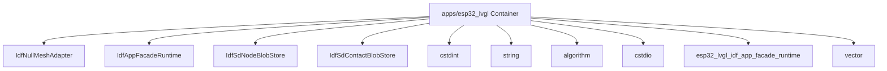

# Component responsibility: apps/esp32_lvgl

C4 level: Component
Status: candidate
Confidence: high
Project version: 0.1.30-alpha
Git:34aad0bffa2f / main / dirty
Updated on: 2026-06-25T09:19:32.800Z

## Positioning

Explain the key responsibility units inside apps/esp32_lvgl from the C4 Component layer: entry, page, command, interface, registry, adapter or shared object.

## C4 hierarchical path

- Current layer: Component, explaining the key responsibility units within a Container.
- Upper layer: Container, which defines the architectural boundaries to which these components belong.
- Lower layer: Code View, only enter a small number of key code anchors when you need to trace the implementation entrance or change the impact surface.

## Responsibility

Explain which key components within the apps/esp32_lvgl Container bear architectural responsibilities. The Component layer is not a comprehensive list of classes/functions, only objects that are helpful for understanding system boundaries, collaboration, or the impact of changes.

## Boundary

The boundary of Component View is limited to apps/esp32_lvgl Container; cross-container relationships should be explained back to the Container or Engineering Sequence perspective.

## Relationship

- IdfNullMeshAdapter: IdfNullMeshAdapter is an external system adapter component within apps/esp32_lvgl, evidenced by apps/esp32_lvgl/src/esp32_lvgl_idf_app_facade_runtime.cpp#L282.
- IdfAppFacadeRuntime: IdfAppFacadeRuntime is a major architectural component within apps/esp32_lvgl, as evidenced by apps/esp32_lvgl/src/esp32_lvgl_idf_app_facade_runtime.cpp#L415.
- IdfSdNodeBlobStore: IdfSdNodeBlobStore is a persistent access component within apps/esp32_lvgl, evidence from apps/esp32_lvgl/src/esp32_lvgl_idf_app_facade_runtime.cpp#L171.
- IdfSdContactBlobStore: IdfSdContactBlobStore is a persistent access component within apps/esp32_lvgl, evidence from apps/esp32_lvgl/src/esp32_lvgl_idf_app_facade_runtime.cpp#L254.
- cstdint: cstdint is the run configuration component within apps/esp32_lvgl, evidence from apps/esp32_lvgl/src/esp32_lvgl_runtime_config.h.
- string: string is a major architectural component within apps/esp32_lvgl, as evidenced by apps/esp32_lvgl/src/esp32_lvgl_idf_app_facade_runtime.cpp.
- algorithm: algorithm is the main architectural component within apps/esp32_lvgl, evidence from apps/esp32_lvgl/src/esp32_lvgl_idf_app_facade_runtime.cpp.
- cstdio: cstdio is the main architectural component within apps/esp32_lvgl, as evidenced by apps/esp32_lvgl/src/esp32_lvgl_arduino_app_registry.cpp.
- esp32_lvgl_idf_app_facade_runtime: esp32_lvgl_idf_app_facade_runtime is a run configuration component within apps/esp32_lvgl, evidenced by apps/esp32_lvgl/src/esp32_lvgl_idf_app_facade_runtime.h.
- vector: vector is the main architectural component within apps/esp32_lvgl, as evidenced by apps/esp32_lvgl/src/esp32_lvgl_idf_app_facade_runtime.cpp.
- esp32_lvgl_runtime_config: esp32_lvgl_runtime_config is the runtime configuration component within apps/esp32_lvgl, evidenced by apps/esp32_lvgl/src/esp32_lvgl_runtime_config.cpp.
- esp32_lvgl_arduino_app_registry: esp32_lvgl_arduino_app_registry is the main architectural component within apps/esp32_lvgl, evidenced by apps/esp32_lvgl/src/esp32_lvgl_arduino_app_registry.cpp.

## Correlation with business complexity

- The component layer helps connect business stories to actual portal, orchestration, adaptation or infrastructure objects.
- If a component directly hosts a Use Case, corresponding evidence should appear in the drill-down document of the organization/process model.

## Correlation with technical complexity

- Corresponds to Engineering Class / Structural Diagram: docs/engineering/class-structural-diagrams/apps-esp32_lvgl/class-structural-diagram.html.
- Component-level reuse signs, external collaboration signs, and complexity candidates are still explained by the software structural model.

## C4 Component diagram

## Explanation of elements in the diagram

### IdfNullMeshAdapter

- Level: component
- Description: IdfNullMeshAdapter is a class candidate component in apps/esp32_lvgl, and the evidence anchor is apps/esp32_lvgl/src/esp32_lvgl_idf_app_facade_runtime.cpp#L282; the current warehouse evidence shows that it has Strong signs of external collaboration/orchestration.
- Responsibility: IdfNullMeshAdapter is considered an external capability adapter component in the current C4 Component View. This judgment is not determined by the name alone, but by apps/esp32_lvgl/src/esp32_lvgl_idf_app_facade_runtime.cpp#L282, class type and strong external collaboration/orchestration signs.
- Boundary: It belongs inside the apps/esp32_lvgl Container; collaboration beyond this path should be interpreted back to the Container or Sequence perspective in the software structure model.
- Relational meaning: IdfNullMeshAdapter is put into Component View because it can offload the architectural responsibilities of apps/esp32_lvgl to an inspectable entry, orchestration, adaptation, contract or shared object. Reuse signs and external collaboration signs are used to indicate whether it is more like a shared core, an external orchestrator, or a normal local object.
- Why it belongs to this layer: It has a clear code anchor, but the current explanation target is not the source code details, but how the internal responsibilities of apps/esp32_lvgl are split, so it belongs to the C4 Component layer.
- Drill-down intention: Drill down to the Component Diagram of the Code View or software structure model to view the file anchor point, direct collaboration and whether there is a risk of change diffusion of IdfNullMeshAdapter.
- Confidence: high
- Evidence:
  - apps/esp32_lvgl/src/esp32_lvgl_idf_app_facade_runtime.cpp#L282
 - Indications of reuse: there are local reuse or dependency clues
 - Indications of external collaboration: there are local external collaboration clues

### IdfAppFacadeRuntime

- Level: component
- Description: IdfAppFacadeRuntime is a class candidate component in apps/esp32_lvgl, and the evidence anchor is apps/esp32_lvgl/src/esp32_lvgl_idf_app_facade_runtime.cpp#L415; the current warehouse evidence shows that it has strong signs of external collaboration/orchestration.
- Responsibility: IdfAppFacadeRuntime is considered an orchestration/aggregation component in the current C4 Component View. This judgment is not determined by the name alone, but by apps/esp32_lvgl/src/esp32_lvgl_idf_app_facade_runtime.cpp#L415, class type and strong external collaboration/orchestration signs.
- Boundary: It belongs inside the apps/esp32_lvgl Container; collaboration beyond this path should be interpreted back to the Container or Sequence perspective in the software structure model.
- Relational significance: IdfAppFacadeRuntime is put into Component View because it can offload the architectural responsibilities of apps/esp32_lvgl to an inspectable entry, orchestration, adaptation, contract or shared object. Reuse signs and external collaboration signs are used to indicate whether it is more like a shared core, an external orchestrator, or a normal local object.
- Why it belongs to this layer: It has a clear code anchor, but the current explanation target is not the source code details, but how the internal responsibilities of apps/esp32_lvgl are split, so it belongs to the C4 Component layer.
- Drill-down intent: Drill down to the Component Diagram of the Code View or software structure model to view the file anchors of IdfAppFacadeRuntime, direct collaboration, and whether there is a risk of change diffusion.
- Confidence: medium
- Evidence:
  - apps/esp32_lvgl/src/esp32_lvgl_idf_app_facade_runtime.cpp#L415
 - Indications of reuse: there are local reuse or dependency clues
 - Signs of external collaboration: Coordinating multiple external objects or capabilities

### IdfSdNodeBlobStore

- Level: component
- Description: IdfSdNodeBlobStore is a class candidate component in apps/esp32_lvgl, and the evidence anchor is apps/esp32_lvgl/src/esp32_lvgl_idf_app_facade_runtime.cpp#L171; the current warehouse evidence shows that it has signs of partial relationships and is suitable as a candidate anchor rather than a complete conclusion.
- Responsibility: IdfSdNodeBlobStore is considered a candidate schema component in the current C4 Component View. This judgment is not determined by the name alone, but is jointly supported by apps/esp32_lvgl/src/esp32_lvgl_idf_app_facade_runtime.cpp#L171, class type, and local relationship signs, which are suitable as candidate anchors rather than complete conclusions.
- Boundary: It belongs inside the apps/esp32_lvgl Container; collaboration beyond this path should be interpreted back to the Container or Sequence perspective in the software structure model.
- Relational meaning: IdfSdNodeBlobStore is put into the Component View because it offloads the architectural responsibilities of apps/esp32_lvgl to an inspectable entry, orchestration, adaptation, contract, or shared object. Reuse signs and external collaboration signs are used to indicate whether it is more like a shared core, an external orchestrator, or a normal local object.
- Why it belongs to this layer: It has a clear code anchor, but the current explanation target is not the source code details, but how the internal responsibilities of apps/esp32_lvgl are split, so it belongs to the C4 Component layer.
- Drill-down intention: Drill down to the Component Diagram of the Code View or software structure model to view the file anchor point of IdfSdNodeBlobStore, direct collaboration and whether there is a risk of change diffusion.
- Confidence: medium
- Evidence:
  - apps/esp32_lvgl/src/esp32_lvgl_idf_app_facade_runtime.cpp#L171
 - Indications of reuse: there are local reuse or dependency clues
 - Indications of external collaboration: there are local external collaboration clues

### IdfSdContactBlobStore

- Level: component
- Description: IdfSdContactBlobStore is a class candidate component in apps/esp32_lvgl, and the evidence anchor is apps/esp32_lvgl/src/esp32_lvgl_idf_app_facade_runtime.cpp#L254; the current warehouse evidence shows that it has signs of local relationships and is suitable as a candidate anchor rather than a complete conclusion.
- Responsibility: IdfSdContactBlobStore is considered a candidate schema component in the current C4 Component View. This judgment is not determined by the name alone, but is jointly supported by apps/esp32_lvgl/src/esp32_lvgl_idf_app_facade_runtime.cpp#L254, class type, and local relationship signs, which are suitable as candidate anchors rather than complete conclusions.
- Boundary: It belongs inside the apps/esp32_lvgl Container; collaboration beyond this path should be interpreted back to the Container or Sequence perspective in the software structure model.
- Relational meaning: IdfSdContactBlobStore is put into the Component View because it offloads the architectural responsibilities of apps/esp32_lvgl to an inspectable entry, orchestration, adaptation, contract, or shared object. Reuse signs and external collaboration signs are used to indicate whether it is more like a shared core, an external orchestrator, or a normal local object.
- Why it belongs to this layer: It has a clear code anchor, but the current explanation target is not the source code details, but how the internal responsibilities of apps/esp32_lvgl are split, so it belongs to the C4 Component layer.
- Drill-down intention: Drill down to the Component Diagram of the Code View or software structure model to view the file anchor point of IdfSdContactBlobStore, direct collaboration, and whether there is a risk of change diffusion.
- Confidence: medium
- Evidence:
  - apps/esp32_lvgl/src/esp32_lvgl_idf_app_facade_runtime.cpp#L254
 - Indications of reuse: there are local reuse or dependency clues
 - Indications of external collaboration: there are local external collaboration clues

### cstdint

- Level: component
- Description: cstdint is an import candidate component in apps/esp32_lvgl, and the evidence anchor is apps/esp32_lvgl/src/esp32_lvgl_runtime_config.h; the current warehouse evidence shows that it has strong signs of being reused/dependent.
- Responsibility: cstdint is considered a shared core or dependent component in the current C4 Component View. This judgment is not determined by the name alone, but is supported by apps/esp32_lvgl/src/esp32_lvgl_runtime_config.h, import type and strong signs of reuse/dependence.
- Boundary: It belongs inside the apps/esp32_lvgl Container; collaboration beyond this path should be interpreted back to the Container or Sequence perspective in the software structure model.
- Relational meaning: cstdint is put into Component View because it offloads the architectural responsibilities of apps/esp32_lvgl to an inspectable entry, orchestration, adaptation, contract, or shared object. Reuse signs and external collaboration signs are used to indicate whether it is more like a shared core, an external orchestrator, or a normal local object.
- Why it belongs to this layer: It has a clear code anchor, but the current explanation target is not the source code details, but how the internal responsibilities of apps/esp32_lvgl are split, so it belongs to the C4 Component layer.
- Drill-down intention: Drill down to the Component Diagram of the Code View or software structure model to view the file anchor point of cstdint, direct collaboration, and whether there is a risk of change diffusion.
- Confidence: medium
- Evidence:
  - apps/esp32_lvgl/src/esp32_lvgl_runtime_config.h
 - Signs of reuse: reused or dependent on multiple objects
 - Signs of external collaboration: No obvious clues of external collaboration are currently observed

### string

- Level: component
 - Description: string is an import candidate component in apps/esp32_lvgl, and the evidence anchor is apps/esp32_lvgl/src/esp32_lvgl_idf_app_facade_runtime.cpp; the current warehouse evidence shows that it has strong signs of being reused/dependent.
- Responsibility: string is considered a shared core or dependent component in the current C4 Component View. This judgment is not determined by the name alone, but is supported by apps/esp32_lvgl/src/esp32_lvgl_idf_app_facade_runtime.cpp, import type and strong signs of reuse/dependence.
- Boundary: It belongs inside the apps/esp32_lvgl Container; collaboration beyond this path should be interpreted back to the Container or Sequence perspective in the software structure model.
 - Relational meaning: string is put into the Component View because it offloads the architectural responsibilities of apps/esp32_lvgl onto an inspectable entry, orchestration, adaptation, contract, or shared object. Reuse signs and external collaboration signs are used to indicate whether it is more like a shared core, an external orchestrator, or a normal local object.
- Why it belongs to this layer: It has a clear code anchor, but the current explanation target is not the source code details, but how the internal responsibilities of apps/esp32_lvgl are split, so it belongs to the C4 Component layer.
- Drill-down intention: Drill down to the Component Diagram of the Code View or software structure model to view the file anchor point of the string, direct collaboration, and whether there is a risk of change diffusion.
- Confidence: medium
- Evidence:
  - apps/esp32_lvgl/src/esp32_lvgl_idf_app_facade_runtime.cpp
 - Indications of reuse: there are local reuse or dependency clues
 - Signs of external collaboration: No obvious clues of external collaboration are currently observed

### algorithm

- Level: component
- Description: algorithm is an import candidate component in apps/esp32_lvgl, and the evidence anchor is apps/esp32_lvgl/src/esp32_lvgl_idf_app_facade_runtime.cpp; the current warehouse evidence shows that it has strong signs of being reused/dependent.
- Responsibility: The algorithm is considered a shared core or dependent component in the current C4 Component View. This judgment is not determined by the name alone, but is supported by apps/esp32_lvgl/src/esp32_lvgl_idf_app_facade_runtime.cpp, import type and strong signs of reuse/dependence.
- Boundary: It belongs inside the apps/esp32_lvgl Container; collaboration beyond this path should be interpreted back to the Container or Sequence perspective in the software structure model.
- Relational meaning: The algorithm is put into Component View because it can fall the architectural responsibility of apps/esp32_lvgl to an inspectable entry, orchestration, adaptation, contract or shared object. Reuse signs and external collaboration signs are used to indicate whether it is more like a shared core, an external orchestrator, or a normal local object.
- Why it belongs to this layer: It has a clear code anchor, but the current explanation target is not the source code details, but how the internal responsibilities of apps/esp32_lvgl are split, so it belongs to the C4 Component layer.
- Drill-down intent: Drill down to the Component Diagram of the Code View or software structure model to view the algorithm's file anchors, direct collaboration, and whether there is a risk of change diffusion.
- Confidence: medium
- Evidence:
  - apps/esp32_lvgl/src/esp32_lvgl_idf_app_facade_runtime.cpp
 - Indications of reuse: there are local reuse or dependency clues
 - Signs of external collaboration: No obvious clues of external collaboration are currently observed

### cstdio

- Level: component
- Description: cstdio is an import candidate component in apps/esp32_lvgl, and the evidence anchor is apps/esp32_lvgl/src/esp32_lvgl_arduino_app_registry.cpp; the current warehouse evidence shows that it has strong signs of being reused/dependent.
- Responsibility: cstdio is considered a shared core or dependent component in the current C4 Component View. This judgment is not determined by the name alone, but is supported by apps/esp32_lvgl/src/esp32_lvgl_arduino_app_registry.cpp, import type and strong signs of reuse/dependence.
- Boundary: It belongs inside the apps/esp32_lvgl Container; collaboration beyond this path should be interpreted back to the Container or Sequence perspective in the software structure model.
- Relational meaning: cstdio is put into Component View because it can offload the architectural responsibilities of apps/esp32_lvgl to an inspectable entry, orchestration, adaptation, contract or shared object. Reuse signs and external collaboration signs are used to indicate whether it is more like a shared core, an external orchestrator, or a normal local object.
- Why it belongs to this layer: It has a clear code anchor, but the current explanation target is not the source code details, but how the internal responsibilities of apps/esp32_lvgl are split, so it belongs to the C4 Component layer.
- Drill-down intent: Drill down to the Component Diagram of the Code View or software structure model to view cstdio's file anchors, direct collaboration, and whether there is a risk of change diffusion.
- Confidence: medium
- Evidence:
  - apps/esp32_lvgl/src/esp32_lvgl_arduino_app_registry.cpp
 - Indications of reuse: there are local reuse or dependency clues
 - Signs of external collaboration: No obvious clues of external collaboration are currently observed

### esp32_lvgl_idf_app_facade_runtime

- Level: component
- Description: esp32_lvgl_idf_app_facade_runtime is an import candidate component in apps/esp32_lvgl, and the evidence anchor is apps/esp32_lvgl/src/esp32_lvgl_idf_app_facade_runtime.h; the current warehouse evidence shows that it has strong signs of being reused/dependent.
 - Responsibility: esp32_lvgl_idf_app_facade_runtime is considered a candidate architecture component in the current C4 Component View. This judgment is not determined by the name alone, but is supported by apps/esp32_lvgl/src/esp32_lvgl_idf_app_facade_runtime.h, import type and strong signs of reuse/dependence.
- Boundary: It belongs inside the apps/esp32_lvgl Container; collaboration beyond this path should be interpreted back to the Container or Sequence perspective in the software structure model.
- Relational meaning: esp32_lvgl_idf_app_facade_runtime is placed in the Component View because it places the architectural responsibilities of apps/esp32_lvgl onto an inspectable entry, orchestration, adaptation, contract, or shared object. Reuse signs and external collaboration signs are used to indicate whether it is more like a shared core, an external orchestrator, or a normal local object.
- Why it belongs to this layer: It has a clear code anchor, but the current explanation target is not the source code details, but how the internal responsibilities of apps/esp32_lvgl are split, so it belongs to the C4 Component layer.
- Drill-down intention: Drill down to the Component Diagram of the Code View or software structure model to view the file anchor point of esp32_lvgl_idf_app_facade_runtime, direct collaboration, and whether there is a risk of change diffusion.
- Confidence: medium
- Evidence:
  - apps/esp32_lvgl/src/esp32_lvgl_idf_app_facade_runtime.h
 - Indications of reuse: there are local reuse or dependency clues
 - Signs of external collaboration: No obvious clues of external collaboration are currently observed

### vector

- Level: component
- Note: vector is an import candidate component in apps/esp32_lvgl, and the evidence anchor is apps/esp32_lvgl/src/esp32_lvgl_idf_app_facade_runtime.cpp; the current warehouse evidence shows that it has strong signs of being reused/dependent.
- Responsibility: vector is considered a candidate architectural component in the current C4 Component View. This judgment is not determined by the name alone, but is supported by apps/esp32_lvgl/src/esp32_lvgl_idf_app_facade_runtime.cpp, import type and strong signs of reuse/dependence.
- Boundary: It belongs inside the apps/esp32_lvgl Container; collaboration beyond this path should be interpreted back to the Container or Sequence perspective in the software structure model.
- Relational meaning: vector is put into the Component View because it can drop the architectural responsibilities of apps/esp32_lvgl onto an inspectable entry, orchestration, adaptation, contract, or shared object. Reuse signs and external collaboration signs are used to indicate whether it is more like a shared core, an external orchestrator, or a normal local object.
- Why it belongs to this layer: It has a clear code anchor, but the current explanation target is not the source code details, but how the internal responsibilities of apps/esp32_lvgl are split, so it belongs to the C4 Component layer.
- Drill-down intention: Drill down to the Component Diagram of the Code View or software structure model to view the file anchor point of the vector, direct collaboration, and whether there is a risk of change diffusion.
- Confidence: medium
- Evidence:
  - apps/esp32_lvgl/src/esp32_lvgl_idf_app_facade_runtime.cpp
 - Indications of reuse: there are local reuse or dependency clues
 - Signs of external collaboration: No obvious clues of external collaboration are currently observed

### esp32_lvgl_runtime_config

- Level: component
- Description: esp32_lvgl_runtime_config is an import candidate component in apps/esp32_lvgl, and the evidence anchor is apps/esp32_lvgl/src/esp32_lvgl_runtime_config.cpp; the current warehouse evidence shows that it has signs of partial relationships and is suitable as a candidate anchor rather than a complete conclusion.
- Responsibility: esp32_lvgl_runtime_config is considered a candidate architectural component in the current C4 Component View. This judgment is not determined by the name alone, but is jointly supported by apps/esp32_lvgl/src/esp32_lvgl_runtime_config.cpp, import type, and partial relationship signs, which are suitable as candidate anchors rather than complete conclusions.
- Boundary: It belongs inside the apps/esp32_lvgl Container; collaboration beyond this path should be interpreted back to the Container or Sequence perspective in the software structure model.
 - Relational meaning: esp32_lvgl_runtime_config is placed in the Component View because it offloads the architectural responsibilities of apps/esp32_lvgl onto an inspectable entry, orchestration, adaptation, contract, or shared object. Reuse signs and external collaboration signs are used to indicate whether it is more like a shared core, an external orchestrator, or a normal local object.
- Why it belongs to this layer: It has a clear code anchor, but the current explanation target is not the source code details, but how the internal responsibilities of apps/esp32_lvgl are split, so it belongs to the C4 Component layer.
- Drill-down intention: Drill down to the Component Diagram of the Code View or software structure model to view the file anchor point of esp32_lvgl_runtime_config, direct collaboration, and whether there is a risk of change diffusion.
- Confidence: medium
- Evidence:
  - apps/esp32_lvgl/src/esp32_lvgl_runtime_config.cpp
 - Indications of reuse: there are local reuse or dependency clues
 - Signs of external collaboration: No obvious clues of external collaboration are currently observed

### esp32_lvgl_arduino_app_registry

- Level: component
- Description: esp32_lvgl_arduino_app_registry is an import candidate component in apps/esp32_lvgl, and the evidence anchor is apps/esp32_lvgl/src/esp32_lvgl_arduino_app_registry.cpp; the current warehouse evidence shows that it has signs of partial relationships and is suitable as a candidate anchor rather than a complete conclusion.
- Responsibility: esp32_lvgl_arduino_app_registry is considered a candidate architectural component in the current C4 Component View. This judgment is not determined by the name alone, but is jointly supported by apps/esp32_lvgl/src/esp32_lvgl_arduino_app_registry.cpp, import type, and partial relationship signs, which are suitable as candidate anchors rather than complete conclusions.
- Boundary: It belongs inside the apps/esp32_lvgl Container; collaboration beyond this path should be interpreted back to the Container or Sequence perspective in the software structure model.
 - Relational meaning: esp32_lvgl_arduino_app_registry is placed in the Component View because it offloads the architectural responsibilities of apps/esp32_lvgl onto an inspectable entry, orchestration, adaptation, contract, or shared object. Reuse signs and external collaboration signs are used to indicate whether it is more like a shared core, an external orchestrator, or a normal local object.
- Why it belongs to this layer: It has a clear code anchor, but the current explanation target is not the source code details, but how the internal responsibilities of apps/esp32_lvgl are split, so it belongs to the C4 Component layer.
- Drill-down intent: Drill down to the Component Diagram of the Code View or software structure model to view the file anchor point of esp32_lvgl_arduino_app_registry, direct collaboration, and whether there is a risk of change diffusion.
- Confidence: medium
- Evidence:
  - apps/esp32_lvgl/src/esp32_lvgl_arduino_app_registry.cpp
 - Indications of reuse: there are local reuse or dependency clues
 - Signs of external collaboration: No obvious clues of external collaboration are currently observed

## Drill-down C4

- [Code Anchor: apps/esp32_lvgl](../../code/apps-esp32_lvgl/code.md) - Entering Code Anchor: apps/esp32_lvgl is to trace the architectural responsibility of Component Responsibility: apps/esp32_lvgl to the specific file/symbol anchor; only when you need to determine the implementation entry or the impact of the change, you should drill down to Code.

## Associated Software Structural Model

- [apps/esp32_lvgl Class / Structural Diagram](../../../../engineering/class-structural-diagrams/apps-esp32_lvgl/class-structural-diagram.md) - View the internal structure collaboration and key technical objects of this Container.

## Evidence

- apps/esp32_lvgl/src/esp32_lvgl_idf_app_facade_runtime.cpp#L282
- apps/esp32_lvgl/src/esp32_lvgl_idf_app_facade_runtime.cpp#L415
- apps/esp32_lvgl/src/esp32_lvgl_idf_app_facade_runtime.cpp#L171
- apps/esp32_lvgl/src/esp32_lvgl_idf_app_facade_runtime.cpp#L254
- apps/esp32_lvgl/src/esp32_lvgl_runtime_config.h
- apps/esp32_lvgl/src/esp32_lvgl_idf_app_facade_runtime.cpp
- apps/esp32_lvgl/src/esp32_lvgl_idf_app_facade_runtime.cpp
- apps/esp32_lvgl/src/esp32_lvgl_arduino_app_registry.cpp
- apps/esp32_lvgl/src/esp32_lvgl_idf_app_facade_runtime.h
- apps/esp32_lvgl/src/esp32_lvgl_idf_app_facade_runtime.cpp
- apps/esp32_lvgl/src/esp32_lvgl_runtime_config.cpp
- apps/esp32_lvgl/src/esp32_lvgl_arduino_app_registry.cpp

## Judgment basis

- Component candidates only retain component-level responsibility objects such as entrances, orchestrations, interfaces, adapters, configurations, tasks, consumers or producers; methods, routes and local functions are dropped to Code View.

## Change Record

### 0.1.30-alpha - 2026-06-25T09:19:32.800Z

- Regenerate based on local warehouse evidence Component responsibility: apps/esp32_lvgl.
