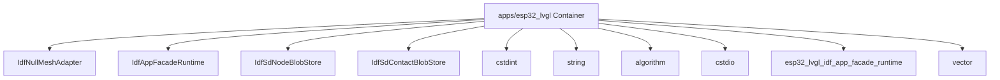

# 组件职责：apps/esp32_lvgl

C4 层级：Component
状态：candidate
置信度：high
项目版本：0.1.30-alpha
Git：34aad0bffa2f / main / dirty
更新于：2026-06-25T09:19:32.800Z

## 定位

从 C4 Component 层解释 apps/esp32_lvgl 内部的关键职责单元：入口、页面、命令、接口、注册表、adapter 或共享对象。

## C4 层级路径

- 当前层：Component，解释某个 Container 内部的关键职责单元。
- 上层：Container，限定这些组件所属的架构边界。
- 下层：Code View，只在需要追溯实现入口或变更影响面时进入少量关键代码锚点。

## 责任

解释 apps/esp32_lvgl 这个 Container 内部由哪些关键组件承担架构职责。Component 层不是全量类/函数列表，只保留对理解系统边界、协作或变更影响有帮助的对象。

## 边界

Component View 的边界被限制在 apps/esp32_lvgl Container 内；跨容器关系应该回到 Container 或 Engineering Sequence 视角解释。

## 关系

- IdfNullMeshAdapter: IdfNullMeshAdapter 是 apps/esp32_lvgl 内的外部系统适配组件，证据来自 apps/esp32_lvgl/src/esp32_lvgl_idf_app_facade_runtime.cpp#L282。
- IdfAppFacadeRuntime: IdfAppFacadeRuntime 是 apps/esp32_lvgl 内的主要架构组件，证据来自 apps/esp32_lvgl/src/esp32_lvgl_idf_app_facade_runtime.cpp#L415。
- IdfSdNodeBlobStore: IdfSdNodeBlobStore 是 apps/esp32_lvgl 内的持久化访问组件，证据来自 apps/esp32_lvgl/src/esp32_lvgl_idf_app_facade_runtime.cpp#L171。
- IdfSdContactBlobStore: IdfSdContactBlobStore 是 apps/esp32_lvgl 内的持久化访问组件，证据来自 apps/esp32_lvgl/src/esp32_lvgl_idf_app_facade_runtime.cpp#L254。
- cstdint: cstdint 是 apps/esp32_lvgl 内的运行配置组件，证据来自 apps/esp32_lvgl/src/esp32_lvgl_runtime_config.h。
- string: string 是 apps/esp32_lvgl 内的主要架构组件，证据来自 apps/esp32_lvgl/src/esp32_lvgl_idf_app_facade_runtime.cpp。
- algorithm: algorithm 是 apps/esp32_lvgl 内的主要架构组件，证据来自 apps/esp32_lvgl/src/esp32_lvgl_idf_app_facade_runtime.cpp。
- cstdio: cstdio 是 apps/esp32_lvgl 内的主要架构组件，证据来自 apps/esp32_lvgl/src/esp32_lvgl_arduino_app_registry.cpp。
- esp32_lvgl_idf_app_facade_runtime: esp32_lvgl_idf_app_facade_runtime 是 apps/esp32_lvgl 内的运行配置组件，证据来自 apps/esp32_lvgl/src/esp32_lvgl_idf_app_facade_runtime.h。
- vector: vector 是 apps/esp32_lvgl 内的主要架构组件，证据来自 apps/esp32_lvgl/src/esp32_lvgl_idf_app_facade_runtime.cpp。
- esp32_lvgl_runtime_config: esp32_lvgl_runtime_config 是 apps/esp32_lvgl 内的运行配置组件，证据来自 apps/esp32_lvgl/src/esp32_lvgl_runtime_config.cpp。
- esp32_lvgl_arduino_app_registry: esp32_lvgl_arduino_app_registry 是 apps/esp32_lvgl 内的主要架构组件，证据来自 apps/esp32_lvgl/src/esp32_lvgl_arduino_app_registry.cpp。

## 与业务复杂度的关联

- 组件层帮助把业务故事连接到实际入口、编排、适配或基础设施对象。
- 如果某个组件直接承载 Use Case，应在组织/过程模型的下钻文档中出现对应证据。

## 与技术复杂度的关联

- 对应 Engineering Class / Structural Diagram：docs/engineering/class-structural-diagrams/apps-esp32_lvgl/class-structural-diagram.html。
- 组件级复用迹象、外部协作迹象和复杂度候选点仍由软件结构模型负责解释。

## C4 Component 图

## 图内元素解释

### IdfNullMeshAdapter

- 层级：component
- 说明：IdfNullMeshAdapter 是 apps/esp32_lvgl 内的 class 候选组件，证据锚点是 apps/esp32_lvgl/src/esp32_lvgl_idf_app_facade_runtime.cpp#L282；当前仓库证据显示它有 较强的外部协作/编排迹象。
- 责任：IdfNullMeshAdapter 在当前 C4 Component View 中被视为外部能力适配组件。这个判断不是由名称单独决定，而是由 apps/esp32_lvgl/src/esp32_lvgl_idf_app_facade_runtime.cpp#L282、class 类型和 较强的外部协作/编排迹象 共同支撑。
- 边界：它属于 apps/esp32_lvgl Container 内部；超出该路径的协作应回到 Container 或软件结构模型中的 Sequence 视角解释。
- 关系意义：IdfNullMeshAdapter 被放入 Component View，是因为它能把 apps/esp32_lvgl 的架构职责落到一个可检查的入口、编排、适配、契约或共享对象上。复用迹象和外部协作迹象用于提示它更像共享核心、对外编排者，还是普通局部对象。
- 为什么属于该层：它有明确代码锚点，但当前解释目标不是源码细节，而是 apps/esp32_lvgl 内部职责如何拆分，所以属于 C4 Component 层。
- 下钻意图：下钻到 Code View 或软件结构模型的 Component Diagram，用来查看 IdfNullMeshAdapter 的文件锚点、直接协作和是否存在变更扩散风险。
- 置信度：high
- 证据：
  - apps/esp32_lvgl/src/esp32_lvgl_idf_app_facade_runtime.cpp#L282
  - 复用迹象：存在局部复用或依赖线索
  - 外部协作迹象：存在局部外部协作线索

### IdfAppFacadeRuntime

- 层级：component
- 说明：IdfAppFacadeRuntime 是 apps/esp32_lvgl 内的 class 候选组件，证据锚点是 apps/esp32_lvgl/src/esp32_lvgl_idf_app_facade_runtime.cpp#L415；当前仓库证据显示它有 较强的外部协作/编排迹象。
- 责任：IdfAppFacadeRuntime 在当前 C4 Component View 中被视为编排/聚合组件。这个判断不是由名称单独决定，而是由 apps/esp32_lvgl/src/esp32_lvgl_idf_app_facade_runtime.cpp#L415、class 类型和 较强的外部协作/编排迹象 共同支撑。
- 边界：它属于 apps/esp32_lvgl Container 内部；超出该路径的协作应回到 Container 或软件结构模型中的 Sequence 视角解释。
- 关系意义：IdfAppFacadeRuntime 被放入 Component View，是因为它能把 apps/esp32_lvgl 的架构职责落到一个可检查的入口、编排、适配、契约或共享对象上。复用迹象和外部协作迹象用于提示它更像共享核心、对外编排者，还是普通局部对象。
- 为什么属于该层：它有明确代码锚点，但当前解释目标不是源码细节，而是 apps/esp32_lvgl 内部职责如何拆分，所以属于 C4 Component 层。
- 下钻意图：下钻到 Code View 或软件结构模型的 Component Diagram，用来查看 IdfAppFacadeRuntime 的文件锚点、直接协作和是否存在变更扩散风险。
- 置信度：medium
- 证据：
  - apps/esp32_lvgl/src/esp32_lvgl_idf_app_facade_runtime.cpp#L415
  - 复用迹象：存在局部复用或依赖线索
  - 外部协作迹象：协调多个外部对象或能力

### IdfSdNodeBlobStore

- 层级：component
- 说明：IdfSdNodeBlobStore 是 apps/esp32_lvgl 内的 class 候选组件，证据锚点是 apps/esp32_lvgl/src/esp32_lvgl_idf_app_facade_runtime.cpp#L171；当前仓库证据显示它有 局部关系迹象，适合作为候选锚点而非完整结论。
- 责任：IdfSdNodeBlobStore 在当前 C4 Component View 中被视为候选架构组件。这个判断不是由名称单独决定，而是由 apps/esp32_lvgl/src/esp32_lvgl_idf_app_facade_runtime.cpp#L171、class 类型和 局部关系迹象，适合作为候选锚点而非完整结论 共同支撑。
- 边界：它属于 apps/esp32_lvgl Container 内部；超出该路径的协作应回到 Container 或软件结构模型中的 Sequence 视角解释。
- 关系意义：IdfSdNodeBlobStore 被放入 Component View，是因为它能把 apps/esp32_lvgl 的架构职责落到一个可检查的入口、编排、适配、契约或共享对象上。复用迹象和外部协作迹象用于提示它更像共享核心、对外编排者，还是普通局部对象。
- 为什么属于该层：它有明确代码锚点，但当前解释目标不是源码细节，而是 apps/esp32_lvgl 内部职责如何拆分，所以属于 C4 Component 层。
- 下钻意图：下钻到 Code View 或软件结构模型的 Component Diagram，用来查看 IdfSdNodeBlobStore 的文件锚点、直接协作和是否存在变更扩散风险。
- 置信度：medium
- 证据：
  - apps/esp32_lvgl/src/esp32_lvgl_idf_app_facade_runtime.cpp#L171
  - 复用迹象：存在局部复用或依赖线索
  - 外部协作迹象：存在局部外部协作线索

### IdfSdContactBlobStore

- 层级：component
- 说明：IdfSdContactBlobStore 是 apps/esp32_lvgl 内的 class 候选组件，证据锚点是 apps/esp32_lvgl/src/esp32_lvgl_idf_app_facade_runtime.cpp#L254；当前仓库证据显示它有 局部关系迹象，适合作为候选锚点而非完整结论。
- 责任：IdfSdContactBlobStore 在当前 C4 Component View 中被视为候选架构组件。这个判断不是由名称单独决定，而是由 apps/esp32_lvgl/src/esp32_lvgl_idf_app_facade_runtime.cpp#L254、class 类型和 局部关系迹象，适合作为候选锚点而非完整结论 共同支撑。
- 边界：它属于 apps/esp32_lvgl Container 内部；超出该路径的协作应回到 Container 或软件结构模型中的 Sequence 视角解释。
- 关系意义：IdfSdContactBlobStore 被放入 Component View，是因为它能把 apps/esp32_lvgl 的架构职责落到一个可检查的入口、编排、适配、契约或共享对象上。复用迹象和外部协作迹象用于提示它更像共享核心、对外编排者，还是普通局部对象。
- 为什么属于该层：它有明确代码锚点，但当前解释目标不是源码细节，而是 apps/esp32_lvgl 内部职责如何拆分，所以属于 C4 Component 层。
- 下钻意图：下钻到 Code View 或软件结构模型的 Component Diagram，用来查看 IdfSdContactBlobStore 的文件锚点、直接协作和是否存在变更扩散风险。
- 置信度：medium
- 证据：
  - apps/esp32_lvgl/src/esp32_lvgl_idf_app_facade_runtime.cpp#L254
  - 复用迹象：存在局部复用或依赖线索
  - 外部协作迹象：存在局部外部协作线索

### cstdint

- 层级：component
- 说明：cstdint 是 apps/esp32_lvgl 内的 import 候选组件，证据锚点是 apps/esp32_lvgl/src/esp32_lvgl_runtime_config.h；当前仓库证据显示它有 较强的被复用/被依赖迹象。
- 责任：cstdint 在当前 C4 Component View 中被视为共享核心或被依赖组件。这个判断不是由名称单独决定，而是由 apps/esp32_lvgl/src/esp32_lvgl_runtime_config.h、import 类型和 较强的被复用/被依赖迹象 共同支撑。
- 边界：它属于 apps/esp32_lvgl Container 内部；超出该路径的协作应回到 Container 或软件结构模型中的 Sequence 视角解释。
- 关系意义：cstdint 被放入 Component View，是因为它能把 apps/esp32_lvgl 的架构职责落到一个可检查的入口、编排、适配、契约或共享对象上。复用迹象和外部协作迹象用于提示它更像共享核心、对外编排者，还是普通局部对象。
- 为什么属于该层：它有明确代码锚点，但当前解释目标不是源码细节，而是 apps/esp32_lvgl 内部职责如何拆分，所以属于 C4 Component 层。
- 下钻意图：下钻到 Code View 或软件结构模型的 Component Diagram，用来查看 cstdint 的文件锚点、直接协作和是否存在变更扩散风险。
- 置信度：medium
- 证据：
  - apps/esp32_lvgl/src/esp32_lvgl_runtime_config.h
  - 复用迹象：被多个对象复用或依赖
  - 外部协作迹象：当前未观察到明显外部协作线索

### string

- 层级：component
- 说明：string 是 apps/esp32_lvgl 内的 import 候选组件，证据锚点是 apps/esp32_lvgl/src/esp32_lvgl_idf_app_facade_runtime.cpp；当前仓库证据显示它有 较强的被复用/被依赖迹象。
- 责任：string 在当前 C4 Component View 中被视为共享核心或被依赖组件。这个判断不是由名称单独决定，而是由 apps/esp32_lvgl/src/esp32_lvgl_idf_app_facade_runtime.cpp、import 类型和 较强的被复用/被依赖迹象 共同支撑。
- 边界：它属于 apps/esp32_lvgl Container 内部；超出该路径的协作应回到 Container 或软件结构模型中的 Sequence 视角解释。
- 关系意义：string 被放入 Component View，是因为它能把 apps/esp32_lvgl 的架构职责落到一个可检查的入口、编排、适配、契约或共享对象上。复用迹象和外部协作迹象用于提示它更像共享核心、对外编排者，还是普通局部对象。
- 为什么属于该层：它有明确代码锚点，但当前解释目标不是源码细节，而是 apps/esp32_lvgl 内部职责如何拆分，所以属于 C4 Component 层。
- 下钻意图：下钻到 Code View 或软件结构模型的 Component Diagram，用来查看 string 的文件锚点、直接协作和是否存在变更扩散风险。
- 置信度：medium
- 证据：
  - apps/esp32_lvgl/src/esp32_lvgl_idf_app_facade_runtime.cpp
  - 复用迹象：存在局部复用或依赖线索
  - 外部协作迹象：当前未观察到明显外部协作线索

### algorithm

- 层级：component
- 说明：algorithm 是 apps/esp32_lvgl 内的 import 候选组件，证据锚点是 apps/esp32_lvgl/src/esp32_lvgl_idf_app_facade_runtime.cpp；当前仓库证据显示它有 较强的被复用/被依赖迹象。
- 责任：algorithm 在当前 C4 Component View 中被视为共享核心或被依赖组件。这个判断不是由名称单独决定，而是由 apps/esp32_lvgl/src/esp32_lvgl_idf_app_facade_runtime.cpp、import 类型和 较强的被复用/被依赖迹象 共同支撑。
- 边界：它属于 apps/esp32_lvgl Container 内部；超出该路径的协作应回到 Container 或软件结构模型中的 Sequence 视角解释。
- 关系意义：algorithm 被放入 Component View，是因为它能把 apps/esp32_lvgl 的架构职责落到一个可检查的入口、编排、适配、契约或共享对象上。复用迹象和外部协作迹象用于提示它更像共享核心、对外编排者，还是普通局部对象。
- 为什么属于该层：它有明确代码锚点，但当前解释目标不是源码细节，而是 apps/esp32_lvgl 内部职责如何拆分，所以属于 C4 Component 层。
- 下钻意图：下钻到 Code View 或软件结构模型的 Component Diagram，用来查看 algorithm 的文件锚点、直接协作和是否存在变更扩散风险。
- 置信度：medium
- 证据：
  - apps/esp32_lvgl/src/esp32_lvgl_idf_app_facade_runtime.cpp
  - 复用迹象：存在局部复用或依赖线索
  - 外部协作迹象：当前未观察到明显外部协作线索

### cstdio

- 层级：component
- 说明：cstdio 是 apps/esp32_lvgl 内的 import 候选组件，证据锚点是 apps/esp32_lvgl/src/esp32_lvgl_arduino_app_registry.cpp；当前仓库证据显示它有 较强的被复用/被依赖迹象。
- 责任：cstdio 在当前 C4 Component View 中被视为共享核心或被依赖组件。这个判断不是由名称单独决定，而是由 apps/esp32_lvgl/src/esp32_lvgl_arduino_app_registry.cpp、import 类型和 较强的被复用/被依赖迹象 共同支撑。
- 边界：它属于 apps/esp32_lvgl Container 内部；超出该路径的协作应回到 Container 或软件结构模型中的 Sequence 视角解释。
- 关系意义：cstdio 被放入 Component View，是因为它能把 apps/esp32_lvgl 的架构职责落到一个可检查的入口、编排、适配、契约或共享对象上。复用迹象和外部协作迹象用于提示它更像共享核心、对外编排者，还是普通局部对象。
- 为什么属于该层：它有明确代码锚点，但当前解释目标不是源码细节，而是 apps/esp32_lvgl 内部职责如何拆分，所以属于 C4 Component 层。
- 下钻意图：下钻到 Code View 或软件结构模型的 Component Diagram，用来查看 cstdio 的文件锚点、直接协作和是否存在变更扩散风险。
- 置信度：medium
- 证据：
  - apps/esp32_lvgl/src/esp32_lvgl_arduino_app_registry.cpp
  - 复用迹象：存在局部复用或依赖线索
  - 外部协作迹象：当前未观察到明显外部协作线索

### esp32_lvgl_idf_app_facade_runtime

- 层级：component
- 说明：esp32_lvgl_idf_app_facade_runtime 是 apps/esp32_lvgl 内的 import 候选组件，证据锚点是 apps/esp32_lvgl/src/esp32_lvgl_idf_app_facade_runtime.h；当前仓库证据显示它有 较强的被复用/被依赖迹象。
- 责任：esp32_lvgl_idf_app_facade_runtime 在当前 C4 Component View 中被视为候选架构组件。这个判断不是由名称单独决定，而是由 apps/esp32_lvgl/src/esp32_lvgl_idf_app_facade_runtime.h、import 类型和 较强的被复用/被依赖迹象 共同支撑。
- 边界：它属于 apps/esp32_lvgl Container 内部；超出该路径的协作应回到 Container 或软件结构模型中的 Sequence 视角解释。
- 关系意义：esp32_lvgl_idf_app_facade_runtime 被放入 Component View，是因为它能把 apps/esp32_lvgl 的架构职责落到一个可检查的入口、编排、适配、契约或共享对象上。复用迹象和外部协作迹象用于提示它更像共享核心、对外编排者，还是普通局部对象。
- 为什么属于该层：它有明确代码锚点，但当前解释目标不是源码细节，而是 apps/esp32_lvgl 内部职责如何拆分，所以属于 C4 Component 层。
- 下钻意图：下钻到 Code View 或软件结构模型的 Component Diagram，用来查看 esp32_lvgl_idf_app_facade_runtime 的文件锚点、直接协作和是否存在变更扩散风险。
- 置信度：medium
- 证据：
  - apps/esp32_lvgl/src/esp32_lvgl_idf_app_facade_runtime.h
  - 复用迹象：存在局部复用或依赖线索
  - 外部协作迹象：当前未观察到明显外部协作线索

### vector

- 层级：component
- 说明：vector 是 apps/esp32_lvgl 内的 import 候选组件，证据锚点是 apps/esp32_lvgl/src/esp32_lvgl_idf_app_facade_runtime.cpp；当前仓库证据显示它有 较强的被复用/被依赖迹象。
- 责任：vector 在当前 C4 Component View 中被视为候选架构组件。这个判断不是由名称单独决定，而是由 apps/esp32_lvgl/src/esp32_lvgl_idf_app_facade_runtime.cpp、import 类型和 较强的被复用/被依赖迹象 共同支撑。
- 边界：它属于 apps/esp32_lvgl Container 内部；超出该路径的协作应回到 Container 或软件结构模型中的 Sequence 视角解释。
- 关系意义：vector 被放入 Component View，是因为它能把 apps/esp32_lvgl 的架构职责落到一个可检查的入口、编排、适配、契约或共享对象上。复用迹象和外部协作迹象用于提示它更像共享核心、对外编排者，还是普通局部对象。
- 为什么属于该层：它有明确代码锚点，但当前解释目标不是源码细节，而是 apps/esp32_lvgl 内部职责如何拆分，所以属于 C4 Component 层。
- 下钻意图：下钻到 Code View 或软件结构模型的 Component Diagram，用来查看 vector 的文件锚点、直接协作和是否存在变更扩散风险。
- 置信度：medium
- 证据：
  - apps/esp32_lvgl/src/esp32_lvgl_idf_app_facade_runtime.cpp
  - 复用迹象：存在局部复用或依赖线索
  - 外部协作迹象：当前未观察到明显外部协作线索

### esp32_lvgl_runtime_config

- 层级：component
- 说明：esp32_lvgl_runtime_config 是 apps/esp32_lvgl 内的 import 候选组件，证据锚点是 apps/esp32_lvgl/src/esp32_lvgl_runtime_config.cpp；当前仓库证据显示它有 局部关系迹象，适合作为候选锚点而非完整结论。
- 责任：esp32_lvgl_runtime_config 在当前 C4 Component View 中被视为候选架构组件。这个判断不是由名称单独决定，而是由 apps/esp32_lvgl/src/esp32_lvgl_runtime_config.cpp、import 类型和 局部关系迹象，适合作为候选锚点而非完整结论 共同支撑。
- 边界：它属于 apps/esp32_lvgl Container 内部；超出该路径的协作应回到 Container 或软件结构模型中的 Sequence 视角解释。
- 关系意义：esp32_lvgl_runtime_config 被放入 Component View，是因为它能把 apps/esp32_lvgl 的架构职责落到一个可检查的入口、编排、适配、契约或共享对象上。复用迹象和外部协作迹象用于提示它更像共享核心、对外编排者，还是普通局部对象。
- 为什么属于该层：它有明确代码锚点，但当前解释目标不是源码细节，而是 apps/esp32_lvgl 内部职责如何拆分，所以属于 C4 Component 层。
- 下钻意图：下钻到 Code View 或软件结构模型的 Component Diagram，用来查看 esp32_lvgl_runtime_config 的文件锚点、直接协作和是否存在变更扩散风险。
- 置信度：medium
- 证据：
  - apps/esp32_lvgl/src/esp32_lvgl_runtime_config.cpp
  - 复用迹象：存在局部复用或依赖线索
  - 外部协作迹象：当前未观察到明显外部协作线索

### esp32_lvgl_arduino_app_registry

- 层级：component
- 说明：esp32_lvgl_arduino_app_registry 是 apps/esp32_lvgl 内的 import 候选组件，证据锚点是 apps/esp32_lvgl/src/esp32_lvgl_arduino_app_registry.cpp；当前仓库证据显示它有 局部关系迹象，适合作为候选锚点而非完整结论。
- 责任：esp32_lvgl_arduino_app_registry 在当前 C4 Component View 中被视为候选架构组件。这个判断不是由名称单独决定，而是由 apps/esp32_lvgl/src/esp32_lvgl_arduino_app_registry.cpp、import 类型和 局部关系迹象，适合作为候选锚点而非完整结论 共同支撑。
- 边界：它属于 apps/esp32_lvgl Container 内部；超出该路径的协作应回到 Container 或软件结构模型中的 Sequence 视角解释。
- 关系意义：esp32_lvgl_arduino_app_registry 被放入 Component View，是因为它能把 apps/esp32_lvgl 的架构职责落到一个可检查的入口、编排、适配、契约或共享对象上。复用迹象和外部协作迹象用于提示它更像共享核心、对外编排者，还是普通局部对象。
- 为什么属于该层：它有明确代码锚点，但当前解释目标不是源码细节，而是 apps/esp32_lvgl 内部职责如何拆分，所以属于 C4 Component 层。
- 下钻意图：下钻到 Code View 或软件结构模型的 Component Diagram，用来查看 esp32_lvgl_arduino_app_registry 的文件锚点、直接协作和是否存在变更扩散风险。
- 置信度：medium
- 证据：
  - apps/esp32_lvgl/src/esp32_lvgl_arduino_app_registry.cpp
  - 复用迹象：存在局部复用或依赖线索
  - 外部协作迹象：当前未观察到明显外部协作线索

## 可下钻 C4

- [代码锚点：apps/esp32_lvgl](../../code/apps-esp32_lvgl/code.md) - 进入 代码锚点：apps/esp32_lvgl 是为了把 组件职责：apps/esp32_lvgl 的架构职责追溯到具体文件/符号锚点；只有需要判断实现入口或变更影响面时才应下钻到 Code。

## 关联软件结构模型

- [apps/esp32_lvgl Class / Structural Diagram](../../../../engineering/class-structural-diagrams/apps-esp32_lvgl/class-structural-diagram.md) - 查看该 Container 内部结构协作和关键技术对象。

## 证据

- apps/esp32_lvgl/src/esp32_lvgl_idf_app_facade_runtime.cpp#L282
- apps/esp32_lvgl/src/esp32_lvgl_idf_app_facade_runtime.cpp#L415
- apps/esp32_lvgl/src/esp32_lvgl_idf_app_facade_runtime.cpp#L171
- apps/esp32_lvgl/src/esp32_lvgl_idf_app_facade_runtime.cpp#L254
- apps/esp32_lvgl/src/esp32_lvgl_runtime_config.h
- apps/esp32_lvgl/src/esp32_lvgl_idf_app_facade_runtime.cpp
- apps/esp32_lvgl/src/esp32_lvgl_idf_app_facade_runtime.cpp
- apps/esp32_lvgl/src/esp32_lvgl_arduino_app_registry.cpp
- apps/esp32_lvgl/src/esp32_lvgl_idf_app_facade_runtime.h
- apps/esp32_lvgl/src/esp32_lvgl_idf_app_facade_runtime.cpp
- apps/esp32_lvgl/src/esp32_lvgl_runtime_config.cpp
- apps/esp32_lvgl/src/esp32_lvgl_arduino_app_registry.cpp

## 判定依据

- Component 候选只保留入口、编排、接口、适配器、配置、任务、消费者或生产者等组件级职责对象；方法、路由和局部函数下沉到 Code View。

## 变更记录

### 0.1.30-alpha - 2026-06-25T09:19:32.800Z

- 基于本地仓库证据重新生成 组件职责：apps/esp32_lvgl。
