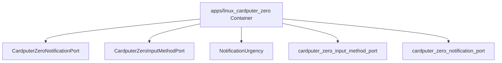

# Component responsibility: apps/linux_cardputer_zero

C4 level: Component
Status: candidate
Confidence: medium
Project version: 0.1.30-alpha
Git:34aad0bffa2f / main / dirty
Updated on: 2026-06-25T09:19:32.800Z

## Positioning

Explain the key responsibility units inside apps/linux_cardputer_zero from the C4 Component layer: entry, page, command, interface, registry, adapter or shared object.

## C4 hierarchical path

- Current layer: Component, explaining the key responsibility units within a Container.
- Upper layer: Container, which defines the architectural boundaries to which these components belong.
- Lower layer: Code View, only enter a small number of key code anchors when you need to trace the implementation entrance or change the impact surface.

## Responsibility

Explain which key components within the apps/linux_cardputer_zero Container bear architectural responsibilities. The Component layer is not a comprehensive list of classes/functions, only objects that are helpful for understanding system boundaries, collaboration, or the impact of changes.

## Boundary

The boundary of Component View is limited to apps/linux_cardputer_zero Container; cross-container relationships should be explained back to the Container or Engineering Sequence perspective.

## Relationship

- CardputerZeroNotificationPort: CardputerZeroNotificationPort is the main architectural component within apps/linux_cardputer_zero, evidenced by apps/linux_cardputer_zero/src/cardputer_zero_notification_port.h#L67.
- CardputerZeroInputMethodPort: CardputerZeroInputMethodPort is the main architectural component within apps/linux_cardputer_zero, as evidenced by apps/linux_cardputer_zero/src/cardputer_zero_input_method_port.h#L39.
- NotificationUrgency: NotificationUrgency is a major architectural component within apps/linux_cardputer_zero, as evidenced by apps/linux_cardputer_zero/src/cardputer_zero_notification_port.h#L12.
- cardputer_zero_input_method_port: cardputer_zero_input_method_port is the main architectural component within apps/linux_cardputer_zero, as evidenced by apps/linux_cardputer_zero/src/cardputer_zero_input_method_port.cpp.
- cardputer_zero_notification_port: cardputer_zero_notification_port is the main architectural component within apps/linux_cardputer_zero, evidenced by apps/linux_cardputer_zero/src/cardputer_zero_notification_port.cpp.

## Correlation with business complexity

- The component layer helps connect business stories to actual portal, orchestration, adaptation or infrastructure objects.
- If a component directly hosts a Use Case, corresponding evidence should appear in the drill-down document of the organization/process model.

## Correlation with technical complexity

- Corresponds to Engineering Class / Structural Diagram: docs/engineering/class-structural-diagrams/apps-linux_cardputer_zero/class-structural-diagram.html.
- Component-level reuse signs, external collaboration signs, and complexity candidates are still explained by the software structural model.

## C4 Component diagram

## Explanation of elements in the diagram

### CardputerZeroNotificationPort

- Level: component
- Description: CardputerZeroNotificationPort is a class candidate component in apps/linux_cardputer_zero, and the evidence anchor is apps/linux_cardputer_zero/src/cardputer_zero_notification_port.h#L67; the current warehouse evidence shows that it has signs of partial relationships and is suitable as a candidate anchor rather than a complete conclusion.
- Responsibility: CardputerZeroNotificationPort is considered a candidate architecture component in the current C4 Component View. This judgment is not determined by the name alone, but is jointly supported by apps/linux_cardputer_zero/src/cardputer_zero_notification_port.h#L67, class type and local relationship signs, which are suitable as candidate anchors rather than complete conclusions.
- Boundary: It belongs inside apps/linux_cardputer_zero Container; collaboration beyond this path should be interpreted back to the Container or Sequence perspective in the software structure model.
- Relational significance: CardputerZeroNotificationPort is put into the Component View because it offloads the architectural responsibilities of apps/linux_cardputer_zero to an inspectable entry, orchestration, adaptation, contract, or shared object. Reuse signs and external collaboration signs are used to indicate whether it is more like a shared core, an external orchestrator, or a normal local object.
- Why it belongs to this layer: It has a clear code anchor, but the current explanation target is not the source code details, but how to split the internal responsibilities of apps/linux_cardputer_zero, so it belongs to the C4 Component layer.
- Drill down intent: Drill down to the Code View or Component Diagram of the software structure model to view the file anchor point of CardputerZeroNotificationPort, direct collaboration, and whether there is a risk of change diffusion.
- Confidence: medium
- Evidence:
  - apps/linux_cardputer_zero/src/cardputer_zero_notification_port.h#L67
 - Indications of reuse: there are local reuse or dependency clues
 - Indications of external collaboration: there are local external collaboration clues

### CardputerZeroInputMethodPort

- Level: component
- Description: CardputerZeroInputMethodPort is a class candidate component in apps/linux_cardputer_zero, and the evidence anchor is apps/linux_cardputer_zero/src/cardputer_zero_input_method_port.h#L39; the current warehouse evidence shows that it has signs of partial relationships and is suitable as a candidate anchor rather than a complete conclusion.
- Responsibility: CardputerZeroInputMethodPort is considered a candidate architecture component in the current C4 Component View. This judgment is not determined by the name alone, but is jointly supported by apps/linux_cardputer_zero/src/cardputer_zero_input_method_port.h#L39, class type, and local relationship signs, which are suitable as candidate anchors rather than complete conclusions.
- Boundary: It belongs inside apps/linux_cardputer_zero Container; collaboration beyond this path should be interpreted back to the Container or Sequence perspective in the software structure model.
- Relational significance: CardputerZeroInputMethodPort is put into the Component View because it offloads the architectural responsibilities of apps/linux_cardputer_zero onto an inspectable entry, orchestration, adaptation, contract, or shared object. Reuse signs and external collaboration signs are used to indicate whether it is more like a shared core, an external orchestrator, or a normal local object.
- Why it belongs to this layer: It has a clear code anchor, but the current explanation target is not the source code details, but how to split the internal responsibilities of apps/linux_cardputer_zero, so it belongs to the C4 Component layer.
- Drill-down intent: Drill down to the Component Diagram of the Code View or software structure model to view the file anchor point, direct collaboration, and whether there is a risk of change diffusion of CardputerZeroInputMethodPort.
- Confidence: medium
- Evidence:
  - apps/linux_cardputer_zero/src/cardputer_zero_input_method_port.h#L39
 - Indications of reuse: there are local reuse or dependency clues
 - Indications of external collaboration: there are local external collaboration clues

### NotificationUrgency

- Level: component
- Description: NotificationUrgency is an enum candidate component in apps/linux_cardputer_zero, and the evidence anchor is apps/linux_cardputer_zero/src/cardputer_zero_notification_port.h#L12; the current warehouse evidence shows that it has signs of partial relationships and is suitable as a candidate anchor rather than a complete conclusion.
- Responsibility: NotificationUrgency is considered a candidate architectural component in the current C4 Component View. This judgment is not determined by the name alone, but is jointly supported by apps/linux_cardputer_zero/src/cardputer_zero_notification_port.h#L12, enum type, and local relationship signs, which are suitable as candidate anchors rather than complete conclusions.
- Boundary: It belongs inside apps/linux_cardputer_zero Container; collaboration beyond this path should be interpreted back to the Container or Sequence perspective in the software structure model.
- Relational meaning: NotificationUrgency is put into the Component View because it offloads the architectural responsibilities of apps/linux_cardputer_zero onto an inspectable entry, orchestration, adaptation, contract, or shared object. Reuse signs and external collaboration signs are used to indicate whether it is more like a shared core, an external orchestrator, or a normal local object.
- Why it belongs to this layer: It has a clear code anchor, but the current explanation target is not the source code details, but how to split the internal responsibilities of apps/linux_cardputer_zero, so it belongs to the C4 Component layer.
- Drill-down intent: Drill down to the Component Diagram of the Code View or software structure model to view the file anchor point of NotificationUrgency, direct collaboration, and whether there is a risk of change diffusion.
- Confidence: medium
- Evidence:
  - apps/linux_cardputer_zero/src/cardputer_zero_notification_port.h#L12
 - Indications of reuse: there are local reuse or dependency clues
 - Indications of external collaboration: there are local external collaboration clues

### cardputer_zero_input_method_port

- Level: component
- Description: cardputer_zero_input_method_port is an import candidate component in apps/linux_cardputer_zero, and the evidence anchor is apps/linux_cardputer_zero/src/cardputer_zero_input_method_port.cpp; the current warehouse evidence shows that it has signs of partial relationships and is suitable as a candidate anchor rather than a complete conclusion.
- Responsibility: cardputer_zero_input_method_port is considered a candidate architecture component in the current C4 Component View. This judgment is not determined by the name alone, but is jointly supported by apps/linux_cardputer_zero/src/cardputer_zero_input_method_port.cpp, import type, and partial relationship signs, which are suitable as candidate anchors rather than complete conclusions.
- Boundary: It belongs inside apps/linux_cardputer_zero Container; collaboration beyond this path should be interpreted back to the Container or Sequence perspective in the software structure model.
- Relational meaning: cardputer_zero_input_method_port is put into the Component View because it offloads the architectural responsibilities of apps/linux_cardputer_zero to an inspectable entry, orchestration, adaptation, contract, or shared object. Reuse signs and external collaboration signs are used to indicate whether it is more like a shared core, an external orchestrator, or a normal local object.
- Why it belongs to this layer: It has a clear code anchor, but the current explanation target is not the source code details, but how to split the internal responsibilities of apps/linux_cardputer_zero, so it belongs to the C4 Component layer.
- Drill-down intention: Drill down to the Component Diagram of the Code View or software structure model to view the file anchor point of cardputer_zero_input_method_port, direct collaboration, and whether there is a risk of change diffusion.
- Confidence: medium
- Evidence:
  - apps/linux_cardputer_zero/src/cardputer_zero_input_method_port.cpp
 - Reuse signs: No obvious reuse clues are currently observed
 - Signs of external collaboration: No obvious clues of external collaboration are currently observed

### cardputer_zero_notification_port

- Level: component
 - Description: cardputer_zero_notification_port is an import candidate component in apps/linux_cardputer_zero, and the evidence anchor is apps/linux_cardputer_zero/src/cardputer_zero_notification_port.cpp; the current warehouse evidence shows that it has Local signs of relationships, suitable as candidate anchors rather than complete conclusions.
- Responsibility: cardputer_zero_notification_port is considered a candidate architecture component in the current C4 Component View. This judgment is not determined by the name alone, but is jointly supported by apps/linux_cardputer_zero/src/cardputer_zero_notification_port.cpp, import type, and partial relationship signs, which are suitable as candidate anchors rather than complete conclusions.
- Boundary: It belongs inside apps/linux_cardputer_zero Container; collaboration beyond this path should be interpreted back to the Container or Sequence perspective in the software structure model.
 - Relational meaning: cardputer_zero_notification_port is placed in the Component View because it offloads the architectural responsibilities of apps/linux_cardputer_zero onto an inspectable entry, orchestration, adaptation, contract, or shared object. Reuse signs and external collaboration signs are used to indicate whether it is more like a shared core, an external orchestrator, or a normal local object.
- Why it belongs to this layer: It has a clear code anchor, but the current explanation target is not the source code details, but how to split the internal responsibilities of apps/linux_cardputer_zero, so it belongs to the C4 Component layer.
- Drill-down intention: Drill down to the Component Diagram of the Code View or software structure model to view the file anchor point of cardputer_zero_notification_port, direct collaboration, and whether there is a risk of change diffusion.
- Confidence: medium
- Evidence:
  - apps/linux_cardputer_zero/src/cardputer_zero_notification_port.cpp
 - Reuse signs: No obvious reuse clues are currently observed
 - Signs of external collaboration: No obvious clues of external collaboration are currently observed

## Drill-down C4

- [Code Anchor: apps/linux_cardputer_zero](../../code/apps-linux_cardputer_zero/code.md) - Entering Code Anchor: apps/linux_cardputer_zero is to trace the architectural responsibility of Component Responsibility: apps/linux_cardputer_zero to the specific file/symbol anchor; you should drill down only when you need to determine the implementation entry or the impact of the change. Code.

## Associated Software Structural Model

- [apps/linux_cardputer_zero Class / Structural Diagram](../../../../engineering/class-structural-diagrams/apps-linux_cardputer_zero/class-structural-diagram.md) - View the internal structure collaboration and key technical objects of this Container.

## Evidence

- apps/linux_cardputer_zero/src/cardputer_zero_notification_port.h#L67
- apps/linux_cardputer_zero/src/cardputer_zero_input_method_port.h#L39
- apps/linux_cardputer_zero/src/cardputer_zero_notification_port.h#L12
- apps/linux_cardputer_zero/src/cardputer_zero_input_method_port.cpp
- apps/linux_cardputer_zero/src/cardputer_zero_notification_port.cpp

## Judgment basis

- Component candidates only retain component-level responsibility objects such as entrances, orchestrations, interfaces, adapters, configurations, tasks, consumers or producers; methods, routes and local functions are dropped to Code View.

## Change Record

### 0.1.30-alpha - 2026-06-25T09:19:32.800Z

- Regenerate based on local repository evidence Component responsibility: apps/linux_cardputer_zero.
