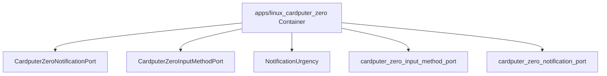

# 组件职责：apps/linux_cardputer_zero

C4 层级：Component
状态：candidate
置信度：medium
项目版本：0.1.30-alpha
Git：34aad0bffa2f / main / dirty
更新于：2026-06-25T09:19:32.800Z

## 定位

从 C4 Component 层解释 apps/linux_cardputer_zero 内部的关键职责单元：入口、页面、命令、接口、注册表、adapter 或共享对象。

## C4 层级路径

- 当前层：Component，解释某个 Container 内部的关键职责单元。
- 上层：Container，限定这些组件所属的架构边界。
- 下层：Code View，只在需要追溯实现入口或变更影响面时进入少量关键代码锚点。

## 责任

解释 apps/linux_cardputer_zero 这个 Container 内部由哪些关键组件承担架构职责。Component 层不是全量类/函数列表，只保留对理解系统边界、协作或变更影响有帮助的对象。

## 边界

Component View 的边界被限制在 apps/linux_cardputer_zero Container 内；跨容器关系应该回到 Container 或 Engineering Sequence 视角解释。

## 关系

- CardputerZeroNotificationPort: CardputerZeroNotificationPort 是 apps/linux_cardputer_zero 内的主要架构组件，证据来自 apps/linux_cardputer_zero/src/cardputer_zero_notification_port.h#L67。
- CardputerZeroInputMethodPort: CardputerZeroInputMethodPort 是 apps/linux_cardputer_zero 内的主要架构组件，证据来自 apps/linux_cardputer_zero/src/cardputer_zero_input_method_port.h#L39。
- NotificationUrgency: NotificationUrgency 是 apps/linux_cardputer_zero 内的主要架构组件，证据来自 apps/linux_cardputer_zero/src/cardputer_zero_notification_port.h#L12。
- cardputer_zero_input_method_port: cardputer_zero_input_method_port 是 apps/linux_cardputer_zero 内的主要架构组件，证据来自 apps/linux_cardputer_zero/src/cardputer_zero_input_method_port.cpp。
- cardputer_zero_notification_port: cardputer_zero_notification_port 是 apps/linux_cardputer_zero 内的主要架构组件，证据来自 apps/linux_cardputer_zero/src/cardputer_zero_notification_port.cpp。

## 与业务复杂度的关联

- 组件层帮助把业务故事连接到实际入口、编排、适配或基础设施对象。
- 如果某个组件直接承载 Use Case，应在组织/过程模型的下钻文档中出现对应证据。

## 与技术复杂度的关联

- 对应 Engineering Class / Structural Diagram：docs/engineering/class-structural-diagrams/apps-linux_cardputer_zero/class-structural-diagram.html。
- 组件级复用迹象、外部协作迹象和复杂度候选点仍由软件结构模型负责解释。

## C4 Component 图

## 图内元素解释

### CardputerZeroNotificationPort

- 层级：component
- 说明：CardputerZeroNotificationPort 是 apps/linux_cardputer_zero 内的 class 候选组件，证据锚点是 apps/linux_cardputer_zero/src/cardputer_zero_notification_port.h#L67；当前仓库证据显示它有 局部关系迹象，适合作为候选锚点而非完整结论。
- 责任：CardputerZeroNotificationPort 在当前 C4 Component View 中被视为候选架构组件。这个判断不是由名称单独决定，而是由 apps/linux_cardputer_zero/src/cardputer_zero_notification_port.h#L67、class 类型和 局部关系迹象，适合作为候选锚点而非完整结论 共同支撑。
- 边界：它属于 apps/linux_cardputer_zero Container 内部；超出该路径的协作应回到 Container 或软件结构模型中的 Sequence 视角解释。
- 关系意义：CardputerZeroNotificationPort 被放入 Component View，是因为它能把 apps/linux_cardputer_zero 的架构职责落到一个可检查的入口、编排、适配、契约或共享对象上。复用迹象和外部协作迹象用于提示它更像共享核心、对外编排者，还是普通局部对象。
- 为什么属于该层：它有明确代码锚点，但当前解释目标不是源码细节，而是 apps/linux_cardputer_zero 内部职责如何拆分，所以属于 C4 Component 层。
- 下钻意图：下钻到 Code View 或软件结构模型的 Component Diagram，用来查看 CardputerZeroNotificationPort 的文件锚点、直接协作和是否存在变更扩散风险。
- 置信度：medium
- 证据：
  - apps/linux_cardputer_zero/src/cardputer_zero_notification_port.h#L67
  - 复用迹象：存在局部复用或依赖线索
  - 外部协作迹象：存在局部外部协作线索

### CardputerZeroInputMethodPort

- 层级：component
- 说明：CardputerZeroInputMethodPort 是 apps/linux_cardputer_zero 内的 class 候选组件，证据锚点是 apps/linux_cardputer_zero/src/cardputer_zero_input_method_port.h#L39；当前仓库证据显示它有 局部关系迹象，适合作为候选锚点而非完整结论。
- 责任：CardputerZeroInputMethodPort 在当前 C4 Component View 中被视为候选架构组件。这个判断不是由名称单独决定，而是由 apps/linux_cardputer_zero/src/cardputer_zero_input_method_port.h#L39、class 类型和 局部关系迹象，适合作为候选锚点而非完整结论 共同支撑。
- 边界：它属于 apps/linux_cardputer_zero Container 内部；超出该路径的协作应回到 Container 或软件结构模型中的 Sequence 视角解释。
- 关系意义：CardputerZeroInputMethodPort 被放入 Component View，是因为它能把 apps/linux_cardputer_zero 的架构职责落到一个可检查的入口、编排、适配、契约或共享对象上。复用迹象和外部协作迹象用于提示它更像共享核心、对外编排者，还是普通局部对象。
- 为什么属于该层：它有明确代码锚点，但当前解释目标不是源码细节，而是 apps/linux_cardputer_zero 内部职责如何拆分，所以属于 C4 Component 层。
- 下钻意图：下钻到 Code View 或软件结构模型的 Component Diagram，用来查看 CardputerZeroInputMethodPort 的文件锚点、直接协作和是否存在变更扩散风险。
- 置信度：medium
- 证据：
  - apps/linux_cardputer_zero/src/cardputer_zero_input_method_port.h#L39
  - 复用迹象：存在局部复用或依赖线索
  - 外部协作迹象：存在局部外部协作线索

### NotificationUrgency

- 层级：component
- 说明：NotificationUrgency 是 apps/linux_cardputer_zero 内的 enum 候选组件，证据锚点是 apps/linux_cardputer_zero/src/cardputer_zero_notification_port.h#L12；当前仓库证据显示它有 局部关系迹象，适合作为候选锚点而非完整结论。
- 责任：NotificationUrgency 在当前 C4 Component View 中被视为候选架构组件。这个判断不是由名称单独决定，而是由 apps/linux_cardputer_zero/src/cardputer_zero_notification_port.h#L12、enum 类型和 局部关系迹象，适合作为候选锚点而非完整结论 共同支撑。
- 边界：它属于 apps/linux_cardputer_zero Container 内部；超出该路径的协作应回到 Container 或软件结构模型中的 Sequence 视角解释。
- 关系意义：NotificationUrgency 被放入 Component View，是因为它能把 apps/linux_cardputer_zero 的架构职责落到一个可检查的入口、编排、适配、契约或共享对象上。复用迹象和外部协作迹象用于提示它更像共享核心、对外编排者，还是普通局部对象。
- 为什么属于该层：它有明确代码锚点，但当前解释目标不是源码细节，而是 apps/linux_cardputer_zero 内部职责如何拆分，所以属于 C4 Component 层。
- 下钻意图：下钻到 Code View 或软件结构模型的 Component Diagram，用来查看 NotificationUrgency 的文件锚点、直接协作和是否存在变更扩散风险。
- 置信度：medium
- 证据：
  - apps/linux_cardputer_zero/src/cardputer_zero_notification_port.h#L12
  - 复用迹象：存在局部复用或依赖线索
  - 外部协作迹象：存在局部外部协作线索

### cardputer_zero_input_method_port

- 层级：component
- 说明：cardputer_zero_input_method_port 是 apps/linux_cardputer_zero 内的 import 候选组件，证据锚点是 apps/linux_cardputer_zero/src/cardputer_zero_input_method_port.cpp；当前仓库证据显示它有 局部关系迹象，适合作为候选锚点而非完整结论。
- 责任：cardputer_zero_input_method_port 在当前 C4 Component View 中被视为候选架构组件。这个判断不是由名称单独决定，而是由 apps/linux_cardputer_zero/src/cardputer_zero_input_method_port.cpp、import 类型和 局部关系迹象，适合作为候选锚点而非完整结论 共同支撑。
- 边界：它属于 apps/linux_cardputer_zero Container 内部；超出该路径的协作应回到 Container 或软件结构模型中的 Sequence 视角解释。
- 关系意义：cardputer_zero_input_method_port 被放入 Component View，是因为它能把 apps/linux_cardputer_zero 的架构职责落到一个可检查的入口、编排、适配、契约或共享对象上。复用迹象和外部协作迹象用于提示它更像共享核心、对外编排者，还是普通局部对象。
- 为什么属于该层：它有明确代码锚点，但当前解释目标不是源码细节，而是 apps/linux_cardputer_zero 内部职责如何拆分，所以属于 C4 Component 层。
- 下钻意图：下钻到 Code View 或软件结构模型的 Component Diagram，用来查看 cardputer_zero_input_method_port 的文件锚点、直接协作和是否存在变更扩散风险。
- 置信度：medium
- 证据：
  - apps/linux_cardputer_zero/src/cardputer_zero_input_method_port.cpp
  - 复用迹象：当前未观察到明显复用线索
  - 外部协作迹象：当前未观察到明显外部协作线索

### cardputer_zero_notification_port

- 层级：component
- 说明：cardputer_zero_notification_port 是 apps/linux_cardputer_zero 内的 import 候选组件，证据锚点是 apps/linux_cardputer_zero/src/cardputer_zero_notification_port.cpp；当前仓库证据显示它有 局部关系迹象，适合作为候选锚点而非完整结论。
- 责任：cardputer_zero_notification_port 在当前 C4 Component View 中被视为候选架构组件。这个判断不是由名称单独决定，而是由 apps/linux_cardputer_zero/src/cardputer_zero_notification_port.cpp、import 类型和 局部关系迹象，适合作为候选锚点而非完整结论 共同支撑。
- 边界：它属于 apps/linux_cardputer_zero Container 内部；超出该路径的协作应回到 Container 或软件结构模型中的 Sequence 视角解释。
- 关系意义：cardputer_zero_notification_port 被放入 Component View，是因为它能把 apps/linux_cardputer_zero 的架构职责落到一个可检查的入口、编排、适配、契约或共享对象上。复用迹象和外部协作迹象用于提示它更像共享核心、对外编排者，还是普通局部对象。
- 为什么属于该层：它有明确代码锚点，但当前解释目标不是源码细节，而是 apps/linux_cardputer_zero 内部职责如何拆分，所以属于 C4 Component 层。
- 下钻意图：下钻到 Code View 或软件结构模型的 Component Diagram，用来查看 cardputer_zero_notification_port 的文件锚点、直接协作和是否存在变更扩散风险。
- 置信度：medium
- 证据：
  - apps/linux_cardputer_zero/src/cardputer_zero_notification_port.cpp
  - 复用迹象：当前未观察到明显复用线索
  - 外部协作迹象：当前未观察到明显外部协作线索

## 可下钻 C4

- [代码锚点：apps/linux_cardputer_zero](../../code/apps-linux_cardputer_zero/code.md) - 进入 代码锚点：apps/linux_cardputer_zero 是为了把 组件职责：apps/linux_cardputer_zero 的架构职责追溯到具体文件/符号锚点；只有需要判断实现入口或变更影响面时才应下钻到 Code。

## 关联软件结构模型

- [apps/linux_cardputer_zero Class / Structural Diagram](../../../../engineering/class-structural-diagrams/apps-linux_cardputer_zero/class-structural-diagram.md) - 查看该 Container 内部结构协作和关键技术对象。

## 证据

- apps/linux_cardputer_zero/src/cardputer_zero_notification_port.h#L67
- apps/linux_cardputer_zero/src/cardputer_zero_input_method_port.h#L39
- apps/linux_cardputer_zero/src/cardputer_zero_notification_port.h#L12
- apps/linux_cardputer_zero/src/cardputer_zero_input_method_port.cpp
- apps/linux_cardputer_zero/src/cardputer_zero_notification_port.cpp

## 判定依据

- Component 候选只保留入口、编排、接口、适配器、配置、任务、消费者或生产者等组件级职责对象；方法、路由和局部函数下沉到 Code View。

## 变更记录

### 0.1.30-alpha - 2026-06-25T09:19:32.800Z

- 基于本地仓库证据重新生成 组件职责：apps/linux_cardputer_zero。
