# Component responsibility: apps/linux_uconsole_gtk

C4 Level: Component
Status: candidate
Confidence: high
Project version: 0.1.30-alpha
Git:34aad0bffa2f / main / dirty
Updated on: 2026-06-25T09:19:32.800Z

## Positioning

Explain the key responsibility units inside apps/linux_uconsole_gtk from the C4 Component layer: entry, page, command, interface, registry, adapter or shared object.

## C4 hierarchy path

- Current layer: Component, explaining the key responsibility units within a Container.
- Upper layer: Container, which defines the architectural boundaries to which these components belong.
- Lower layer: Code View, only enter a small number of key code anchors when you need to trace the implementation entrance or change the impact surface.

## Responsibility

Explain which key components within the apps/linux_uconsole_gtk Container bear architectural responsibilities. The Component layer is not a comprehensive list of classes/functions, only objects that are helpful for understanding system boundaries, collaboration, or the impact of changes.

## Boundary

The boundary of Component View is limited to apps/linux_uconsole_gtk Container; cross-container relationships should be explained back to the Container or Engineering Sequence perspective.

## Relationships

 - FakeMeshAdapter: FakeMeshAdapter is an external system adapter component within apps/linux_uconsole_gtk, evidenced by apps/linux_uconsole_gtk/tests/uconsole_chat_dedup_smoke.cpp#L17.
- FakeMeshAdapter: FakeMeshAdapter is a persistent access component in apps/linux_uconsole_gtk, evidence from apps/linux_uconsole_gtk/tests/uconsole_chat_sqlite_store_smoke.cpp#L19.
- LinuxUConsoleGtkPageRegistryAdoption: LinuxUConsoleGtkPageRegistryAdoption is an interface component within apps/linux_uconsole_gtk, evidence from apps/linux_uconsole_gtk/src/linux_uconsole_gtk_page_registry_adoption.h#L18.
- LinuxUConsoleGtkPageRegistryRenderer: LinuxUConsoleGtkPageRegistryRenderer is an interface component within apps/linux_uconsole_gtk, evidence from apps/linux_uconsole_gtk/src/linux_uconsole_gtk_page_registry_renderer.h#L11.
- LinuxUConsoleGtkPageRegistrySource: LinuxUConsoleGtkPageRegistrySource is an interface component within apps/linux_uconsole_gtk, evidence from apps/linux_uconsole_gtk/src/linux_uconsole_gtk_page_registry_adoption.h#L12.
- linux_uconsole_gtk_page_registry_adoption: linux_uconsole_gtk_page_registry_adoption is an interface component within apps/linux_uconsole_gtk, evidence from apps/linux_uconsole_gtk/src/linux_uconsole_gtk_page_registry_adoption.cpp.
- linux_uconsole_gtk_page_registry_renderer: linux_uconsole_gtk_page_registry_renderer is an interface component within apps/linux_uconsole_gtk, evidence from apps/linux_uconsole_gtk/src/linux_uconsole_gtk_page_registry_renderer.cpp.
- string_view: string_view is an interface component within apps/linux_uconsole_gtk, evidence from apps/linux_uconsole_gtk/src/platform/desktop/sdl_window_presenter.cpp.
- linux_uconsole_gtk_page_registry_adoption: linux_uconsole_gtk_page_registry_adoption is an interface component within apps/linux_uconsole_gtk, evidenced by apps/linux_uconsole_gtk/src/linux_uconsole_gtk_page_registry_adoption.h.
- linux_uconsole_gtk_page_registry_renderer: linux_uconsole_gtk_page_registry_renderer is an interface component within apps/linux_uconsole_gtk, evidence from apps/linux_uconsole_gtk/src/linux_uconsole_gtk_page_registry_renderer.h.
- uconsole_chat_sqlite_store_smoke: uconsole_chat_sqlite_store_smoke is a persistent access component within apps/linux_uconsole_gtk, evidence from apps/linux_uconsole_gtk/tests/uconsole_chat_sqlite_store_smoke.cpp.

## Correlation with business complexity

 - The component layer helps connect business stories to actual portal, orchestration, adaptation or infrastructure objects.
- If a component directly hosts a Use Case, corresponding evidence should appear in the drill-down document of the organization/process model.

## Correlation with technical complexity

 - Corresponds to Engineering Class / Structural Diagram: docs/engineering/class-structural-diagrams/apps-linux_uconsole_gtk/class-structural-diagram.html.
- Component-level reuse signs, external collaboration signs, and complexity candidates are still explained by the software structural model.

## C4 Component diagram

```mermaid
flowchart TB
  container["apps/linux_uconsole_gtk Container"]
  component_1["FakeMeshAdapter"]
  container --> component_1
  component_2["FakeMeshAdapter"]
  container --> component_2
  component_3["LinuxUConsoleGtkPageRegistryAdoption"]
  container --> component_3
  component_4["LinuxUConsoleGtkPageRegistryRenderer"]
  container --> component_4
  component_5["LinuxUConsoleGtkPageRegistrySource"]
  container --> component_5
  component_6["linux_uconsole_gtk_page_registry_adoption"]
  container --> component_6
  component_7["linux_uconsole_gtk_page_registry_renderer"]
  container --> component_7
  component_8["string_view"]
  container --> component_8
  component_9["linux_uconsole_gtk_page_registry_adoption"]
  container --> component_9
  component_10["linux_uconsole_gtk_page_registry_renderer"]
  container --> component_10
```

## Explanation of elements in the diagram

### FakeMeshAdapter

- Level: component
- Description: FakeMeshAdapter is a class candidate component in apps/linux_uconsole_gtk, and the evidence anchor is apps/linux_uconsole_gtk/tests/uconsole_chat_dedup_smoke.cpp#L17; the current warehouse evidence shows that it has strong signs of external collaboration/orchestration.
- Responsibility: FakeMeshAdapter is considered an external capability adapter component in the current C4 Component View. This judgment is not determined by the name alone, but is supported by apps/linux_uconsole_gtk/tests/uconsole_chat_dedup_smoke.cpp#L17, class type and strong external collaboration/orchestration signs.
- Boundary: It belongs inside apps/linux_uconsole_gtk Container; collaboration beyond this path should be interpreted back to the Container or Sequence perspective in the software structure model.
- Relational meaning: FakeMeshAdapter is put into Component View because it can reduce the architectural responsibility of apps/linux_uconsole_gtk to an inspectable entry, orchestration, adaptation, contract or shared object. Reuse signs and external collaboration signs are used to indicate whether it is more like a shared core, an external orchestrator, or a normal local object.
- Why it belongs to this layer: It has a clear code anchor, but the current explanation target is not the source code details, but how the internal responsibilities of apps/linux_uconsole_gtk are split, so it belongs to the C4 Component layer.
- Drill-down intent: Drill down to the Component Diagram of the Code View or software structure model to view the file anchor points of FakeMeshAdapter, direct collaboration, and whether there is a risk of change diffusion.
- Confidence: high
- Evidence:
  - apps/linux_uconsole_gtk/tests/uconsole_chat_dedup_smoke.cpp#L17
 - Signs of reuse: There are local reuse or dependency clues
 - Signs of external collaboration: There are local external collaboration clues

### FakeMeshAdapter

- Level: component
- Description: FakeMeshAdapter is a class candidate component in apps/linux_uconsole_gtk, and the evidence anchor is apps/linux_uconsole_gtk/tests/uconsole_chat_sqlite_store_smoke.cpp#L19; the current warehouse evidence shows that it has strong signs of external collaboration/orchestration.
- Responsibility: FakeMeshAdapter is considered an external capability adapter component in the current C4 Component View. This judgment is not determined by the name alone, but is supported by apps/linux_uconsole_gtk/tests/uconsole_chat_sqlite_store_smoke.cpp#L19, class type and strong external collaboration/orchestration signs.
- Boundary: It belongs inside apps/linux_uconsole_gtk Container; collaboration beyond this path should be interpreted back to the Container or Sequence perspective in the software structure model.
- Relational meaning: FakeMeshAdapter is put into Component View because it can reduce the architectural responsibility of apps/linux_uconsole_gtk to an inspectable entry, orchestration, adaptation, contract or shared object. Reuse signs and external collaboration signs are used to indicate whether it is more like a shared core, an external orchestrator, or a normal local object.
- Why it belongs to this layer: It has a clear code anchor, but the current explanation target is not the source code details, but how the internal responsibilities of apps/linux_uconsole_gtk are split, so it belongs to the C4 Component layer.
- Drill-down intent: Drill down to the Component Diagram of the Code View or software structure model to view the file anchor points of FakeMeshAdapter, direct collaboration, and whether there is a risk of change diffusion.
- Confidence: high
- Evidence:
  - apps/linux_uconsole_gtk/tests/uconsole_chat_sqlite_store_smoke.cpp#L19
 - Signs of reuse: There are local reuse or dependency clues
 - Signs of external collaboration: There are local external collaboration clues

### LinuxUConsoleGtkPageRegistryAdoption

- Level: component
- Description: LinuxUConsoleGtkPageRegistryAdoption is a class candidate component in apps/linux_uconsole_gtk, and the evidence anchor is apps/linux_uconsole_gtk/src/linux_uconsole_gtk_page_registry_adoption.h#L18; the current warehouse evidence shows that it has signs of local relationships and is suitable as a candidate anchor rather than a complete conclusion.
 - Responsibility: LinuxUConsoleGtkPageRegistryAdoption is considered a user interface or page entry component in the current C4 Component View. This judgment is not determined by the name alone, but is jointly supported by apps/linux_uconsole_gtk/src/linux_uconsole_gtk_page_registry_adoption.h#L18, class type, and local relationship signs, which are suitable as candidate anchors rather than complete conclusions.
- Boundary: It belongs inside apps/linux_uconsole_gtk Container; collaboration beyond this path should be interpreted back to the Container or Sequence perspective in the software structure model.
- Relational meaning: LinuxUConsoleGtkPageRegistryAdoption is put into the Component View because it can drop the architectural responsibilities of apps/linux_uconsole_gtk onto an inspectable entry, orchestration, adaptation, contract, or shared object. Reuse signs and external collaboration signs are used to indicate whether it is more like a shared core, an external orchestrator, or a normal local object.
- Why it belongs to this layer: It has a clear code anchor, but the current explanation target is not the source code details, but how the internal responsibilities of apps/linux_uconsole_gtk are split, so it belongs to the C4 Component layer.
- Drill-down intention: Drill down to the Component Diagram of Code View or software structure model to view the file anchor point, direct collaboration and whether there is a risk of change diffusion of LinuxUConsoleGtkPageRegistryAdoption.
- Confidence: medium
- Evidence:
  - apps/linux_uconsole_gtk/src/linux_uconsole_gtk_page_registry_adoption.h#L18
 - Signs of reuse: There are local reuse or dependency clues
 - Signs of external collaboration: There are local external collaboration clues

### LinuxUConsoleGtkPageRegistryRenderer

- Level: component
- Description: LinuxUConsoleGtkPageRegistryRenderer is a class candidate component in apps/linux_uconsole_gtk, and the evidence anchor is apps/linux_uconsole_gtk/src/linux_uconsole_gtk_page_registry_renderer.h#L11; the current warehouse evidence shows that it has signs of local relationships and is suitable as a candidate anchor rather than a complete conclusion.
- Responsibility: LinuxUConsoleGtkPageRegistryRenderer is considered a user interface or page entry component in the current C4 Component View. This judgment is not determined by the name alone, but is jointly supported by apps/linux_uconsole_gtk/src/linux_uconsole_gtk_page_registry_renderer.h#L11, class type, and local relationship signs, which are suitable as candidate anchors rather than complete conclusions.
- Boundary: It belongs inside apps/linux_uconsole_gtk Container; collaboration beyond this path should be interpreted back to the Container or Sequence perspective in the software structure model.
 - Relational meaning: LinuxUConsoleGtkPageRegistryRenderer is put into the Component View because it offloads the architectural responsibilities of apps/linux_uconsole_gtk to an inspectable entry, orchestration, adaptation, contract, or shared object. Reuse signs and external collaboration signs are used to indicate whether it is more like a shared core, an external orchestrator, or a normal local object.
- Why it belongs to this layer: It has a clear code anchor, but the current explanation target is not the source code details, but how the internal responsibilities of apps/linux_uconsole_gtk are split, so it belongs to the C4 Component layer.
- Drill down intention: Drill down to the Component Diagram of Code View or software structure model to view the file anchor point, direct collaboration and whether there is a risk of change diffusion of LinuxUConsoleGtkPageRegistryRenderer.
- Confidence: medium
- Evidence:
  - apps/linux_uconsole_gtk/src/linux_uconsole_gtk_page_registry_renderer.h#L11
 - Signs of reuse: There are local reuse or dependency clues
 - Signs of external collaboration: No obvious clues of external collaboration are currently observed

### LinuxUConsoleGtkPageRegistrySource

- Level: component
- Description: LinuxUConsoleGtkPageRegistrySource is an enum candidate component within apps/linux_uconsole_gtk, and the evidence anchor is apps/linux_uconsole_gtk/src/linux_uconsole_gtk_page_registry_adoption.h#L12; the current warehouse evidence shows that it has signs of partial relationships and is suitable as a candidate anchor rather than a complete conclusion.
- Responsibility: LinuxUConsoleGtkPageRegistrySource is considered a user interface or page entry component in the current C4 Component View. This judgment is not determined by the name alone, but is jointly supported by apps/linux_uconsole_gtk/src/linux_uconsole_gtk_page_registry_adoption.h#L12, enum type, and local relationship signs, which are suitable as candidate anchors rather than complete conclusions.
- Boundary: It belongs inside apps/linux_uconsole_gtk Container; collaboration beyond this path should be interpreted back to the Container or Sequence perspective in the software structure model.
 - Relational meaning: LinuxUConsoleGtkPageRegistrySource is put into the Component View because it offloads the architectural responsibilities of apps/linux_uconsole_gtk onto an inspectable entry, orchestration, adaptation, contract, or shared object. Reuse signs and external collaboration signs are used to indicate whether it is more like a shared core, an external orchestrator, or a normal local object.
- Why it belongs to this layer: It has a clear code anchor, but the current explanation target is not the source code details, but how the internal responsibilities of apps/linux_uconsole_gtk are split, so it belongs to the C4 Component layer.
- Drill-down intent: Drill down to the Component Diagram of the Code View or software structure model to view the file anchor point, direct collaboration, and whether there is a risk of change diffusion of LinuxUConsoleGtkPageRegistrySource.
- Confidence: medium
- Evidence:
  - apps/linux_uconsole_gtk/src/linux_uconsole_gtk_page_registry_adoption.h#L12
 - Signs of reuse: There are local reuse or dependency clues
 - Signs of external collaboration: There are local external collaboration clues

### linux_uconsole_gtk_page_registry_adoption

- Level: component
- Description: linux_uconsole_gtk_page_registry_adoption is an import candidate component in apps/linux_uconsole_gtk, and the evidence anchor is apps/linux_uconsole_gtk/src/linux_uconsole_gtk_page_registry_adoption.cpp; the current warehouse evidence shows that it has signs of partial relationships and is suitable as a candidate anchor rather than a complete conclusion.
- Responsibility: linux_uconsole_gtk_page_registry_adoption is considered a user interface or page entry component in the current C4 Component View. This judgment is not determined by the name alone, but is jointly supported by apps/linux_uconsole_gtk/src/linux_uconsole_gtk_page_registry_adoption.cpp, import type, and partial relationship signs, which are suitable as candidate anchors rather than complete conclusions.
- Boundary: It belongs inside apps/linux_uconsole_gtk Container; collaboration beyond this path should be interpreted back to the Container or Sequence perspective in the software structure model.
- Relational meaning: linux_uconsole_gtk_page_registry_adoption is put into the Component View because it can drop the architectural responsibilities of apps/linux_uconsole_gtk onto an inspectable entry, orchestration, adaptation, contract, or shared object. Reuse signs and external collaboration signs are used to indicate whether it is more like a shared core, an external orchestrator, or a normal local object.
- Why it belongs to this layer: It has a clear code anchor, but the current explanation target is not the source code details, but how the internal responsibilities of apps/linux_uconsole_gtk are split, so it belongs to the C4 Component layer.
- Drill-down intent: Drill down to the Component Diagram of the Code View or software structure model to view the file anchor point of linux_uconsole_gtk_page_registry_adoption, direct collaboration, and whether there is a risk of change diffusion.
- Confidence: medium
- Evidence:
  - apps/linux_uconsole_gtk/src/linux_uconsole_gtk_page_registry_adoption.cpp
 - Signs of reuse: There are local reuse or dependency clues
 - Signs of external collaboration: No obvious clues of external collaboration are currently observed

### linux_uconsole_gtk_page_registry_renderer

- Level: component
- Description: linux_uconsole_gtk_page_registry_renderer is an import candidate component in apps/linux_uconsole_gtk, and the evidence anchor is apps/linux_uconsole_gtk/src/linux_uconsole_gtk_page_registry_renderer.cpp; the current warehouse evidence shows that it has signs of partial relationships and is suitable as a candidate anchor rather than a complete conclusion.
- Responsibility: linux_uconsole_gtk_page_registry_renderer is considered a user interface or page entry component in the current C4 Component View. This judgment is not determined by the name alone, but is jointly supported by apps/linux_uconsole_gtk/src/linux_uconsole_gtk_page_registry_renderer.cpp, import type, and partial relationship signs, which are suitable as candidate anchors rather than complete conclusions.
- Boundary: It belongs inside apps/linux_uconsole_gtk Container; collaboration beyond this path should be interpreted back to the Container or Sequence perspective in the software structure model.
- Relational meaning: linux_uconsole_gtk_page_registry_renderer is put into the Component View because it can offload the architectural responsibilities of apps/linux_uconsole_gtk to an inspectable entry, orchestration, adaptation, contract or shared object. Reuse signs and external collaboration signs are used to indicate whether it is more like a shared core, an external orchestrator, or a normal local object.
- Why it belongs to this layer: It has a clear code anchor, but the current explanation target is not the source code details, but how the internal responsibilities of apps/linux_uconsole_gtk are split, so it belongs to the C4 Component layer.
- Drill-down intent: Drill down to the Component Diagram of the Code View or software structure model to view the file anchors of linux_uconsole_gtk_page_registry_renderer, direct collaboration, and whether there is a risk of change diffusion.
- Confidence: medium
- Evidence:
  - apps/linux_uconsole_gtk/src/linux_uconsole_gtk_page_registry_renderer.cpp
 - Signs of reuse: There are local reuse or dependency clues
 - Signs of external collaboration: No obvious clues of external collaboration are currently observed

### string_view

- Level: component
- Description: string_view is an import candidate component in apps/linux_uconsole_gtk, and the evidence anchor is apps/linux_uconsole_gtk/src/platform/desktop/sdl_window_presenter.cpp; the current warehouse evidence shows that it has signs of partial relationships and is suitable as a candidate anchor rather than a complete conclusion.
- Responsibility: string_view is considered a candidate architectural component in the current C4 Component View. This judgment is not determined by the name alone, but is jointly supported by apps/linux_uconsole_gtk/src/platform/desktop/sdl_window_presenter.cpp, import type, and partial relationship signs, which are suitable as candidate anchors rather than complete conclusions.
- Boundary: It belongs inside apps/linux_uconsole_gtk Container; collaboration beyond this path should be interpreted back to the Container or Sequence perspective in the software structure model.
- Relational meaning: string_view is put into the Component View because it offloads the architectural responsibilities of apps/linux_uconsole_gtk onto an inspectable entry, orchestration, adaptation, contract, or shared object. Reuse signs and external collaboration signs are used to indicate whether it is more like a shared core, an external orchestrator, or a normal local object.
- Why it belongs to this layer: It has a clear code anchor, but the current explanation target is not the source code details, but how the internal responsibilities of apps/linux_uconsole_gtk are split, so it belongs to the C4 Component layer.
- Drill-down intention: Drill down to the Component Diagram of the Code View or software structure model to view the file anchor point of string_view, direct collaboration, and whether there is a risk of change diffusion.
- Confidence: medium
- Evidence:
  - apps/linux_uconsole_gtk/src/platform/desktop/sdl_window_presenter.cpp
 - Signs of reuse: There are local reuse or dependency clues
 - Signs of external collaboration: No obvious clues of external collaboration are currently observed

### linux_uconsole_gtk_page_registry_adoption

- Level: component
- Description: linux_uconsole_gtk_page_registry_adoption is an import candidate component in apps/linux_uconsole_gtk, and the evidence anchor is apps/linux_uconsole_gtk/src/linux_uconsole_gtk_page_registry_adoption.h; the current warehouse evidence shows that it has signs of partial relationships and is suitable as a candidate anchor rather than a complete conclusion.
 - Responsibility: linux_uconsole_gtk_page_registry_adoption is considered a user interface or page entry component in the current C4 Component View. This judgment is not determined by the name alone, but is jointly supported by apps/linux_uconsole_gtk/src/linux_uconsole_gtk_page_registry_adoption.h, import type, and partial relationship signs, which are suitable as candidate anchors rather than complete conclusions.
- Boundary: It belongs inside apps/linux_uconsole_gtk Container; collaboration beyond this path should be interpreted back to the Container or Sequence perspective in the software structure model.
- Relational meaning: linux_uconsole_gtk_page_registry_adoption is put into the Component View because it can drop the architectural responsibilities of apps/linux_uconsole_gtk onto an inspectable entry, orchestration, adaptation, contract, or shared object. Reuse signs and external collaboration signs are used to indicate whether it is more like a shared core, an external orchestrator, or a normal local object.
- Why it belongs to this layer: It has a clear code anchor, but the current explanation target is not the source code details, but how the internal responsibilities of apps/linux_uconsole_gtk are split, so it belongs to the C4 Component layer.
- Drill-down intent: Drill down to the Component Diagram of the Code View or software structure model to view the file anchor point of linux_uconsole_gtk_page_registry_adoption, direct collaboration, and whether there is a risk of change diffusion.
- Confidence: medium
- Evidence:
  - apps/linux_uconsole_gtk/src/linux_uconsole_gtk_page_registry_adoption.h
 - Reuse signs: No obvious reuse clues are currently observed
 - Signs of external collaboration: No obvious clues of external collaboration are currently observed

### linux_uconsole_gtk_page_registry_renderer

- Level: component
 - Description: linux_uconsole_gtk_page_registry_renderer is an import candidate component in apps/linux_uconsole_gtk, and the evidence anchor is apps/linux_uconsole_gtk/src/linux_uconsole_gtk_page_registry_renderer.h; The current repository evidence shows that it has signs of partial relationships and is suitable as a candidate anchor rather than a complete conclusion.
- Responsibility: linux_uconsole_gtk_page_registry_renderer is considered a user interface or page entry component in the current C4 Component View. This judgment is not determined by the name alone, but is jointly supported by apps/linux_uconsole_gtk/src/linux_uconsole_gtk_page_registry_renderer.h, import type, and partial relationship signs, which are suitable as candidate anchors rather than complete conclusions.
- Boundary: It belongs inside apps/linux_uconsole_gtk Container; collaboration beyond this path should be interpreted back to the Container or Sequence perspective in the software structure model.
- Relational meaning: linux_uconsole_gtk_page_registry_renderer is put into the Component View because it can offload the architectural responsibilities of apps/linux_uconsole_gtk to an inspectable entry, orchestration, adaptation, contract or shared object. Reuse signs and external collaboration signs are used to indicate whether it is more like a shared core, an external orchestrator, or a normal local object.
- Why it belongs to this layer: It has a clear code anchor, but the current explanation target is not the source code details, but how the internal responsibilities of apps/linux_uconsole_gtk are split, so it belongs to the C4 Component layer.
- Drill-down intent: Drill down to the Component Diagram of the Code View or software structure model to view the file anchors of linux_uconsole_gtk_page_registry_renderer, direct collaboration, and whether there is a risk of change diffusion.
- Confidence: medium
- Evidence:
  - apps/linux_uconsole_gtk/src/linux_uconsole_gtk_page_registry_renderer.h
 - Reuse signs: No obvious reuse clues are currently observed
 - Signs of external collaboration: No obvious clues of external collaboration are currently observed

### uconsole_chat_sqlite_store_smoke

- Level: component
- Description: uconsole_chat_sqlite_store_smoke is an import candidate component in apps/linux_uconsole_gtk, and the evidence anchor is apps/linux_uconsole_gtk/tests/uconsole_chat_sqlite_store_smoke.cpp; the current warehouse evidence shows that it has signs of partial relationships and is suitable as a candidate anchor rather than a complete conclusion.
- Responsibility: uconsole_chat_sqlite_store_smoke is considered a candidate schema component in the current C4 Component View. This judgment is not determined by the name alone, but is jointly supported by apps/linux_uconsole_gtk/tests/uconsole_chat_sqlite_store_smoke.cpp, import type, and partial relationship signs, which are suitable as candidate anchors rather than complete conclusions.
- Boundary: It belongs inside apps/linux_uconsole_gtk Container; collaboration beyond this path should be interpreted back to the Container or Sequence perspective in the software structure model.
 - Relational meaning: uconsole_chat_sqlite_store_smoke is put into the Component View because it offloads the architectural responsibilities of apps/linux_uconsole_gtk onto an inspectable entry, orchestration, adaptation, contract or shared object. Reuse signs and external collaboration signs are used to indicate whether it is more like a shared core, an external orchestrator, or a normal local object.
- Why it belongs to this layer: It has a clear code anchor, but the current explanation target is not the source code details, but how the internal responsibilities of apps/linux_uconsole_gtk are split, so it belongs to the C4 Component layer.
- Drill-down intention: Drill down to the Component Diagram of the Code View or software structure model to view the file anchor point of uconsole_chat_sqlite_store_smoke, direct collaboration, and whether there is a risk of change diffusion.
- Confidence: medium
- Evidence:
  - apps/linux_uconsole_gtk/tests/uconsole_chat_sqlite_store_smoke.cpp
 - Reuse signs: No obvious reuse clues are currently observed
 - Signs of external collaboration: No obvious clues of external collaboration are currently observed

## Can be drilled into C4

- [Code anchor: apps/linux_uconsole_gtk](../../code/apps-linux_uconsole_gtk/code.md) - Enter code anchor: apps/linux_uconsole_gtk to put component responsibility: apps/linux_uconsole_gtk The architectural responsibilities can be traced back to specific files/symbol anchors; you should drill down to Code only when you need to determine the implementation entry or the impact of changes.

## Associated Software Structural Model

- [apps/linux_uconsole_gtk Class / Structural Diagram](../../../../engineering/class-structural-diagrams/apps-linux_uconsole_gtk/class-structural-diagram.md) - View the internal structure collaboration and key technical objects of this Container.

## Evidence

- apps/linux_uconsole_gtk/tests/uconsole_chat_dedup_smoke.cpp#L17
- apps/linux_uconsole_gtk/tests/uconsole_chat_sqlite_store_smoke.cpp#L19
- apps/linux_uconsole_gtk/src/linux_uconsole_gtk_page_registry_adoption.h#L18
- apps/linux_uconsole_gtk/src/linux_uconsole_gtk_page_registry_renderer.h#L11
- apps/linux_uconsole_gtk/src/linux_uconsole_gtk_page_registry_adoption.h#L12
- apps/linux_uconsole_gtk/src/linux_uconsole_gtk_page_registry_adoption.cpp
- apps/linux_uconsole_gtk/src/linux_uconsole_gtk_page_registry_renderer.cpp
- apps/linux_uconsole_gtk/src/platform/desktop/sdl_window_presenter.cpp
- apps/linux_uconsole_gtk/src/linux_uconsole_gtk_page_registry_adoption.h
- apps/linux_uconsole_gtk/src/linux_uconsole_gtk_page_registry_renderer.h
- apps/linux_uconsole_gtk/tests/uconsole_chat_sqlite_store_smoke.cpp

## Judgment basis

- Component candidates only retain component-level responsibility objects such as entrances, orchestrations, interfaces, adapters, configurations, tasks, consumers or producers; methods, routes and local functions are dropped to Code View.

## Change Record

### 0.1.30-alpha - 2026-06-25T09:19:32.800Z

 - Regenerate based on local repository evidence Component responsibility: apps/linux_uconsole_gtk.
