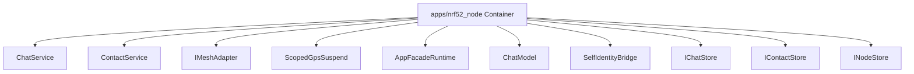

# Component responsibility: apps/nrf52_node

C4 Level: Component
Status: candidate
Confidence: high
Project version: 0.1.30-alpha
Git:34aad0bffa2f / main / dirty
Updated on: 2026-06-25T09:19:32.800Z

## Positioning

Explain the key responsibility units inside apps/nrf52_node from the C4 Component layer: entry, page, command, interface, registry, adapter or shared object.

## C4 hierarchy path

- Current layer: Component, explaining the key responsibility units within a Container.
- Upper layer: Container, which defines the architectural boundaries to which these components belong.
- Lower layer: Code View, only enter a small number of key code anchors when you need to trace the implementation entrance or change the impact surface.

## Responsibility

Explain which key components within the apps/nrf52_node Container bear architectural responsibilities. The Component layer is not a comprehensive list of classes/functions, only objects that are helpful for understanding system boundaries, collaboration, or the impact of changes.

## Boundary

The boundary of Component View is limited to apps/nrf52_node Container; cross-container relationships should be explained back to the Container or Engineering Sequence perspective.

## Relationships

- ChatService: ChatService is an application service or processing component within apps/nrf52_node, evidenced by apps/nrf52_node/src/nrf52_node_app_facade_runtime.h#L23.
- ContactService: ContactService is an application service or processing component within apps/nrf52_node, evidenced by apps/nrf52_node/src/nrf52_node_app_facade_runtime.h#L30.
- IMeshAdapter: IMeshAdapter is an external system adapter component within apps/nrf52_node, evidenced by apps/nrf52_node/src/nrf52_node_app_facade_runtime.h#L25.
- ScopedGpsSuspend: ScopedGpsSuspend is a major architectural component within apps/nrf52_node, evidenced by apps/nrf52_node/src/nrf52_node_app_facade_runtime.cpp#L45.
- AppFacadeRuntime: AppFacadeRuntime is the main architectural component within apps/nrf52_node, evidence from apps/nrf52_node/src/nrf52_node_app_facade_runtime.h#L42.
- ChatModel: ChatModel is the main architectural component within apps/nrf52_node, as evidenced by apps/nrf52_node/src/nrf52_node_app_facade_runtime.h#L22.
- SelfIdentityBridge: SelfIdentityBridge is the main architectural component within apps/nrf52_node, as evidenced by apps/nrf52_node/src/nrf52_node_app_facade_runtime.h#L36.
- IChatStore: IChatStore is a persistent access component within apps/nrf52_node, evidenced by apps/nrf52_node/src/nrf52_node_app_facade_runtime.h#L24.
- IContactStore: IContactStore is a persistent access component within apps/nrf52_node, evidence from apps/nrf52_node/src/nrf52_node_app_facade_runtime.h#L29.
- INodeStore: INodeStore is a persistent access component within apps/nrf52_node, evidence from apps/nrf52_node/src/nrf52_node_app_facade_runtime.h#L28.
- nrf52_node_app_facade_runtime: nrf52_node_app_facade_runtime is an application service or processing component within apps/nrf52_node, evidence from apps/nrf52_node/src/nrf52_node_app_facade_runtime.cpp.
- nrf52_node_runtime_config: nrf52_node_runtime_config is the runtime configuration component within apps/nrf52_node, evidenced by apps/nrf52_node/src/nrf52_node_runtime_config.cpp.

## Correlation with business complexity

- The component layer helps connect business stories to actual portal, orchestration, adaptation or infrastructure objects.
- If a component directly hosts a Use Case, corresponding evidence should appear in the drill-down document of the organization/process model.

## Correlation with technical complexity

 - Corresponds to Engineering Class / Structural Diagram: docs/engineering/class-structural-diagrams/apps-nrf52_node/class-structural-diagram.html.
- Component-level reuse signs, external collaboration signs, and complexity candidates are still explained by the software structural model.

## C4 Component diagram

## Explanation of elements in the figure

### ChatService

-Level: component
- Description: ChatService is a class candidate component in apps/nrf52_node, and the evidence anchor is apps/nrf52_node/src/nrf52_node_app_facade_runtime.h#L23; the current warehouse evidence shows that it has Local signs of relationships, suitable as candidate anchors rather than complete conclusions.
- Responsibility: ChatService is considered a candidate architectural component in the current C4 Component View. This judgment is not determined by the name alone, but is jointly supported by apps/nrf52_node/src/nrf52_node_app_facade_runtime.h#L23, class type and local relationship signs, which are suitable as candidate anchors rather than complete conclusions.
- Boundary: It belongs inside apps/nrf52_node Container; collaboration beyond this path should be interpreted back to the Container or Sequence perspective in the software structure model.
- Relational meaning: ChatService is put into Component View because it can offload the architectural responsibilities of apps/nrf52_node to an inspectable entry, orchestration, adaptation, contract or shared object. Reuse signs and external collaboration signs are used to indicate whether it is more like a shared core, an external orchestrator, or a normal local object.
- Why it belongs to this layer: It has a clear code anchor, but the current explanation target is not the source code details, but how the internal responsibilities of apps/nrf52_node are split, so it belongs to the C4 Component layer.
- Drill-down intent: Drill down to the Component Diagram of the Code View or software structure model to view the file anchor points of ChatService, direct collaboration, and whether there is a risk of change diffusion.
- Confidence: high
- Evidence:
  - apps/nrf52_node/src/nrf52_node_app_facade_runtime.h#L23
 - Signs of reuse: There are local reuse or dependency clues
 - Signs of external collaboration: No obvious clues of external collaboration are currently observed

### ContactService

-Level: component
- Description: ContactService is a class candidate component in apps/nrf52_node, and the evidence anchor is apps/nrf52_node/src/nrf52_node_app_facade_runtime.h#L30; the current warehouse evidence shows that it has signs of partial relationships and is suitable as a candidate anchor rather than a complete conclusion.
- Responsibility: ContactService is considered a candidate architectural component in the current C4 Component View. This judgment is not determined by the name alone, but is jointly supported by apps/nrf52_node/src/nrf52_node_app_facade_runtime.h#L30, class type and local relationship signs, which are suitable as candidate anchors rather than complete conclusions.
- Boundary: It belongs inside apps/nrf52_node Container; collaboration beyond this path should be interpreted back to the Container or Sequence perspective in the software structure model.
- Relational meaning: ContactService is put into Component View because it can offload the architectural responsibilities of apps/nrf52_node to an inspectable entry, orchestration, adaptation, contract or shared object. Reuse signs and external collaboration signs are used to indicate whether it is more like a shared core, an external orchestrator, or a normal local object.
- Why it belongs to this layer: It has a clear code anchor, but the current explanation target is not the source code details, but how the internal responsibilities of apps/nrf52_node are split, so it belongs to the C4 Component layer.
- Drill-down intent: Drill down to the Component Diagram of the Code View or software structure model to view the file anchors of ContactService, direct collaboration, and whether there is a risk of change diffusion.
- Confidence: high
- Evidence:
  - apps/nrf52_node/src/nrf52_node_app_facade_runtime.h#L30
 - Signs of reuse: There are local reuse or dependency clues
 - Signs of external collaboration: No obvious clues of external collaboration are currently observed

### IMeshAdapter

-Level: component
- Description: IMeshAdapter is a class candidate component in apps/nrf52_node, and the evidence anchor is apps/nrf52_node/src/nrf52_node_app_facade_runtime.h#L25; the current warehouse evidence shows that it has signs of partial relationships and is suitable as a candidate anchor rather than a complete conclusion.
- Responsibility: IMeshAdapter is considered an external capability adapter component in the current C4 Component View. This judgment is not determined by the name alone, but is jointly supported by apps/nrf52_node/src/nrf52_node_app_facade_runtime.h#L25, class type and local relationship signs, which are suitable as candidate anchors rather than complete conclusions.
- Boundary: It belongs inside apps/nrf52_node Container; collaboration beyond this path should be interpreted back to the Container or Sequence perspective in the software structure model.
- Relational meaning: IMeshAdapter is put into Component View because it can offload the architectural responsibilities of apps/nrf52_node to an inspectable entry, orchestration, adaptation, contract or shared object. Reuse signs and external collaboration signs are used to indicate whether it is more like a shared core, an external orchestrator, or a normal local object.
- Why it belongs to this layer: It has a clear code anchor, but the current explanation target is not the source code details, but how the internal responsibilities of apps/nrf52_node are split, so it belongs to the C4 Component layer.
- Drill-down intention: Drill down to the Component Diagram of the Code View or software structure model to view the IMeshAdapter's file anchor points, direct collaboration, and whether there is a risk of change diffusion.
- Confidence: high
- Evidence:
  - apps/nrf52_node/src/nrf52_node_app_facade_runtime.h#L25
 - Signs of reuse: There are local reuse or dependency clues
 - Signs of external collaboration: No obvious clues of external collaboration are currently observed

### ScopedGpsSuspend

-Level: component
- Description: ScopedGpsSuspend is a class candidate component in apps/nrf52_node, and the evidence anchor is apps/nrf52_node/src/nrf52_node_app_facade_runtime.cpp#L45; the current warehouse evidence shows that it has signs of partial relationships and is suitable as a candidate anchor rather than a complete conclusion.
- Responsibility: ScopedGpsSuspend is considered a candidate architecture component in the current C4 Component View. This judgment is not determined by the name alone, but is jointly supported by apps/nrf52_node/src/nrf52_node_app_facade_runtime.cpp#L45, class type, and local relationship signs, which are suitable as candidate anchors rather than complete conclusions.
- Boundary: It belongs inside apps/nrf52_node Container; collaboration beyond this path should be interpreted back to the Container or Sequence perspective in the software structure model.
 - Relational meaning: ScopedGpsSuspend is put into the Component View because it can offload the architectural responsibilities of apps/nrf52_node to an inspectable entry, orchestration, adaptation, contract or shared object. Reuse signs and external collaboration signs are used to indicate whether it is more like a shared core, an external orchestrator, or a normal local object.
- Why it belongs to this layer: It has a clear code anchor, but the current explanation target is not the source code details, but how the internal responsibilities of apps/nrf52_node are split, so it belongs to the C4 Component layer.
- Drill-down intent: Drill down to the Component Diagram of the Code View or software structure model to view the file anchors of ScopedGpsSuspend, direct collaboration, and whether there is a risk of change diffusion.
- Confidence: medium
- Evidence:
  - apps/nrf52_node/src/nrf52_node_app_facade_runtime.cpp#L45
 - Signs of reuse: There are local reuse or dependency clues
 - Signs of external collaboration: There are local external collaboration clues

### AppFacadeRuntime

-Level: component
 - Description: AppFacadeRuntime is a class candidate component within apps/nrf52_node, and the evidence anchor is apps/nrf52_node/src/nrf52_node_app_facade_runtime.h#L42; the current warehouse evidence shows that it has signs of local relationships and is suitable as a candidate anchor rather than a complete conclusion.
- Responsibility: AppFacadeRuntime is considered a candidate architectural component in the current C4 Component View. This judgment is not determined by the name alone, but is jointly supported by apps/nrf52_node/src/nrf52_node_app_facade_runtime.h#L42, class type and local relationship signs, which are suitable as candidate anchors rather than complete conclusions.
- Boundary: It belongs inside apps/nrf52_node Container; collaboration beyond this path should be interpreted back to the Container or Sequence perspective in the software structure model.
 - Relational meaning: AppFacadeRuntime is put into Component View because it offloads the architectural responsibilities of apps/nrf52_node to an inspectable entry, orchestration, adaptation, contract, or shared object. Reuse signs and external collaboration signs are used to indicate whether it is more like a shared core, an external orchestrator, or a normal local object.
- Why it belongs to this layer: It has a clear code anchor, but the current explanation target is not the source code details, but how the internal responsibilities of apps/nrf52_node are split, so it belongs to the C4 Component layer.
- Drill-down intent: Drill down to the Component Diagram of the Code View or software structure model to view the file anchor points of AppFacadeRuntime, direct collaboration, and whether there is a risk of change diffusion.
- Confidence: medium
- Evidence:
  - apps/nrf52_node/src/nrf52_node_app_facade_runtime.h#L42
 - Signs of reuse: There are local reuse or dependency clues
 - Signs of external collaboration: There are local external collaboration clues

### ChatModel

-Level: component
- Description: ChatModel is a class candidate component in apps/nrf52_node, and the evidence anchor is apps/nrf52_node/src/nrf52_node_app_facade_runtime.h#L22; the current warehouse evidence shows that it has signs of partial relationships and is suitable as a candidate anchor rather than a complete conclusion.
- Responsibility: ChatModel is considered a candidate architectural component in the current C4 Component View. This judgment is not determined by the name alone, but is jointly supported by apps/nrf52_node/src/nrf52_node_app_facade_runtime.h#L22, class type and local relationship signs, which are suitable as candidate anchors rather than complete conclusions.
- Boundary: It belongs inside apps/nrf52_node Container; collaboration beyond this path should be interpreted back to the Container or Sequence perspective in the software structure model.
 - Relational meaning: ChatModel is put into Component View because it offloads the architectural responsibilities of apps/nrf52_node to an inspectable entry, orchestration, adaptation, contract or shared object. Reuse signs and external collaboration signs are used to indicate whether it is more like a shared core, an external orchestrator, or a normal local object.
- Why it belongs to this layer: It has a clear code anchor, but the current explanation target is not the source code details, but how the internal responsibilities of apps/nrf52_node are split, so it belongs to the C4 Component layer.
- Drill-down intent: Drill down to the Component Diagram of the Code View or software structure model to view the ChatModel's file anchors, direct collaboration, and whether there is a risk of change diffusion.
- Confidence: medium
- Evidence:
  - apps/nrf52_node/src/nrf52_node_app_facade_runtime.h#L22
 - Signs of reuse: There are local reuse or dependency clues
 - Signs of external collaboration: No obvious clues of external collaboration are currently observed

### SelfIdentityBridge

-Level: component
- Description: SelfIdentityBridge is a class candidate component in apps/nrf52_node, and the evidence anchor is apps/nrf52_node/src/nrf52_node_app_facade_runtime.h#L36; the current warehouse evidence shows that it has signs of partial relationships and is suitable as a candidate anchor rather than a complete conclusion.
- Responsibility: SelfIdentityBridge is considered a candidate schema component in the current C4 Component View. This judgment is not determined by the name alone, but is jointly supported by apps/nrf52_node/src/nrf52_node_app_facade_runtime.h#L36, class type and local relationship signs, which are suitable as candidate anchors rather than complete conclusions.
- Boundary: It belongs inside apps/nrf52_node Container; collaboration beyond this path should be interpreted back to the Container or Sequence perspective in the software structure model.
- Relational significance: SelfIdentityBridge is put into Component View because it can offload the architectural responsibility of apps/nrf52_node to an inspectable entry, orchestration, adaptation, contract or shared object. Reuse signs and external collaboration signs are used to indicate whether it is more like a shared core, an external orchestrator, or a normal local object.
- Why it belongs to this layer: It has a clear code anchor, but the current explanation target is not the source code details, but how the internal responsibilities of apps/nrf52_node are split, so it belongs to the C4 Component layer.
- Drill-down intent: Drill down to the Code View or Component Diagram of the software structure model to view SelfIdentityBridge's file anchors, direct collaboration, and whether there is a risk of change propagation.
- Confidence: medium
- Evidence:
  - apps/nrf52_node/src/nrf52_node_app_facade_runtime.h#L36
 - Signs of reuse: There are local reuse or dependency clues
 - Signs of external collaboration: No obvious clues of external collaboration are currently observed

### IChatStore

-Level: component
- Description: IChatStore is a class candidate component in apps/nrf52_node, and the evidence anchor is apps/nrf52_node/src/nrf52_node_app_facade_runtime.h#L24; the current warehouse evidence shows that it has signs of partial relationships and is suitable as a candidate anchor rather than a complete conclusion.
- Responsibility: IChatStore is considered a candidate architectural component in the current C4 Component View. This judgment is not determined by the name alone, but is jointly supported by apps/nrf52_node/src/nrf52_node_app_facade_runtime.h#L24, class type and local relationship signs, which are suitable as candidate anchors rather than complete conclusions.
- Boundary: It belongs inside apps/nrf52_node Container; collaboration beyond this path should be interpreted back to the Container or Sequence perspective in the software structure model.
- Relational meaning: IChatStore is put into the Component View because it offloads the architectural responsibilities of apps/nrf52_node onto an inspectable entry, orchestration, adaptation, contract, or shared object. Reuse signs and external collaboration signs are used to indicate whether it is more like a shared core, an external orchestrator, or a normal local object.
- Why it belongs to this layer: It has a clear code anchor, but the current explanation target is not the source code details, but how the internal responsibilities of apps/nrf52_node are split, so it belongs to the C4 Component layer.
- Drill-down intent: Drill down to the Code View or Component Diagram of the software structure model to view the file anchors of IChatStore, direct collaboration, and whether there is a risk of change diffusion.
- Confidence: medium
- Evidence:
  - apps/nrf52_node/src/nrf52_node_app_facade_runtime.h#L24
 - Signs of reuse: There are local reuse or dependency clues
 - Signs of external collaboration: No obvious clues of external collaboration are currently observed

### IContactStore

-Level: component
- Description: IContactStore is a class candidate component in apps/nrf52_node, and the evidence anchor is apps/nrf52_node/src/nrf52_node_app_facade_runtime.h#L29; the current warehouse evidence shows that it has signs of partial relationships and is suitable as a candidate anchor rather than a complete conclusion.
- Responsibility: IContactStore is considered a candidate architectural component in the current C4 Component View. This judgment is not determined by the name alone, but is jointly supported by apps/nrf52_node/src/nrf52_node_app_facade_runtime.h#L29, class type and local relationship signs, which are suitable as candidate anchors rather than complete conclusions.
- Boundary: It belongs inside apps/nrf52_node Container; collaboration beyond this path should be interpreted back to the Container or Sequence perspective in the software structure model.
- Relational significance: IContactStore is put into Component View because it can offload the architectural responsibility of apps/nrf52_node to an inspectable entry, orchestration, adaptation, contract or shared object. Reuse signs and external collaboration signs are used to indicate whether it is more like a shared core, an external orchestrator, or a normal local object.
- Why it belongs to this layer: It has a clear code anchor, but the current explanation target is not the source code details, but how the internal responsibilities of apps/nrf52_node are split, so it belongs to the C4 Component layer.
- Drill-down intent: Drill down to the Component Diagram of the Code View or software structure model to view the file anchor points of IContactStore, direct collaboration, and whether there is a risk of change diffusion.
- Confidence: medium
- Evidence:
  - apps/nrf52_node/src/nrf52_node_app_facade_runtime.h#L29
 - Signs of reuse: There are local reuse or dependency clues
 - Signs of external collaboration: No obvious clues of external collaboration are currently observed

### INodeStore

-Level: component
- Description: INodeStore is a class candidate component in apps/nrf52_node, and the evidence anchor is apps/nrf52_node/src/nrf52_node_app_facade_runtime.h#L28; the current warehouse evidence shows that it has signs of partial relationships and is suitable as a candidate anchor rather than a complete conclusion.
- Responsibility: INodeStore is considered a candidate architectural component in the current C4 Component View. This judgment is not determined by the name alone, but is jointly supported by apps/nrf52_node/src/nrf52_node_app_facade_runtime.h#L28, class type and local relationship signs, which are suitable as candidate anchors rather than complete conclusions.
- Boundary: It belongs inside apps/nrf52_node Container; collaboration beyond this path should be interpreted back to the Container or Sequence perspective in the software structure model.
- Relational meaning: INodeStore is put into the Component View because it offloads the architectural responsibilities of apps/nrf52_node to an inspectable entry, orchestration, adaptation, contract, or shared object. Reuse signs and external collaboration signs are used to indicate whether it is more like a shared core, an external orchestrator, or a normal local object.
- Why it belongs to this layer: It has a clear code anchor, but the current explanation target is not the source code details, but how the internal responsibilities of apps/nrf52_node are split, so it belongs to the C4 Component layer.
- Drill-down intent: Drill down to the Component Diagram of the Code View or software structure model to view the file anchor points of INodeStore, direct collaboration, and whether there is a risk of change diffusion.
- Confidence: medium
- Evidence:
  - apps/nrf52_node/src/nrf52_node_app_facade_runtime.h#L28
 - Signs of reuse: There are local reuse or dependency clues
 - Signs of external collaboration: No obvious clues of external collaboration are currently observed

### nrf52_node_app_facade_runtime

-Level: component
- Description: nrf52_node_app_facade_runtime is an import candidate component in apps/nrf52_node, and the evidence anchor is apps/nrf52_node/src/nrf52_node_app_facade_runtime.cpp; the current warehouse evidence shows that it has signs of partial relationships and is suitable as a candidate anchor rather than a complete conclusion.
 - Responsibility: nrf52_node_app_facade_runtime is considered a candidate architecture component in the current C4 Component View. This judgment is not determined by the name alone, but is jointly supported by apps/nrf52_node/src/nrf52_node_app_facade_runtime.cpp, import type, and partial relationship signs, which are suitable as candidate anchors rather than complete conclusions.
- Boundary: It belongs inside apps/nrf52_node Container; collaboration beyond this path should be interpreted back to the Container or Sequence perspective in the software structure model.
 - Relational meaning: nrf52_node_app_facade_runtime is placed in the Component View because it enables the architectural responsibilities of apps/nrf52_node to fall onto an inspectable entry, orchestration, adaptation, contract or shared object. Reuse signs and external collaboration signs are used to indicate whether it is more like a shared core, an external orchestrator, or a normal local object.
- Why it belongs to this layer: It has a clear code anchor, but the current explanation target is not the source code details, but how the internal responsibilities of apps/nrf52_node are split, so it belongs to the C4 Component layer.
- Drill down intention: Drill down to the Component Diagram of Code View or software structure model to view the file anchor point of nrf52_node_app_facade_runtime, direct collaboration and whether there is a risk of change diffusion.
- Confidence: high
- Evidence:
  - apps/nrf52_node/src/nrf52_node_app_facade_runtime.cpp
 - Signs of reuse: There are local reuse or dependency clues
 - Signs of external collaboration: No obvious clues of external collaboration are currently observed

### nrf52_node_runtime_config

-Level: component
- Description: nrf52_node_runtime_config is an import candidate component in apps/nrf52_node, and the evidence anchor is apps/nrf52_node/src/nrf52_node_runtime_config.cpp; the current warehouse evidence shows that it has signs of partial relationships and is suitable as a candidate anchor rather than a complete conclusion.
 - Responsibility: nrf52_node_runtime_config is considered a candidate architecture component in the current C4 Component View. This judgment is not determined by the name alone, but is jointly supported by apps/nrf52_node/src/nrf52_node_runtime_config.cpp, import type, and partial relationship signs, which are suitable as candidate anchors rather than complete conclusions.
- Boundary: It belongs inside apps/nrf52_node Container; collaboration beyond this path should be interpreted back to the Container or Sequence perspective in the software structure model.
 - Relational meaning: nrf52_node_runtime_config is placed in the Component View because it offloads the architectural responsibilities of apps/nrf52_node onto an inspectable entry, orchestration, adaptation, contract, or shared object. Reuse signs and external collaboration signs are used to indicate whether it is more like a shared core, an external orchestrator, or a normal local object.
- Why it belongs to this layer: It has a clear code anchor, but the current explanation target is not the source code details, but how the internal responsibilities of apps/nrf52_node are split, so it belongs to the C4 Component layer.
- Drill-down intent: Drill down to the Component Diagram of the Code View or software structure model to view the file anchor point of nrf52_node_runtime_config, direct collaboration, and whether there is a risk of change diffusion.
- Confidence: medium
- Evidence:
  - apps/nrf52_node/src/nrf52_node_runtime_config.cpp
 - Signs of reuse: There are local reuse or dependency clues
 - Signs of external collaboration: No obvious clues of external collaboration are currently observed

## Can drill down to C4

- [Code anchor: apps/nrf52_node](../../code/apps-nrf52_node/code.md) - Enter code anchor: apps/nrf52_node to put component responsibility: apps/nrf52_node The architectural responsibilities can be traced back to specific files/symbol anchors; you should drill down to Code only when you need to determine the implementation entry or the impact of changes.

## Associated software structural model

- [apps/nrf52_node Class / Structural Diagram](../../../../engineering/class-structural-diagrams/apps-nrf52_node/class-structural-diagram.md) - View the internal structure collaboration and key technical objects of this Container.

## Evidence

- apps/nrf52_node/src/nrf52_node_app_facade_runtime.h#L23
- apps/nrf52_node/src/nrf52_node_app_facade_runtime.h#L30
- apps/nrf52_node/src/nrf52_node_app_facade_runtime.h#L25
- apps/nrf52_node/src/nrf52_node_app_facade_runtime.cpp#L45
- apps/nrf52_node/src/nrf52_node_app_facade_runtime.h#L42
- apps/nrf52_node/src/nrf52_node_app_facade_runtime.h#L22
- apps/nrf52_node/src/nrf52_node_app_facade_runtime.h#L36
- apps/nrf52_node/src/nrf52_node_app_facade_runtime.h#L24
- apps/nrf52_node/src/nrf52_node_app_facade_runtime.h#L29
- apps/nrf52_node/src/nrf52_node_app_facade_runtime.h#L28
- apps/nrf52_node/src/nrf52_node_app_facade_runtime.cpp
- apps/nrf52_node/src/nrf52_node_runtime_config.cpp

## Judgment basis

- Component candidates only retain component-level responsibility objects such as entrances, orchestrations, interfaces, adapters, configurations, tasks, consumers or producers; methods, routes and local functions are dropped to Code View.

## Change record

### 0.1.30-alpha - 2026-06-25T09:19:32.800Z

 - Regenerate based on local warehouse evidence Component responsibility: apps/nrf52_node.
