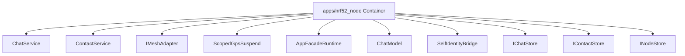

# 组件职责：apps/nrf52_node

C4 层级：Component
状态：candidate
置信度：high
项目版本：0.1.30-alpha
Git：34aad0bffa2f / main / dirty
更新于：2026-06-25T09:19:32.800Z

## 定位

从 C4 Component 层解释 apps/nrf52_node 内部的关键职责单元：入口、页面、命令、接口、注册表、adapter 或共享对象。

## C4 层级路径

- 当前层：Component，解释某个 Container 内部的关键职责单元。
- 上层：Container，限定这些组件所属的架构边界。
- 下层：Code View，只在需要追溯实现入口或变更影响面时进入少量关键代码锚点。

## 责任

解释 apps/nrf52_node 这个 Container 内部由哪些关键组件承担架构职责。Component 层不是全量类/函数列表，只保留对理解系统边界、协作或变更影响有帮助的对象。

## 边界

Component View 的边界被限制在 apps/nrf52_node Container 内；跨容器关系应该回到 Container 或 Engineering Sequence 视角解释。

## 关系

- ChatService: ChatService 是 apps/nrf52_node 内的应用服务或处理组件，证据来自 apps/nrf52_node/src/nrf52_node_app_facade_runtime.h#L23。
- ContactService: ContactService 是 apps/nrf52_node 内的应用服务或处理组件，证据来自 apps/nrf52_node/src/nrf52_node_app_facade_runtime.h#L30。
- IMeshAdapter: IMeshAdapter 是 apps/nrf52_node 内的外部系统适配组件，证据来自 apps/nrf52_node/src/nrf52_node_app_facade_runtime.h#L25。
- ScopedGpsSuspend: ScopedGpsSuspend 是 apps/nrf52_node 内的主要架构组件，证据来自 apps/nrf52_node/src/nrf52_node_app_facade_runtime.cpp#L45。
- AppFacadeRuntime: AppFacadeRuntime 是 apps/nrf52_node 内的主要架构组件，证据来自 apps/nrf52_node/src/nrf52_node_app_facade_runtime.h#L42。
- ChatModel: ChatModel 是 apps/nrf52_node 内的主要架构组件，证据来自 apps/nrf52_node/src/nrf52_node_app_facade_runtime.h#L22。
- SelfIdentityBridge: SelfIdentityBridge 是 apps/nrf52_node 内的主要架构组件，证据来自 apps/nrf52_node/src/nrf52_node_app_facade_runtime.h#L36。
- IChatStore: IChatStore 是 apps/nrf52_node 内的持久化访问组件，证据来自 apps/nrf52_node/src/nrf52_node_app_facade_runtime.h#L24。
- IContactStore: IContactStore 是 apps/nrf52_node 内的持久化访问组件，证据来自 apps/nrf52_node/src/nrf52_node_app_facade_runtime.h#L29。
- INodeStore: INodeStore 是 apps/nrf52_node 内的持久化访问组件，证据来自 apps/nrf52_node/src/nrf52_node_app_facade_runtime.h#L28。
- nrf52_node_app_facade_runtime: nrf52_node_app_facade_runtime 是 apps/nrf52_node 内的应用服务或处理组件，证据来自 apps/nrf52_node/src/nrf52_node_app_facade_runtime.cpp。
- nrf52_node_runtime_config: nrf52_node_runtime_config 是 apps/nrf52_node 内的运行配置组件，证据来自 apps/nrf52_node/src/nrf52_node_runtime_config.cpp。

## 与业务复杂度的关联

- 组件层帮助把业务故事连接到实际入口、编排、适配或基础设施对象。
- 如果某个组件直接承载 Use Case，应在组织/过程模型的下钻文档中出现对应证据。

## 与技术复杂度的关联

- 对应 Engineering Class / Structural Diagram：docs/engineering/class-structural-diagrams/apps-nrf52_node/class-structural-diagram.html。
- 组件级复用迹象、外部协作迹象和复杂度候选点仍由软件结构模型负责解释。

## C4 Component 图

## 图内元素解释

### ChatService

- 层级：component
- 说明：ChatService 是 apps/nrf52_node 内的 class 候选组件，证据锚点是 apps/nrf52_node/src/nrf52_node_app_facade_runtime.h#L23；当前仓库证据显示它有 局部关系迹象，适合作为候选锚点而非完整结论。
- 责任：ChatService 在当前 C4 Component View 中被视为候选架构组件。这个判断不是由名称单独决定，而是由 apps/nrf52_node/src/nrf52_node_app_facade_runtime.h#L23、class 类型和 局部关系迹象，适合作为候选锚点而非完整结论 共同支撑。
- 边界：它属于 apps/nrf52_node Container 内部；超出该路径的协作应回到 Container 或软件结构模型中的 Sequence 视角解释。
- 关系意义：ChatService 被放入 Component View，是因为它能把 apps/nrf52_node 的架构职责落到一个可检查的入口、编排、适配、契约或共享对象上。复用迹象和外部协作迹象用于提示它更像共享核心、对外编排者，还是普通局部对象。
- 为什么属于该层：它有明确代码锚点，但当前解释目标不是源码细节，而是 apps/nrf52_node 内部职责如何拆分，所以属于 C4 Component 层。
- 下钻意图：下钻到 Code View 或软件结构模型的 Component Diagram，用来查看 ChatService 的文件锚点、直接协作和是否存在变更扩散风险。
- 置信度：high
- 证据：
  - apps/nrf52_node/src/nrf52_node_app_facade_runtime.h#L23
  - 复用迹象：存在局部复用或依赖线索
  - 外部协作迹象：当前未观察到明显外部协作线索

### ContactService

- 层级：component
- 说明：ContactService 是 apps/nrf52_node 内的 class 候选组件，证据锚点是 apps/nrf52_node/src/nrf52_node_app_facade_runtime.h#L30；当前仓库证据显示它有 局部关系迹象，适合作为候选锚点而非完整结论。
- 责任：ContactService 在当前 C4 Component View 中被视为候选架构组件。这个判断不是由名称单独决定，而是由 apps/nrf52_node/src/nrf52_node_app_facade_runtime.h#L30、class 类型和 局部关系迹象，适合作为候选锚点而非完整结论 共同支撑。
- 边界：它属于 apps/nrf52_node Container 内部；超出该路径的协作应回到 Container 或软件结构模型中的 Sequence 视角解释。
- 关系意义：ContactService 被放入 Component View，是因为它能把 apps/nrf52_node 的架构职责落到一个可检查的入口、编排、适配、契约或共享对象上。复用迹象和外部协作迹象用于提示它更像共享核心、对外编排者，还是普通局部对象。
- 为什么属于该层：它有明确代码锚点，但当前解释目标不是源码细节，而是 apps/nrf52_node 内部职责如何拆分，所以属于 C4 Component 层。
- 下钻意图：下钻到 Code View 或软件结构模型的 Component Diagram，用来查看 ContactService 的文件锚点、直接协作和是否存在变更扩散风险。
- 置信度：high
- 证据：
  - apps/nrf52_node/src/nrf52_node_app_facade_runtime.h#L30
  - 复用迹象：存在局部复用或依赖线索
  - 外部协作迹象：当前未观察到明显外部协作线索

### IMeshAdapter

- 层级：component
- 说明：IMeshAdapter 是 apps/nrf52_node 内的 class 候选组件，证据锚点是 apps/nrf52_node/src/nrf52_node_app_facade_runtime.h#L25；当前仓库证据显示它有 局部关系迹象，适合作为候选锚点而非完整结论。
- 责任：IMeshAdapter 在当前 C4 Component View 中被视为外部能力适配组件。这个判断不是由名称单独决定，而是由 apps/nrf52_node/src/nrf52_node_app_facade_runtime.h#L25、class 类型和 局部关系迹象，适合作为候选锚点而非完整结论 共同支撑。
- 边界：它属于 apps/nrf52_node Container 内部；超出该路径的协作应回到 Container 或软件结构模型中的 Sequence 视角解释。
- 关系意义：IMeshAdapter 被放入 Component View，是因为它能把 apps/nrf52_node 的架构职责落到一个可检查的入口、编排、适配、契约或共享对象上。复用迹象和外部协作迹象用于提示它更像共享核心、对外编排者，还是普通局部对象。
- 为什么属于该层：它有明确代码锚点，但当前解释目标不是源码细节，而是 apps/nrf52_node 内部职责如何拆分，所以属于 C4 Component 层。
- 下钻意图：下钻到 Code View 或软件结构模型的 Component Diagram，用来查看 IMeshAdapter 的文件锚点、直接协作和是否存在变更扩散风险。
- 置信度：high
- 证据：
  - apps/nrf52_node/src/nrf52_node_app_facade_runtime.h#L25
  - 复用迹象：存在局部复用或依赖线索
  - 外部协作迹象：当前未观察到明显外部协作线索

### ScopedGpsSuspend

- 层级：component
- 说明：ScopedGpsSuspend 是 apps/nrf52_node 内的 class 候选组件，证据锚点是 apps/nrf52_node/src/nrf52_node_app_facade_runtime.cpp#L45；当前仓库证据显示它有 局部关系迹象，适合作为候选锚点而非完整结论。
- 责任：ScopedGpsSuspend 在当前 C4 Component View 中被视为候选架构组件。这个判断不是由名称单独决定，而是由 apps/nrf52_node/src/nrf52_node_app_facade_runtime.cpp#L45、class 类型和 局部关系迹象，适合作为候选锚点而非完整结论 共同支撑。
- 边界：它属于 apps/nrf52_node Container 内部；超出该路径的协作应回到 Container 或软件结构模型中的 Sequence 视角解释。
- 关系意义：ScopedGpsSuspend 被放入 Component View，是因为它能把 apps/nrf52_node 的架构职责落到一个可检查的入口、编排、适配、契约或共享对象上。复用迹象和外部协作迹象用于提示它更像共享核心、对外编排者，还是普通局部对象。
- 为什么属于该层：它有明确代码锚点，但当前解释目标不是源码细节，而是 apps/nrf52_node 内部职责如何拆分，所以属于 C4 Component 层。
- 下钻意图：下钻到 Code View 或软件结构模型的 Component Diagram，用来查看 ScopedGpsSuspend 的文件锚点、直接协作和是否存在变更扩散风险。
- 置信度：medium
- 证据：
  - apps/nrf52_node/src/nrf52_node_app_facade_runtime.cpp#L45
  - 复用迹象：存在局部复用或依赖线索
  - 外部协作迹象：存在局部外部协作线索

### AppFacadeRuntime

- 层级：component
- 说明：AppFacadeRuntime 是 apps/nrf52_node 内的 class 候选组件，证据锚点是 apps/nrf52_node/src/nrf52_node_app_facade_runtime.h#L42；当前仓库证据显示它有 局部关系迹象，适合作为候选锚点而非完整结论。
- 责任：AppFacadeRuntime 在当前 C4 Component View 中被视为候选架构组件。这个判断不是由名称单独决定，而是由 apps/nrf52_node/src/nrf52_node_app_facade_runtime.h#L42、class 类型和 局部关系迹象，适合作为候选锚点而非完整结论 共同支撑。
- 边界：它属于 apps/nrf52_node Container 内部；超出该路径的协作应回到 Container 或软件结构模型中的 Sequence 视角解释。
- 关系意义：AppFacadeRuntime 被放入 Component View，是因为它能把 apps/nrf52_node 的架构职责落到一个可检查的入口、编排、适配、契约或共享对象上。复用迹象和外部协作迹象用于提示它更像共享核心、对外编排者，还是普通局部对象。
- 为什么属于该层：它有明确代码锚点，但当前解释目标不是源码细节，而是 apps/nrf52_node 内部职责如何拆分，所以属于 C4 Component 层。
- 下钻意图：下钻到 Code View 或软件结构模型的 Component Diagram，用来查看 AppFacadeRuntime 的文件锚点、直接协作和是否存在变更扩散风险。
- 置信度：medium
- 证据：
  - apps/nrf52_node/src/nrf52_node_app_facade_runtime.h#L42
  - 复用迹象：存在局部复用或依赖线索
  - 外部协作迹象：存在局部外部协作线索

### ChatModel

- 层级：component
- 说明：ChatModel 是 apps/nrf52_node 内的 class 候选组件，证据锚点是 apps/nrf52_node/src/nrf52_node_app_facade_runtime.h#L22；当前仓库证据显示它有 局部关系迹象，适合作为候选锚点而非完整结论。
- 责任：ChatModel 在当前 C4 Component View 中被视为候选架构组件。这个判断不是由名称单独决定，而是由 apps/nrf52_node/src/nrf52_node_app_facade_runtime.h#L22、class 类型和 局部关系迹象，适合作为候选锚点而非完整结论 共同支撑。
- 边界：它属于 apps/nrf52_node Container 内部；超出该路径的协作应回到 Container 或软件结构模型中的 Sequence 视角解释。
- 关系意义：ChatModel 被放入 Component View，是因为它能把 apps/nrf52_node 的架构职责落到一个可检查的入口、编排、适配、契约或共享对象上。复用迹象和外部协作迹象用于提示它更像共享核心、对外编排者，还是普通局部对象。
- 为什么属于该层：它有明确代码锚点，但当前解释目标不是源码细节，而是 apps/nrf52_node 内部职责如何拆分，所以属于 C4 Component 层。
- 下钻意图：下钻到 Code View 或软件结构模型的 Component Diagram，用来查看 ChatModel 的文件锚点、直接协作和是否存在变更扩散风险。
- 置信度：medium
- 证据：
  - apps/nrf52_node/src/nrf52_node_app_facade_runtime.h#L22
  - 复用迹象：存在局部复用或依赖线索
  - 外部协作迹象：当前未观察到明显外部协作线索

### SelfIdentityBridge

- 层级：component
- 说明：SelfIdentityBridge 是 apps/nrf52_node 内的 class 候选组件，证据锚点是 apps/nrf52_node/src/nrf52_node_app_facade_runtime.h#L36；当前仓库证据显示它有 局部关系迹象，适合作为候选锚点而非完整结论。
- 责任：SelfIdentityBridge 在当前 C4 Component View 中被视为候选架构组件。这个判断不是由名称单独决定，而是由 apps/nrf52_node/src/nrf52_node_app_facade_runtime.h#L36、class 类型和 局部关系迹象，适合作为候选锚点而非完整结论 共同支撑。
- 边界：它属于 apps/nrf52_node Container 内部；超出该路径的协作应回到 Container 或软件结构模型中的 Sequence 视角解释。
- 关系意义：SelfIdentityBridge 被放入 Component View，是因为它能把 apps/nrf52_node 的架构职责落到一个可检查的入口、编排、适配、契约或共享对象上。复用迹象和外部协作迹象用于提示它更像共享核心、对外编排者，还是普通局部对象。
- 为什么属于该层：它有明确代码锚点，但当前解释目标不是源码细节，而是 apps/nrf52_node 内部职责如何拆分，所以属于 C4 Component 层。
- 下钻意图：下钻到 Code View 或软件结构模型的 Component Diagram，用来查看 SelfIdentityBridge 的文件锚点、直接协作和是否存在变更扩散风险。
- 置信度：medium
- 证据：
  - apps/nrf52_node/src/nrf52_node_app_facade_runtime.h#L36
  - 复用迹象：存在局部复用或依赖线索
  - 外部协作迹象：当前未观察到明显外部协作线索

### IChatStore

- 层级：component
- 说明：IChatStore 是 apps/nrf52_node 内的 class 候选组件，证据锚点是 apps/nrf52_node/src/nrf52_node_app_facade_runtime.h#L24；当前仓库证据显示它有 局部关系迹象，适合作为候选锚点而非完整结论。
- 责任：IChatStore 在当前 C4 Component View 中被视为候选架构组件。这个判断不是由名称单独决定，而是由 apps/nrf52_node/src/nrf52_node_app_facade_runtime.h#L24、class 类型和 局部关系迹象，适合作为候选锚点而非完整结论 共同支撑。
- 边界：它属于 apps/nrf52_node Container 内部；超出该路径的协作应回到 Container 或软件结构模型中的 Sequence 视角解释。
- 关系意义：IChatStore 被放入 Component View，是因为它能把 apps/nrf52_node 的架构职责落到一个可检查的入口、编排、适配、契约或共享对象上。复用迹象和外部协作迹象用于提示它更像共享核心、对外编排者，还是普通局部对象。
- 为什么属于该层：它有明确代码锚点，但当前解释目标不是源码细节，而是 apps/nrf52_node 内部职责如何拆分，所以属于 C4 Component 层。
- 下钻意图：下钻到 Code View 或软件结构模型的 Component Diagram，用来查看 IChatStore 的文件锚点、直接协作和是否存在变更扩散风险。
- 置信度：medium
- 证据：
  - apps/nrf52_node/src/nrf52_node_app_facade_runtime.h#L24
  - 复用迹象：存在局部复用或依赖线索
  - 外部协作迹象：当前未观察到明显外部协作线索

### IContactStore

- 层级：component
- 说明：IContactStore 是 apps/nrf52_node 内的 class 候选组件，证据锚点是 apps/nrf52_node/src/nrf52_node_app_facade_runtime.h#L29；当前仓库证据显示它有 局部关系迹象，适合作为候选锚点而非完整结论。
- 责任：IContactStore 在当前 C4 Component View 中被视为候选架构组件。这个判断不是由名称单独决定，而是由 apps/nrf52_node/src/nrf52_node_app_facade_runtime.h#L29、class 类型和 局部关系迹象，适合作为候选锚点而非完整结论 共同支撑。
- 边界：它属于 apps/nrf52_node Container 内部；超出该路径的协作应回到 Container 或软件结构模型中的 Sequence 视角解释。
- 关系意义：IContactStore 被放入 Component View，是因为它能把 apps/nrf52_node 的架构职责落到一个可检查的入口、编排、适配、契约或共享对象上。复用迹象和外部协作迹象用于提示它更像共享核心、对外编排者，还是普通局部对象。
- 为什么属于该层：它有明确代码锚点，但当前解释目标不是源码细节，而是 apps/nrf52_node 内部职责如何拆分，所以属于 C4 Component 层。
- 下钻意图：下钻到 Code View 或软件结构模型的 Component Diagram，用来查看 IContactStore 的文件锚点、直接协作和是否存在变更扩散风险。
- 置信度：medium
- 证据：
  - apps/nrf52_node/src/nrf52_node_app_facade_runtime.h#L29
  - 复用迹象：存在局部复用或依赖线索
  - 外部协作迹象：当前未观察到明显外部协作线索

### INodeStore

- 层级：component
- 说明：INodeStore 是 apps/nrf52_node 内的 class 候选组件，证据锚点是 apps/nrf52_node/src/nrf52_node_app_facade_runtime.h#L28；当前仓库证据显示它有 局部关系迹象，适合作为候选锚点而非完整结论。
- 责任：INodeStore 在当前 C4 Component View 中被视为候选架构组件。这个判断不是由名称单独决定，而是由 apps/nrf52_node/src/nrf52_node_app_facade_runtime.h#L28、class 类型和 局部关系迹象，适合作为候选锚点而非完整结论 共同支撑。
- 边界：它属于 apps/nrf52_node Container 内部；超出该路径的协作应回到 Container 或软件结构模型中的 Sequence 视角解释。
- 关系意义：INodeStore 被放入 Component View，是因为它能把 apps/nrf52_node 的架构职责落到一个可检查的入口、编排、适配、契约或共享对象上。复用迹象和外部协作迹象用于提示它更像共享核心、对外编排者，还是普通局部对象。
- 为什么属于该层：它有明确代码锚点，但当前解释目标不是源码细节，而是 apps/nrf52_node 内部职责如何拆分，所以属于 C4 Component 层。
- 下钻意图：下钻到 Code View 或软件结构模型的 Component Diagram，用来查看 INodeStore 的文件锚点、直接协作和是否存在变更扩散风险。
- 置信度：medium
- 证据：
  - apps/nrf52_node/src/nrf52_node_app_facade_runtime.h#L28
  - 复用迹象：存在局部复用或依赖线索
  - 外部协作迹象：当前未观察到明显外部协作线索

### nrf52_node_app_facade_runtime

- 层级：component
- 说明：nrf52_node_app_facade_runtime 是 apps/nrf52_node 内的 import 候选组件，证据锚点是 apps/nrf52_node/src/nrf52_node_app_facade_runtime.cpp；当前仓库证据显示它有 局部关系迹象，适合作为候选锚点而非完整结论。
- 责任：nrf52_node_app_facade_runtime 在当前 C4 Component View 中被视为候选架构组件。这个判断不是由名称单独决定，而是由 apps/nrf52_node/src/nrf52_node_app_facade_runtime.cpp、import 类型和 局部关系迹象，适合作为候选锚点而非完整结论 共同支撑。
- 边界：它属于 apps/nrf52_node Container 内部；超出该路径的协作应回到 Container 或软件结构模型中的 Sequence 视角解释。
- 关系意义：nrf52_node_app_facade_runtime 被放入 Component View，是因为它能把 apps/nrf52_node 的架构职责落到一个可检查的入口、编排、适配、契约或共享对象上。复用迹象和外部协作迹象用于提示它更像共享核心、对外编排者，还是普通局部对象。
- 为什么属于该层：它有明确代码锚点，但当前解释目标不是源码细节，而是 apps/nrf52_node 内部职责如何拆分，所以属于 C4 Component 层。
- 下钻意图：下钻到 Code View 或软件结构模型的 Component Diagram，用来查看 nrf52_node_app_facade_runtime 的文件锚点、直接协作和是否存在变更扩散风险。
- 置信度：high
- 证据：
  - apps/nrf52_node/src/nrf52_node_app_facade_runtime.cpp
  - 复用迹象：存在局部复用或依赖线索
  - 外部协作迹象：当前未观察到明显外部协作线索

### nrf52_node_runtime_config

- 层级：component
- 说明：nrf52_node_runtime_config 是 apps/nrf52_node 内的 import 候选组件，证据锚点是 apps/nrf52_node/src/nrf52_node_runtime_config.cpp；当前仓库证据显示它有 局部关系迹象，适合作为候选锚点而非完整结论。
- 责任：nrf52_node_runtime_config 在当前 C4 Component View 中被视为候选架构组件。这个判断不是由名称单独决定，而是由 apps/nrf52_node/src/nrf52_node_runtime_config.cpp、import 类型和 局部关系迹象，适合作为候选锚点而非完整结论 共同支撑。
- 边界：它属于 apps/nrf52_node Container 内部；超出该路径的协作应回到 Container 或软件结构模型中的 Sequence 视角解释。
- 关系意义：nrf52_node_runtime_config 被放入 Component View，是因为它能把 apps/nrf52_node 的架构职责落到一个可检查的入口、编排、适配、契约或共享对象上。复用迹象和外部协作迹象用于提示它更像共享核心、对外编排者，还是普通局部对象。
- 为什么属于该层：它有明确代码锚点，但当前解释目标不是源码细节，而是 apps/nrf52_node 内部职责如何拆分，所以属于 C4 Component 层。
- 下钻意图：下钻到 Code View 或软件结构模型的 Component Diagram，用来查看 nrf52_node_runtime_config 的文件锚点、直接协作和是否存在变更扩散风险。
- 置信度：medium
- 证据：
  - apps/nrf52_node/src/nrf52_node_runtime_config.cpp
  - 复用迹象：存在局部复用或依赖线索
  - 外部协作迹象：当前未观察到明显外部协作线索

## 可下钻 C4

- [代码锚点：apps/nrf52_node](../../code/apps-nrf52_node/code.md) - 进入 代码锚点：apps/nrf52_node 是为了把 组件职责：apps/nrf52_node 的架构职责追溯到具体文件/符号锚点；只有需要判断实现入口或变更影响面时才应下钻到 Code。

## 关联软件结构模型

- [apps/nrf52_node Class / Structural Diagram](../../../../engineering/class-structural-diagrams/apps-nrf52_node/class-structural-diagram.md) - 查看该 Container 内部结构协作和关键技术对象。

## 证据

- apps/nrf52_node/src/nrf52_node_app_facade_runtime.h#L23
- apps/nrf52_node/src/nrf52_node_app_facade_runtime.h#L30
- apps/nrf52_node/src/nrf52_node_app_facade_runtime.h#L25
- apps/nrf52_node/src/nrf52_node_app_facade_runtime.cpp#L45
- apps/nrf52_node/src/nrf52_node_app_facade_runtime.h#L42
- apps/nrf52_node/src/nrf52_node_app_facade_runtime.h#L22
- apps/nrf52_node/src/nrf52_node_app_facade_runtime.h#L36
- apps/nrf52_node/src/nrf52_node_app_facade_runtime.h#L24
- apps/nrf52_node/src/nrf52_node_app_facade_runtime.h#L29
- apps/nrf52_node/src/nrf52_node_app_facade_runtime.h#L28
- apps/nrf52_node/src/nrf52_node_app_facade_runtime.cpp
- apps/nrf52_node/src/nrf52_node_runtime_config.cpp

## 判定依据

- Component 候选只保留入口、编排、接口、适配器、配置、任务、消费者或生产者等组件级职责对象；方法、路由和局部函数下沉到 Code View。

## 变更记录

### 0.1.30-alpha - 2026-06-25T09:19:32.800Z

- 基于本地仓库证据重新生成 组件职责：apps/nrf52_node。
