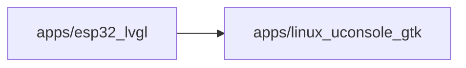

# Container boundary: apps/esp32_lvgl

C4 Level: Container
Status: candidate
Confidence: high
Project version: 0.1.30-alpha
Git:34aad0bffa2f / main / dirty
Updated on: 2026-06-25T09:19:32.800Z

## Targeting

apps/esp32_lvgl is a C4 Container layer candidate boundary: it must behave as an application, service, data store, runnable unit, or independently deployable/executable system part, rather than a normal directory, code layering, or shared collection of tools.

## C4 hierarchical path

- Current layer: Container, explaining an independently understandable application, service, data storage or running unit within the target system.
- Upper layer: System Context, indicating which target software system the Container belongs to.
- Lower layer: Component, explaining the entrance, interface, orchestration, adaptation, contract or shared object inside the Container.

## Responsibility

apps/esp32_lvgl is an application-level Container candidate: repository evidence shows it is close to a runnable entry, desktop/frontend/backend application shell, or user-perceivable system capabilities.

## Boundary

The boundary comes from the warehouse path apps/esp32_lvgl. C4 Container is not equal to any package or code layer; only boundaries with applications, services, data storage, runtime portals, deployment units, external interfaces or independent execution semantics enter this layer. Ordinary configuration files, document directories, CI directories, warehouse management files and pure code layering can only be used as evidence or software structure model objects, not as Containers.

## Relationships

- Depends on other Container: apps/linux_uconsole_gtk.
 - Contains 14 candidate component view objects, 18 run/collaboration links, 0 run or build nodes.

## Correlation with business complexity

- This Container is not the business use case itself; it only explains the internal application/service/data storage/operation unit of the software system into which the business capability enters or passes.
- If the Use Case in the organization/process model refers to this boundary, how it enters this Container should be explained in the Use Case drill-down document instead of writing the business process into the C4 Container diagram.

## Correlation with technical complexity

-Corresponding software structure model Package Diagram: docs/engineering/package-diagrams/apps-esp32_lvgl/package-diagram.html.
- Continue into the software structure model to view drill-down UML, structural collaborations, operational links, and complexity candidates.

## C4 Container diagram

## Explanation of elements in the diagram

### apps/esp32_lvgl

- Level: container
- Description: This node in the diagram represents the apps/esp32_lvgl C4 Container; the current document records 14 component drill-down entries, 18 running collaboration threads and 0 running or build nodes.
- Responsibility: apps/esp32_lvgl is an application-level Container Candidate: Repository evidence shows it is close to a runnable entry, desktop/frontend/backend application shell, or user-perceivable system capabilities.
- Boundary: The boundary comes from the warehouse path apps/esp32_lvgl; the entry, service interface, application code, running configuration and deployment evidence under this path jointly support it to enter the Container layer. Ordinary configuration files, document directories or pure code layering will not form a Container alone.
- Relationship meaning: The figure points from apps/esp32_lvgl to the external boundary, indicating that this runnable boundary will call, reference or depend on other Containers; these relationships are used to determine deployment, interfaces and change impacts.
- Why it belongs to this layer: This node enters the Container layer because the local warehouse evidence shows that it has applications, services, data storage, running portals, deployment units, external interfaces or independent execution semantics; not because it is just a directory or package.
- Drill down intention: Drill down from apps/esp32_lvgl to Component to view the decomposition of responsibilities within the boundary.
- Confidence: high
- Evidence:
  - apps/esp32_lvgl/APP_SHELL_MANIFEST.md
  - apps/esp32_lvgl/CMakeLists.txt
  - apps/esp32_lvgl/library.json
  - apps/esp32_lvgl/README.md
  - apps/esp32_lvgl/src/esp32_lvgl_app_shell.cpp
  - apps/esp32_lvgl/src/esp32_lvgl_app_shell.h
  - apps/esp32_lvgl/src/esp32_lvgl_arduino_app_registry.cpp
  - apps/esp32_lvgl/src/esp32_lvgl_arduino_app_runtime_access.cpp
 - Drill down to:
 - [Component Responsibility: apps/esp32_lvgl](../../components/apps-esp32_lvgl/component.md) - Enter Component Responsibility: apps/esp32_lvgl to answer "Container Boundary: apps/esp32_lvgl is hosted by which internal components". Focus on portals, orchestration, adaptation, contracts, and shared objects rather than browsing the entire file.
 - [Code Anchor: apps/esp32_lvgl](../../code/apps-esp32_lvgl/code.md) - Entering the code anchor: apps/esp32_lvgl is to put the container boundary: apps/esp32_lvgl The architectural responsibilities can be traced back to specific files/symbol anchors; you should drill down to Code only when you need to determine the implementation entry or the impact of changes.

### apps/linux_uconsole_gtk

- Level: container
- Description: apps/esp32_lvgl depends on apps/linux_uconsole_gtk.
- Responsibility: apps/esp32_lvgl depends on apps/linux_uconsole_gtk.
 - Boundary: apps/linux_uconsole_gtk does not belong to the internal bounds of apps/esp32_lvgl; it is just a dependent adjacent module in the current graph.
- Relationship meaning: apps/esp32_lvgl -> apps/linux_uconsole_gtk indicates that there are cross-boundary calls, references or configuration dependencies in the local warehouse evidence; it illustrates the direction of technical collaboration, but cannot independently prove the business process relationship.
- Why it belongs to this layer: apps/linux_uconsole_gtk path ownership is projected as an adjacent Container candidate instead of apps/esp32_lvgl internal Component.
- Drill down intention: Go into the independent Container document of apps/linux_uconsole_gtk to view its own responsibilities and evidence; if there is no independent document, it will only be regarded as an external dependency fact.
- Confidence: medium
- Evidence:
  - dependency edge: apps/esp32_lvgl -> apps/linux_uconsole_gtk

## Drill-down to C4

- [Component Responsibility: apps/esp32_lvgl](../../components/apps-esp32_lvgl/component.md) - Enter Component Responsibility: apps/esp32_lvgl to answer "Container Boundary: apps/esp32_lvgl is hosted by which internal components". Focus on portals, orchestration, adaptation, contracts, and shared objects rather than browsing the entire file.
- [Code Anchor: apps/esp32_lvgl](../../code/apps-esp32_lvgl/code.md) - Entering the code anchor: apps/esp32_lvgl is to put the container boundary: apps/esp32_lvgl The architectural responsibilities can be traced back to specific files/symbol anchors; you should drill down to Code only when you need to determine the implementation entry or the impact of changes.

## Associated software structure model

- [apps/esp32_lvgl Package Diagram](../../../../engineering/package-diagrams/apps-esp32_lvgl/package-diagram.md) - View the boundaries, dependencies and complexity candidate points of the software structure package/module to which the Container belongs.

## Evidence

- apps/esp32_lvgl/APP_SHELL_MANIFEST.md
- apps/esp32_lvgl/CMakeLists.txt
- apps/esp32_lvgl/library.json
- apps/esp32_lvgl/README.md
- apps/esp32_lvgl/src/esp32_lvgl_app_shell.cpp
- apps/esp32_lvgl/src/esp32_lvgl_app_shell.h
- apps/esp32_lvgl/src/esp32_lvgl_arduino_app_registry.cpp
- apps/esp32_lvgl/src/esp32_lvgl_arduino_app_runtime_access.cpp

## Judgment basis

- The boundary must be supported by running entry, build/deployment configuration, service interface, application entry, data storage or independent execution evidence; directory name, number of files or number of dependencies alone are not enough to establish.
- When evidence of operation, deployment, interface, or data storage is missing, the build process reduces confidence or does not build standalone Containers.

## Change Record

### 0.1.30-alpha - 2026-06-25T09:19:32.800Z

 - Regenerate based on local repository evidence Container boundary: apps/esp32_lvgl.
