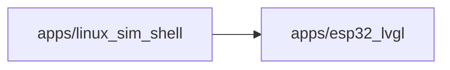

# Container boundary: apps/linux_sim_shell

C4 level: Container
Status: candidate
Confidence: high
Project version: 0.1.30-alpha
Git:34aad0bffa2f / main / dirty
Updated on: 2026-06-25T09:19:32.800Z

## Positioning

apps/linux_sim_shell is a C4 Container layer candidate boundary: it must behave as an application, service, data store, runnable unit, or independently deployable/executable system part, rather than a normal directory, code layering, or shared collection of tools.

## C4 hierarchy path

- Current layer: Container, which explains an independently understandable application, service, data storage or running unit within the target system.
- Upper layer: System Context, indicating which target software system the Container belongs to.
- Lower layer: Component, explaining the entrance, interface, orchestration, adaptation, contract or shared object inside the Container.

## Responsibility

apps/linux_sim_shell is an application-level Container candidate: repository evidence shows it is close to a runnable entry, a desktop/front-end/back-end application shell, or user-perceivable system capabilities.

## Boundary

The boundary comes from the warehouse path apps/linux_sim_shell. C4 Container is not equal to any package or code layer; only boundaries with applications, services, data storage, runtime portals, deployment units, external interfaces or independent execution semantics enter this layer. Ordinary configuration files, document directories, CI directories, warehouse management files and pure code layering can only be used as evidence or software structure model objects, not as Containers.

## Relationships

- Depends on other Containers: apps/esp32_lvgl.
 - Contains 0 candidate component view objects, 0 run/collaboration links, 0 run or build nodes.

## Correlation with business complexity

- This Container is not the business use case itself; it only explains the internal application/service/data storage/operation unit of the software system through which the business capability enters or passes.
- If the Use Case in the organization/process model refers to this boundary, how it enters this Container should be explained in the Use Case drill-down document instead of writing the business process into the C4 Container diagram.

## Correlation with technical complexity

- Corresponding software structure model Package Diagram: docs/engineering/package-diagrams/apps-linux_sim_shell/package-diagram.html.
- Continue into the software structure model to view drill-down UML, structural collaborations, operational links, and complexity candidates.

## C4 Container diagram

## Explanation of elements in the figure

### apps/linux_sim_shell

- Level: container
- Description: This node in the diagram represents the apps/linux_sim_shell C4 Container; the current document records 0 component drill-down entries, 0 running collaboration threads and 0 running or build nodes.
- Responsibility: apps/linux_sim_shell is an application-level Container Candidate: Repository evidence shows it is close to a runnable entry, a desktop/frontend/backend application shell, or a user-perceivable system capability.
- Boundary: The boundary comes from the warehouse path apps/linux_sim_shell; the entry, service interface, application code, running configuration and deployment evidence under this path jointly support it to enter the Container layer. Ordinary configuration files, document directories or pure code layering will not form a Container alone.
- Relationship meaning: The figure points from apps/linux_sim_shell to the external boundary, indicating that this runnable boundary will call, reference or depend on other Containers; these relationships are used to determine deployment, interfaces and change impacts.
- Why it belongs to this layer: This node enters the Container layer because the local warehouse evidence shows that it has applications, services, data storage, running portals, deployment units, external interfaces or independent execution semantics; not because it is just a directory or package.
- Drill down intention: Drill down from apps/linux_sim_shell to Component to view the decomposition of responsibilities within the boundary.
- Confidence: high
- Evidence:
  - apps/linux_sim_shell/APP_SHELL_MANIFEST.md
  - apps/linux_sim_shell/CMakeLists.txt
  - apps/linux_sim_shell/README.md
  - apps/linux_sim_shell/src/linux_sim_app_shell.cpp
  - apps/linux_sim_shell/src/linux_sim_app_shell.h
  - apps/linux_sim_shell/src/linux_sim_runtime_entry_adoption_probe.cpp
  - apps/linux_sim_shell/src/linux_sim_runtime_entry_adoption_probe.h
  - apps/linux_sim_shell/src/linux_sim_runtime_entry.cpp
- Drill-down:
 - [Code Anchor: apps/linux_sim_shell](../../code/apps-linux_sim_shell/code.md) - Entering the Code Anchor: apps/linux_sim_shell is to put the container boundary: apps/linux_sim_shell The architectural responsibilities can be traced back to specific files/symbol anchors; you should drill down to Code only when you need to determine the implementation entry or the impact of changes.

### apps/esp32_lvgl

- Level: container
- Description: apps/linux_sim_shell depends on apps/esp32_lvgl.
- Responsibility: apps/linux_sim_shell depends on apps/esp32_lvgl.
 - Bounds: apps/esp32_lvgl does not belong to the internal boundaries of apps/linux_sim_shell; it is just a dependent adjacent module in the current graph.
- Relationship meaning: apps/linux_sim_shell -> apps/esp32_lvgl indicates that there are cross-border calls, references or configuration dependencies in the local warehouse evidence; it illustrates the direction of technical collaboration, but cannot independently prove the business process relationship.
- Why it belongs to this layer: apps/esp32_lvgl by path ownership is projected as an adjacent Container candidate, rather than apps/linux_sim_shell internal Component.
- Drill down intention: Go into the independent Container document of apps/esp32_lvgl to view its own responsibilities and evidence; if there is no independent document, it will only be regarded as an external dependency fact.
- Confidence: medium
- Evidence:
  - dependency edge: apps/linux_sim_shell -> apps/esp32_lvgl

## Can drill down to C4

- [Code anchor: apps/linux_sim_shell](../../code/apps-linux_sim_shell/code.md) - Entering code anchor: apps/linux_sim_shell is to trace the architectural responsibility of container boundary: apps/linux_sim_shell to the specific file/symbol anchor; only when you need to determine the implementation entry or the impact of the change, you should drill down to Code.

## Associated software structural model

- [apps/linux_sim_shell Package Diagram](../../../../engineering/package-diagrams/apps-linux_sim_shell/package-diagram.md) - View the boundaries, dependencies and complexity candidates of the software structure package/module to which the Container belongs.

## Evidence

- apps/linux_sim_shell/APP_SHELL_MANIFEST.md
- apps/linux_sim_shell/CMakeLists.txt
- apps/linux_sim_shell/README.md
- apps/linux_sim_shell/src/linux_sim_app_shell.cpp
- apps/linux_sim_shell/src/linux_sim_app_shell.h
- apps/linux_sim_shell/src/linux_sim_runtime_entry_adoption_probe.cpp
- apps/linux_sim_shell/src/linux_sim_runtime_entry_adoption_probe.h
- apps/linux_sim_shell/src/linux_sim_runtime_entry.cpp

## Judgment basis

- This boundary must be supported by running entry, build/deployment configuration, service interface, application entry, data storage or independent execution evidence; directory name, number of files or number of dependencies alone are not sufficient.
- The build process reduces confidence or does not build standalone Containers when there is missing evidence of operation, deployment, interface, or data storage.

## Change record

### 0.1.30-alpha - 2026-06-25T09:19:32.800Z

- Regenerate container boundary based on local repository evidence: apps/linux_sim_shell.
