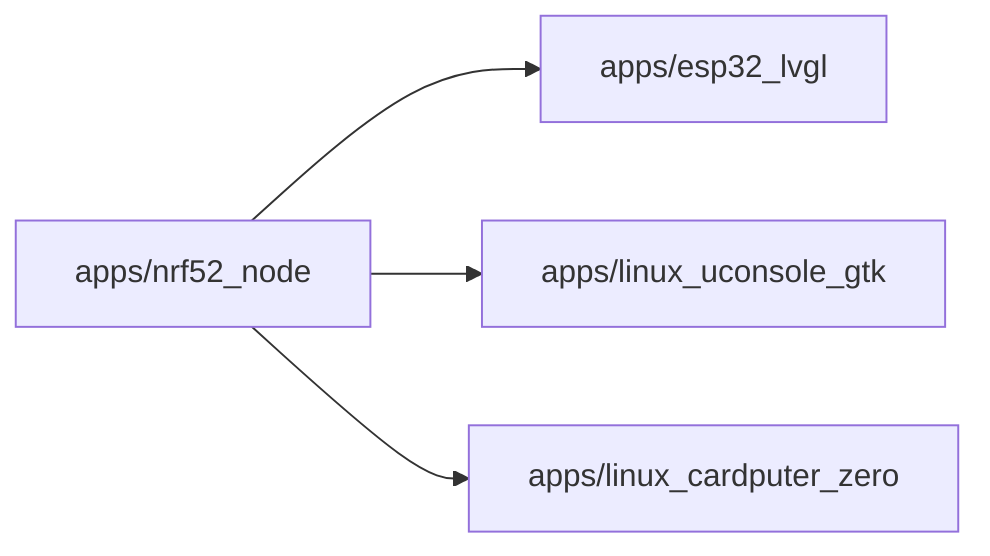

# Container boundary: apps/nrf52_node

C4 level: Container
Status: candidate
Confidence: high
Project version: 0.1.30-alpha
Git:34aad0bffa2f / main / dirty
Updated on: 2026-06-25T09:19:32.800Z

## Positioning

apps/nrf52_node is a candidate boundary for the C4 Container layer: it must behave as an application, service, data store, runnable unit, or part of a system that can be deployed/executed independently, rather than as a normal directory, code layering, or collection of shared tools.

## C4 hierarchy path

- Current layer: Container, which explains an independently understandable application, service, data storage or running unit within the target system.
- Upper layer: System Context, indicating which target software system the Container belongs to.
- Lower layer: Component, explaining the entrance, interface, orchestration, adaptation, contract or shared object inside the Container.

## Responsibility

apps/nrf52_node is an application-level Container candidate: repository evidence shows it is close to a runnable portal, desktop/frontend/backend application shell, or user-perceivable system capabilities.

## Boundary

The boundary comes from the warehouse path apps/nrf52_node. C4 Container is not equal to any package or code layer; only boundaries with applications, services, data storage, runtime portals, deployment units, external interfaces or independent execution semantics enter this layer. Ordinary configuration files, document directories, CI directories, warehouse management files and pure code layering can only be used as evidence or software structure model objects, not as Containers.

## Relationships

- Depends on other Containers: apps/esp32_lvgl, apps/linux_uconsole_gtk, apps/linux_cardputer_zero.
 - Contains 14 candidate component view objects, 0 run/collaboration links, 0 run or build nodes.

## Correlation with business complexity

- This Container is not the business use case itself; it only explains the internal application/service/data storage/operation unit of the software system through which the business capability enters or passes.
- If the Use Case in the organization/process model refers to this boundary, how it enters this Container should be explained in the Use Case drill-down document instead of writing the business process into the C4 Container diagram.

## Correlation with technical complexity

- Corresponding software structure model Package Diagram: docs/engineering/package-diagrams/apps-nrf52_node/package-diagram.html.
- Continue into the software structure model to view drill-down UML, structural collaborations, operational links, and complexity candidates.

## C4 Container diagram

## Explanation of elements in the diagram

### apps/nrf52_node

 - Level: container
- Note: This node in the figure represents the C4 Container apps/nrf52_node; the current document records 14 component drill-down entries, 0 running collaboration threads, and 0 running or build nodes.
- Responsibility: apps/nrf52_node is an application-level Container Candidate: Repository evidence shows it is close to a runnable entry, desktop/frontend/backend application shell, or user-perceivable system capabilities.
- Boundary: The boundary comes from the warehouse path apps/nrf52_node; the entry, service interface, application code, running configuration and deployment evidence under this path jointly support it to enter the Container layer. Ordinary configuration files, document directories or pure code layers will not form a Container alone.
- Relationship meaning: The figure points from apps/nrf52_node to the external boundary, indicating that this runnable boundary will call, reference or depend on other Containers; these relationships are used to determine deployment, interfaces and change impacts.
- Why it belongs to this layer: This node enters the Container layer because the local warehouse evidence shows that it has applications, services, data storage, running portals, deployment units, external interfaces or independent execution semantics; not because it is just a directory or package.
- Drill down intention: Drill down from apps/nrf52_node to Component to view the decomposition of responsibilities within the boundary.
- Confidence: high
- Evidence:
  - apps/nrf52_node/APP_SHELL_MANIFEST.md
  - apps/nrf52_node/library.json
  - apps/nrf52_node/README.md
  - apps/nrf52_node/src/nrf52_node_app_facade_runtime.cpp
  - apps/nrf52_node/src/nrf52_node_app_facade_runtime.h
  - apps/nrf52_node/src/nrf52_node_app_runtime_access.cpp
  - apps/nrf52_node/src/nrf52_node_app_runtime_access.h
  - apps/nrf52_node/src/nrf52_node_app_shell.cpp
 - Drill down:
 - [Component Responsibility: apps/nrf52_node](../../components/apps-nrf52_node/component.md) - Enter Component Responsibility: apps/nrf52_node to answer "Container Boundary: apps/nrf52_node is hosted by which internal components". Focus on portals, orchestration, adaptation, contracts, and shared objects rather than browsing the entire file.
 - [Code Anchor: apps/nrf52_node](../../code/apps-nrf52_node/code.md) - Entering the code anchor: apps/nrf52_node is to put the container boundary: apps/nrf52_node The architectural responsibilities can be traced back to specific files/symbol anchors; you should drill down to Code only when you need to determine the implementation entry or the impact of changes.

### apps/esp32_lvgl

 - Level: container
- Description: apps/nrf52_node depends on apps/esp32_lvgl.
- Responsibility: apps/nrf52_node depends on apps/esp32_lvgl.
 - Boundary: apps/esp32_lvgl does not belong to the internal bounds of apps/nrf52_node; it is just a dependent adjacent module in the current graph.
- Relationship meaning: apps/nrf52_node -> apps/esp32_lvgl indicates the existence of cross-boundary calls, references or configuration dependencies in the local warehouse evidence; it illustrates the direction of technical collaboration, but cannot independently prove the business process relationship.
- Why it belongs to this layer: apps/esp32_lvgl is projected as an adjacent Container candidate by path instead of the apps/nrf52_node internal Component.
- Drill-down intention: Go into the independent Container document of apps/esp32_lvgl to view its own responsibilities and evidence; if there is no independent document, it will only be regarded as an external dependency fact.
- Confidence: medium
- Evidence:
  - dependency edge: apps/nrf52_node -> apps/esp32_lvgl

### apps/linux_uconsole_gtk

 - Level: container
- Description: apps/nrf52_node depends on apps/linux_uconsole_gtk.
- Responsibility: apps/nrf52_node depends on apps/linux_uconsole_gtk.
 - Bounds: apps/linux_uconsole_gtk does not belong to the internal bounds of apps/nrf52_node; it is just a dependent adjacent module in the current graph.
- Relationship meaning: apps/nrf52_node -> apps/linux_uconsole_gtk indicates that there are cross-boundary calls, references or configuration dependencies in the local warehouse evidence; it illustrates the direction of technical collaboration, but cannot independently prove the business process relationship.
- Why it belongs to this layer: apps/linux_uconsole_gtk is projected as an adjacent Container candidate by path instead of the apps/nrf52_node internal Component.
- Drill down intent: Go into the standalone Container document of apps/linux_uconsole_gtk to view its own responsibilities and evidence; if there is no independent document, it will only be treated as an external dependency fact.
- Confidence: medium
- Evidence:
  - dependency edge: apps/nrf52_node -> apps/linux_uconsole_gtk

### apps/linux_cardputer_zero

 - Level: container
- Description: apps/nrf52_node depends on apps/linux_cardputer_zero.
- Responsibility: apps/nrf52_node depends on apps/linux_cardputer_zero.
 - Boundary: apps/linux_cardputer_zero is not part of the internal bounds of apps/nrf52_node; it is just a dependent adjacent module in the current graph.
- Relationship meaning: apps/nrf52_node -> apps/linux_cardputer_zero indicates that there are cross-boundary calls, references or configuration dependencies in the local warehouse evidence; it illustrates the direction of technical collaboration, but cannot independently prove the business process relationship.
- Why it belongs to this layer: apps/linux_cardputer_zero is projected as an adjacent Container candidate by path instead of apps/nrf52_node internal Component.
- Drill-down intention: Go into the independent Container document of apps/linux_cardputer_zero to view its own responsibilities and evidence; if there is no independent document, it will only be regarded as an external dependency fact.
- Confidence: medium
- Evidence:
  - dependency edge: apps/nrf52_node -> apps/linux_cardputer_zero

## Can be drilled into C4

 - [Component Responsibility: apps/nrf52_node](../../components/apps-nrf52_node/component.md) - Enter Component Responsibility: apps/nrf52_node to answer "Container Boundary: apps/nrf52_node is hosted by which internal components". Focus on portals, orchestration, adaptation, contracts, and shared objects rather than browsing the entire file.
- [Code Anchor: apps/nrf52_node](../../code/apps-nrf52_node/code.md) - Entering the code anchor: apps/nrf52_node is to put the container boundary: apps/nrf52_node The architectural responsibilities can be traced back to specific files/symbol anchors; you should drill down to Code only when you need to determine the implementation entry or the impact of changes.

## Associated Software Structural Model

- [apps/nrf52_node Package Diagram](../../../../engineering/package-diagrams/apps-nrf52_node/package-diagram.md) - View the boundaries, dependencies and complexity candidates of the software structure package/module to which the Container belongs.

## Evidence

- apps/nrf52_node/APP_SHELL_MANIFEST.md
- apps/nrf52_node/library.json
- apps/nrf52_node/README.md
- apps/nrf52_node/src/nrf52_node_app_facade_runtime.cpp
- apps/nrf52_node/src/nrf52_node_app_facade_runtime.h
- apps/nrf52_node/src/nrf52_node_app_runtime_access.cpp
- apps/nrf52_node/src/nrf52_node_app_runtime_access.h
- apps/nrf52_node/src/nrf52_node_app_shell.cpp

## Judgment basis

- This boundary must be supported by a run entry, build/deployment configuration, service interface, application entry, data storage or independent execution evidence; directory name, number of files or number of dependencies alone are not sufficient.
- When evidence of operation, deployment, interface, or data storage is missing, the build process reduces confidence or does not build standalone Containers.

## Change Record

### 0.1.30-alpha - 2026-06-25T09:19:32.800Z

 - Regenerate container boundary based on local repository evidence: apps/nrf52_node.
