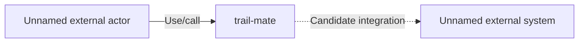

# System context: trail-mate

C4 level: System Context
Status: candidate
Confidence: high
Project version: 0.1.30-alpha
Git:34aad0bffa2f / main / dirty
Updated on: 2026-06-25T09:19:32.800Z

## Positioning

Explain from the C4 System Context layer the environment in which the target software system of trail-mate is located: who uses it, which external systems it depends on or collaborates with, and where its boundaries are as a black box.

## C4 hierarchy path

- Current layer: System Context, explaining the boundaries between the target software system and external participants and external systems.
- Upper level: None, this is the root level of the current C4 tree.
- Lower layer: Container, which enters the applications, services, data storage or running units within the system.

## Responsibility

trail-mate is the currently open target project being analyzed. System Context only observes it as a whole software system, first explains who will use or call it, which external systems it may cooperate with, and then enters the Container layer to explain the internal boundaries.

## Boundary

The System Context must surround the trail-mate target system itself; development tools, model services, document generation processes, and IDE workflows do not belong to the target system business context unless they are part of the implementation of the target project itself.

## Relationships

- trail-mate is the system boundary of the current C4 tree; the internal implementation is only expanded through Container drill-down.
- External users, callers or upstream systems are not named in the current warehouse evidence, so this diagram only retains unnamed external actors and does not use tool-side roles to replace real business roles.
- External systems and third-party services will only be detailed when the warehouse evidence can support them; when the current evidence is insufficient, the unnamed external system placeholder will be retained in the figure and the evidence gap will be marked.

## Correlation with business complexity

- The organization/process model is responsible for explaining business stories and use cases; the System Context only retains the external roles or external system entrances for these business capabilities to enter the system boundary.
- If the business actors or systems external to the business have not been documented, this diagram must be marked as a candidate and tool-side roles must not be used in place of the real business context.

## Correlation with technical complexity

- The software structure model identified 18 packages/modules, 24 components and 18 complexity candidates based on local repository evidence.
- System Context is the top-level entrance to the architectural view; only after continuing to drill down to 5 Containers can the system boundaries be reduced to inspectable applications, services, data storage or running units.

## C4 System Context Diagram

## Explanation of elements in the figure

### Unnamed external actor

 - Level: person
 - Description: A human role, upstream system operator, or external caller that triggers or uses the trail-mate capability.
- Responsibility: The human actor, upstream system operator, or external caller who triggers or uses the trail-mate capability.
- Boundary: The actor is outside the target system; currently only the interaction boundary is stated, no specific business identity is assumed.
-Relationship meaning: The unnamed external actor is an external participant of the target system; the relationship meaning is to describe who triggers, uses or receives system capabilities.
- Why it belongs to this layer: It is located outside the system boundary or at the junction of the system boundary, so it is only explained in the System Context layer.
- Drill-down intent: Drill-down around Unnamed External Actors is used to explain system boundaries, external collaboration, or project memory evidence.
- Confidence: low
- Evidence:
  - apps/linux_uconsole_gtk
  - apps/esp32_lvgl
  - apps/nrf52_node
  - apps/linux_cardputer_zero
  - apps/linux_sim_shell

### trail-mate

-Level: system_context
-Description: The overall software system boundary of trail-mate.
- Responsibility: overall software system boundaries for trail-mate.
- Boundary: The current diagram only treats the target project as a whole system, and does not expand the internal modules, code, document generation process or IDE running mechanism.
- Relationship meaning: trail-mate is the common parent boundary of all subsequent Containers, Components and Code Views; any drill-down must be able to return to this target system, not the workflow of the development tool itself.
- Why it belongs to this layer: It represents the overall system boundary and does not expand the internal implementation.
- Drill down intention: Drill down from trail-mate to Container to see which architectural boundaries the system capabilities fall on.
- Confidence: high
- Evidence:
  - apps/linux_uconsole_gtk
  - apps/esp32_lvgl
  - apps/nrf52_node
  - apps/linux_cardputer_zero
  - apps/linux_sim_shell
- Drill-down:
 - [Container boundary: apps/linux_uconsole_gtk](../containers/apps-linux_uconsole_gtk/container.md) - Enter the container boundary: apps/linux_uconsole_gtk from the system context to enlarge the target system to apps/linux_uconsole_gtk This application, service, data store, or execution unit determines how it assumes C4 Container responsibilities within the system.
 - [Container boundary: apps/esp32_lvgl](../containers/apps-esp32_lvgl/container.md) - Enter the container boundary: apps/esp32_lvgl from the system context in order to enlarge the target system to apps/esp32_lvgl, an application, service, data storage or running unit, and determine how it takes on the C4 Container inside the system. Responsibilities.
 - [Container boundary: apps/nrf52_node](../containers/apps-nrf52_node/container.md) - Enter the container boundary: apps/nrf52_node from the system context in order to enlarge the target system to apps/nrf52_node, an application, service, data storage or running unit, and determine how it assumes the C4 Container responsibilities within the system.
 - [Container boundary: apps/linux_cardputer_zero](../containers/apps-linux_cardputer_zero/container.md) - Enter the container boundary: apps/linux_cardputer_zero from the system context, in order to enlarge the target system to apps/linux_cardputer_zero, an application, service, data storage or running unit, and determine how it can bear the C4 inside the system. Container responsibilities.
 - [Container boundary: apps/linux_sim_shell](../containers/apps-linux_sim_shell/container.md) - Enter the container boundary: apps/linux_sim_shell from the system context in order to enlarge the target system to apps/linux_sim_shell, an application, service, data storage or running unit, and determine how it assumes the C4 Container responsibilities within the system.

### Unnamed external system

 - Level: external_system
 - Description: The boundary of an external system that trail-mate may call or be called on.
- Responsibility: External system boundaries from which trail-mate may call or be called.
- Boundary: The current warehouse evidence does not have enough interface, configuration, dependency, deployment or business documentation evidence to name a specific external system, so the general boundary is retained.
-Relationship meaning: This node expresses the determination result that there is insufficient evidence of external collaboration; development tools, model services, or document generation processes cannot be used to fill the external business boundaries of the target system.
- Why it belongs to this layer: It is located outside the system boundary or at the junction of the system boundary, so it is only explained in the System Context layer.
- Drill down intent: Drill down around an unnamed external system to explain system boundaries, external collaboration, or project memory evidence.
- Confidence: low
- Evidence:
  - apps/linux_uconsole_gtk
  - apps/esp32_lvgl
  - apps/nrf52_node
  - apps/linux_cardputer_zero
  - apps/linux_sim_shell

## Can drill down to C4

- [Container boundary: apps/linux_uconsole_gtk](../containers/apps-linux_uconsole_gtk/container.md) - Enter the container boundary: apps/linux_uconsole_gtk from the system context, in order to enlarge the target system to apps/linux_uconsole_gtk, an application, service, data storage or running unit, and determine how it can bear the C4 inside the system. Container responsibilities.
- [Container boundary: apps/esp32_lvgl](../containers/apps-esp32_lvgl/container.md) - Enter the container boundary: apps/esp32_lvgl from the system context, in order to enlarge the target system to apps/esp32_lvgl, an application, service, data storage or running unit, and determine how it takes on the C4 Container inside the system. Responsibilities.
- [Container boundary: apps/nrf52_node](../containers/apps-nrf52_node/container.md) - Enter the container boundary: apps/nrf52_node from the system context in order to enlarge the target system to apps/nrf52_node, the application, service, data storage or running unit, and determine how it takes on the C4 Container inside the system. Responsibilities.
- [Container boundary: apps/linux_cardputer_zero](../containers/apps-linux_cardputer_zero/container.md) - Enter the container boundary: apps/linux_cardputer_zero from the system context in order to enlarge the target system to apps/linux_cardputer_zero, an application, service, data storage or running unit, and determine how it can bear the C4 inside the system. Container responsibilities.
- [Container boundary: apps/linux_sim_shell](../containers/apps-linux_sim_shell/container.md) - Enter the container boundary: apps/linux_sim_shell from the system context in order to enlarge the target system to apps/linux_sim_shell, an application, service, data storage or running unit, and determine how it assumes the C4 Container responsibilities within the system.

## Associated software structural model

- There are currently no Engineering documents associated.

## Evidence

- apps/linux_uconsole_gtk
- apps/esp32_lvgl
- apps/nrf52_node
- apps/linux_cardputer_zero
- apps/linux_sim_shell

## Judgment basis

- Current local evidence does not yet stably name real external consumers, callers or upstream systems, so the System Context remains a black box system with external collaboration placeholders.
- External systems, third-party services or infrastructure dependencies are only broken down to specific nodes when evidence is provided by interfaces, configuration, deployment or business documentation.
- Container candidates must come from running portals, deployment/build configurations, service boundaries, application boundaries, or data storage evidence; ordinary directories, hierarchical packages, and governance files do not automatically become Containers.

## Change record

### 0.1.30-alpha - 2026-06-25T09:19:32.800Z

- Regenerate system context based on local repository evidence: trail-mate.
