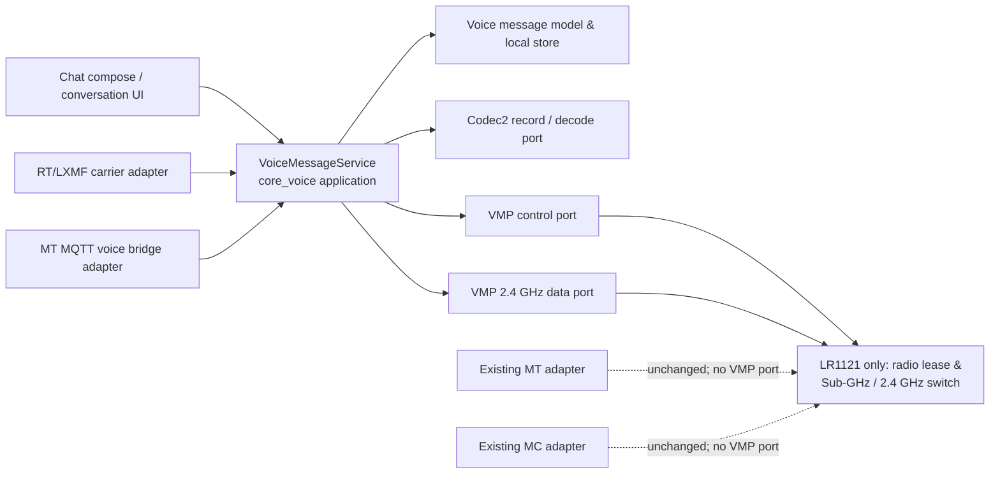
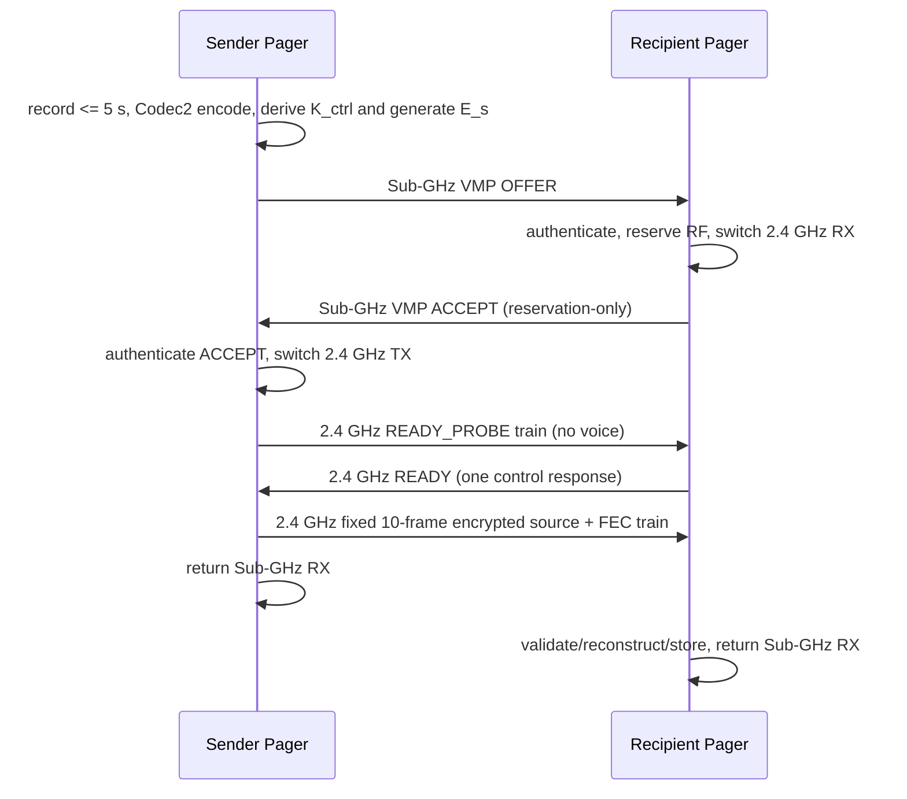
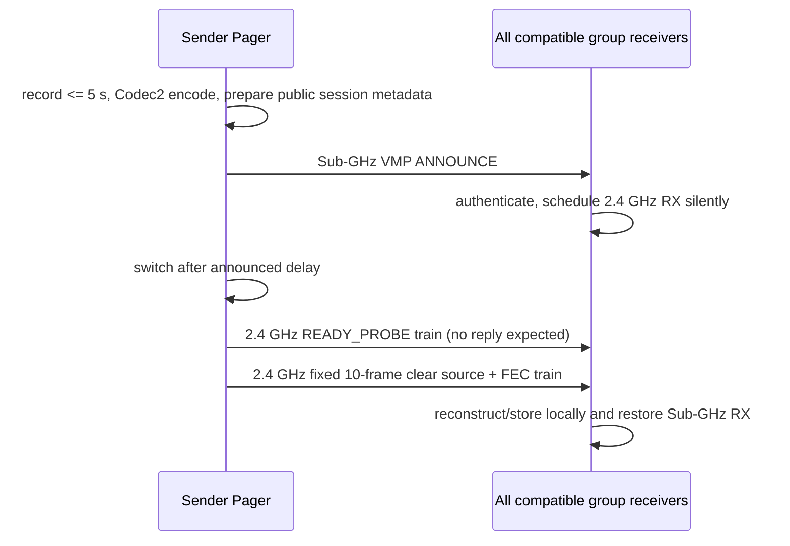
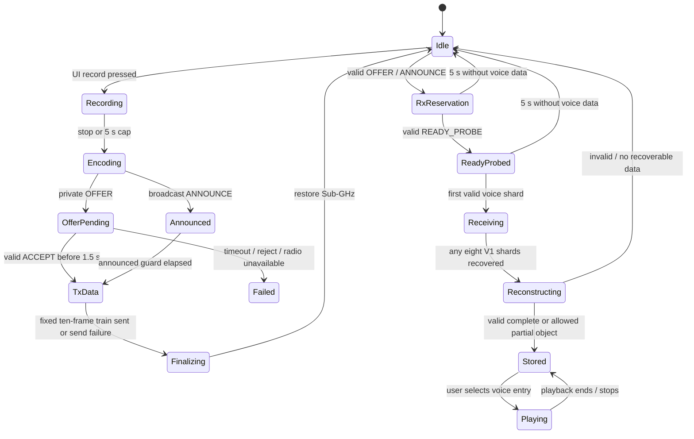

# Pager Voice Message Protocol (VMP) v1

**Status:** proposed implementation specification
**Scope:** Trail Mate Pager devices with microphone/audio hardware. LR1121 has the direct Sub-GHz/2.4 GHz VMP carrier; SX1262 supports the isolated MT MQTT carrier only when its MQTT uplink is enabled.
**Normative words:** the terms **MUST**, **MUST NOT**, **SHOULD**, and **MAY** are to be interpreted as requirements for the VMP implementation.

## 1. Purpose and boundaries

VMP carries a short, recorded voice message between Trail Mate Pager devices. On an LR1121 it uses the currently selected Sub-GHz radio configuration only as a control plane, then sends compressed voice bytes over LR1121 2.4 GHz GFSK: private delivery is encrypted end to end; broadcast delivery is intentionally public cleartext. An SX1262 cannot enter that path: it may encode and publish the same bounded VMP object only through an enabled isolated MT MQTT uplink. A recording is at most **five seconds** long.

The protocol deliberately has two delivery modes:

| Mode | Who receives | Sub-GHz control exchange | 2.4 GHz data exchange | Receiver transmission |
| --- | --- | --- | --- | --- |
| private | one selected contact | `OFFER` then authenticated `ACCEPT` | sender -> selected receiver | one `ACCEPT` only; never data/retry/forward |
| broadcast | compatible receivers on one selected group/channel | public `ANNOUNCE` | sender -> all silent receivers | none |

“Broadcast” in this document means **one-hop local broadcast**, not a mesh flood. A relay, a receiver, and an MQTT ingress device MUST NOT transmit, forward, retransmit, rebroadcast, or inject a received VMP audio packet onto a radio mesh. The only receive-side transmission VMP allows is the private recipient's small, authenticated `ACCEPT` control reply, which creates a temporary receive reservation; it is not a copy of the message.

VMP is a Trail Mate application protocol. It is not a Meshtastic (MT) or MeshCore (MC) port number, payload, routing rule, or relay rule. MT/MC radio operation remains unchanged. When Reticulum (RT) is active, LXMF MAY carry a VMP manifest or an encrypted VMP object through an established RT path, but that is a VMP carrier adapter, not an alteration to LXMF text-message semantics.

### 1.1 Pager carrier capability matrix

The implementation treats the radio chip as a hard carrier-security and RF-capability boundary, not as a UI preference:

| Pager hardware | Direct Sub-GHz control + LR1121 2.4 GHz train | MT MQTT publish/ingest | RT/LXMF VQ carrier | Record/send button |
| --- | --- | --- | --- | --- |
| LR1121 | allowed; private `OFFER`/`ACCEPT`/`READY` and public `ANNOUNCE` are available | allowed only when the existing MT MQTT uplink is enabled | allowed for private VMP when RT is active | available after local inbox hydration; direct RF does not require MQTT |
| SX1262 | **MUST NOT** enter any VMP RF control, `READY`, lease, or 2.4 GHz state | the **only** VMP carrier; allowed only while the existing MT MQTT uplink is enabled | **MUST NOT** send or accept VMP through LXMF | hidden/disabled unless the MQTT-only carrier is actually enabled |

An SX1262 receiving an MQTT VMP object still terminates it locally in the attachment inbox and may play it. It MUST NOT announce, relay, downlink, retransmit, or transform that object into a LoRa/Sub-GHz/2.4 GHz transmission. The SX1262 restriction applies to both egress and ingress: no direct VMP RF receive path and no LXMF VMP carrier are installed on that hardware.

## 2. Design principles

1. **No protocol leakage.** `core_voice` owns VMP state, packet parsing, key derivation, local-inbox storage, and deduplication. MT, MC, RT/LXMF, MQTT, UI, and LR1121 are adapters behind ports.
2. **No forwarding by construction.** The inbound VMP service exposes only `store`, `display`, and `play`; it has no radio enqueue capability. The MT MQTT adapter must not call `MtAdapter::enqueueMqttDownlinkTx()` for a VMP envelope.
3. **Bounded work and memory.** The maximum encoded message is fixed, packet data are streamed into fixed-depth storage slots, and no Codec2 frame, protobuf object, or large byte buffer is an ESP task-stack local.
4. **Validate before expensive work.** A private device validates a control authentication tag before reserving radio time and authenticates each private 2.4 GHz data frame before writing it. A public broadcast validates only unkeyed corruption checks and is intentionally marked unverified.
5. **Best-effort media, deterministic completion.** VMP uses no data ACK and no radio data retransmission. It can use proactive FEC, but a message is either stored as complete, stored as recoverable-with-gaps, or discarded. It is never re-originated by the receiver.
6. **Fail closed.** Unknown VMP versions, invalid profile identifiers, bad authentication tags, oversized objects, expired reservations, and duplicate sessions are rejected locally.

## 3. Architecture



The implementation is split into the following units:

| Unit | Responsibility | Must not do |
| --- | --- | --- |
| `core_voice/domain` | message metadata, limits, delivery mode, status, content identifier | call radio, UI, MQTT, or Codec2 |
| `core_voice/protocol` | VMP v1 binary codecs, FEC layout, replay/deduplication and session state machine | know MT/MC/RT wire formats |
| `core_voice/application` | start record/send, receive control/data, persist message, publish domain events | make board-specific SPI calls |
| `platform/.../voice_audio_runtime` | bounded Codec2 capture/decode/playback | own message routing or radio policy |
| `platform/.../lr1121_voice_radio` | serialized RF lease, PHY profile application and immediate restoration of Sub-GHz RX | expose generic arbitrary radio TX to an inbound message |
| `.../voice_mqtt_bridge` | VMP MQTT manifest/chunk publication and local-only ingest | invoke MT MQTT downlink-to-radio logic |
| `ui/.../chat` | record affordance, countdown, send intent, playable row | encode or decrypt audio |

This keeps VMP optional: boards without a microphone or supported audio runtime report `Unsupported` and leave existing text chat behavior intact. A Pager with SX1262 can still expose the bounded VMP feature after inbox hydration, but its send affordance remains unavailable until the existing MT MQTT uplink is active; it has no fallback to direct RF or LXMF.

## 4. Media representation and limits

### 4.1 Codec and storage

VMP v1 uses **Codec2 mode 1300** at 8 kHz mono for the default profile. In the bundled Codec2 implementation this is 320 samples / 52 bits (7 packed bytes) per 40 ms frame, so a full five-second recording is exactly 125 frames or **875 encoded bytes** before VMP padding. `Codec2 mode 1200` is an allowed fallback; its identifier is carried in the manifest. The protocol carries encoded Codec2 frames directly, not a WAV container and not the existing real-time-call protobuf wrapper.

The sender records PCM into a board-owned/PSRAM buffer or a bounded spill file, then encodes before entering the radio handshake. It MUST stop capture at 5,000 ms even if the record button remains pressed. The UI may stop earlier. The receiver stores the authenticated encoded object and decodes it only when the user selects playback; this avoids holding the 2.4 GHz reservation while decoding and keeps playback independent of RF timing.

V1 limits:

| Item | Limit | Reason |
| --- | ---: | --- |
| recording duration | 5,000 ms | product requirement and predictable storage/airtime |
| encoded media length | 1,280 bytes | one fixed 8-source-shard V1 block; a full 5 s Codec2-1300 recording is 875 bytes |
| 2.4 GHz voice data frames | exactly 10 | eight padded source shards + two parity shards; excludes short readiness control |
| protected wire bytes | about 1.8 KiB | ten 160-byte shards plus VMP data headers and private authentication tags |
| unicast reservation | 5,000 ms after 2.4 GHz RX becomes ready | required receive fallback behavior |
| broadcast reservation | 5,000 ms after announcement | same user-visible behavior without ACK |
| control reservation | 1,500 ms total | prevents Sub-GHz ownership starvation |
| active sessions | one TX + one RX reservation, never simultaneous | LR1121 is half duplex and shares one RF front end |
| retained voice objects | 8 / at most 10,240 B encoded payload in PSRAM; 21,280 B for primary+backup on SD and 31,920 B at a snapshot commit peak | fixed inbox; oldest object is replaced; values include the V1 1,280-byte per-object maximum and local record headers |

### 3.1 Pager memory and durable attachment policy

The Pager implementation deliberately separates RF control state from bulk media state:

* The static VMP session keeps only radio/control state, short wire buffers, cryptographic transient state, and FreeRTOS synchronization in internal RAM.
* The inbox, encoded Codec2 media, RS/FEC receive and transmit blocks, MQTT carrier plans, playback copy, and persistence metadata scratch live in one PSRAM-only `PagerMediaStorage` allocation. If that allocation fails, VMP is disabled; it never silently falls back to consuming tens of kilobytes of internal heap.
* PCM stereo/mono frame storage is the one deliberate internal-RAM exception because I2S needs DMA-capable memory. It is a 1,920-byte scratch allocation made only while recording or playing and is securely released immediately afterwards. It is not a permanent VMP allocation.
* The `vmp_tx` and `vmp_play` FreeRTOS stacks are a separate, deliberate internal-SRAM exception: each is **16 KiB** and exists only while recording/sending or playing. ESP-IDF's task-depth argument is bytes. Codec2 plus the Pager I2S/codec/I2C call chain cannot safely run in the former 4 KiB/3 KiB tasks. These stacks MUST NOT be moved to PSRAM; they are released by `vTaskDelete`, and `[VMP][Mem]` records their high-water mark after capture/playback and at task completion.
* The chat UI's eight-entry metadata projection is also PSRAM-only. Its runtime adapter keeps one internal-RAM pointer rather than a 328-byte permanent metadata array; if that small PSRAM allocation fails, the VMP UI is not registered and does not fall back to internal RAM.

VMP is persistent whenever the active text chat uses the existing `SdStore`; it follows the **same deferred-storage hydration boundary**. Until that shared hydration completes, VMP cannot record, receive, display, or play an object, so a restore cannot overwrite a newly received voice. The storage owner exposes both a one-shot completion event and a durable `initial_hydration_ready` state: VMP consumes the event when available and also observes the durable state, so a late UI/runtime subscriber cannot remain permanently blocked after another consumer has consumed the event. If text falls back to `RamStore` because SD persistence is unavailable, VMP explicitly follows the same volatile policy rather than pretending that received media is durable.

The first implemented adapter stores VMP local message attachments under `/data/v2/attachments/voice/inbox.v1`. The historical file name is retained for compatibility, but the bounded PSRAM store is no longer receive-only: it is the authoritative local VMP message-object index for both incoming and outgoing voice. It is an atomic bounded snapshot with a temporary file, a retained previous snapshot, schema/version, per-media CRC-32, and whole-payload CRC-32. The committed primary and previous backup require at most 21,280 B for a full eight-object V1 store; writing a new temporary snapshot raises the bounded peak to 31,920 B.

### 3.1.1 Voice as a durable local chat-message extension

Text and VMP must not be made equivalent by inserting a fake `"[voice]"` text packet into an MT, MC, or RT journal. That would corrupt protocol ownership, create a message that other clients interpret as ordinary text, and make a received VMP object appear relayable. Instead, VMP follows the **same durability and projection rules** as text through a typed local attachment-message record:

| Field | VMP attachment-message rule | Text-message analogue |
| --- | --- | --- |
| Stable identity | `VoiceMessageMetadata.local_id` is the local attachment/message ID; `(sender_id, session_id)` remains its VMP duplicate key | protocol `message_id` plus protocol-specific dedup identity |
| Conversation ownership | persisted `{presentation protocol, logical channel, peer}`: peer is `sender_id` for incoming private, `target_id` for outgoing private, or zero for broadcast; the logical channel is authenticated/CRC-covered in VMP control and is distinct from the 2.4 GHz RF channel | `ConversationId` in the protocol message slot |
| Direction/read state | packed local `outgoing` and persistent `read` bits | `from`/delivery direction plus read projection in `ChatMessage` |
| Delivery state | `Received`, `Sending`, `Sent`, `Failed` | `Incoming`, `Queued`, `Sent`, `Failed` in the message/status projections |
| Body | Codec2 bytes in the typed voice attachment slot | UTF-8 text in protocol-specific fixed slot |
| Presentation | Chat projection merges attachment messages with text rows by conversation and timestamp | Chat workspace projection |

`Sent` is deliberately a **local carrier-result** state, not a remote delivery receipt. For direct private RF it means authenticated `ACCEPT`/`READY` completed and the bounded shard train was handed to the LR1121; for broadcast it means the public train was emitted once; for MQTT/LXMF it means the bounded carrier plan was accepted. No receiver forwards, acknowledges full media, or changes the sender's state. An inbound object remains unread until its own bound conversation is opened; an outgoing object is born read.

The durable transactions are intentionally symmetric with text-message lifecycle rules:

```text
incoming: validate/auth/FEC
  -> insert local attachment object
  -> atomically commit voice snapshot
  -> publish/projection/play eligibility

outgoing: capture + encode + prepare control
  -> insert local `Sending` attachment object
  -> atomically commit voice snapshot
  -> choose exactly one VMP carrier and transmit once
  -> atomically commit `Sent` or `Failed`
  -> refresh conversation projection
```

If the **pre-send** snapshot commit fails, VMP MUST NOT use any carrier: a clip is never transmitted without a recoverable local message record. If a terminal-state commit fails, the UI retains the safe `Sending` state rather than inventing a terminal result. A reboot cannot resume a VMP transmission; hydration converts a retained outgoing `Sending` entry to `Failed` and immediately attempts a healing snapshot commit. This gives a truthful, recoverable result without adding a retry queue, extra audio buffer, or a forbidden receiver-side transmit path.

The attachment record remains 48 bytes. Direction/read state are encoded in compact flags; delivery state, presentation protocol, and logical chat channel occupy existing reserved bytes. V2 snapshots retain the V1 record ABI; V1 records are hydrated as already-read, unbound legacy objects, then safely bound to the boot-time active protocol/primary channel and rewritten as V2. Snapshot records are serialized newest-first, and hydration explicitly restores their descending insertion sequence, so a reboot retains both chronological conversation order and oldest-object eviction behavior. No payload is duplicated: the same existing eight PSRAM slots hold both incoming and outgoing clips, and oldest-object replacement is across the combined local VMP history.

Restore validates the primary first and, on I/O or integrity failure, attempts the retained backup before declaring the attachment store unavailable. It preserves each local playback ID and VMP duplicate key; it never feeds a restored item to any RF, MQTT, or LXMF transmit path.

The attachment store shares the SD runtime's controlled file access, bounded transfer slices, and temporary/backup recovery protocol. It does not create another uncoordinated SPI client. The current product SD policy, like existing text-chat storage, does not provide a claim of at-rest encryption for a device whose removable storage is physically compromised. Private VMP provides end-to-end confidentiality over RF/LXMF/MQTT carriers; a storage-encryption product requirement must be implemented at the common storage layer for text and all attachments together, not as a voice-only cipher.

### 3.2 Future message attachment contract

Text remains in the protocol-partitioned chat journal. Binary and structured bodies use the local **message attachment store** with a stable attachment ID and typed record family:

| Attachment kind | Storage role | Intended chat record linkage | Current status |
| --- | --- | --- | --- |
| Voice | Codec2 encoded object plus direction, delivery, codec/mode/identity metadata and play action | stable local attachment/message ID projected into the owning conversation; never a fake MT/MC/RT text packet | implemented |
| Image | immutable compressed image/blob with MIME, dimensions, content hash, thumbnail policy | attachment ID in a normal chat message record | storage family reserved; transport/UI not yet implemented |
| Location | compact structured coordinates, timestamp, accuracy, and optional text preview | inline metadata where small, attachment ID only if extended history/track payload is required | storage family reserved; transport/UI not yet implemented |

Images and location messages MUST use this attachment boundary rather than inventing protocol-specific caches or direct SD paths. Their attachment descriptor MUST carry `kind`, stable local attachment/message ID, conversation identity, direction, delivery state, content hash, and presentation metadata rather than a full image/audio byte vector. Retention, eviction, export, delete, and at-rest encryption then remain common storage concerns. The attachment layer has no mesh/radio/MQTT/LXMF send function by design; bearer adapters may create a local attachment only after their own validation.

If a message cannot be stored, the receiver reports a local storage failure and returns to Sub-GHz; it never asks another node to retransmit.

### 4.2 Fragment layout and FEC

Each V1 data frame contains a fixed 160-byte shard. The whole five-second recording is one group of eight source shards; the final source shard is zero-padded and unused source slots are all-zero. The group includes two parity shards generated by systematic Reed-Solomon `(10, 8)` over those 160-byte slots. Thus any eight of the ten valid voice-data frames reconstruct the object, allowing up to two packet losses without a reverse-channel ARQ. A message that cannot reconstruct this one block MAY be saved as `partial` only when the product setting **Keep damaged voice messages** is enabled; its conversation entry must say “voice message incomplete” and playback must fill missing frames with Codec2 silence.

The sender transmits the eight padded source shards followed by two parity shards and then returns directly to Sub-GHz RX. There is no `DATA_END` frame in V1: the Sub-GHz control frame already supplies the media length and fixed `(10, 8)` layout. A receiver reconstructs and stores as soon as it has any eight distinct valid shards; if it cannot do so, it times out at five seconds and restores Sub-GHz RX. The fixed ten-frame train is intentionally the complete 2.4 GHz voice-transfer budget.

Before a private sender emits any source or parity shard, it performs a bounded 2.4 GHz readiness exchange. The sender sends a short train of authenticated `READY_PROBE` frames, which have no voice payload. The receiver validates one probe, briefly sends an authenticated `READY` control frame on 2.4 GHz, immediately returns to RX, and starts its five-second media deadline. The sender MUST NOT send audio unless it receives the matching `READY`. `READY` and `READY_PROBE` are session-control exceptions only; they are neither voice data, delivery receipts, retry requests, nor packets a third party may relay.

## 5. Security model

### 5.1 Trust material

VMP uses a separate, versioned **voice key domain**. It MUST NOT reinterpret MT channel keys or MC forwarding keys as VMP keys.

* A private contact has a VMP-specific, verified 32-byte static contact secret `K_contact`. The Pager keeps only a bounded RAM cache of this derived VMP value. It is never an MT channel key, MC forwarding key, or a key copied from an unrelated protocol packet.
* A broadcast session is public: it has **no group key, no key exchange, no encryption, and no sender authentication**. Its logical chat-channel byte is public, bounds projection to the originating channel, and the `public-broadcast` flag is mandatory.
* Key material is never placed in a chat event, a diagnostic log, or an MQTT topic name.

For a **private** session, `OFFER` carries the sender's fresh X25519 ephemeral public key `E_s` and `ACCEPT` carries the receiver's fresh ephemeral public key `E_r`. The private portions never go on air and MUST be erased immediately after completion, failure, or timeout. Given a 64-bit `session_id` and 96-bit `session_nonce`, derive:

```
S_contact = X25519(local_verified_static_private, peer_verified_static_public)
K_contact = HKDF-Expand(HKDF-Extract("TMVM-V1-CTK", S_contact),
                        "TrailMate/VMP/v1/contact/{mt|mc|rt}" ||
                        min(local_node_id, peer_node_id) ||
                        max(local_node_id, peer_node_id), 32)
K_eph     = X25519(local_ephemeral_private, peer_ephemeral_public)
K_ctrl    = HKDF-Expand(HKDF-Extract(session_nonce, K_contact),
                        "TrailMate/VMP/v1/private-control" || session_id, 32)
PRK       = HKDF-Extract(salt = session_nonce, IKM = K_eph)
K_ready   = HKDF-Expand(PRK, "TrailMate/VMP/v1/ready" || session_id, 16)
K_data    = HKDF-Expand(PRK, "TrailMate/VMP/v1/data"  || session_id, 16)
K_mqtt    = HKDF-Expand(PRK, "TrailMate/VMP/v1/mqtt"  || session_id, 32)
```

For private delivery, `K_ctrl` authenticates the Sub-GHz `OFFER`/`ACCEPT` transcript with a full 128-bit ChaCha20-Poly1305 AEAD tag over the clear control bytes. `K_ready` authenticates the zero-payload 2.4 GHz `READY_PROBE`/`READY` exchange the same way. `K_data` encrypts and authenticates every 2.4 GHz voice-data frame with ChaCha20-Poly1305 and a full 128-bit tag. VMP derives a unique 96-bit nonce from `session_nonce[0..7]`, frame type, block, shard, direction, and a domain separator; all clear headers are AEAD additional authenticated data. `K_mqtt` authenticates the MQTT manifest and binds cloud delivery to the same object.

For broadcast delivery, the control trailer is a CRC-64/ECMA of the preceding control bytes and each 2.4 GHz frame has the PHY CRC plus a CRC-32C over its clear header and shard. These checks reject accidental corruption only; they are not signatures or authentication. The broadcast `session_id`/nonce remain random so receivers can deduplicate a public transmission, but they are not keys.

The verified static contact secret authenticates the peer and blocks a man-in-the-middle from substituting an ephemeral key. The per-message ephemeral X25519 exchange gives recorded private voice traffic forward secrecy after the ephemeral private keys are erased. The V1 wire frame reserves and carries the two existing control-frame public keys, so it adds no key-exchange round trip beyond `OFFER`/`ACCEPT`.

**Implemented trust bridge and fail-closed policy:** before a private send, direct private receive, MQTT control, or LXMF VQ control is accepted, the Pager asks a VMP-only bridge for `K_contact`. The bridge derives it from the active backend's static identity ECDH and stores it in the bounded VMP cache only after the contact policy passes. MT and MC require a non-ignored contact with a public key marked `key_manually_verified`; RT requires a non-ignored saved contact with a stored LXMF encryption identity. Missing identity material, an unverified MT/MC key, an ignored peer, a failed ECDH operation, or an unsupported backend makes private VMP unavailable. It never falls back to cleartext, a channel key, an MC forwarding key, or a different protocol's packet key.

The cache is invalidated whenever the active mesh protocol changes, so an equal numeric node ID on another backend can never reuse a contact secret derived in the former `{mt|mc|rt}` identity family. If a VMP transfer is already active, invalidation is deferred until that transfer has completed and erased its ephemeral/session keys.

The RT saved-contact rule is explicit trust-on-first-use for the currently stored LXMF identity. It prevents a passive third party, MQTT broker, RF listener, or carrier from decrypting voice traffic, but a future UI should expose and persist an out-of-band LXMF fingerprint-verification mark to make active identity-substitution protection user-visible as it already is for MT/MC. Until then, users needing resistance to an active first-contact MITM MUST verify the LXMF identity fingerprint out of band before saving the contact.

### 5.2 Replay, reflection, and reservation abuse

The receiver maintains a fixed ring of recently seen `(sender_id, session_id, session_nonce)` values for 10 minutes. It MUST reject duplicate control packets and must not extend a timeout on a duplicate. It validates a private control tag or a broadcast corruption check and the intended target before switching RF. The private `ACCEPT` is bound to the `OFFER` digest and has its own `K_ctrl` tag; a sender accepts it only within 1,500 ms of its own offer.

Public broadcast is intentionally susceptible to nearby spoofed `ANNOUNCE`/`READY_PROBE` traffic and short receive-window denial of service. The receiver MUST mark the resulting message as `source_unverified`, expose that state in the conversation UI, and bound public reservations exactly as specified. A future signed-public-broadcast profile may improve origin assurance, but must remain a separate opt-in protocol version so it does not reintroduce a key exchange into V1.

No VMP ingress is permitted to create a session that is then announced over radio. MQTT and LXMF object reception terminate in the local VMP inbox only.

## 6. Sub-GHz control plane

### 6.1 Control envelope

VMP control bytes use the binary envelope below. They are carried by the `VoiceControlPort` on the currently configured Sub-GHz air parameters, scheduled by a radio lease after ordinary packet RX has become idle. The control envelope is neither an MT nor MC application packet.

| Offset | Size | Field | Notes |
| ---: | ---: | --- | --- |
| 0 | 2 | magic | ASCII `VM` |
| 2 | 1 | version | `1` |
| 3 | 1 | type | `1=OFFER`, `2=ACCEPT`, `3=ANNOUNCE`, `4=CANCEL` |
| 4 | 1 | flags | bit 0 private, bit 1 broadcast, bit 2 public-broadcast, bit 3 RT-carrier hint |
| 5 | 1 | logical chat channel | local conversation channel `0..7`; authenticated for private control and corruption-covered for public broadcast; **not** the 2.4 GHz RF channel |
| 6 | 4 | sender ID | Trail Mate node identity short ID |
| 10 | 4 | target ID | recipient short ID, or `0xFFFFFFFF` for broadcast |
| 14 | 8 | session ID | cryptographically random, nonzero |
| 22 | 12 | session nonce | cryptographically random |
| 34 | 1 | 2.4 GHz PHY profile | profile registry ID |
| 35 | 1 | 2.4 GHz channel index | selected from the region whitelist |
| 36 | 2 | source media length | encoded Codec2 bytes, big-endian |
| 38 | 1 | codec | `1=Codec2-1300`, `2=Codec2-1200` |
| 39 | 1 | FEC layout | V1 value `0xA8` = 10 total / 8 source shards |
| 40 | 1 | total blocks | V1 fixed value `1` |
| 41 | 2 | data-start delay / guard | semantics defined below, milliseconds |
| 43 | 4 | object fingerprint | non-secret session binding: low 32 bits of `session_id XOR (session_id >> 32)` |
| 47 | 32 | ephemeral public key | private: fresh X25519 public key; broadcast: all zeroes |
| 79 | 16 | integrity trailer | private: full 128-bit ChaCha20-Poly1305 tag with `K_ctrl`; broadcast: CRC-64/ECMA followed by eight zero bytes |

The fixed frame is 95 bytes. `ACCEPT` uses the same layout: it carries the receiver's fresh X25519 key, copies the offered-object fingerprint at bytes 43–46, and sets bytes 41–42 to the receiver's selected guard. This 32-bit field is only a cheap session-matching aid; private integrity comes from the authenticated control tag and every media frame's ChaCha20-Poly1305 tag, never from the fingerprint. `CANCEL` uses zero length media and preserves the normal mode flags; V1 does not encode a reason, so it is optional diagnostic cleanup rather than a retry mechanism.

Control packets are no larger than the normal application-independent control MTU. If the current Sub-GHz settings cannot carry the fixed 95 bytes, VMP is unavailable and the UI disables the record button with a precise reason.

### 6.2 Private session sequence



Detailed timing:

1. Sender derives `K_ctrl` from the verified static-contact secret, generates `E_s`, obtains the radio lease, and performs a short RSSI/CAD preflight. It sends one authenticated `OFFER`. It waits at most 1,500 ms for `ACCEPT`.
2. The target derives the same `K_ctrl` from its verified static-contact secret and validates the packet **before** allocating `E_r` or reserving 2.4 GHz. It then generates `E_r`, derives `K_ready`/`K_data`/`K_mqtt`, reserves the radio, immediately configures 2.4 GHz receive, and sends exactly one authenticated `ACCEPT` using the old Sub-GHz profile. It may repeat that **control-only** `ACCEPT` once after 80 ms if it can do so before changing the PHY; it MUST NOT send after moving to 2.4 GHz and MUST NOT send any data acknowledgement.
3. Sender validates `ACCEPT` with `K_ctrl`, derives `K_ready`/`K_data`/`K_mqtt` from `E_r`, changes to the specified 2.4 GHz profile, waits the receiver-selected guard (default 120 ms), and sends `READY_PROBE` at 40 ms intervals. It sends at most three probes and stops as soon as it authenticates a matching 2.4 GHz `READY` frame.
4. Receiver remains in 2.4 GHz RX for five seconds from readiness. A valid `READY_PROBE` causes one 2.4 GHz `READY` control reply, then an immediate return to RX; a valid first voice shard converts state from `WAITING_FIRST_MEDIA` to `RECEIVING`. A `READY_PROBE` alone does not count as received voice media and cannot extend the five-second media deadline. It returns early as soon as any eight authenticated shards reconstruct the fixed FEC block.
5. Sender returns to the stored Sub-GHz configuration after its ten-frame train, a 2.4 GHz ready timeout, or its private acceptance deadline. It never retries the audio data.

### 6.3 Broadcast sequence



An `ANNOUNCE` carries a 700 ms data-start delay. A receiver switches after validating the public CRC, starts a five-second receive deadline, and is listening at least 250 ms before the advertised start. The sender starts with a short `READY_PROBE` train so the first 2.4 GHz frame is not voice data, then sends clear media without waiting for any response. Broadcast receivers MUST send no ACK, NACK, `READY`, receipt, or data packet. The sender begins no sooner than the announced delay, so it cannot be delayed by an ACK storm. Receivers that miss the announcement simply do not receive this one-hop message.

## 7. 2.4 GHz data plane

### 7.1 PHY profile registry

VMP does not hard-code a worldwide channel map. Board capabilities and the selected regulatory region provide a whitelisted `VoicePhyProfile` table; unknown IDs are rejected. The first field-tested V1 profile is intentionally conservative:

| Property | VMP profile `0x01` target | Rationale |
| --- | --- | --- |
| modulation | 2.4 GHz GFSK, packet mode | suitable for short bulk transfer and available on LR1121 |
| nominal bit rate | 500 kbit/s | transfers a 3 KiB protected object well within five seconds |
| frequency deviation | 250 kHz | modulation index near 1; validate against RadioLib/LR1121 settings |
| receiver bandwidth | 800 kHz | accommodates occupied bandwidth plus implementation margin |
| whitening | enabled | reduces long patterns and DC bias |
| sync word | VMP-specific 32-bit value | makes accidental Wi-Fi/BLE noise less likely to enter frame parsing |
| packet CRC | enabled | rejects corruption before AEAD work; cryptographic tag remains authoritative |
| TX power | board/region capped, never above the configured 2.4 GHz capability | LR1121's 2.4 GHz PA is a separate, lower-power path |
| channels | region-approved, 2 MHz-spaced 2.4 GHz centres selected by a hash of the public session ID and sent in the control frame | spreads sessions without requiring a broadcast key |

The LR1121 supports the 2.4 GHz ISM band and (G)FSK. Its documented 2.4 GHz power path is lower than its Sub-GHz power path, so deployment must measure the actual board antenna/matching-network performance rather than assume Sub-GHz range. Semtech's product information also makes clear that the RF matching network must satisfy regional limits. See the [LR1121 product page](https://www.semtech.com/products/wireless-rf/lora-connect/lr1121) and [Semtech's LR1121 family table](https://www.semtech.com/products/wireless-rf/lora-connect).

`0x01` is a starting profile, not an unvalidated regulatory declaration. Before enabling it by default, test conducted/radiated spectral mask, occupied bandwidth, receive sensitivity, Wi-Fi coexistence, packet error rate, and the exact T-LoRa Pager LR1121 front-end. The profile registry permits a lower-rate/longer-range GFSK profile if field data requires it, without changing the VMP envelope.

### 7.2 Data frame

The clear data header is private-session AEAD additional authenticated data and is covered by the public-broadcast CRC:

| Offset | Size | Field |
| ---: | ---: | --- |
| 0 | 2 | magic `VD` |
| 2 | 1 | version `1` |
| 3 | 1 | type: `1=READY_PROBE`, `2=READY`, `3=SHARD` |
| 4 | 8 | session ID |
| 12 | 1 | block index |
| 13 | 1 | shard index (`0..7` source, `8..9` parity) |
| 14 | 1 | shard payload length (0–160) |
| 15 | 1 | flags (`last block`, `partial source`) |
| 16 | N | private ciphertext or public clear shard |
| 16+N | 16 / 4 | private ChaCha20-Poly1305 tag / public CRC-32C |

`READY_PROBE` and `READY` use this same header but carry zero media bytes. They have `block_index=0`, `shard_index=0`, and no flags, so they cannot be confused with a Codec2 shard. Private receivers send exactly one `READY` after an authenticated probe; broadcast receivers never send it. The receiver first checks magic/version/session bounds, then validates/decrypts a private frame or validates a broadcast CRC. It accepts each shard index once, uses one fixed 10-shard block slot, and never makes a packet-sized automatic local. The control frame's validated media length determines how many reconstructed bytes are retained; all padding is discarded. Once any eight distinct shards are available, the receiver reconstructs, persists, and marks the message complete without waiting for an extra terminator packet.

## 8. Session state machine



Every transition that leaves a radio-reserved state uses RAII-style `RadioLease` cleanup to restore the captured Sub-GHz profile, clear DIO/IRQ state, and restart normal RX. A watchdog-safe deadline is owned by `VoiceSessionCoordinator`; neither a UI object nor an ISR owns it.

## 9. RT/LXMF carrier adapter (LR1121 Pager only)

When the active protocol is Reticulum, an **LR1121 Pager** selects an **LXMF private-unicast carrier** after microphone capture and Codec2 encoding. It does not alter LXMF text payloads, LXST calls, real-time Codec2 packets, or the Reticulum routing protocol. An SX1262 Pager MUST reject the VMP LXMF adapter and cannot use LXMF as a substitute for its absent 2.4 GHz carrier; its only supported VMP network carrier is the explicitly enabled MT MQTT uplink in Section 10.

### 9.1 Exact LXMF carrier

The carrier is existing signed/encrypted LXMF `AppData` on the reserved 32-bit port `0x564D5001` (`VMP` v1), not an MT/MC port and not an LXMF text string. The payload is the existing VQ envelope used by the MQTT carrier:

| Order | Payload | Maximum |
| ---: | --- | ---: |
| 1 | one exact private VMP `OFFER` control frame inside VQ kind `1` | 99 B including VQ prefix |
| 2–11 | one exact private encrypted VMP shard inside VQ kind `2` | 196 B including VQ prefix |

For a private VMP object, the sender emits the original 11 envelopes once to the selected LXMF destination: control first, then eight source and two RS parity shards. The outer LXMF session provides its normal authenticated/encrypted delivery semantics. VMP additionally keeps its own static-contact `K_data` AEAD for the object, so a third party cannot decrypt the audio merely by obtaining the LXMF application payload, broker copy, or a different bearer copy. This asynchronous-carrier schedule intentionally has no `ACCEPT` ephemeral exchange and therefore has no additional VMP forward secrecy beyond `K_contact`; the direct 2.4 GHz private flow retains its per-transfer ephemeral forward secrecy.

The pager's VMP worker does **not** send VMP ACK/NACK/receipt/retry envelopes. It invokes the existing LXMF AppData sender once per VQ envelope with `want_ack=false`; any internal LXMF link scheduling is transport behavior and must not be treated as an application-level VMP relay. A failed local LXMF enqueue clears the unsent VMP object rather than falling back to radio or cleartext.

On receive, the LXMF adapter first performs its existing signature/identity validation. It then checks the reserved port before the generic AppData queue. The `MeshIncomingData.from` peer ID MUST equal the `sender_id` in the VMP control and every subsequent shard. The payload is handed to the bounded VMP VQ receiver and, after complete cryptographic/FEC validation, to the local VMP inbox. The reserved-port branch always returns before generic AppData delivery: it cannot be consumed by team, BLE, MT, MC, or a future bridge that could resend it.

LXMF has no single-frame public multicast equivalent. Therefore RT mode uses LXMF only for **private** VMP unicast. A user-selected broadcast remains the direct, public, one-hop 2.4 GHz `ANNOUNCE`/ten-shard VMP mode. The firmware MUST NOT emulate broadcast by fan-out to every known LXMF peer, because that would multiply traffic and violate the bounded-send design.

## 10. MT MQTT bridge

### 10.1 Publishing

If the active protocol is MT and both the existing MQTT client and MQTT uplink are enabled, every locally completed LR1121 VMP direct-radio send is copied into one bounded VMP MQTT publish plan. On an SX1262 Pager, this exact bounded plan is the primary and only VMP send path: the object is encoded locally and placed directly into the MQTT publish plan without an `OFFER`, `ACCEPT`, `READY`, radio lease, or 2.4 GHz operation. The plan is independent of MT service envelopes and uses the existing broker connection only as a byte carrier.

```
<configured-meshtastic-root>/2/e/vmp
```

The application payload is one bounded **VQ envelope**, never a Meshtastic `ServiceEnvelope`:

| bytes | meaning |
|---:|---|
| 0–1 | ASCII `VQ` magic |
| 2 | VQ version `1` |
| 3 | kind: `1=VMP control`, `2=VMP shard` |
| 4… | one exact existing VMP control frame (95 bytes) or one exact VMP shard frame (180 public / 192 private bytes) |

One voice produces precisely eleven MQTT envelopes: first the control envelope and then its ten source/FEC shard envelopes. Every envelope is at most 196 bytes, fitting below the current direct MQTT runtime's bounded packet buffers and MT proxy payload ceiling without making VMP an MT payload.

The direct MQTT client currently uses its existing QoS 0 raw publish primitive. The VMP plan is nevertheless two-phase: it exposes a copy of the current envelope, and advances only after the TCP MQTT write succeeds. A socket error retains the current envelope for a later reconnect; no radio retransmission is requested and a failed cloud copy never changes a successful local radio result. There is one in-memory plan only; a newer local VMP send replaces an undrained older plan.

When the active protocol is not MT, MQTT is disabled, or MT MQTT uplink is disabled, the runtime clears that pending plan. This is intentional: enabling upload later must not silently publish a voice recorded while upload was disabled.

Private MQTT delivery uses the VMP **asynchronous-carrier** static-contact schedule (also used by the RT/LXMF private-unicast carrier):

```text
K_ctrl  = HKDF(K_contact, session_nonce, "private-control", session_id)
K_ready = HKDF(K_ctrl,    session_nonce, "mqtt-ready",     session_id)
K_data  = HKDF(K_ctrl,    session_nonce, "mqtt-data",      session_id)
K_mqtt  = HKDF(K_ctrl,    session_nonce, "mqtt-manifest",  session_id)
```

`K_data` protects every private asynchronous-carrier shard with the same ChaCha20-Poly1305 VMP media framing used on 2.4 GHz. The schedule is deliberately separate from the radio ephemeral-X25519 schedule: an asynchronous carrier cannot obtain an `ACCEPT`-side ephemeral key without adding an unbounded handshake. Consequently, private MQTT/LXMF objects retain end-to-end confidentiality and authentication against a broker, router, or third party holding no verified contact secret, but do **not** add forward secrecy beyond that long-lived contact secret. Radio private transfers retain their per-transfer forward-secret schedule.

### 10.2 Receiving

The existing MT subscription (`<root>/2/e/#`) already includes the VMP topic. Before the generic MT proxy decoder receives a PUBLISH, the runtime compares the topic against `<root>/2/e/vmp`. A matching VQ envelope is handled by `MqttReceiveTransfer`, which has one bounded in-flight object and is limited to the VMP ten-shard layout.

Private cloud control is accepted only if all of the following are true:

1. the control is a valid private `OFFER` addressed to the local node;
2. the sender has an already verified VMP contact secret;
3. the static MQTT key schedule authenticates the control tag;
4. every shard decrypts and authenticates under `K_data`; and
5. any eight unique V1 shards reconstruct exactly the announced encoded length.

Public cloud control must be a valid public broadcast `ANNOUNCE`; every shard still requires VMP's CRC-32C corruption check, but the stored object remains `source_unverified` by design. Retained PUBLISHes, empty/oversized VQ payloads, unrelated topics, unauthenticated private controls, duplicate shards, and invalid FEC are rejected. A completed object is copied only into the local VMP inbox. The chat UI's normal VMP inbox projection observes it and offers on-demand playback.

The following are mandatory safety rules:

* VMP MQTT input MUST NOT be passed to `MtAdapter::handleMqttProxyMessage()` or its downlink-to-radio queue. The VMP topic branch returns before that call.
* It MUST NOT call any method that transmits a received VMP object over LoRa/Sub-GHz/2.4 GHz. `acceptMqttEnvelope()` has only receive/FEC/inbox operations.
* The local inbox deduplicates `(sender_id, session_id)` and never exposes a publication or radio-send API for received media.
* A public MQTT broker topic is not a substitute for end-to-end encryption. Private VMP payloads remain VMP encrypted; broadcast VMP is intentionally public and unverified.

This directly enforces the requirement that a voice message received from MQTT is displayed and playable, but never floods or relays onto the air.

## 11. Chat UI and accessibility

`chat_compose` is owned by the Chat app for every entry path. Contacts only resolves the chosen target to a `ConversationId` and routes into that app; it MUST NOT construct a private compose screen, IME, focus group, or voice action. Consequently, text, voice, image, and location attachment controls all have one lifecycle and every successful send returns to the owning Chat conversation instead of Contacts.

The microphone action is shown when the isolated VMP runtime is bound to a supported Pager. Its press operation is admitted only when local durable inbox hydration and the relevant carrier are ready; a transient storage gate reports its exact state in `[VMP][TX]`/`[VMP][Store]` logs and never starts capture. LR1121 direct RF does not require MQTT. SX1262 becomes send-capable only while the MT MQTT uplink is enabled and has no RF/LXMF fallback. The action is available for both a selected private conversation and the broadcast/channel conversation when their applicable carrier condition is met.

1. The microphone is **push-to-talk**, never click-to-start: `LV_EVENT_PRESSED` immediately starts capture and changes the compact action to `Release`; the compose header shows `REC <elapsed>/5`. `LV_EVENT_RELEASED` and `LV_EVENT_PRESS_LOST` immediately request capture stop after the current Codec2 frame. The post-release synthetic click is ignored. The elapsed value MUST remain in the header rather than expanding the narrow press-and-hold control.
2. At 5.0 seconds the worker stops capture automatically, changes the in-place state to `Sending`, and encodes/sends in the background. Release before five seconds follows the same path; a tap shorter than one complete Codec2 frame is discarded without creating a message. The destination is derived from the active conversation: peer means private; channel/group means one-hop broadcast.
3. If the active protocol/board cannot provide VMP, the action is hidden or disabled with a reason; it does not silently fall back to text, MT, or MC payloads.
4. Once capture ends, the compose page returns to the conversation **without waiting for RF, MQTT, or LXMF to finish**. The worker first creates the durable outgoing attachment object; while a local voice worker is active, the conversation projection polls at 150 ms so the new `Sending` bubble appears as soon as that commit exists, then changes to `Sent` or `Failed` after the one carrier attempt. A discarded sub-frame tap creates no bubble. Incoming and outgoing private clips use the same persisted `{protocol, channel, peer}` conversation; a broadcast clip uses the originating broadcast channel. This is not a toast-only result.
5. Tapping a playable bubble starts asynchronous decoder output and changes that bubble to `playing` for the clip duration. It returns to `tap to play` afterward; playback has no radio or MQTT effect. The UI rejects only the genuinely unavailable/busy speaker case with the specific `Voice audio is busy` notice.
6. A received message is added only after cryptographic validation and bounded durable attachment-message storage. It appears in the conversation list with a `Voice message` preview and unread count even when that thread is closed; opening precisely that bound thread persists its read state. The notification can be a normal incoming-message tone; it must never auto-play voice.
7. For rotary navigation, visible controls MUST use this stable cycle: **IME → Symbols → Emoji → Send → Voice (or Position) → Cancel → top-bar Back**. The editable text area and IME's hidden input proxy are not rotary stops; they remain available to touch/IME text entry. Rebuilding the group whenever the optional auxiliary action changes prevents creation timing from changing focus order.

## 12. Error behavior and observability

The service records a small, non-sensitive diagnostic reason: `unsupported_board`, `radio_busy`, `control_auth_failed`, `accept_timeout`, `ready_timeout`, `no_first_voice_data`, `data_auth_failed`, `fec_unrecoverable`, `storage_full`, `mqtt_manifest_invalid`, or `mqtt_loop_suppressed`. Logs may include session ID in redacted form and byte counts, but never keys, full PCM, ciphertext, contact secret, or user voice content.

UI delivery state is intentionally honest:

| Sender result | Meaning |
| --- | --- |
| `sent-to-2.4GHz` | voice frames were handed to the radio; not a remote receipt |
| `receiver-ready` | private recipient authenticated and sent `ACCEPT`; not a content acknowledgement |
| `broadcast-sent` | announced and sent once; receiver population is unknown |
| `not-delivered` | no private `ACCEPT`, RF failure, or local encoding/store failure |
| `cloud-upload-pending/failed` | only VMP MQTT replication state |

No delivery receipt is added to V1 because receiving one would require another radio transmission and would violate the no-data-TX/no-flood property.

## 13. Implementation status and verification gates

| Area | Current implementation status | Remaining release gate |
| --- | --- | --- |
| Core VMP v1 | Implemented: binary control/data codecs, private/public validation, RS(10,8), replay/session state, `K_contact` domain derivation, bounded inbox, and host test sources. | Run the OpenSSL-enabled private crypto/transport tests in CI; this workstation's CMake OpenSSL discovery is unavailable. |
| Pager audio/UI | Implemented: push-to-talk press/release capture with a visible 5-second in-place countdown, local outgoing/incoming attachment-message projection with `Sending`/`Sent`/`Failed`, and on-demand playback progress. | Hardware exercise press/release, auto-cap, capture/playback ownership, and a text conversation. |
| LR1121 direct carrier | Implemented: Sub-GHz control, authenticated private `ACCEPT`, repeated `READY_PROBE`, 2.4 GHz ten-shard train, timeout cleanup, and Sub-GHz restoration. | Two-Pager over-the-air timing, packet-loss, coexistence, regional channel, EIRP, and current-consumption validation. |
| SX1262 MQTT-only carrier | Implemented: VMP service/audio/inbox and UI runtime initialize for the SX1262 Pager; it records only while MT MQTT uplink is enabled, queues the same bounded VQ publication, and rejects direct RF and LXMF VMP paths. | Build and hardware test with MQTT enabled/disabled, publish failure/reconnect, and proof that no VMP frame reaches SX1262 LoRa TX. |
| MT MQTT | Implemented: isolated VQ topic, optional QoS 0 upload plan, local-only inbound termination, and no-MT-downlink contract test. | Broker interoperability and retained/duplicate/partition test on hardware. |
| RT/LXMF | Implemented: reserved AppData VQ port, private carrier, nested VMP encryption, local-only inbound termination, and isolation contract test. | LXMF path/identity lifecycle and delayed-delivery validation on two devices. |
| Persistent storage | Implemented: VMP voice uses the common typed attachment-message boundary for both incoming and outgoing clips, atomic snapshot/backup recovery, CRC validation, stable playback IDs, durable delivery-state transitions, interrupted-send recovery, and the same delayed hydration/durable-incoming behavior as text chat. Bulk live state is PSRAM; only active PCM scratch is internal DMA RAM. | Hardware power-loss/SD-removal recovery and common text+attachment at-rest encryption policy validation. |

Completed automated gates in this workspace are the Pager release build, clang-format 14, ESP stack-hygiene validation, and the MT MQTT/LXMF local-only ingress contract tests. RF and audio behavior still require the two-device hardware gates above before a production-default rollout.

## 14. Two-Pager hardware acceptance and log capture

This gate is deliberately a **two-device** procedure. A successful build, a UI
render, or a single Pager's local `Sent` state is not evidence that the
LR1121/Sub-GHz/2.4 GHz handoff works. Use two LR1121 Pagers with compatible
region settings, distinct node IDs, the same selected logical chat channel,
and a verified private-contact secret for the private cases. Capture both
115200-baud serial logs from boot to the end of every case. Do not put voice
content, contact secrets, or full ciphertext into a bug report; the VMP
session and local IDs are enough to correlate the two logs.

| Case | Operator steps | Sender evidence | Receiver evidence | Pass condition |
| --- | --- | --- | --- | --- |
| Short push-to-talk | In one private conversation, press microphone for 0.5--2 s, then release. | UI immediately shows `REC`, then returns to the timeline. Logs include `hold begin accepted`, `capture begin`, `hold release`, `local message committed ... delivery=sending`; the exact row changes to `Sent` or `Failed`. | None is required until the RF portion begins. | No `Voice session ...` toast is used as the primary flow; exactly one outgoing durable row is created. |
| Five-second cap | Keep microphone pressed past 5.0 s. | UI reaches `REC 5.0/5`, exits capture without another press, and logs `capture end ... elapsed_ms=5000` followed by one local-message commit. | Same as the applicable delivery case. | Capture ends once, never creates a second send on release, and never exceeds the media limit. |
| Private direct RF | Speak 1--3 s in a verified private conversation. | Ordered log spine: `private offer tx`, `private accept authenticated`, `private ready_probe attempt`, `private ready authenticated`, `shard_train complete`, `outbound end sent=1`, and `local delivery committed ... state=Sent`. | Ordered log spine: `private offer accepted`, `private accept sent`, `private 2g rx ready`, `private ready sent`, authenticated/accepted shards, `shard quorum reached`, then `inbox durable_commit`. The private voice appears only in this exact protocol/channel/peer conversation. | Receiver can tap and hear the clip; no payload is forwarded, retransmitted, or injected into MT/MC/RT traffic. |
| Private unavailable / timeout | Turn the receiving Pager off, or make its verified contact unavailable, then send. | The outgoing row remains the same object and ends `Failed`; log contains `private accept failed_or_timed_out` and `outbound end sent=0` followed by a durable delivery-state update. | No receiver row exists. | No duplicate outgoing row, no infinite retry, and normal Sub-GHz RX resumes. |
| Broadcast direct RF | Send from the channel/group conversation while one or more compatible Pagers listen. | Log includes `broadcast announce sent`, zero or more `broadcast ready_probe sent`, `shard_train complete`, and local row `Sent`. | Receiver sends no VMP response. It logs `broadcast announce accepted`, `broadcast 2g rx ready`, accepted shards, `shard quorum reached`, and `inbox durable_commit`; the row is public/source-unverified in the originating broadcast conversation. | Sender does not wait for a receipt and no receiver emits ACK/NACK/READY/rebroadcast traffic. |
| No first media | Cause a private or broadcast announcement/readiness exchange but prevent the ten data frames. | Sender may show `Failed` only for its local send failure; it must restore Sub-GHz RX. | After five seconds receiver logs `private media timeout ready=... unique_shards=0` or `broadcast media timeout unique_shards=0`, and creates no playable row. | A `READY_PROBE` alone is never rendered as a voice message. |
| Playback ownership | Tap a received row, then tap another row while the first is playing. | UI logs `playback queued`; Pager logs `[VMP][PLAY] begin` then `[VMP][PLAY] end`. | Same if tested on the receiver. | The first row changes to `Playing voice...` then resets; a concurrent request is rejected only with `Voice audio is busy`, without RF or storage changes. |
| Closed-thread unread and restart | Receive a clip while its bound conversation is closed; inspect list, reboot, then reopen that conversation. | N/A. | List displays `Voice message` preview and unread count. After reboot, log shows `attachment inbox restore=...`; opening the exact conversation logs `conversation_read` and clears only its incoming unread state. | The clip remains ordered correctly, playable, and absent from all other protocol/channel/peer threads. |

For the log reviewer, these correlation points are normative:

1. An outgoing `local message committed ... delivery=sending` MUST precede a
   carrier attempt, so the sender has an IM row even if no receiver is present.
2. An incoming `inbox durable_commit` MUST precede the chat projection log
   `stage=apply_voice`; a failed durable commit must roll back instead of
   displaying a non-persistent received message.
3. A private test must show both `private accept authenticated` and `private
   ready authenticated` before `shard_train complete`. The `ACCEPT` proves the
   target reserved 2.4 GHz; `READY` proves it is actually listening before
   the first voice frame.
4. A broadcast test MUST NOT contain a receiver-side VMP transmit log. The
   expected receiver operation is validate, store, display, and optionally
   play only.
5. After every terminal result, send and receive logs must show the normal
   Sub-GHz receive path restored. A failed VMP test must never strand the
   device in a 2.4 GHz or radio-busy state.

The following bounded log prefixes make an end-to-end capture searchable:

```text
[ChatCompose][VMP]         UI press/release dispatch
[ChatUiTrace][VMP]         message projection, list refresh, read state, playback request
[VMP][AUDIO]               capture timing and bounded Codec2 result
[VMP][TX]                  durable local row, carrier choice, terminal send state
[VMP][RF]                  Sub-GHz negotiation, 2.4 GHz readiness, shard train
[VMP][RX]                  receive validation and durable inbox commit
[VMP][PLAY]                on-demand decode/playback lifecycle
[VMP][Mem]                 active-only VMP task stack budget/high-water telemetry
[VMP][MQTT]                isolated SX1262/LR1121 MQTT carrier plan only
```

## 15. Open engineering decisions retained for field validation

* The exact region-specific 2.4 GHz channel whitelist and maximum EIRP must come from board RF compliance validation, not a universal firmware constant.
* Profile `0x01` bitrate/deviation/bandwidth must be confirmed against the exact RadioLib LR1121 driver version and the Pager's matching network. A lower-rate fallback may be added behind the same profile registry.
* The initial durable retention count remains eight whole voice objects. Image retention, thumbnail size, location-history compaction, cross-kind quota accounting, and user-visible delete/export behavior must be specified through the common attachment-store policy before those message kinds are enabled.
* The current VMP bridge derives a bounded RAM-cached secret from existing verified static identities. A future dedicated VMP pairing flow may add key rotation or explicit RT fingerprint-verification UX, but must retain domain separation and must not reuse MT/MC channel or forwarding keys.
