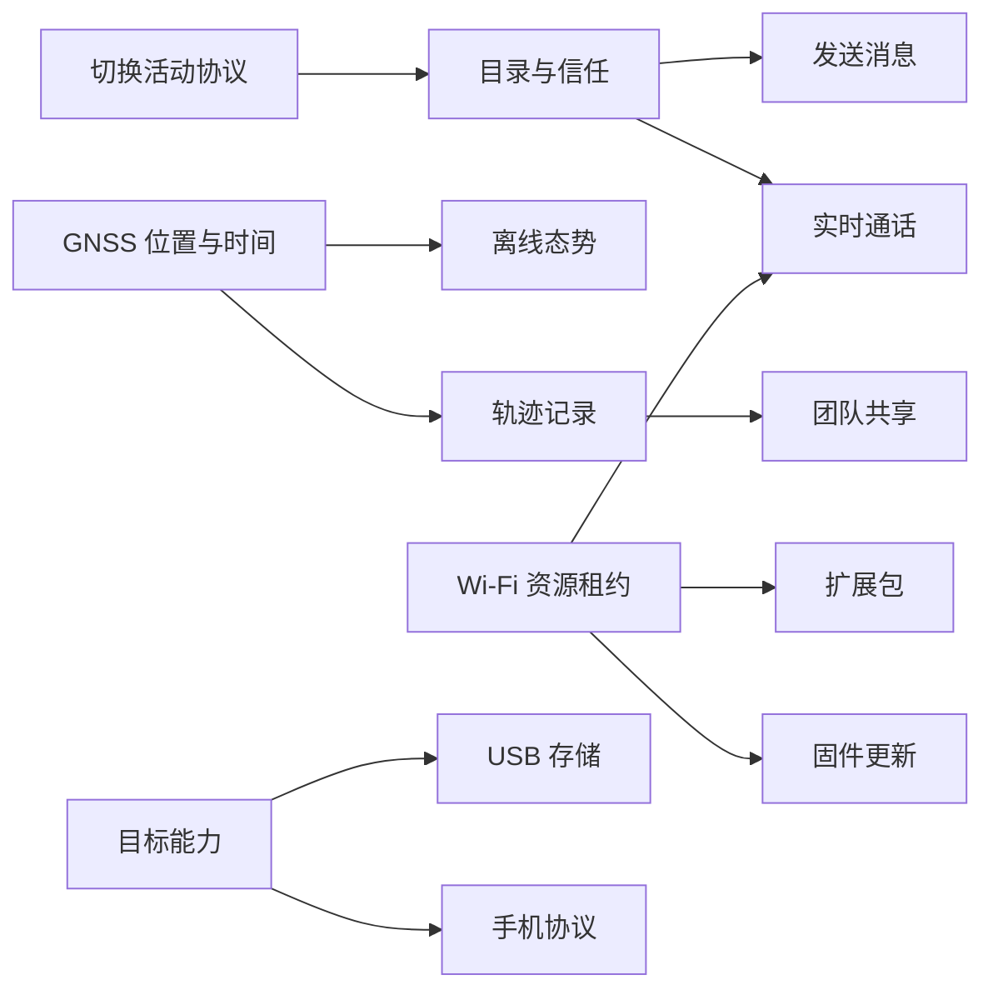

# Trail Mate Design Explorer：用户目标与系统行为地图

<!-- praxis:use-case-diagrams-maps:start -->

状态：**confirmed document / mixed design status**

依据：源码、GitNexus 执行流、测试契约与现有产品意图

评审日期：2026-07-23

作者：Codex 直接编写；未调用 Praxis Agent

## 设计范围

Design Explorer 按“用户要完成什么、系统承诺什么、失败后如何恢复”组织内容，不按页面、按钮或 C++ 函数计数。当前地图覆盖六个业务上下文、21 个用户目标；`confirmed` 表示行为已有源码 owner，`candidate` 表示用户目标存在但关键模型或规则仍未闭合。

## 覆盖总览

| 业务上下文 | 用例数 | 设计判断 |
| --- | ---: | --- |
| 网络、身份与目录 | 3 | 协议切换、联系人目录和 Wi-Fi 接入都有实现；IdentityLink 仍缺失 |
| 通信、媒体与投递 | 5 | 消息、实时通话、Walkie、SSTV 均有独立行为与失败路径 |
| 地图、定位与现场感知 | 5 | 地图、GNSS、轨迹、频谱已实现；路线导航规则仍在 UI runtime |
| 团队协作 | 2 | 配对、密钥和共享消息存在；成员生命周期模型仍不完整 |
| 设备维护与数据所有权 | 4 | Package、Firmware、Backup、USB 都有资源/提交边界 |
| 外部应用与主机集成 | 2 | HostLink 与 Phone BLE 是两套不同集成契约 |

## 用例图索引

| ID | 用例图文档 | 语义 HTML | 下钻 UML | 业务边界路径 | 状态 | 置信度 | 当前版本 | 最近变更 |
| --- | --- | --- | ---: | --- | --- | --- | --- | --- |
| use-case:configure-radio-parameters | [切换活动协议并提交无线配置](use-case-diagrams/configure-radio-parameters.md) | [HTML](use-case-diagrams/configure-radio-parameters.html) | 2 | Trail Mate / 网络、身份与目录 | confirmed | high | source-audit | 2026-07-23 |
| use-case:manage-peer-directory | [管理联系人、附近节点与本地信任](use-case-diagrams/manage-peer-directory.md) | [HTML](use-case-diagrams/manage-peer-directory.html) | 3 | Trail Mate / 网络、身份与目录 | confirmed | high | source-audit | 2026-07-23 |
| use-case:connect-wifi-services | [连接 Wi-Fi 并仲裁联网能力](use-case-diagrams/connect-wifi-services.md) | [HTML](use-case-diagrams/connect-wifi-services.html) | 2 | Trail Mate / 网络、身份与目录 | confirmed | high | source-audit | 2026-07-23 |
| use-case:send-text-message | [发送去中心化消息并跟踪投递](use-case-diagrams/send-text-message.md) | [HTML](use-case-diagrams/send-text-message.html) | 3 | Trail Mate / 通信、媒体与投递 | confirmed | high | source-audit | 2026-07-23 |
| use-case:receive-text-message | [接收、验证并提交去中心化消息](use-case-diagrams/receive-text-message.md) | [HTML](use-case-diagrams/receive-text-message.html) | 4 | Trail Mate / 通信、媒体与投递 | confirmed | high | source-audit | 2026-07-23 |
| use-case:realtime-audio-call | [发起或响应 Reticulum 实时通话](use-case-diagrams/realtime-audio-call.md) | [HTML](use-case-diagrams/realtime-audio-call.html) | 3 | Trail Mate / 通信、媒体与投递 | confirmed | high | source-audit | 2026-07-23 |
| use-case:monitor-walkie-channel | [监听模拟对讲频道](use-case-diagrams/monitor-walkie-channel.md) | [HTML](use-case-diagrams/monitor-walkie-channel.html) | 2 | Trail Mate / 通信、媒体与投递 | confirmed | high | source-audit | 2026-07-23 |
| use-case:receive-sstv-image | [接收并保存 SSTV 图像](use-case-diagrams/receive-sstv-image.md) | [HTML](use-case-diagrams/receive-sstv-image.html) | 2 | Trail Mate / 通信、媒体与投递 | confirmed | high | source-audit | 2026-07-23 |
| use-case:view-map-navigate | [使用离线地图建立现场态势](use-case-diagrams/view-map-navigate.md) | [HTML](use-case-diagrams/view-map-navigate.html) | 2 | Trail Mate / 地图、定位与现场感知 | confirmed | high | source-audit | 2026-07-23 |
| use-case:inspect-gnss-health | [检查 GNSS 卫星、定位与时间权威](use-case-diagrams/inspect-gnss-health.md) | [HTML](use-case-diagrams/inspect-gnss-health.html) | 2 | Trail Mate / 地图、定位与现场感知 | confirmed | high | source-audit | 2026-07-23 |
| use-case:record-follow-route | [记录并可靠保存现场轨迹](use-case-diagrams/record-follow-route.md) | [HTML](use-case-diagrams/record-follow-route.html) | 3 | Trail Mate / 地图、定位与现场感知 | confirmed | high | source-audit | 2026-07-23 |
| use-case:follow-route | [加载路线并判断偏航与恢复](use-case-diagrams/follow-route.md) | [HTML](use-case-diagrams/follow-route.html) | 2 | Trail Mate / 地图、定位与现场感知 | candidate | high | source-audit | 2026-07-23 |
| use-case:survey-radio-spectrum | [扫描频段并选择低干扰频点](use-case-diagrams/survey-radio-spectrum.md) | [HTML](use-case-diagrams/survey-radio-spectrum.html) | 2 | Trail Mate / 地图、定位与现场感知 | confirmed | high | source-audit | 2026-07-23 |
| use-case:manage-team-sharing | [建立团队凭据与成员关系](use-case-diagrams/manage-team-sharing.md) | [HTML](use-case-diagrams/manage-team-sharing.html) | 3 | Trail Mate / 团队协作 | candidate | high | source-audit | 2026-07-23 |
| use-case:share-team-situation | [共享团队位置、航点、轨迹与聊天](use-case-diagrams/share-team-situation.md) | [HTML](use-case-diagrams/share-team-situation.html) | 2 | Trail Mate / 团队协作 | confirmed | high | source-audit | 2026-07-23 |
| use-case:manage-extension-packages | [安装、更新或卸载扩展包](use-case-diagrams/manage-extension-packages.md) | [HTML](use-case-diagrams/manage-extension-packages.html) | 3 | Trail Mate / 设备维护与数据所有权 | confirmed | high | source-audit | 2026-07-23 |
| use-case:update-device-firmware | [检查并安装设备固件更新](use-case-diagrams/update-device-firmware.md) | [HTML](use-case-diagrams/update-device-firmware.html) | 3 | Trail Mate / 设备维护与数据所有权 | confirmed | high | source-audit | 2026-07-23 |
| use-case:backup-restore-settings | [备份、恢复或重置设备设置](use-case-diagrams/backup-restore-settings.md) | [HTML](use-case-diagrams/backup-restore-settings.html) | 2 | Trail Mate / 设备维护与数据所有权 | confirmed | high | source-audit | 2026-07-23 |
| use-case:expose-usb-storage | [把设备存储安全交给 USB 主机](use-case-diagrams/expose-usb-storage.md) | [HTML](use-case-diagrams/expose-usb-storage.html) | 3 | Trail Mate / 设备维护与数据所有权 | confirmed | high | source-audit | 2026-07-23 |
| use-case:hostlink-data-exchange | [通过 HostLink 与外部主机交换应用数据](use-case-diagrams/hostlink-data-exchange.md) | [HTML](use-case-diagrams/hostlink-data-exchange.html) | 3 | Trail Mate / 外部应用与主机集成 | confirmed | high | source-audit | 2026-07-23 |
| use-case:sync-phone-application | [向手机应用提供协议兼容服务](use-case-diagrams/sync-phone-application.md) | [HTML](use-case-diagrams/sync-phone-application.html) | 3 | Trail Mate / 外部应用与主机集成 | confirmed | high | source-audit | 2026-07-23 |

## 跨用例设计主线

## 不升级为独立用例的内容

- 菜单打开、页面刷新、返回键和纯展示 widget 是交互细节，不是用户目标。
- 单个设置项不是独立用例；它属于协议配置、联网、维护或设备偏好的一部分。
- 关机确认是安全交互，但当前业务复杂度不足以占据单独 Design Explorer 顶层条目。
- 测试 helper、生成代码、字体、构建环境和缓存不属于产品设计。

## 仍需在 Review Queue 关闭的设计问题

- `follow-route`：偏航双阈值已实现，但 `NavigationSession / RouteProgress / DeviationPolicy` 仍由 UI runtime 隐式承担。
- `manage-team-sharing`：配对、密钥、kick 和 leader transfer 存在，但稳定 `TeamMember` 生命周期与 IdentityLink 尚未形成。
- Call、Package、Firmware、Wi-Fi Lease 虽然有完整用户行为，本轮只确认其设计用例，不据此宣称它们已经形成独立领域模型。

<!-- praxis:use-case-diagrams-maps:end -->
