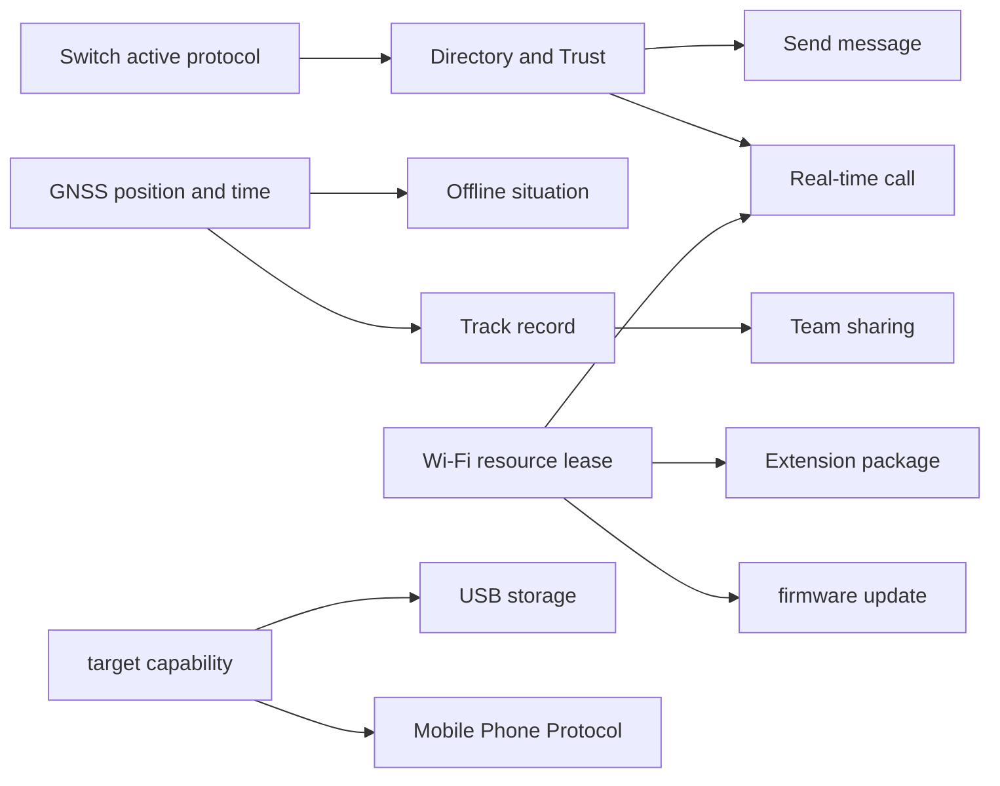

# Trail Mate Design Explorer: User goals and system behavior map

<!-- praxis:use-case-diagrams-maps:start -->

Status: **confirmed document / mixed design status**

Based on: source code, GitNexus execution flow, test contract and existing product intent

Review date: 2026-07-23

Author: Codex written directly; Praxis is not called Agent

## Design Scope

Design Explorer organizes content by "what the user wants to accomplish, what the system promises, and how to recover after failure" and does not count by pages, buttons, or C++ functions. The current map covers six business contexts and 21 user goals; `confirmed` means that the behavior has a source code owner, and `candidate` means that the user goal exists but the key model or rule has not yet been closed.

## Coverage Overview

| Business context | Number of use cases | Design judgment |
| --- | ---: | --- |
| Network, identity and directory | 3 | Protocol switching, contact directory and Wi-Fi access are implemented; IdentityLink is still missing |
| Communications, media and delivery | 5 | Messages, real-time calls, Walkie, and SSTV all have independent behaviors and failure paths |
| Maps, positioning and on-site awareness | 5 | Maps, GNSS, trajectories, and spectrum have been implemented; route navigation rules are still in the UI runtime |
| Team collaboration | 2 | Pairing, keys and shared messages exist; member lifecycle model is still incomplete |
| Device maintenance and data ownership | 4 | Package, Firmware, SD configuration lifecycle, and USB all have resource/commit boundaries |
| External application and host integration | 2 | HostLink and Phone BLE are two different sets of integration contracts |

## Use Case Diagram Index

| ID | Use Case Diagram Document | Semantic HTML | Drilldown UML | Business Boundary Path | Status | Confidence | Current Version | Recent Changes |
| --- | --- | --- | ---: | --- | --- | --- | --- | --- |
| [HTML](use-case-diagrams/configure-radio-parameters.html) | 2 | Trail Mate / Network, Identity and Directory | confirmed | high | source-audit | 2026-07-23 |
| use-case:manage-peer-directory | [Manage Contacts, Nearby Peers and Local Trusts](use-case-diagrams/manage-peer-directory.md) | [HTML](use-case-diagrams/manage-peer-directory.html) | 3 | Trail Mate / Network, Identity and Directory | confirmed | high | source-audit | 2026-07-23 |
Use-case:connect-wifi-services
| use-case:send-text-message | [Send decentralized messages and track delivery](use-case-diagrams/send-text-message.md) | [HTML](use-case-diagrams/send-text-message.html) | 3 | Trail Mate / Communications, Media & Delivery | confirmed | high | source-audit | 2026-07-23 |
| use-case:receive-text-message | [Receive, verify and submit decentralized messages](use-case-diagrams/receive-text-message.md) | [HTML](use-case-diagrams/receive-text-message.html) | 4 | Trail Mate / Communications, Media & Delivery | confirmed | high | source-audit | 2026-07-23 |
| use-case:realtime-audio-call | [Initiate or respond to a Reticulum real-time call](use-case-diagrams/realtime-audio-call.md) | [HTML](use-case-diagrams/realtime-audio-call.html) | 3 | Trail Mate / Communications, Media & Delivery | confirmed | high | source-audit | 2026-07-23 |
| use-case:monitor-walkie-channel | [Monitor analog intercom channel](use-case-diagrams/monitor-walkie-channel.md) | [HTML](use-case-diagrams/monitor-walkie-channel.html) | 2 | Trail Mate / Communications, Media & Delivery | confirmed | high | source-audit | 2026-07-23 |
| use-case:receive-sstv-image | [Receive and save SSTV images](use-case-diagrams/receive-sstv-image.md) | [HTML](use-case-diagrams/receive-sstv-image.html) | 2 | Trail Mate / Communications, Media & Delivery | confirmed | high | source-audit | 2026-07-23 |
| use-case:view-map-navigate | [Use offline maps to establish on-site situation](use-case-diagrams/view-map-navigate.md) | [HTML](use-case-diagrams/view-map-navigate.html) | 2 | Trail Mate / Map, positioning and on-site awareness | confirmed | high | source-audit | 2026-07-23 |
| use-case:inspect-gnss-health | [Inspect GNSS satellites, positioning and time authority](use-case-diagrams/inspect-gnss-health.md) | [HTML](use-case-diagrams/inspect-gnss-health.html) | 2 | Trail Mate / Maps, positioning and scene awareness | confirmed | high | source-audit | 2026-07-23 |
| use-case:record-follow-route | [Record and reliably save on-site trajectories](use-case-diagrams/record-follow-route.md) | [HTML](use-case-diagrams/record-follow-route.html) | 3 | Trail Mate / Maps, positioning and on-site awareness | confirmed | high | source-audit | 2026-07-23 |
| use-case:follow-route | [Load route and determine yaw and recovery](use-case-diagrams/follow-route.md) | [HTML](use-case-diagrams/follow-route.html) | 2 | Trail Mate / Maps, positioning and scene awareness | candidate | high | source-audit | |
| use-case:survey-radio-spectrum | [Detect protocol air interface parameters and confirm availability](use-case-diagrams/survey-radio-spectrum.md) | [HTML](use-case-diagrams/survey-radio-spectrum.html) | 2 | Trail Mate / Communications, Media and Delivery | confirmed | high | source-audit | 2026-08-10 |
| use-case:manage-team-sharing | [Establish team credentials and membership](use-case-diagrams/manage-team-sharing.md) | [HTML](use-case-diagrams/manage-team-sharing.html) | 3 | Trail Mate / Team collaboration | candidate | high | source-audit | 2026-07-23 |
| use-case:share-team-situation | [Share team location, waypoints, tracks and chat](use-case-diagrams/share-team-situation.md) | [HTML](use-case-diagrams/share-team-situation.html) | 2 | Trail Mate / Team collaboration | confirmed | high | source-audit | 2026-07-23 |
| use-case:manage-extension-packages | [Install, update, or uninstall extension packages](use-case-diagrams/manage-extension-packages.md) | [HTML](use-case-diagrams/manage-extension-packages.html) | 3 | Trail Mate / Device Maintenance and Data Ownership | confirmed | high | source-audit | 2026-07-23 |
| use-case:update-device-firmware | [Check and install device firmware updates](use-case-diagrams/update-device-firmware.md) | [HTML](use-case-diagrams/update-device-firmware.html) | 3 | Trail Mate / Device Maintenance and Data Ownership | confirmed | high | source-audit | 2026-07-23 |
| use-case:backup-restore-settings | [Maintain or reset the SD working configuration](use-case-diagrams/backup-restore-settings.md) | Rendered copy retired | 2 | Trail Mate / Device maintenance and data ownership | implemented | high | source-audit | 2026-08-20 |
| use-case:expose-usb-storage | [Leave device storage security to the USB host](use-case-diagrams/expose-usb-storage.md) | [HTML](use-case-diagrams/expose-usb-storage.html) | 3 | Trail Mate / Device maintenance and data ownership | confirmed | high | source-audit | 2026-07-23 |
| use-case:hostlink-data-exchange | [Exchange application data with external hosts through HostLink](use-case-diagrams/hostlink-data-exchange.md) | [HTML](use-case-diagrams/hostlink-data-exchange.html) | 3 | Trail Mate / External application and host integration | confirmed | high | source-audit | 2026-07-23 |
| use-case:sync-phone-application | [Provide protocol compatibility services to mobile applications](use-case-diagrams/sync-phone-application.md) | [HTML](use-case-diagrams/sync-phone-application.html) | 3 | Trail Mate / External application and host integration | confirmed | high | source-audit | 2026-07-23 |

## Cross-use case design mainline

## Content that is not upgraded to independent use cases

- Menu opening, page refresh, return key and pure display widgets are interaction details, not user goals.
- An individual setting item is not a stand-alone use case; it is part of protocol configuration, networking, maintenance, or device preference.
- Shutdown confirmation is a safe interaction, but the current business complexity is not enough to occupy a separate top-level entry in Design Explorer.
- Test helpers, generated code, fonts, build environments and caching are not part of the product design.

## Design issues that still need to be closed in Review Queue

- `follow-route`: Yaw dual thresholds have been implemented, but `NavigationSession / RouteProgress / DeviationPolicy` is still implicitly borne by the UI runtime.
 - `manage-team-sharing`: pairing, key, kick and leader transfer exist, but stable `TeamMember` lifecycle and IdentityLink are not yet formed.
- Although Call, Package, Firmware, and Wi-Fi Lease have complete user behaviors, this round only confirms their design use cases, and does not claim that they have formed independent domain models based on this.

<!-- praxis:use-case-diagrams-maps:end -->
