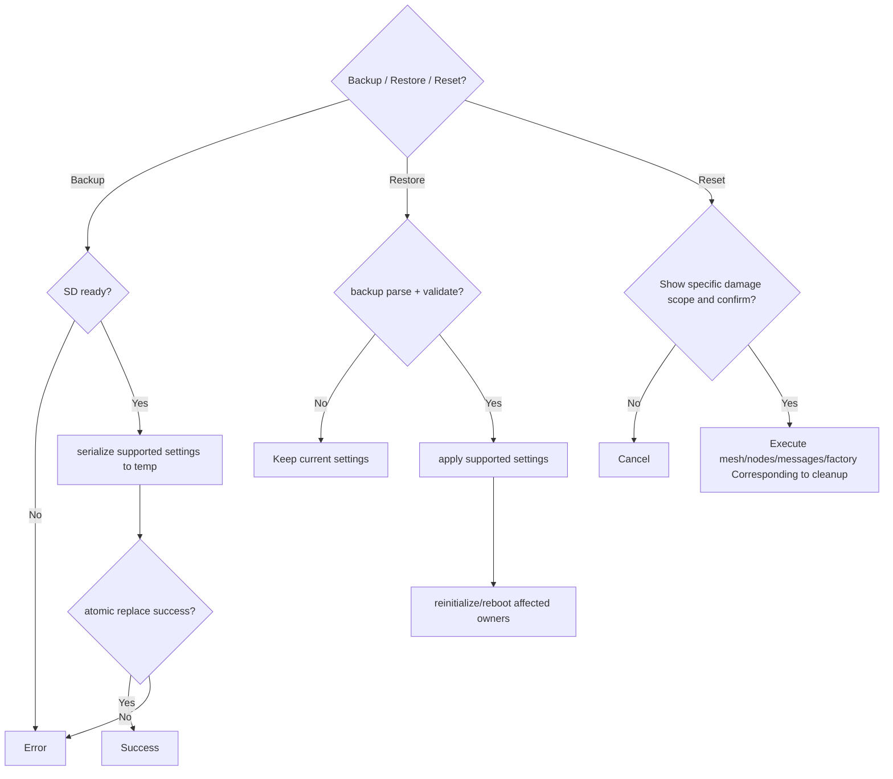

# Activity: Backup, restore and reset

## Questions answered by this picture

How do backup, recovery and reset of four different damage scopes share configuration boundaries while avoiding bad backups from overwriting current settings or vague confirmations leading to excessive deletion.

## Backup

Backup only serializes explicitly supported and migrable fields, writes them to a temporary file and replaces them atomically after a successful flush/close. The inclusion of sensitive keys must be determined by the format version and user intent. Old backups remain available until new files are committed.

## Recovery

 Recovery first parses the version, verification structure, target compatibility and each field constraint, and then constructs a complete candidate configuration. Any validation failures retain the current settings. Reinitialize in the order of affected owners after Apply; changes that require reboot are not pretended to have taken effect immediately.

## Reset range

| Type | Only deletion allowed |
| --- | --- |
| Mesh reset | Clear mesh data such as protocol configuration, identity and channel |
| Nodes reset | peer/node directory and local relationship |
| Messages reset | Session, message and delivery ledger |
| Factory reset | All user configuration and data defined in the document |

The confirmation interface must display the specific range and cannot be replaced by the same "Are you sure?" Cancellation does not have any persistence side effects.

## Failure and recovery

SD unavailability, temporary write failures, atomic replacement failures, and reinitialize failures are reported separately. If the recovery spans multiple owners, complete candidates must be verified in advance and the stages must be recorded; unexplained mixed configurations cannot be left behind after a failure occurs midway.

## Testing

 Covers format upgrades, unknown fields, damaged backups, atomic replacement failures, sensitive field policies, negative deletion assertions for each reset, and configurations that require restarting.
