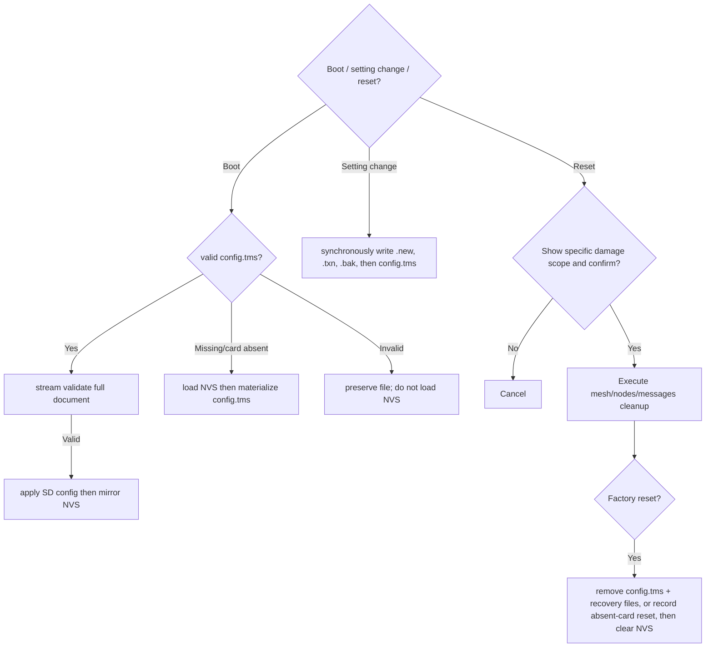

# Activity: SD working configuration and reset

## Questions answered by this picture

How does one SD working document preserve complete settings while avoiding multiple
configuration schemas, unsafe timer-context SD writes, and reset actions that are
silently reversed by an old SD file.

## SD authority

The SD document is validated before any setting owner changes. It is then applied as a
complete candidate, mirrored to NVS, and stored through a recoverable transaction.
`TMSET6` is intentionally strict: unknown keys and malformed known keys are rejected,
and a present invalid document is never replaced by the existing NVS configuration.

## Reset range

| Type | Only deletion allowed |
| --- | --- |
| Mesh reset | Clear mesh data such as protocol configuration, identity and channel |
| Nodes reset | peer/node directory and local relationship |
| Messages reset | Session, message and delivery ledger |
| Factory reset | Removes the SD working authority and all user configuration/data defined by the reset contract |

The confirmation interface must display the specific range and cannot be replaced by the same "Are you sure?" Cancellation does not have any persistence side effects.

## Failure and recovery

SD unavailability, temporary write failures, and replacement failures are reported
separately. A transaction digest identifies a validated `.new` candidate; if the primary
is absent after interruption, boot promotes that candidate or restores the validated
`.bak` generation. A valid primary always remains the authority.

## Testing

Covers schema upgrades, unknown fields, malformed documents, atomic replacement
failures, all ten Wi-Fi profile records, sensitive field handling, and negative
deletion assertions for each reset scope.
