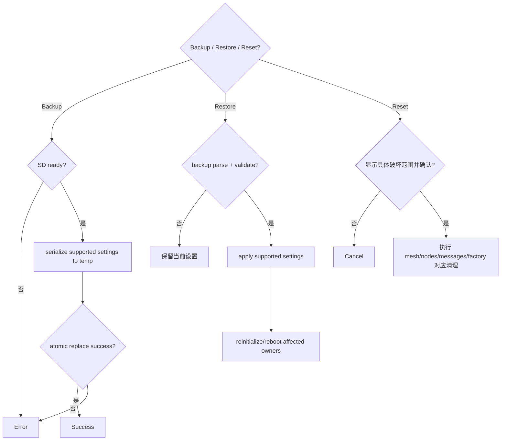

# Activity：备份、恢复与重置

## 本图回答的问题

备份、恢复和四种不同破坏范围的 reset 如何共享配置边界，同时避免坏备份覆盖当前设置或含糊确认导致过度删除。

## 备份

备份只序列化明确支持且可迁移的字段，写入临时文件并在 flush/close 成功后原子替换。敏感密钥是否包含必须由格式版本与用户意图决定。旧备份在新文件提交前保持可用。

## 恢复

恢复先解析版本、校验结构、目标兼容性和每个字段约束，再构造完整候选配置。任何验证失败都保持当前设置。Apply 后按受影响 owner 顺序重新初始化；需要 reboot 的变更不伪装成已立即生效。

## Reset 范围

| 类型 | 只允许删除 |
| --- | --- |
| Mesh reset | 协议配置、身份和频道等明确 mesh 数据 |
| Nodes reset | peer/node 目录及本地关系 |
| Messages reset | 会话、消息和投递账本 |
| Factory reset | 文档定义的全部用户配置和数据 |

确认界面必须显示具体范围，不能用同一个“Are you sure?”代替。取消不产生任何持久化副作用。

## 失败与恢复

SD 不可用、临时写失败、原子替换失败和 reinitialize 失败分别报告。恢复若跨多个 owner，需预先验证完整候选并记录阶段；不能在中途失败后留下无法解释的混合配置。

## 测试

覆盖格式升级、未知字段、损坏备份、原子替换失败、敏感字段策略、每种 reset 的负向删除断言及需要重启的配置。
