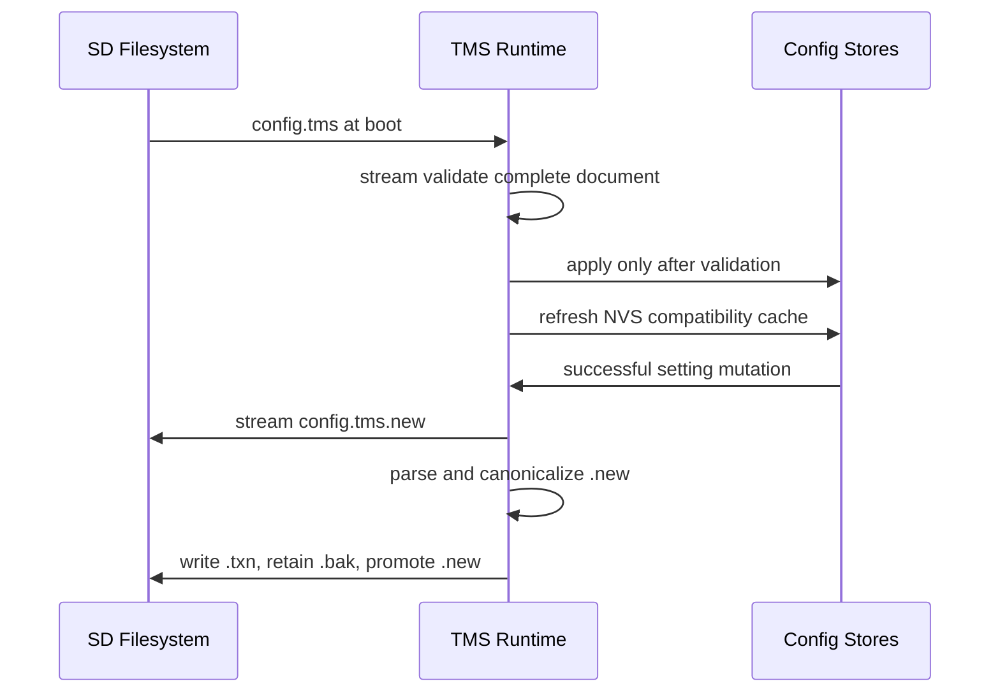

# Sequence: SD working configuration

## Scenarios and responsibilities

The TMS runtime defines one versioned grammar and atomic file replacement. Individual
configuration owners continue to own their runtime application, but cannot drift from
the SD projection because their successful NVS mutations synchronously commit through
the same working-configuration boundary. A batch holds no values and delays only until
its current scope exits.

## Boot and save order

Boot validates before any application. On a normal save, a `.new` document is validated
before the current primary is moved aside; `.txn` records only the tiny digest needed to
recover a missing primary. There is no deferred foreground service and no NVS metadata
that can outrank a valid SD document.

## Consistency and sensitive data

The document includes all supported sensitive configuration because it is the working
authority. It is plaintext and must never be logged or shared unredacted.

## Tests

Cover temp write/close/replace failure, schema v2/v3-to-v4 migration, strict unknown-key
rejection, cross-owner validation, all ten Wi-Fi profiles, and factory-reset SD removal.
