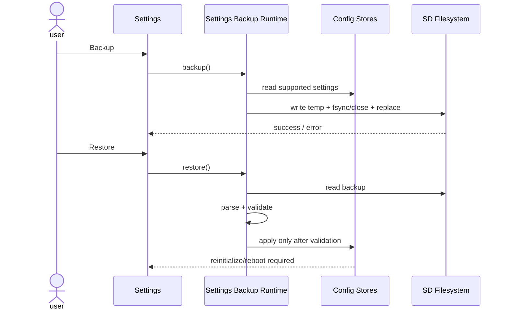

# Sequence:Settings Backup Store

## Scenarios and responsibilities

Settings collects user commands; Backup Runtime defines versioned formats and transactions; Config Stores provides supported fields and atomic applications; SD Filesystem is only responsible for file semantics. The UI does not traverse or overwrite individual configuration files directly.

## Backup sequence

Read supported settings to form an immutable snapshot, write temporary files, flush/fsync/close and then atomic replace. Any stage failure retains old backups. The UI will only display the new backup time after receiving replace successfully.

## Restore order

First complete read, parse, version migration and field verification, and then call Config apply. No owner must be written if validation fails. Apply returns the effective policy for each owner: immediate reinitialize, next startup, or must reboot.

## Consistency and sensitive data

Apply across multiple Config Stores requires aggregation of validation and controlled submission; otherwise, a mixed version will be formed if it fails midway. The backup format clearly marks whether sensitive keys are included and avoids outputting values ​​in the error log.

## Tests

Cover temp write/close/replace failure, old version migration, unknown fields, cross-Store verification failure, partial apply and reboot-required projections.
