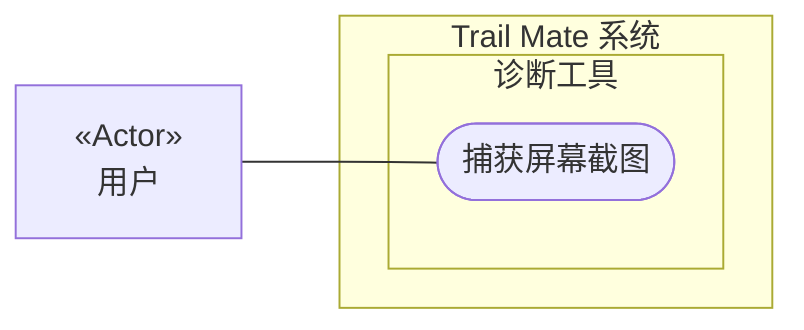

# 用例图：捕获屏幕截图

<!-- praxis:use-case-diagram:start -->

## 元数据

项目版本：0.1.30-alpha
设计文档版本：0.1.30-alpha
Git 分支：main
Git 提交：34aad0bffa2f6450192f655f248a94b6c3cbd767
Git 工作区状态：dirty
Agent 版本决策：none - 本次渲染没有单独的 agent 版本决策
更新于：2026-06-25T14:17:55.307Z
来源：Agent 候选分析
所属地图：../use-case-diagrams-maps.md
语义 HTML：capture-screenshot.html

## 身份信息

- ID：use-case:capture-screenshot
- 业务边界路径：Trail Mate 系统 / 诊断工具
- 当前边界类型：业务模块
- 当前边界职责：提供系统诊断和现场数据采集工具
- 状态：candidate
- 置信度：medium
- Markdown 路径：docs/design/use-case-diagrams/capture-screenshot.md
- HTML 路径：docs/design/use-case-diagrams/capture-screenshot.html
- 触发条件：用户从诊断菜单启动截屏工具

## 故事摘要

用户运行截屏工具，自动操作设备界面并捕获当前屏幕内容，保存为 PNG 文件

## 参与者

- 用户（个人）

## 外部系统

- 无

## UML 下钻地图

- Use Case Diagram：[捕获屏幕截图](capture-screenshot.html)
  - Activity Diagram：[业务流程：捕获屏幕截图](capture-screenshot/activity.html)
  - Sequence Diagram：[对象交互：捕获屏幕截图](capture-screenshot/sequences/sequence-capture-screenshot-sequence.html)

## Mermaid 用例图



## 设计指标索引

此章节是 Design Explorer 可解析的指标索引。每个数字都必须能回溯到这里的具体条目，避免 UI 只展示不可解释的计数。

| 指标 | 数量 | 内容边界 |
| --- | ---: | --- |
| 节点 | 4 | 参与者、外部系统、上下文和当前用例。 |
| 关系 | 5 | 当前用例与上下文、参与者、外部系统或其他用例之间的关系。 |
| 证据 | 2 | 支撑当前候选用例的文件、代码证据、规范或推断证据。 |
| 待裁决 | 0 | 仍需产品或业务负责人裁决的外部问题。 |

### 节点

- Trail Mate 系统（业务边界：系统边界） - 管理整个应用的用户目标和业务能力
- 诊断工具（业务边界：业务模块） - 提供系统诊断和现场数据采集工具
- 捕获屏幕截图（用例） - 用户运行截屏工具，自动操作设备界面并捕获当前屏幕内容，保存为 PNG 文件
- 用户（参与者） - 使用 Trail Mate 设备的最终用户，可以查看状态、收发消息、配置设备、使用诊断工具

### 关系

- Trail Mate 系统 包含业务边界「诊断工具」（包含关系）
- 诊断工具 包含 Use Case「捕获屏幕截图」（包含关系）
- 用户 作为主要参与者参与「捕获屏幕截图」（参与关系） - 使用 Trail Mate 设备的最终用户，可以查看状态、收发消息、配置设备、使用诊断工具
- 用户 -> 捕获屏幕截图（参与关系） - 用户运行截屏工具
- 用户 -> 捕获屏幕截图（参与关系） - 用户捕获屏幕截图

### 证据

- 证据 1 · 本地仓库扫描 · apps/linux_cardputer_zero/tools/cardputer_zero_screenshot_capture.cpp · 1-1（FACT:strong） - 截屏工具主函数和辅助函数

  ```text
  main, press, press_action, press_char, tick_for, render_now, capture_current, save_png 等
  ```
- 证据 2 · 本地仓库扫描 · apps/linux_cardputer_zero/tools/cardputer_zero_screenshot_capture.cpp · 1-1（FACT:strong） - 截屏工具实现

  ```text
  screenshot_capture.cpp
  ```

### 待裁决

- 无

## 主成功路径

1. 用户启动截屏工具并指定操作脚本或参数
2. 工具模拟按键导航到目标界面
3. 工具触发屏幕捕获并保存为 PNG 文件
4. 用户启动截屏工具
5. 工具模拟按键操作以切换界面
6. 工具捕获当前屏幕内容并保存为文件

## 备选路径

1. 无

## 失败路径

1. 设备未就绪或模拟按键失败，工具报错退出

## 证据

| 来源 | 路径 | 行号 | 强度 | 摘要 |
| --- | --- | --- | --- | --- |
| 本地仓库扫描 | apps/linux_cardputer_zero/tools/cardputer_zero_screenshot_capture.cpp | 1-1 | strong | 截屏工具主函数和辅助函数 |
| 本地仓库扫描 | apps/linux_cardputer_zero/tools/cardputer_zero_screenshot_capture.cpp | 1-1 | strong | 截屏工具实现 |

## 变更记录

### 0.1.30-alpha - 2026-06-25T14:17:55.307Z

变更类型：DISCOVERY
版本决策：none - 本次渲染没有单独的 agent 版本决策


Git 分支：main
Git 提交：34aad0bffa2f6450192f655f248a94b6c3cbd767
Git 工作区状态：dirty

摘要：
- 恢复或更新候选用例图「捕获屏幕截图」。

<!-- praxis:use-case-diagram:end -->
