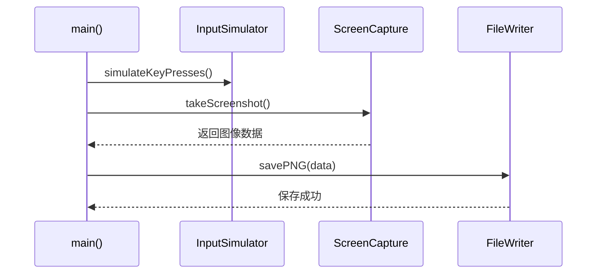

# Sequence Diagram：对象交互：捕获屏幕截图

<!-- praxis:use-case-diagram:start -->

## 元数据

项目版本：0.1.30-alpha
设计文档版本：0.1.30-alpha
Git 分支：main
Git 提交：34aad0bffa2f6450192f655f248a94b6c3cbd767
Git 工作区状态：dirty
Agent 版本决策：none - 本次渲染没有单独的 agent 版本决策
更新于：2026-06-25T14:17:55.307Z
来源：Agent 候选分析
父级 Use Case：use-case:capture-screenshot
业务边界路径：Trail Mate 系统 / 诊断工具
父级文档：docs/design/use-case-diagrams/capture-screenshot.md
Markdown 路径：docs/design/use-case-diagrams/capture-screenshot/sequences/sequence-capture-screenshot-sequence.md
HTML 路径：docs/design/use-case-diagrams/capture-screenshot/sequences/sequence-capture-screenshot-sequence.html

## 交互场景

获取当前屏幕内容作为图像文件

## 参与者 / 生命线

- participant main as main()
- participant input as InputSimulator
- participant screen as ScreenCapture
- participant file as FileWriter

## 消息时序

- main->>input: simulateKeyPresses()
- main->>screen: takeScreenshot()
- screen-->>main: 返回图像数据
- main->>file: savePNG(data)
- file-->>main: 保存成功

## 同步 / 异步 / 回调

- screen-->>main: 返回图像数据
- file-->>main: 保存成功

## 返回 / 异常 / 补偿

- screen-->>main: 返回图像数据
- file-->>main: 保存成功

## 事务 / 幂等 / 重试边界

工具是单线程顺序执行流程

- 无

## Sequence UML 读图说明

main 依次调用模拟按键和截图函数

## 实现范围锚点

- 模块：apps/linux_cardputer_zero
- 关键文件：apps/linux_cardputer_zero/tools/cardputer_zero_screenshot_capture.cpp
- 代码锚点：apps/linux_cardputer_zero/tools/cardputer_zero_screenshot_capture.cpp#L1
- 不覆盖代码：非当前场景的全部调用链
- 不覆盖代码：未被证据支持的异步/补偿路径

## 不覆盖场景

- 错误处理

## Mermaid 图

## 证据上下文

| 来源 | 路径 | 行号 | 强度 | 摘要 |
| --- | --- | --- | --- | --- |
| 本地仓库扫描 | apps/linux_cardputer_zero/tools/cardputer_zero_screenshot_capture.cpp | 1-1 | strong | 截屏工具主函数和辅助函数 |
| 本地仓库扫描 | apps/linux_cardputer_zero/tools/cardputer_zero_screenshot_capture.cpp | 1-1 | strong | 截屏工具实现 |

## 变更记录

### 0.1.30-alpha - 2026-06-25T14:17:55.307Z

变更类型：DISCOVERY
版本决策：none - 本次渲染没有单独的 agent 版本决策

Git 分支：main
Git 提交：34aad0bffa2f6450192f655f248a94b6c3cbd767
Git 工作区状态：dirty

摘要：
- 恢复或更新「捕获屏幕截图」的 Sequence Diagram。

<!-- praxis:use-case-diagram:end -->
