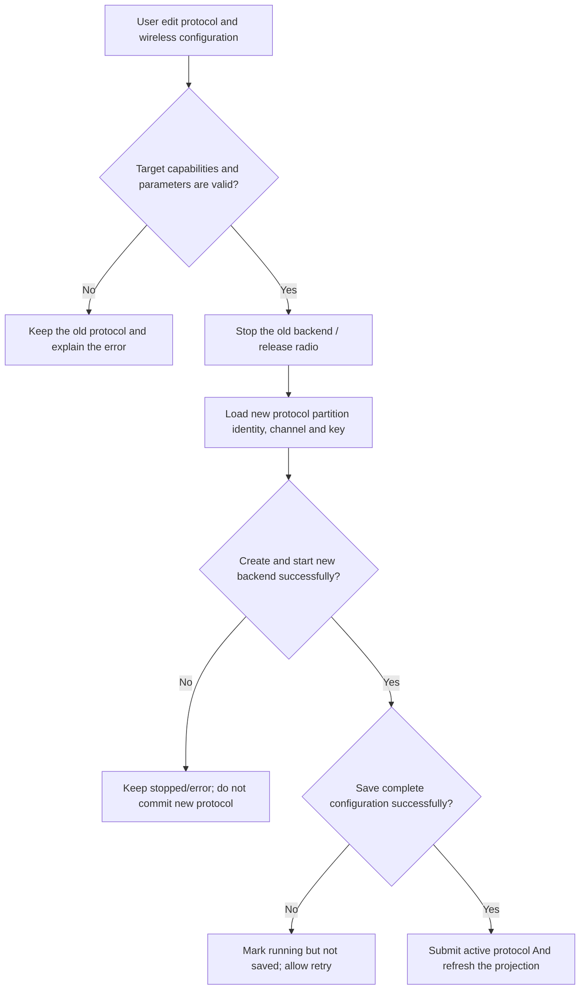

# Activity Diagram: Protocol switching and submission

## Questions answered by this picture

When the user changes the protocol or wireless parameters, how can the system avoid the semi-commit state of "the interface display has been switched, but the radio is still running the old backend". This activity starts with the complete candidate configuration entering verification and ends with clear results in both running and persistent states.

## Input, output and responsibility boundaries

| Project | Design implications |
| --- | --- |
| Input | Target protocol, frequency/bandwidth/spread spectrum parameters, and identity, channel and key in the protocol partition |
| Verify owner | Configure application layer; check target hardware capabilities and protocol parameter constraints at the same time |
| Running state owner | `MeshAdapterRouter` and radio backend |
| Persistence owner | `AppConfig / ConfigFacade` and protocol partition storage |
| Successful output | The new backend has been started, the complete configuration has been saved, and the active protocol projection has been updated |

## Branching rules

1. The old backend cannot be stopped when the parameters or target capabilities are invalid; rejection must carry an error that can be located in the field.
2. After the old backend stops, the new backend cannot write back the active protocol if it fails to start. The system goes into an explicit `stopped/error` instead of pretending that the old protocol is still available.
3. The new backend has been started but failed to save, which belongs to "success in running state and failure in persistence". The interface must show that it is not saved and allow retries as is, and cannot silently declare completion.
4. Protocol switching loads the identity, channel and peer partition of the target protocol; the same display name does not constitute the basis for cross-protocol merging.

## Submission and compensation

There are two different submission points here: radio startup is a running submission, and configuration atomic saving is a persistent submission. The stable active protocol projection is refreshed only if both succeed. Failure to save after startup does not automatically rollback the radio, since rollbacks can also fail; thus preserving the fact in a visible `running-unsaved` state and preventing users from mistakenly thinking that the current configuration will still be used after restarting.

## Source code evidence and testing concerns

- Backend creation and installation are located at the collaboration boundary of `IdfAppFacadeRuntime::createMeshBackend`, `create_mesh_backend` and `MeshAdapterRouter`.
- Each failed exit verifies old/new backend ownership and radio release status.
- Tests cover at least: validation failure, stop succeeds but start fails, start succeeds but persist fails, and idempotent retries of the same configuration.
