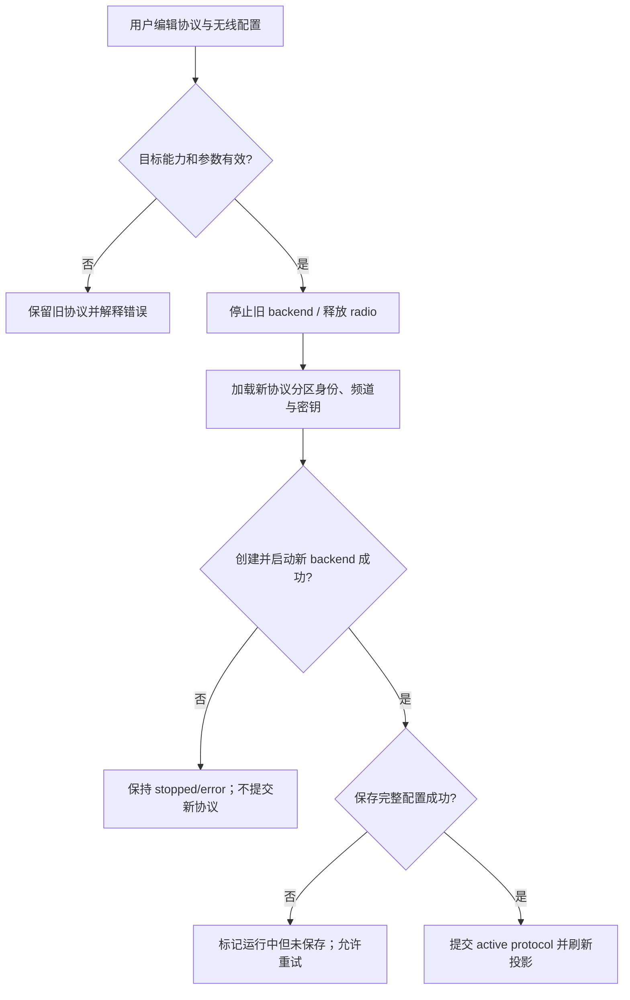

# Activity Diagram：协议切换与提交

## 本图回答的问题

用户改变协议或无线参数时，系统如何避免“界面显示已经切换，但 radio 仍运行旧 backend”的半提交状态。本活动从完整候选配置进入验证开始，到运行态与持久化状态都得到明确结果为止。

## 输入、输出与责任边界

| 项目 | 设计含义 |
| --- | --- |
| 输入 | 目标协议、频率/带宽/扩频参数，以及该协议分区中的身份、频道和密钥 |
| 验证 owner | 配置应用层；同时检查目标硬件能力和协议参数约束 |
| 运行态 owner | `MeshAdapterRouter` 与 radio backend |
| 持久化 owner | `AppConfig / ConfigFacade` 及协议分区存储 |
| 成功输出 | 新 backend 已启动，完整配置已保存，活动协议投影已更新 |

## 分支规则

1. 参数或目标能力无效时不能停止旧 backend；拒绝必须携带可定位到字段的错误。
2. 旧 backend 停止后，新 backend 启动失败时不能回写活动协议。系统进入显式 `stopped/error`，而不是伪装成旧协议仍然可用。
3. 新 backend 已启动但保存失败属于“运行态成功、持久化失败”。界面必须显示未保存并允许原样重试，不能静默宣称完成。
4. 协议切换加载的是目标协议自己的身份、频道和 peer 分区；相同显示名不构成跨协议合并依据。

## 提交与补偿

这里有两个不同提交点：radio 启动是运行态提交，配置原子保存是持久化提交。只有两者都成功才刷新稳定的活动协议投影。启动后的保存失败不能自动回滚 radio，因为回滚同样可能失败；因此以可见的 `running-unsaved` 状态保留事实，并阻止用户误以为重启后仍会使用当前配置。

## 源码证据与测试关注点

- backend 创建和安装位于 `IdfAppFacadeRuntime::createMeshBackend`、`create_mesh_backend` 与 `MeshAdapterRouter` 协作边界。
- 每个失败出口都要验证旧/new backend 所有权和 radio 释放状态。
- 测试至少覆盖：验证失败、stop 成功但 start 失败、start 成功但 persist 失败，以及相同配置的幂等重试。
