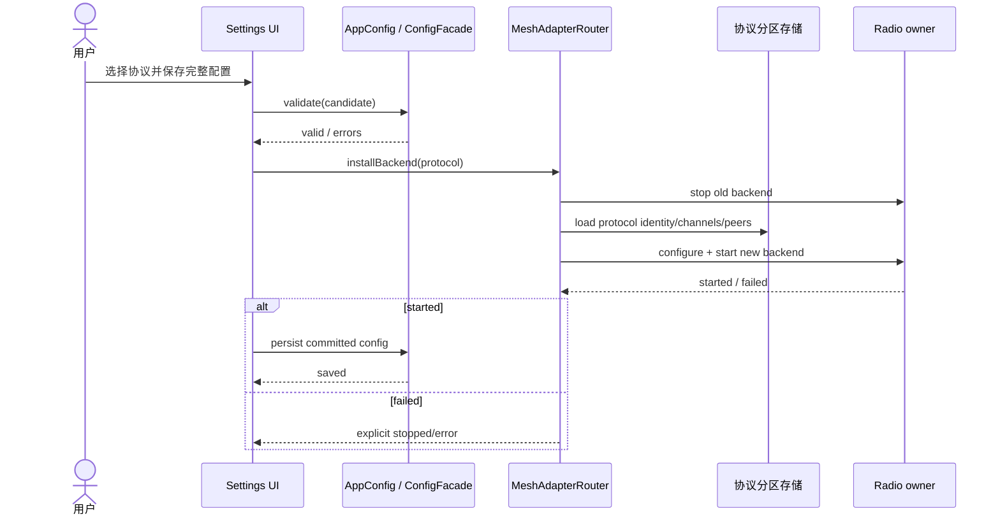

# Sequence Diagram：Settings 到活动 backend

## 场景与参与者职责

本时序描述用户从 Settings 提交完整候选配置，而不是单个控件即时改写 radio。Settings 负责收集候选值和展示结果；Config 负责验证与持久化；Router 负责 backend 生命周期；协议分区存储只返回目标协议的身份、频道和 peer 数据；Radio 是独占硬件 owner。

## 顺序约束

1. `validate(candidate)` 必须发生在停止旧 backend 之前，避免可预见的输入错误造成通信中断。
2. `stop old backend` 必须先于加载并启动新 backend，保证同一 radio 不被两个协议实现同时占有。
3. 新 backend 报告 `started` 之后才能持久化 `activeProtocol`；创建对象不等于启动成功。
4. 持久化成功之后才允许 Settings 发布稳定投影。观察者不能从尚未提交的 UI 字段推断活动协议。

## 失败、超时与重复提交

Router 的启动失败返回显式错误状态，并保持 radio 所有权可判定。Settings 不应在内部自动循环创建 backend；重试由用户或受控恢复策略发起。重复提交同一已提交配置应短路为幂等成功，不重复停止和启动。若 stop 或 start 超时，系统将当前 backend 状态标记为未知/错误，禁止并行发起第二次切换。

## 可观察提交点

| 事件 | 可以断言的事实 |
| --- | --- |
| validate 返回 valid | 候选值合法；运行态未改变 |
| old backend stopped | radio 已释放；新协议尚不可用 |
| new backend started | 本次运行可使用新协议；配置可能尚未持久化 |
| config saved | 重启后仍能恢复同一选择 |
| projection refreshed | 用户和其他应用服务可以观察稳定结果 |

## 源码与验证

关键验证对象是 backend 安装边界、协议分区读取和配置保存，而不是 Settings 控件。契约测试应记录调用顺序，并注入 stop、load、start、persist 四个阶段的独立故障。
