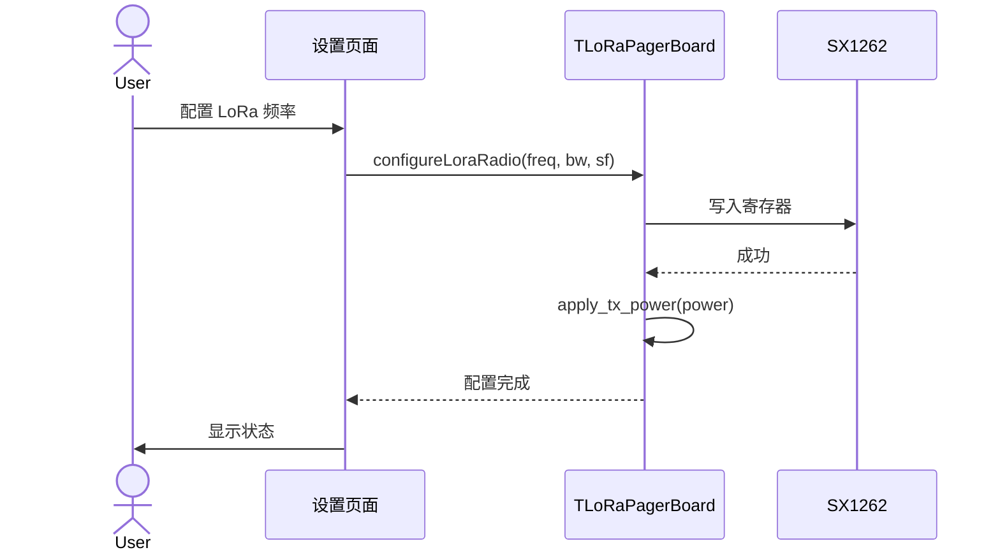

# Sequence Diagram：对象交互：配置无线电

<!-- praxis:use-case-diagram:start -->

## 元数据

项目版本：0.1.30-alpha
设计文档版本：0.1.30-alpha
Git 分支：main
Git 提交：34aad0bffa2f6450192f655f248a94b6c3cbd767
Git 工作区状态：dirty
Agent 版本决策：none - 本次渲染没有单独的 agent 版本决策
更新于：2026-06-25T14:17:55.307Z
来源：Agent 候选分析
父级 Use Case：use-case:configure-radio-parameters
业务边界路径：Trail Mate 系统 / 聊天通信
父级文档：docs/design/use-case-diagrams/configure-radio-parameters.md
Markdown 路径：docs/design/use-case-diagrams/configure-radio-parameters/sequences/sequence-configure-radio-parameters.md
HTML 路径：docs/design/use-case-diagrams/configure-radio-parameters/sequences/sequence-configure-radio-parameters.html

## 交互场景

参数调整

## 参与者 / 生命线

- actor User
- participant UI as 设置页面
- participant Board as TLoRaPagerBoard
- participant Radio as SX1262

## 消息时序

- User->>UI: 配置 LoRa 频率
- UI->>Board: configureLoraRadio(freq, bw, sf)
- Board->>Radio: 写入寄存器
- Radio-->>Board: 成功
- Board->>Board: apply_tx_power(power)
- Board-->>UI: 配置完成
- UI->>User: 显示状态

## 同步 / 异步 / 回调

- Radio-->>Board: 成功
- Board-->>UI: 配置完成

## 返回 / 异常 / 补偿

- Radio-->>Board: 成功
- Board-->>UI: 配置完成

## 事务 / 幂等 / 重试边界

硬件封装

- 无

## Sequence UML 读图说明

交互

## 实现范围锚点

- 模块：boards
- 代码锚点：boards/tlora_pager/src/tlora_pager_board.cpp#L1
- 不覆盖代码：非当前场景的全部调用链
- 不覆盖代码：未被证据支持的异步/补偿路径

## 不覆盖场景

- 所有相关函数调用
- 所有失败补偿场景
- 未被证据支持的异步或回调流程

## Mermaid 图

## 证据上下文

| 来源 | 路径 | 行号 | 强度 | 摘要 |
| --- | --- | --- | --- | --- |
| 本地仓库扫描 | boards/tlora_pager/src/tlora_pager_board.cpp | 1-1 | strong | 无线电配置函数 |
| 本地仓库扫描 | boards/tlora_pager/src/tlora_pager_board.cpp | 1-1 | strong | 无线电配置相关方法 |

## 变更记录

### 0.1.30-alpha - 2026-06-25T14:17:55.307Z

变更类型：DISCOVERY
版本决策：none - 本次渲染没有单独的 agent 版本决策

Git 分支：main
Git 提交：34aad0bffa2f6450192f655f248a94b6c3cbd767
Git 工作区状态：dirty

摘要：
- 恢复或更新「配置无线电参数」的 Sequence Diagram。

<!-- praxis:use-case-diagram:end -->
