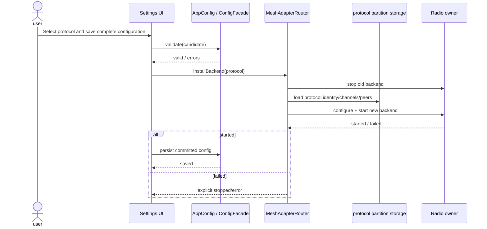

# Sequence Diagram: Settings to activity backend

## Scenario and participant responsibilities

This sequence describes the user submitting a complete candidate configuration from Settings, rather than a single control rewriting the radio on the fly. Settings is responsible for collecting candidate values ​​and displaying results; Config is responsible for verification and persistence; Router is responsible for the backend life cycle; the protocol partition storage only returns the identity, channel and peer data of the target protocol; Radio is the exclusive hardware owner.

## Sequence constraints

1. `validate(candidate)` must occur before stopping the old backend to avoid foreseeable input errors causing communication interruption.
2. `stop old backend` must be loaded and started before the new backend to ensure that the same radio is not occupied by two protocol implementations at the same time.
3. The new backend reports `started` before it can persist `activeProtocol`; creating an object does not mean that the startup is successful.
4. Settings is allowed to publish stable projections only after persistence is successful. Observers cannot infer active protocols from UI fields that have not yet been committed.

## Failure, timeout and repeated submission

Router startup failure returns an explicit error status and leaves radio ownership decidable. Settings should not automatically loop internally to create backends; retries are initiated by the user or a controlled recovery policy. Repeated submissions of the same submitted configuration should be short-circuited to idempotent success, without repeated stops and starts. If stop or start times out, the system will mark the current backend status as unknown/error and prohibit the second switch from being initiated in parallel.

## Observable commit point

| Event | Facts that can be asserted |
| --- | --- |
| validate returns valid | The candidate value is legal; the running state has not changed |
| old backend stopped | radio has been released; the new protocol is not yet available |
| new backend started | New protocols may be used in this run; configuration may not be persisted |
| config saved | The same selection can still be restored after restarting |
| projection refreshed | Users and other application services can observe stable results |

## Source code and verification

The key verification objects are backend installation boundaries, protocol partition reading and configuration saving, not the Settings control. The contract test should record the calling sequence and inject independent faults in the four phases of stop, load, start, and persist.
