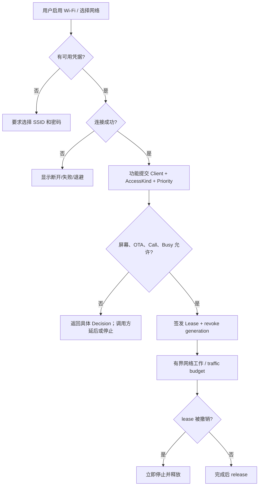

# Activity Diagram：连接与资源请求

## 本图回答的问题

本活动把“连接到一个接入点”和“某个功能获准使用联网资源”分开。Wi-Fi 图标显示 connected，并不意味着 Package、Firmware、MQTT 或 Call 可以无条件启动网络工作。

## 请求模型

每次工作提交 `Client + AccessKind + Priority`。策略还会读取屏幕阶段、当前连接、退避、OTA/Call 独占状态和已有 lease。通过后返回带 generation 与 traffic budget 的 Lease；调用方只能在 Lease 有效期内执行有界工作。

## 判定表

| 条件 | 决策 | 调用方动作 |
| --- | --- | --- |
| Wi-Fi disabled / no credentials | `Disabled` 或 `NoCredentials` | 引导配置，不重试网络 |
| disconnected / backoff | `Disconnected` 或 `Backoff` | 延后，等待状态事件 |
| OTA 或 Call 独占 | `ExclusiveOwner` | 停止低优先级工作 |
| 已有不可抢占 lease | `Busy` | 保留业务请求，稍后重新 acquire |
| 策略允许 | `Granted` | 在 budget 内工作并检查 revoke generation |

## 资源释放与恢复

所有成功路径都必须 `release(Lease)`；异常、取消和页面离开也不能泄漏 lease。高优先级 owner 撤销 lease 后，调用方必须停止发起新 I/O、取消或收束在途请求，并释放本地资源。撤销不是“建议暂停”，generation 变化后旧 Lease 已失效。

## 源码证据与测试关注点

`wifi_runtime_impl.h::apply_enabled` 管理 Wi-Fi 运行状态，Access Runtime 执行 acquire/release 和独占策略。测试需要覆盖无凭据、连接退避、Call/OTA 抢占、重复 release、旧 generation 使用和 traffic budget 耗尽。
