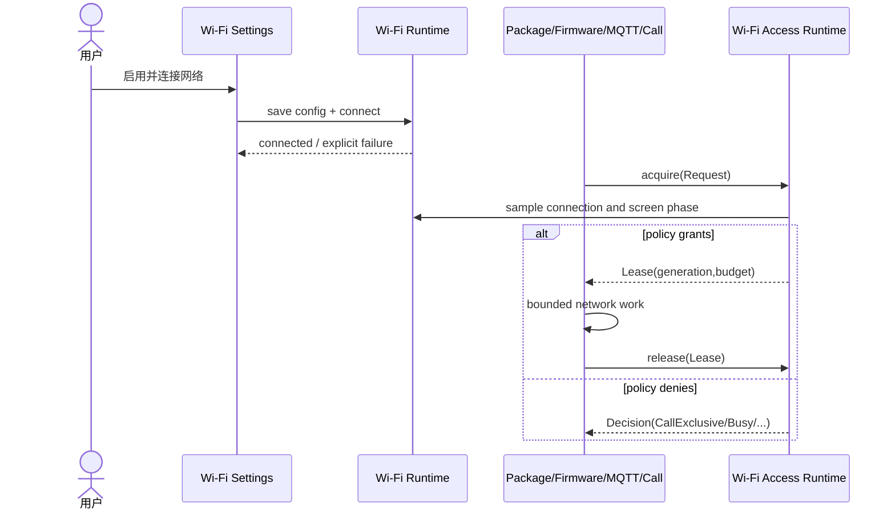

# Sequence Diagram：客户端取得和释放 Wi-Fi Lease

## 时序范围

该图从用户保存 Wi-Fi 配置开始，但核心场景是后台 Client 获取 Lease。Settings 只建立连接条件；Package、Firmware、MQTT 或 Call 必须独立向 Access Runtime 申请访问，不能直接以 `Wifi.connected == true` 作为授权。

## 参与者责任

- **Wi-Fi Settings**：收集凭据、保存配置、展示连接失败。
- **Wi-Fi Runtime**：拥有驱动连接状态与退避。
- **Client**：声明访问类型、优先级和工作预算，响应撤销。
- **Wi-Fi Access Runtime**：统一裁决并维护 Lease generation。

## 消息与提交语义

`save config` 成功不等于网络已连接；`connected` 也不等于 Client 已获授权。只有 `acquire(Request)` 返回 Lease 后，Client 才能开始网络副作用。`release(Lease)` 是资源生命周期的完成点，不是可选清理动作。

## 竞争条件

策略在 acquire 与实际 I/O 之间可能变化，因此 Lease 携带 generation。Call 或 OTA 获得独占权时，Access Runtime 递增 generation；Client 在每个安全检查点检测失效并终止。旧 Lease 的迟到 release 必须是幂等操作，不能释放后来签发给其他 Client 的租约。

## 失败与重试

Denied Decision 要保留原因，调用方据此区分“需要用户配置”“等待连接”“等待高优先级 owner”和“不可恢复错误”。禁止所有拒绝都转换成固定时间轮询，否则会绕过退避并放大功耗与网络压力。

## 验证

时序测试应使用虚拟时钟和可控连接状态，证明授权消息发生在工作之前、撤销可打断工作、重复 release 安全，以及 denied 情况没有网络副作用。
