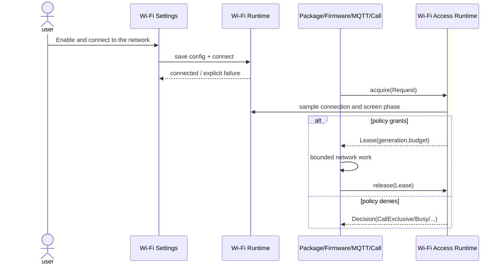

# Sequence Diagram: Client acquires and releases Wi-Fi Lease

## Timing range

This diagram starts with the user saving the Wi-Fi configuration, but the core scenario is the background Client acquiring the Lease. Settings only establishes connection conditions; Package, Firmware, MQTT or Call must independently apply for access to Access Runtime and cannot directly use `Wifi.connected == true` as authorization.

## Participant Responsibilities

- **Wi-Fi Settings**: Collect credentials, save configuration, display connection failure.
- **Wi-Fi Runtime**: Has driver connection status and backoff.
- **Client**: Declare access type, priority and work budget, respond to revocation.
- **Wi-Fi Access Runtime**: Unify adjudication and maintain Lease generation.

## Message and submission semantics

`save config` success does not mean that the network is connected; `connected` does not mean that the Client has been authorized. Only after `acquire(Request)` returns Lease can the Client start network side effects. `release(Lease)` is the completion point of the resource life cycle and is not an optional cleanup action.

## Race conditions

The strategy may change between acquire and actual I/O, so Lease carries generation. When Call or OTA gains exclusive rights, Access Runtime increments generation; Client detects failures and terminates at each security checkpoint. The late release of the old Lease must be an idempotent operation, and leases subsequently issued to other Clients cannot be released.

## Failure and retry

Denied Decision The reason should be retained, so that the caller can distinguish between "requires user configuration", "waiting for connection", "waiting for high priority owner" and "unrecoverable error". Disable all rejections from being converted to fixed-time polling, which would bypass backoff and amplify power consumption and network stress.

## Verification

 Timing tests should use virtual clocks and controllable connection states to prove that authorization messages occur before work, revocation can interrupt work, repeated releases are safe, and denied situations have no network side effects.
