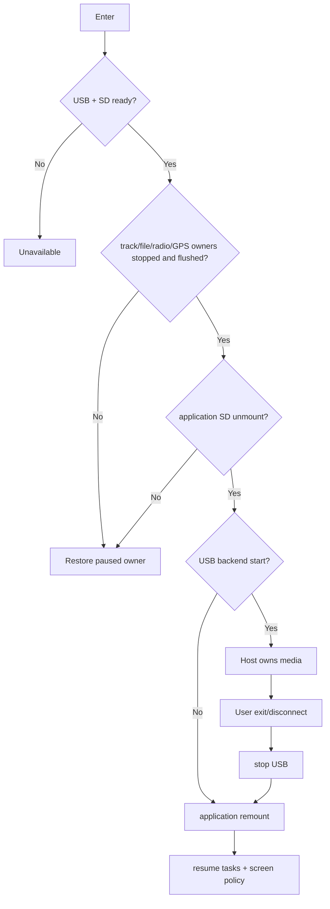

# Activity: SD Ownership Switch

## Questions answered by this picture

How to put the same SD The card is safely handed over to the USB Host from the application side, and the application owner is restored after exit or startup failure, preventing the host and device from writing to the media at the same time.

## Quiesce sequence

The system first blocks new file/track operations, then requires each owner to drain, flush, and close; then uninstalls the application file system. If either owner cannot confirm the quiescence, the transfer will be terminated and the suspended owner will be restored. Simply closing the map page is not enough to prove that SD has been released.

## Ownership invariants

`ApplicationMounted` and `HostOwnsMedia` are mutually exclusive. The USB backend can only be started after the application unmount is successful; the application can only be remounted after the USB stop is completed. There must not be two writable owners at any time.

## Failure compensation

If unmount fails, the suspended task will be resumed; if USB start fails, first stop the remaining backend and then remount; if remount fails, it will enter explicit recovery-required, and tasks that access SD cannot be directly resumed. Compensation is performed in reverse order of completed stages.

## Exit and disconnect

User exit, USB cable disconnect, Host eject and backend error all enter unified stop/remount. Temporary policies such as always-on screen are restored with the session and do not affect the user's original settings.

## Testing
