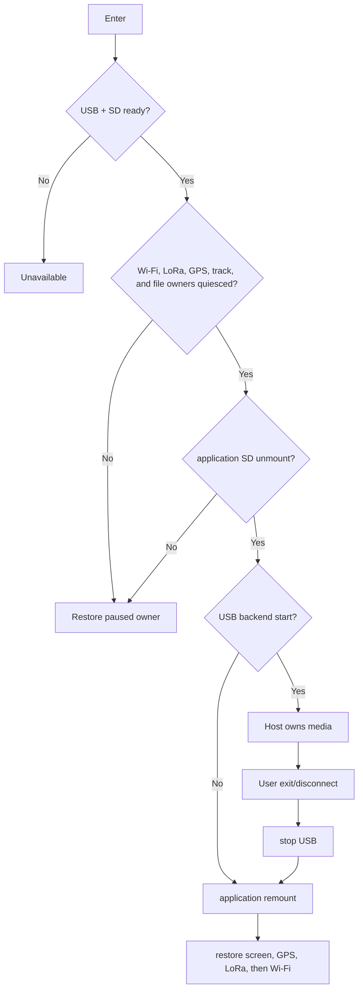

# Activity: SD Ownership Switch

## Questions answered by this picture

How to put the same SD The card is safely handed over to the USB Host from the application side, and the application owner is restored after exit or startup failure, preventing the host and device from writing to the media at the same time.

## Quiesce sequence

The system first asks the Wi-Fi runtime to suspend without changing its saved
setting. It then blocks new file/track operations, rejects a LoRa pause owned
by another exclusive feature, and requires the radio/mesh tasks to quiesce
before the board puts the radio hardware in standby. GPS is suspended next.
Only then may storage owners drain, flush, close, and uninstall the
application file system. If any owner cannot confirm the quiescence, the
transfer is terminated and completed stages are restored in reverse order.
Simply closing the map page is not enough to prove that SD has been released.

## Ownership invariants

`ApplicationMounted` and `HostOwnsMedia` are mutually exclusive. The USB backend can only be started after the application unmount is successful; the application can only be remounted after the USB stop is completed. There must not be two writable owners at any time.

## Failure compensation

If a LoRa standby or SD unmount fails, the Wi-Fi, LoRa, and GPS stages that USB
successfully owns are restored. If USB start fails, first stop the remaining
backend and then remount; if remount fails, it will enter explicit
recovery-required, and tasks that access SD cannot be directly resumed.
Compensation is performed in reverse order of completed stages.

## Exit and disconnect

User exit, USB cable disconnect, Host eject and backend error all enter unified stop/remount. Temporary policies such as always-on screen are restored with the session and do not affect the user's original settings.

## Testing
