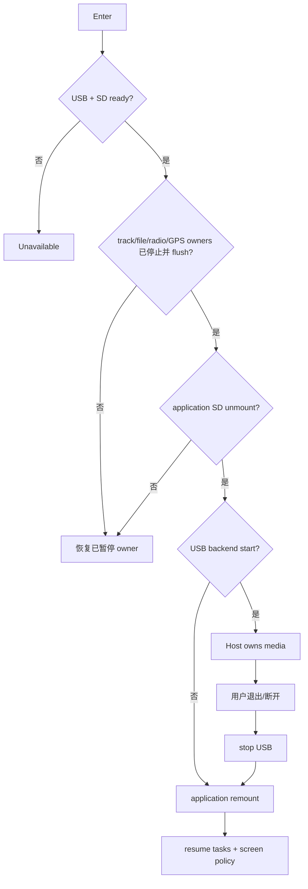

# Activity：SD 所有权切换

## 本图回答的问题

如何把同一张 SD 卡从应用侧安全移交给 USB Host，并在退出或启动失败后恢复应用 owner，避免主机和设备同时写介质。

## Quiesce 顺序

系统先阻止新的文件/轨迹操作，再要求每个 owner drain、flush、close；随后卸载应用文件系统。任一 owner 无法确认静止都终止移交，并恢复已经暂停的 owner。仅仅关闭地图页面不足以证明 SD 已释放。

## 所有权不变量

`ApplicationMounted` 与 `HostOwnsMedia` 互斥。USB backend 只有在应用 unmount 成功后启动；应用只有在 USB stop 完成后 remount。任何时刻不得存在两个可写 owner。

## 失败补偿

unmount 失败恢复暂停任务；USB start 失败先 stop 残留 backend，再 remount；remount 失败进入显式 recovery-required，不能直接 resume 会访问 SD 的任务。补偿按已经完成的阶段逆序执行。

## 退出与断连

用户退出、USB cable disconnect、Host eject 和 backend error 都进入统一 stop/remount。屏幕常亮等临时策略随会话恢复，不影响用户原有设置。

## 测试

覆盖活跃轨迹、文件句柄未关闭、unmount 失败、USB start 失败、主机突然断开、remount 失败、重复退出和掉电后介质检查。
