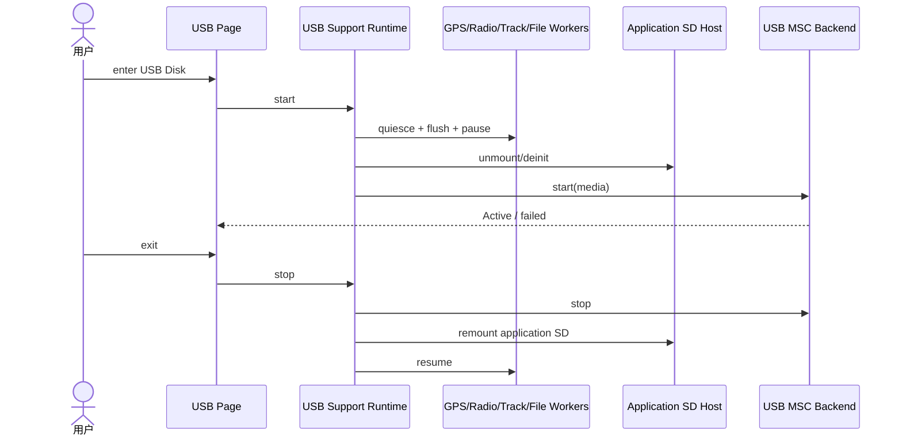

# Sequence：Application SD 到 USB Host

## 场景与参与者

USB Support Runtime 是所有权切换协调者；GPS/Radio/Track/File Workers 是可能持有文件或任务的 owner；Application SD Host 与 USB MSC Backend 是互斥介质 owner；UI 只发 start/stop。

## 移交栅栏

Owners 的 quiesce 返回 token/确认，证明不再产生新 I/O 且已 flush。全部确认后才 unmount/deinit。MSC 只有在 unmount 成功后启动。缺少任一确认都按逆序 resume 已暂停 owner。

## 归还栅栏

stop MSC 必须等待主机 I/O 终止，再 remount 和检查文件系统；remount 成功后才 resume。Host disconnect 也走相同顺序，不能跳过 stop。

## 故障补偿

MSC start 失败执行 stop-if-needed + remount。Remount 失败保持 Owners paused 并显示 recovery-required。重复 stop/start 按 session generation 幂等。

## 测试

覆盖某 owner 拒绝 quiesce、unmount 失败、MSC start 失败、突然断连、remount 失败、重复退出和所有权互斥断言。
