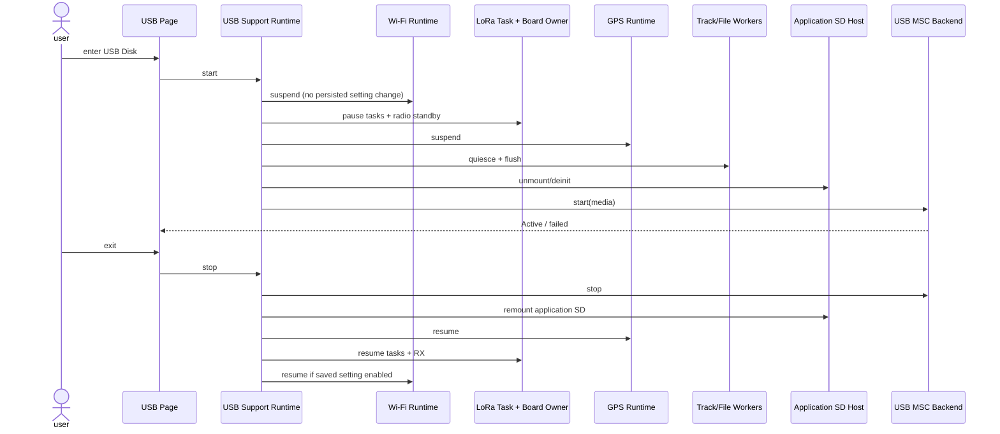

# Sequence: Application SD to USB Host

## Scenarios and participants

USB Support Runtime is the coordinator of ownership switching; Wi-Fi, LoRa,
GPS, Track, and File workers retain ownership of their own hardware/runtime
lifecycles and only acknowledge suspend/resume. Application SD Host and USB
MSC Backend are mutually exclusive media owners; UI only sends start/stop.

## Handover fence

The Wi-Fi runtime confirms that driver/transport work is suspended without
persisting `wifi.enabled`; the LoRa task owner confirms paused tasks and a
successful board standby; GPS and storage owners confirm their own quiesce.
Unmount/deinit occurs only after every confirmation. MSC starts only after
successful unmount. The absence of any acknowledgment resumes completed stages
in reverse order.

## Return fence

stop MSC must wait for host I/O to terminate before remounting and checking the file system; resume only after remounting is successful. Host disconnect also follows the same sequence and cannot skip stop.

## Failure compensation

 MSC start fails to execute stop-if-needed + remount. Remount failure leaves Owners paused and displays recovery-required. Repeated stop/start per session generation is idempotent.

## Tests

Cover an owner's rejection of quiesce, unmount failure, MSC start failure, sudden disconnection, remount failure, repeated exit and ownership mutual exclusion assertion.
