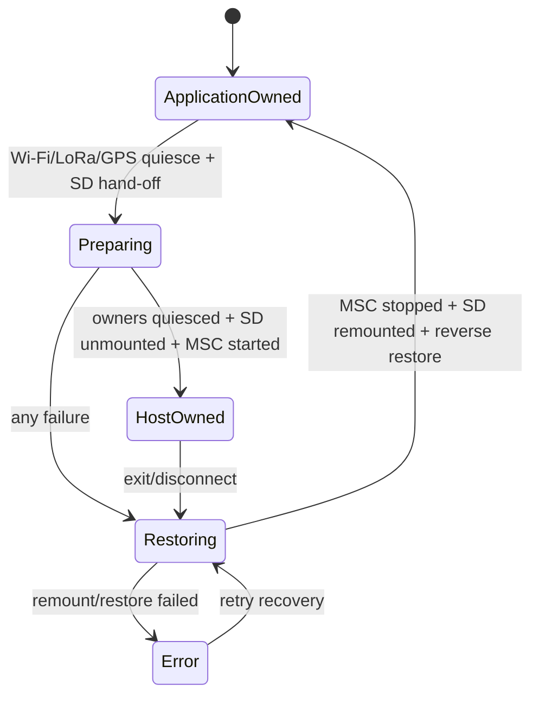

# State Machine:USB Storage Ownership

## Status owner

The USB Support Runtime is the sole coordinating owner and holds the session generation, paused owner collection, and media stages. Application SD Host and MSC backend only report their own operation results.

## Ownership invariants

When ApplicationOwned, the application can access the SD and the MSC must be
stopped. When HostOwned, the MSC can be accessed, the application must be
unmounted, Wi-Fi must be suspended without a persisted setting change, the
LoRa task/board owner must be paused and in standby, and all related owners
must be quiescent. Preparing/Restoring is a transition state that cannot be
declared externally as writable.

## Transition table

| Current state | Completion guard | Next state |
| --- | --- | --- |
| ApplicationOwned | Wi-Fi/LoRa/GPS quiesce accepted | Preparing |
| Preparing | all quiesced + unmounted + MSC active | HostOwned |
| Preparing | Failure in any stage | Restoring |
| HostOwned | exit/disconnect/error | Restoring |
| Restoring | MSC stopped + remounted + reverse restore | ApplicationOwned |
| Restoring | remount/resume failed | Error |

## Ban and restore

The second enter is rejected in Preparing/Restoring/Error. HostOwned does not
allow application file operations. USB cannot steal a pre-existing exclusive
LoRa pause, and any failed prepare stage restores only the owners USB has
already suspended. Error remains affected owner paused until retry recovery is
clearly successful; it cannot pretend to be ApplicationOwned in order to
return to the UI homepage.

## test

Injection failures for each intermediate stage, verifying reversal compensation, ownership mutual exclusion, repeated exits, and media checks after restarts.
