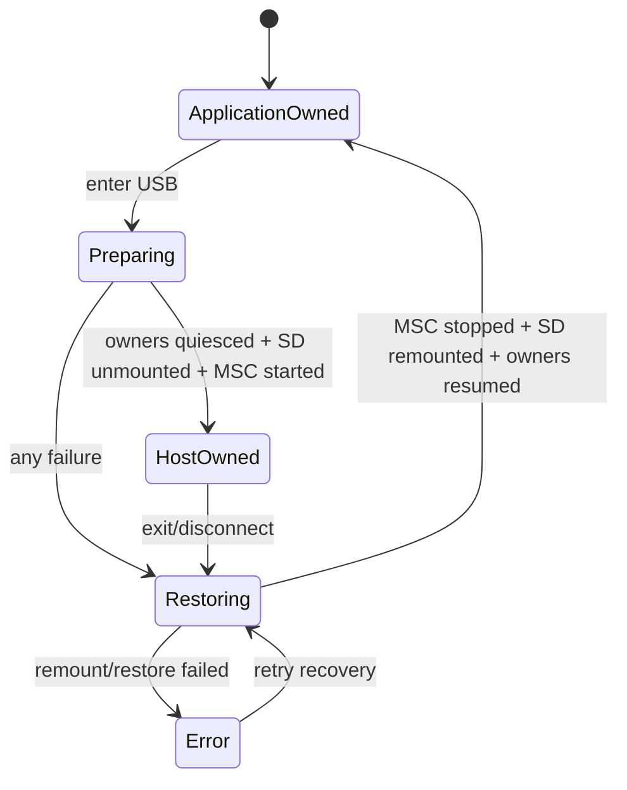

# State Machine：USB Storage Ownership

## 状态 owner

USB Support Runtime 是唯一协调 owner，并持有 session generation、已暂停 owner 集合和介质阶段。Application SD Host 与 MSC backend 只报告自己的操作结果。

## 所有权不变量

ApplicationOwned 时应用可访问 SD、MSC 必须停止；HostOwned 时 MSC 可访问、应用必须 unmounted 且所有相关 owner 静止。Preparing/Restoring 是不可对外宣称可写的过渡态。

## Transition 表

| 当前状态 | 完成 guard | 下一状态 |
| --- | --- | --- |
| ApplicationOwned | enter accepted | Preparing |
| Preparing | all quiesced + unmounted + MSC active | HostOwned |
| Preparing | 任一阶段失败 | Restoring |
| HostOwned | exit/disconnect/error | Restoring |
| Restoring | MSC stopped + remounted + owners resumed | ApplicationOwned |
| Restoring | remount/resume 失败 | Error |

## 禁止与恢复

Preparing/Restoring/Error 中拒绝第二次 enter。HostOwned 不允许应用文件操作。Error 保持受影响 owner paused，直到 retry recovery 明确成功；不能为了回到 UI 首页假装 ApplicationOwned。

## 测试

对每个中间阶段注入失败，验证逆序补偿、所有权互斥、重复 exit 和重启后的介质检查。
