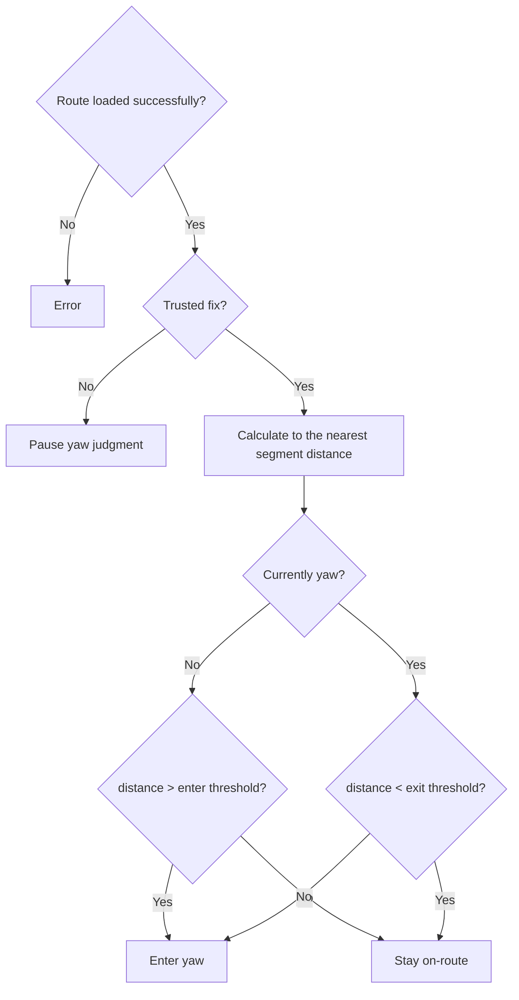

# Activity: Yaw and recovery

## Questions answered by this picture

After loading a route, how does the system determine on-route, enter yaw and recovery based on the trusted position, and avoid jittering near the boundary through dual thresholds. This activity confirms existing behavior but does not claim that a complete navigation domain model has been developed.

## Input and calculation

Route provides at least ordered segments; Fix must pass the location trust check. Each evaluation calculates the distance from the current position to the nearest segment. At the same time, the nearest segment/progress needs to be retained to avoid arbitrary jumps between self-intersecting routes or parallel road segments.

## Yaw hysteresis

| Current status | Condition | Result |
| --- | --- | --- |
| OnRoute | `distance > enterThreshold` | Enter Deviated |
| OnRoute | Other | Keep OnRoute |
| Deviated | `distance < exitThreshold` | Restore OnRoute |
| Deviated | Other | Keep Deviated |
| Arbitrary | fix untrustworthy | Suspension of judgment, status will not be reversed out of thin air |

Must satisfy `exitThreshold < enterThreshold`. If the thresholds are equal, GNSS jitter will cause frequent state flips.

## Missing design owner

The current implementation can calculate the closest distance and hysteresis status, but `NavigationSession`, `RouteProgress`, target point advancement, route revision, relocation and alarm throttling have not yet formed a closed owner. So the definition of "complete navigation" is still candidate after the route is loaded.

## Failure and recovery

Failure to parse the route keeps the original session unstarted; changes to the route file during operation require explicit revision and cannot be silently changed. Fix is ​​​​temporarily lost and displays unknown/paused. After recovery, use the new fix to continue instead of reporting yaw immediately.

## Tests

Covering jitter on both sides of the threshold, parallel segments, self-intersecting routes, no fix, route only one point, route revision changes and the continuity of the most recent segment during recovery.
