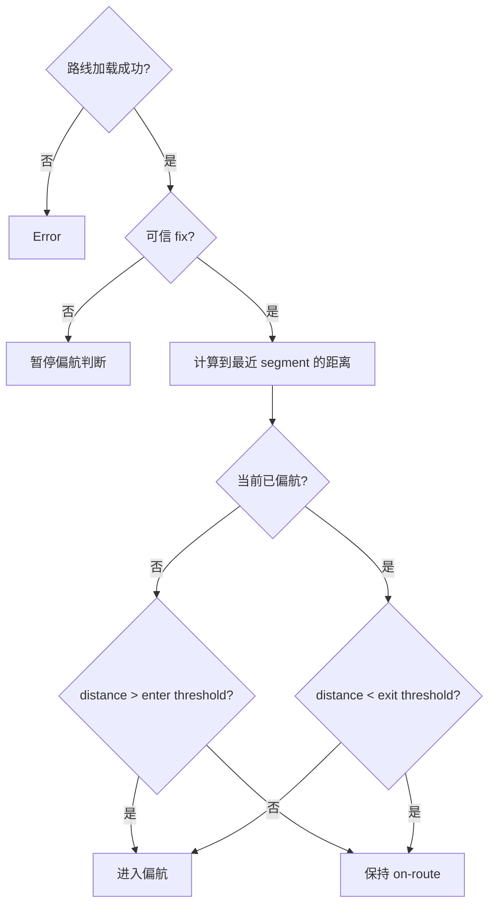

# Activity：偏航与恢复

## 本图回答的问题

加载一条路线后，系统如何依据可信位置判断 on-route、进入偏航和恢复，并通过双阈值避免在边界附近抖动。该活动确认现有行为，但不宣称完整导航领域模型已经形成。

## 输入与计算

Route 至少提供有序 segment；Fix 必须通过定位可信检查。每次评估计算当前位置到最近 segment 的距离，同时需要保留最近 segment/progress，避免在自交路线或平行路段之间任意跳转。

## 偏航迟滞

| 当前状态 | 条件 | 结果 |
| --- | --- | --- |
| OnRoute | `distance > enterThreshold` | 进入 Deviated |
| OnRoute | 其他 | 保持 OnRoute |
| Deviated | `distance < exitThreshold` | 恢复 OnRoute |
| Deviated | 其他 | 保持 Deviated |
| 任意 | fix 不可信 | 暂停判断，状态不凭空反转 |

必须满足 `exitThreshold < enterThreshold`。如果阈值相等，GNSS 抖动会导致状态频繁翻转。

## 缺失的设计 owner

当前实现能计算最近距离和迟滞状态，但 `NavigationSession`、`RouteProgress`、目标点推进、路线 revision、重定位和告警节流尚未形成闭合 owner。因此路线加载后“完成导航”的定义仍是 candidate。

## 失败与恢复

路线解析失败保持原会话未启动；运行中路线文件变化需要显式 revision，不能静默换轨。Fix 暂时丢失显示 unknown/paused，恢复后使用新 fix 继续，而不是立刻报告偏航。

## 测试

覆盖阈值两侧抖动、平行 segment、自交路线、无 fix、路线只有一个点、路线 revision 变化及恢复时最近 segment 连续性。
