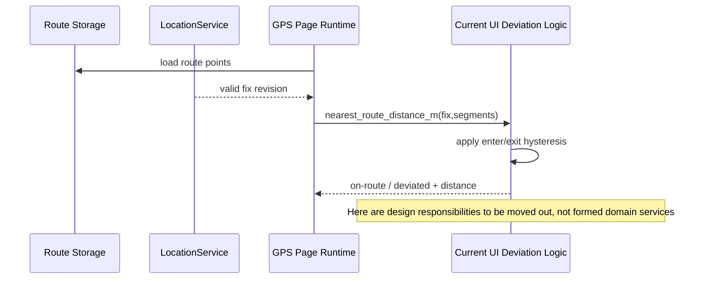

# Sequence: Fix to yaw projection

## Current fact and target boundaries

Route Storage, LocationService and UI runtime are existing participants. The Policy in the figure is the conceptual label of the current UI internal logic. It does not mean that the code already has the `DeviationPolicy` domain service.

## Sequence and revision

A route revision is formed after the route is loaded successfully; each valid fix revision is only evaluated once. The distance calculation must be correlated between the two, late calculations from old routes or old fixes cannot update the current yaw projection.

## State continuity

The most recent segment and the current on-route/deviated state belong to the NavigationSession to achieve stable expression. The current UI owner should maintain at least double-threshold hysteresis; in future migrations, each fix cannot be regarded as a stateless function call.

## Pause and resume

Stop evaluation and display paused/unknown when there is no trusted fix, and retain the previous state and its time. A session will not be created if the route reading fails; the progress will be re-established or the user will be asked to confirm when the route revision changes.

## Design gaps and testing

Missing RouteProgress, target point advancement, arrival events and reentrancy rules. Existing tests should first target distance and hysteresis behavior before adding self-intersecting routes, parallel segments, and old revision and fix recovery scenarios to the target model.
