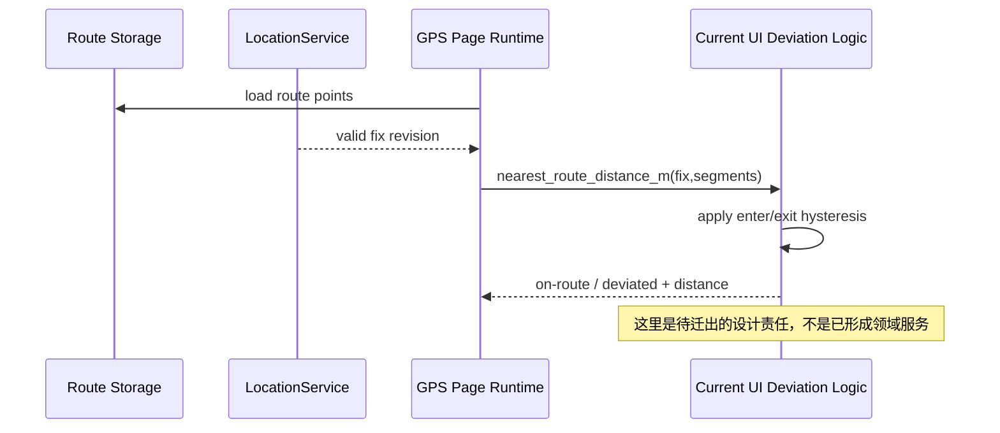

# Sequence：Fix 到偏航投影

## 当前事实与目标边界

Route Storage、LocationService 和 UI runtime 是现有参与者。图中的 Policy 是当前 UI 内部逻辑的概念标签，不代表代码已有 `DeviationPolicy` 领域服务。

## 顺序与 revision

路线加载成功后形成 route revision；每个 valid fix revision 只评估一次。距离计算结果必须关联两者，旧路线或旧 fix 的迟到计算不能更新当前偏航投影。

## 状态连续性

最近 segment 和当前 on-route/deviated 状态属于 NavigationSession 才能稳定表达。当前 UI owner 应至少保持双阈值迟滞；未来迁移时不能把每次 fix 当成无状态函数调用。

## 暂停与恢复

无可信 fix 时停止评估并显示 paused/unknown，保留上一状态及其时间。路线读取失败不创建 session；路线发生 revision 变化时重新建立进度或要求用户确认。

## 设计缺口与测试

缺失 RouteProgress、目标点推进、到达事件和重入规则。现有测试应先锁定距离与迟滞行为，再为目标模型添加自交路线、平行 segment、旧 revision 和 fix 恢复场景。
