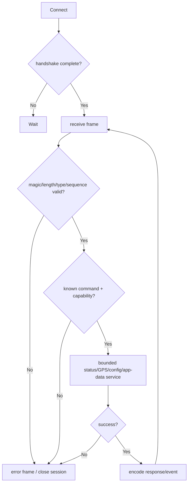

# Activity: HostLink Frame processing

## Questions answered by this picture

After the external host completes the HostLink handshake, how does the frame pass through the codec, sequence number, command routing and capability Check, call the bounded application service and generate the response within the same session.

## Session and framing

The handshake establishes protocol version, capability and session generation. Each frame verifies magic, length, type, sequence number, and size limit; invalid lengths cannot continue to wait for any bytes, nor can an unbounded buffer of the declared size be allocated.

## Command routing

Router only delivers known commands to explicit handlers. Status/GPS queries, configuration commands, and app-data each have independent schemas, permissions, and side effects. Unknown commands return a stable error; the handler cannot be relied upon to reject it when capability does not allow it.

## Serial number and idempotence

The request sequence number is associated with the response within the session. Repeated read-only requests can be re-responded; side-effect commands require request identity/commit result to avoid configuration or message sending caused by host retries. The new handshake generation invalidates late frames from the old session.

## Error strategy

Attributable command errors return an error frame and keep the session; broken framing, persistent overruns, or version incompatibilities close the session. The handler timeout should be bounded and the occupied application resources should be released.

## Tests

 Covers half-frame, sticky packet, over-length, unknown type, repeated sequence number, old session frame, capability rejection, handler timeout and response encoding failure.
