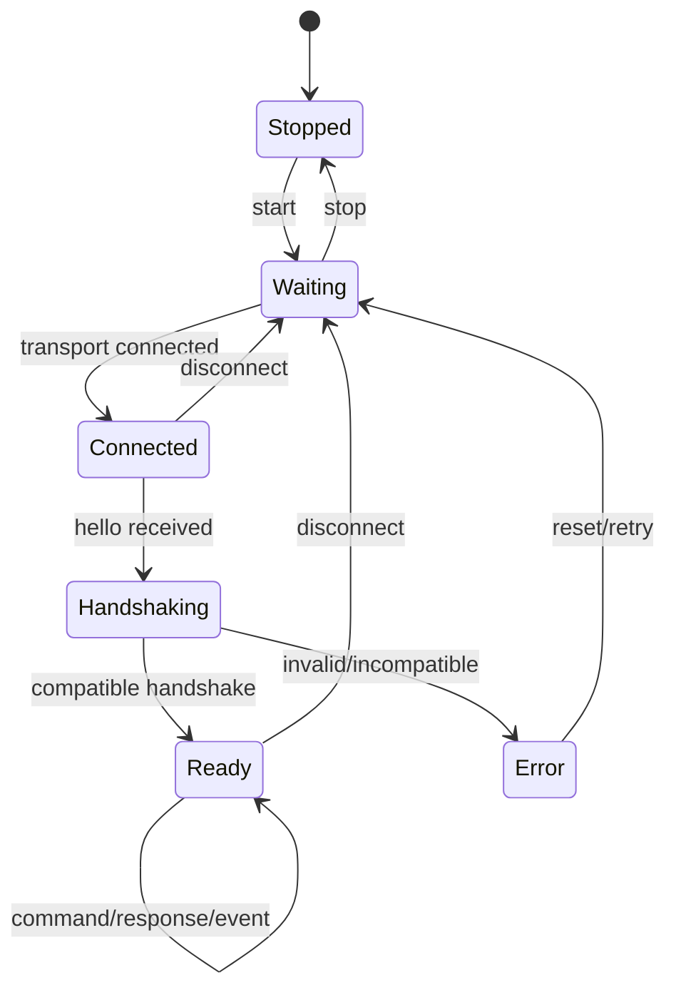

# State Machine：HostLink Session

## 状态 owner

SessionRuntime 持有连接 generation、协商 capability、RX parser、pending request 和 TX 队列。Transport 只产生 connect/disconnect/bytes 事件；Handler 不持有会话状态。

## Guard 与动作

Connected 只有在 transport 建链后进入；Hello 完整且版本/capability 可验证才进入 Handshaking。Ready 之前任何 command frame 返回 protocol error。Ready 的自循环每次完成 decode、route、handler 和有序 response。

## 错误分类

命令级 rejected 保持 Ready；破坏 framing、版本不兼容、持续超限进入 Error 并清理 parser/pending。Disconnect 从任意已连接状态回 Waiting，并使所有旧 callback generation 失效。

## 幂等与背压

Start/stop 幂等；同 seq 副作用命令通过 pending/committed result 去重。RX/TX 使用固定容量，队列满按 contract 返回 Busy 或关闭失控 peer，禁止无界增长。

## 测试

覆盖 command-before-handshake、invalid hello、half frame、disconnect during handler、快速重连、重复 seq、TX 满和 Error reset。
